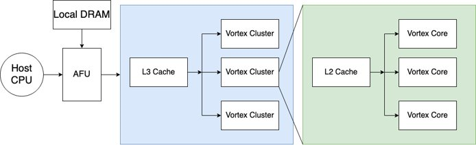
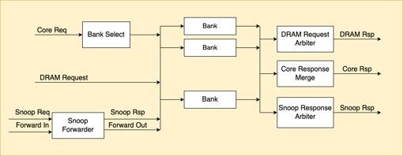
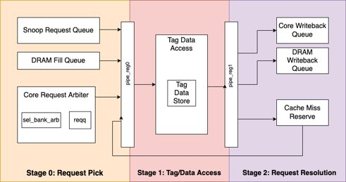

# Vortex Cache Subsystem

The Vortex Cache Sub-system has the following main properties:

- High-bandwidth with bank parallelism
- Snoop protocol to flush data for CPU access
- Generic design: Dcache, Icache, Shared Memory, L2 cache, L3 cache

### Cache Hierarchy 

- Cache can be configured to be any level in the hierarchy
- Caches communicate via snooping
- Cache flush from AFU is passed down the hierarchy​

### VX_cache.v (Top Module)

VX.cache.v is the top module of the cache verilog code located in the `/hw/rtl/cache` directory.

- Configurable (Cache size, number of banks, bank line size, etc.)
- I/O signals
  - Core Request
  - Core Rsp
  - DRAM Req
  - DRAM Rsp
  - Snoop Rsp
  - Snoop Rsp
  - Snoop Forwarding Out
  - Snoop Forwarding In
- Bank Select
  - Assigns valid and ready signals for each bank
- Snoop Forwarder
- DRAM Request Arbiter
  - Prepares cache response for communication with DRAM
- Snoop Response Arbiter
  - Sends snoop response
- Core Response Merge
  - Cache accesses one line at a time. As a result, each request may not come back in the same response. This module tries to recombine the responses by thread ID. 

### VX_bank.v

VX_bank.v is the verilog code that handles cache bank functionality and is located in the `/hw/rtl/cache` directory.

- Allows for high throughput​
- Each bank contains queues to hold requests to the cache​
- I/O signals
  - Core request​
  - Core Response​
  - DRAM Fill Requests​
  - DRAM Fill Response​
  - DRAM WB Requests​
  - Snp Request​
  - Snp Response
- Request Priority: DRAM fill, miss reserve, core request, snoop request​
- Snoop Request Queue​
- DRAM Fill Queue​
- Core Req Arbiter​
  - Requests to be processed by the bank
- Tag Data Store​
  - Registers for valid, dirty, dirtyb, tag, and data​
  - Length of registers determined by lines in the bank​
- Tag Data Access:​
  - I/O: stall, snoop info, force request miss
  - Writes to cache or sends read response; hit or miss determined here
  - A missed request goes to the miss reserve if it is not a snoop request or DRAM fill 