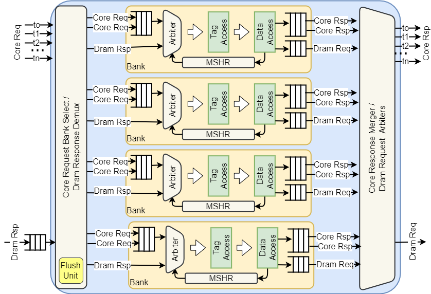

# Vortex Cache Subsystem

The Vortex Cache Sub-system has the following main properties:

- High-bandwidth transfer with Multi-bank parallelism
- Non-blocking pipelined write-through cache architecture with per-bank MSHR
- Configurable design: Dcache, Icache, L2 cache, L3 cache

### Cache Microarchitecture 

The Vortex cache is comprised of multiple parallel banks. It is comprised of the following modules:
- **Bank request dispatch crossbar**: assigns a bank to incoming requests and resolve collision using stalls.
- **Bank response merge crossbar**: merges result from banks and forward to the core response.
- **Memory request multiplexer**: arbitrates bank memory requests
- **Memory response demultiplexer**: forwards memory response to the corresponding bank.
- **Flush Unit**: performs tag memory initialization.

Incoming requests entering the cache are sent to a dispatch crossbar that select the corresponding bank for each request, resolving bank collisions with stalls. The result output of each bank is merge back into outgoing response port via merger crossbar. Each bank intergates a non-blocking pipeline with a local Miss Status Holding Register (MSHR) to reduce the miss rate. The bank pipeline consists of the following stages:

- **Schedule**: Selects the next request into the pipeline from the incoming core request, memory fill, or the MSHR entry, with priority given to the latter.
- **Tag Access**: single-port read/write access to the tag store.
- **Data Access**: Single-port read/write access to the data store.
- **Response Handling**: Core response back to the core.

Deadlocks inside the cache can occur when the MSHR is full and a new request is already in the pipeline. It can also occur when the memory request queue is full, and there is an incoming memory response. The cache mitigates MSHR deadlocks by using an early full signal before a new request is issued and similarly mitigates memory deadlocks by ensuring that its request queue never fills up.
