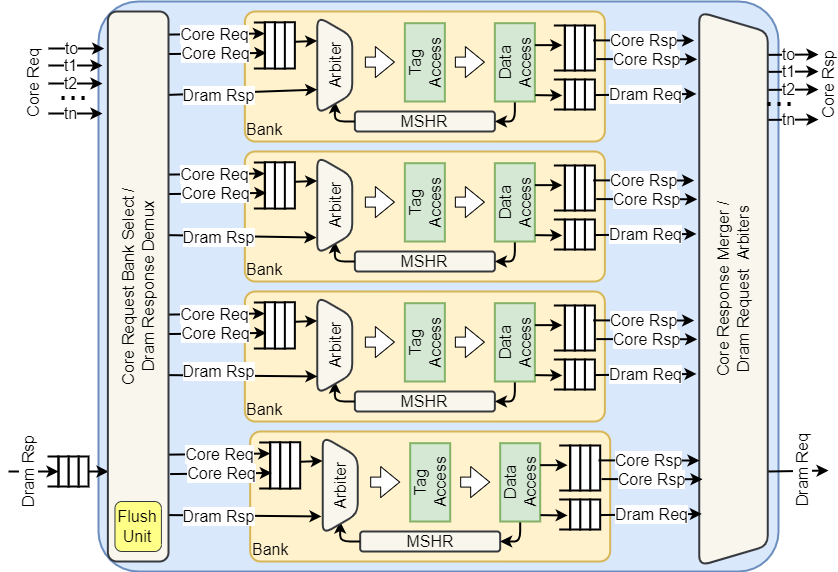

# Vortex Cache Subsystem

The Vortex Cache Sub-system has the following main properties:

- High-bandwidth transfer with Multi-bank parallelism
- Non-blocking pipelined write-through cache architecture with per-bank MSHR
- Configurable design: Dcache, Icache, L2 cache, L3 cache
- Sectored lines (decoupled tag/fill granularity) at the last-level caches

### Cache geometry: line, sector, and word

Each cache decouples three independent granules so banking, memory bandwidth, and
tag cost can be tuned separately:

- **Line (`LINE_SIZE`)** — tag granularity; one tag covers a line. Banks interleave
  at the line granule (a whole line lives in one bank).
- **Sector (`SECTOR_SIZE`)** — fill / eviction / memory-transaction granule. A line
  holds `LINE_SIZE/SECTOR_SIZE` sectors, each with its own valid/dirty state, so the
  memory side transacts in sectors while one tag spans the whole line. `SECTOR_SIZE
  == LINE_SIZE` means a single sector per line (no sectoring).
- **Word (`WORD_SIZE`)** — the coalescer output / per-request access granule. The
  number of request ports (and therefore banks) is `NUM_REQS = footprint / WORD`.

The **L2 and L3** caches are sectored: the line is doubled (`2 × MEM_BLOCK`) to halve
the tag count, while the sector stays at `MEM_BLOCK` (the memory-bus transaction size).
The **icache** and **dcache** keep `LINE = SECTOR = MEM_BLOCK` (unsectored).

### Dcache banking for memory-level parallelism (MLP)

Dcache banks come from the coalescer **word size**, not the line: a warp's coalesced
footprint (`lanes × XLEN/8`) is split into `footprint/WORD` requests, one per bank
(`NUM_BANKS = NUM_REQS`, no over-provisioning). The word is reduced ~`sqrt(lanes)`
below the line so the bank count scales with thread count while the word/bus stays
moderate. With `MEM_BLOCK = 64B`, `XLEN = 32`:

| threads | footprint | word | banks | effective MLP (banks × MSHR) |
|--------:|----------:|-----:|------:|-----------------------------:|
| 1   | 4B   | 4  | 1 | 16  |
| 2   | 8B   | 8  | 1 | 16  |
| 4   | 16B  | 8  | 2 | 32  |
| 8   | 32B  | 16 | 2 | 32  |
| 16  | 64B  | 16 | 4 | 64  |
| 32  | 128B | 32 | 4 | 64  |
| 64  | 256B | 32 | 8 | 128 |

Banks interleave at the line, so a single warp reaches `footprint/LINE` banks; the
remaining banks serve **cross-warp** MLP (independent warps hitting different lines)
and scale total outstanding misses via per-bank MSHRs. The miss drain to the next
level is bounded by `L1_MEM_PORTS = min(NUM_BANKS, PLATFORM_MEMORY_NUM_BANKS)`.

### Cache Microarchitecture 

The Vortex cache is comprised of multiple parallel banks. It is comprised of the following modules:
- **Bank request dispatch crossbar**: assigns a bank to incoming requests and resolve collision using stalls.
- **Bank response merge crossbar**: merges result from banks and forward to the core response.
- **Memory request multiplexer**: arbitrates bank memory requests
- **Memory response demultiplexer**: forwards memory response to the corresponding bank.
- **Flush Unit**: performs tag memory initialization.

Incoming requests entering the cache are sent to a dispatch crossbar that select the corresponding bank for each request, resolving bank collisions with stalls. The result output of each bank is merge back into outgoing response port via merger crossbar. Each bank intergates a non-blocking pipeline with a local Miss Status Holding Register (MSHR) to reduce the miss rate. The bank pipeline consists of the following stages:

- **Schedule**: Selects the next request into the pipeline from the incoming core request, memory fill, or the MSHR entry, with priority given to the latter.
- **Tag Access**: single-port read/write access to the tag store.
- **Data Access**: Single-port read/write access to the data store.
- **Response Handling**: Core response back to the core.

Deadlocks inside the cache can occur when the MSHR is full and a new request is already in the pipeline. It can also occur when the memory request queue is full, and there is an incoming memory response. The cache mitigates MSHR deadlocks by using an early full signal before a new request is issued and similarly mitigates memory deadlocks by ensuring that its request queue never fills up.
