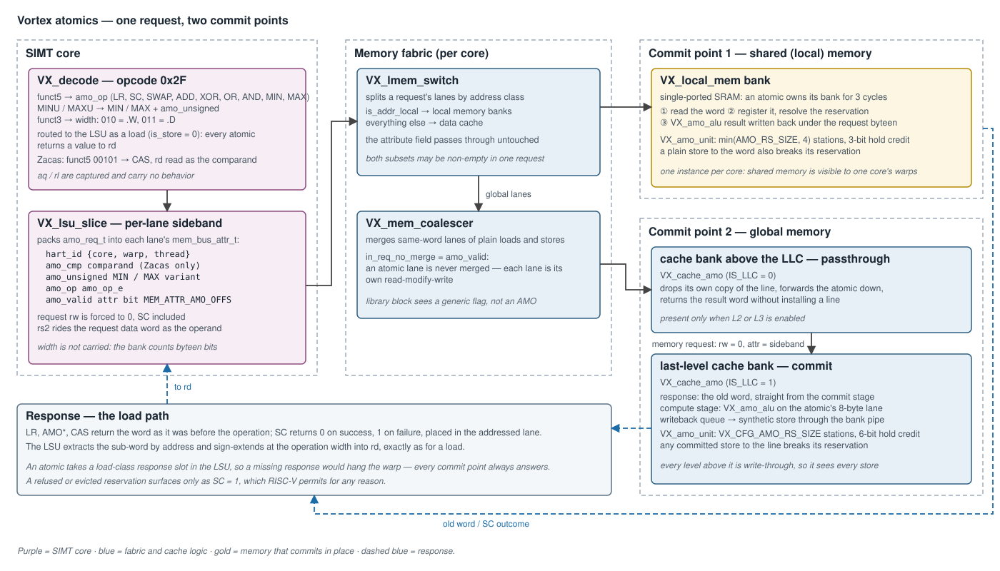
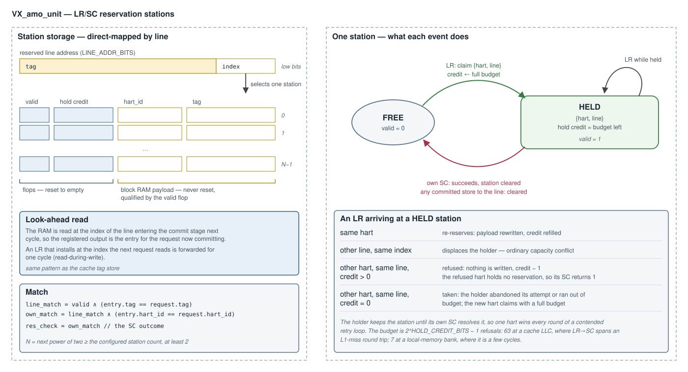
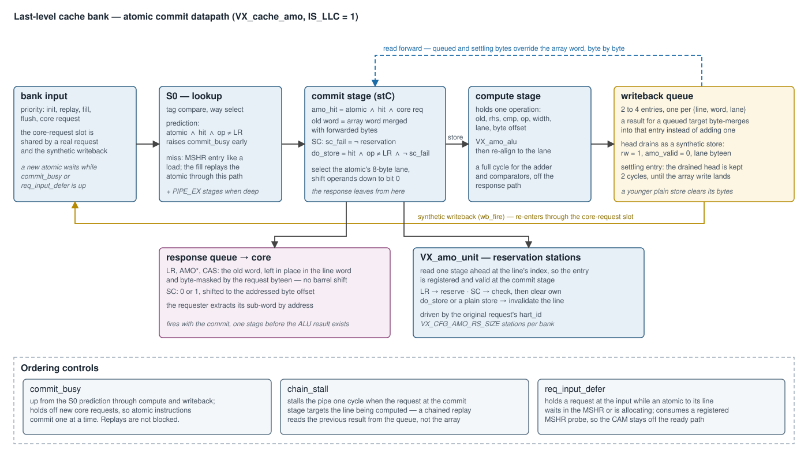

# Atomic Memory Operations (RVA) — Design

**Scope:** the Vortex implementation of the RISC-V "A" extension — `LR`/`SC`,
the nine `AMO*` read-modify-write operations in `.W` and `.D` widths, and the
Zacas compare-and-swap (`AMOCAS`). Covers instruction decode, the per-lane
sideband the LSU attaches, the two places an atomic commits (the last-level
cache bank and the local-memory bank), the reservation stations, and the
SimX model. RTL: [`VX_amo_alu.sv`](../../hw/rtl/cache/VX_amo_alu.sv),
[`VX_amo_unit.sv`](../../hw/rtl/cache/VX_amo_unit.sv),
[`VX_cache_amo.sv`](../../hw/rtl/cache/VX_cache_amo.sv),
[`VX_local_mem.sv`](../../hw/rtl/mem/VX_local_mem.sv). SimX:
[`sim/simx/amo/`](../../sim/simx/amo/),
[`sim/simx/mem/cache.cpp`](../../sim/simx/mem/cache.cpp),
[`sim/simx/mem/local_mem.cpp`](../../sim/simx/mem/local_mem.cpp).

How atomics behave across a multi-level cache hierarchy — the passthrough
role of a cache above the last level, issuer self-consistency, and the
coherence model — is in
[`multicache_amo_coherence.md`](multicache_amo_coherence.md). The cache bank
the engine plugs into is in [`cache_subsystem.md`](cache_subsystem.md). This
document is the atomics deep-dive.



---

## 1. Overview

An atomic is a **load that also writes**. It travels the load path end to
end — a load-class LSU slot, a request with `rw = 0`, a response carrying a
value for `rd` — and the read-modify-write happens at the one place that
owns the word:

1. **Decode** classifies opcode `0x2F`, maps `funct5` to an operation, and
   routes the instruction to the LSU as a load.
2. The **LSU** attaches a per-lane sideband (`amo_req_t`) naming the
   operation and the issuing hart, and forces the request's `rw` to 0.
3. The **memory fabric** steers each lane by address class and never merges
   an atomic lane with another.
4. The lane **commits** at one of two points: the **local-memory bank** for a
   shared-memory address, or the **last-level cache (LLC) bank** for a global
   address. Both use the same ALU and the same reservation unit.
5. The **response** returns the word as it was before the operation (or the
   `SC` outcome) and the LSU writes it to `rd`.

The defining choice is that **global atomics resolve at the LLC**. Every cache
level above it is required to be write-through (§9), so the LLC observes every
store to a line and can keep `LR`/`SC` reservations honest.

---

## 2. Instruction decode

[`VX_decode.sv`](../../hw/rtl/core/VX_decode.sv),
[`sim/simx/decode.cpp`](../../sim/simx/decode.cpp). Opcode `0x2F` is
`INST_AMO`.

| field | meaning |
|---|---|
| `funct3` | width — `010` = `.W` (32-bit), `011` = `.D` (64-bit) |
| `funct5` | operation (table below) |
| `aq`, `rl` | captured, carry no behavior — commit at a single serialization point makes the ordering hints redundant |
| `rs1` | address (no immediate offset) |
| `rs2` | operand; not read by `LR` |
| `rd` | destination; for `AMOCAS` also the comparand |

| `funct5` | instruction | `amo_op_e` | `amo_unsigned` |
|---|---|---|---|
| `00010` | `LR` | `AMO_OP_LR` = 0 | 0 |
| `00011` | `SC` | `AMO_OP_SC` = 1 | 0 |
| `00000` | `AMOADD` | `AMO_OP_ADD` = 2 | 0 |
| `00001` | `AMOSWAP` | `AMO_OP_SWAP` = 3 | 0 |
| `00100` | `AMOXOR` | `AMO_OP_XOR` = 4 | 0 |
| `01000` | `AMOOR` | `AMO_OP_OR` = 5 | 0 |
| `01100` | `AMOAND` | `AMO_OP_AND` = 6 | 0 |
| `10000` / `11000` | `AMOMIN` / `AMOMINU` | `AMO_OP_MIN` = 7 | 0 / 1 |
| `10100` / `11100` | `AMOMAX` / `AMOMAXU` | `AMO_OP_MAX` = 8 | 0 / 1 |
| `00101` | `AMOCAS` (Zacas) | `AMO_OP_CAS` = 9 | 0 |

The unsigned min/max variants collapse onto the signed opcodes plus one bit,
so the operation field stays four bits wide.

**Compare-and-swap reads `rd`.** `AMOCAS` compares memory against `rd`, stores
`rs2` on a match, and writes the old value back to `rd`. The decoder routes
`rd` into the third operand slot — for an atomic that slot's register field
is the `funct5` bits and is otherwise unused — so the comparand reaches the
LSU as `rs3_data` with no new operand path.

---

## 3. The LSU sideband

[`VX_lsu_slice.sv`](../../hw/rtl/core/VX_lsu_slice.sv) packs one `amo_req_t`
per lane into the lane's memory attribute
([`VX_gpu_pkg.sv`](../../hw/rtl/VX_gpu_pkg.sv)):

| field | width | meaning |
|---|---|---|
| `hart_id` | `NC_BITS + NW_BITS + NT_BITS` | `{core, warp, thread}` — the reservation owner |
| `amo_cmp` | `XLEN` | compare-and-swap comparand; present only with Zacas |
| `amo_unsigned` | 1 | unsigned `MIN`/`MAX` |
| `amo_op` | 4 | `amo_op_e` |
| `amo_valid` | 1 | the lane is an atomic; sits at `MEM_ATTR_AMO_OFFS` |

Load-bearing properties:

- **`rw` is forced to 0 for every atomic, `SC` included.** A store that misses
  allocates and writes; a store-conditional that misses must instead fetch
  the line and then decide. Riding the load path gives that ordering for
  free, and gives every atomic the response slot it needs to reach `rd`.
- **Width is not carried.** The commit point derives it from the request's
  byte-enable popcount — four bytes is `.W`, eight is `.D`.
- **The operand rides the data word**, lane-positioned exactly like a plain
  store's data. Compare-and-swap needs a third value and the data word is
  already taken by the swap value, which is why the comparand travels in the
  sideband — and why Zacas is off by default: it widens every memory request
  by `XLEN` bits.
- **The sideband is opaque to the fabric.** The attribute field is cast by
  offset at the commit point, so the shared library blocks under
  `hw/rtl/libs/` contain no atomic logic. The coalescer is told only
  `in_req_no_merge` ([`VX_mem_unit.sv`](../../hw/rtl/core/VX_mem_unit.sv)):
  an atomic lane is never merged, because two read-modify-writes to one word
  are two operations, not one.

A virtual-memory build checks an atomic's permissions as a **write**: the
request arrives with `rw = 0`, so the MMU takes the write intent from the
`amo` bit, and a fault records it
([`virtual_memory_subsystem.md`](virtual_memory_subsystem.md)).

---

## 4. The RMW kernel — `VX_amo_alu`

[`VX_amo_alu.sv`](../../hw/rtl/cache/VX_amo_alu.sv) is pure combinational
logic shared by both commit points.

| port | direction | meaning |
|---|---|---|
| `op`, `is_unsigned`, `width` | in | operation, min/max variant, `.W` (2) or `.D` (3) |
| `old_word` | in | the word currently in memory, right-aligned |
| `rhs` | in | the operand (`rs2`) |
| `cmp` | in | the compare-and-swap comparand |
| `new_word` | out | the value to write |
| `ret_word` | out | the old value, zero-extended |

| operation | `new_word` |
|---|---|
| `LR` | old (nothing is stored) |
| `SC`, `SWAP` | `rhs` |
| `ADD`, `AND`, `OR`, `XOR` | old *op* `rhs` |
| `MIN`, `MAX` | signed or unsigned compare, selected by `is_unsigned` |
| `CAS` | `rhs` if old equals `cmp`, else old |

A `.W` operation on a 64-bit datapath masks both operands to 32 bits and
sign-extends at bit 31 for the signed comparisons.

Two parameters keep the datapath no wider than the build needs:

- `DATA_WIDTH` — the operand width, the cache word capped at 64. A 32-bit
  word can only carry `.W`, so the adder and comparators are built 32-bit.
- `ARITH_WIDTH` — the width of every operation **except** compare-and-swap.
  A 32-bit hart issues 64-bit operands only for the Zacas pair, so its adder
  and comparators shrink to 32 bits while the equality compare stays full
  width. The bank asserts that no `.D` arithmetic atomic reaches a narrowed
  build.

**A failed compare-and-swap still stores.** On a mismatch the old value is
written back unchanged rather than the store being suppressed. The commit
therefore still breaks other harts' reservations on the word — which the
specification requires — and the operation needs no special case downstream.

---

## 5. Reservations — `VX_amo_unit`

[`VX_amo_unit.sv`](../../hw/rtl/cache/VX_amo_unit.sv) holds the ALU and a
bounded set of reservation stations.



### 5.1 Storage

The stations are **direct-mapped on the reserved line's low address bits**.
Each holds `{valid, hold credit, hart_id, tag}`: the valid bit and the credit
in resettable flops, the `{hart_id, tag}` payload in a block RAM read one
stage ahead so the registered entry is present the cycle the commit decision
is made. Capacity is the next power of two at or above the configured count.

A bounded set, rather than one slot per hart, is what keeps the storage
independent of the hart count — a 128-hart configuration would otherwise
carry 128 line addresses and a 128-way compare **per bank**.

### 5.2 Events

| event | source | effect |
|---|---|---|
| `res_reserve` | an `LR` commits | claim the station for `{hart, line}` unless refused (§5.3) |
| `res_clear` | an `SC` commits, pass or fail | clear the station if this hart holds it |
| `res_invalidate` | any store commits to the line | clear the station if it holds that line, whichever hart reserved it |
| `res_check` | combinational | `SC` succeeds iff the station holds `{this hart, this line}` |

### 5.3 The holder is protected

Every hart contending one word maps to the same station. If each `LR`
overwrote it, no `SC` would ever find its own reservation and a contended
retry loop would make no progress. So a live reservation is **not handed to
another hart on demand**: an `LR` from a different hart for the same line is
refused — it reserves nothing, and its `SC` fails.

The protection is bounded. A retry loop is free to abandon an attempt, and a
holder that never issues its `SC` would otherwise own the station forever.
Each refused `LR` spends one **hold credit**; when the credit reaches zero the
next foreign `LR` takes the station.

| deployment | stations | `HOLD_CREDIT_BITS` | budget | sized for |
|---|---|---|---|---|
| cache LLC bank | `VX_CFG_AMO_RS_SIZE` | 6 | 63 refusals | an `LR`→`SC` spanning an L1-miss round trip |
| local-memory bank | `min(VX_CFG_AMO_RS_SIZE, 4)` | 3 | 7 refusals | a round trip of a few cycles |

### 5.4 Why this is legal

RISC-V allows `SC` to fail for any reason, so capacity eviction, an index
conflict between two lines, and a refused `LR` are all conforming. What the
specification forbids is a spurious **success**, and every path that can
write the line — an atomic's store, a plain store arriving write-through
from above, the LLC's own write hit — drives `res_invalidate`. Forward
progress is the system property the hold credit exists to preserve: one hart
wins each round.

---

## 6. Commit at the last-level cache

[`VX_cache_amo.sv`](../../hw/rtl/cache/VX_cache_amo.sv) is instantiated by
every cache bank when atomics are enabled. With `IS_LLC = 1` it commits; with
`IS_LLC = 0` it forwards
([`multicache_amo_coherence.md`](multicache_amo_coherence.md)). The two roles
are exclusive, so each ties off the other's outputs and only the selected
datapath is synthesized.



### 6.1 The commit stage

An atomic that hits reaches the commit stage with the line word read. There:

```
amo_hit  = atomic ∧ hit ∧ core request
sc_fail  = (op == SC) ∧ ¬res_check
do_store = amo_hit ∧ (op ≠ LR) ∧ ¬sc_fail
```

The **response fires from this stage**, before any arithmetic. It is the old
word, left where it sits in the line word and masked by the request's
byte-enable; an `SC` outcome is a single bit shifted to the addressed byte
offset. The requester extracts its sub-word by address, so no full-width
shift round trip sits on the read-to-response path.

A miss takes an MSHR entry like a load. The fill replays the atomic through
the same stage, so miss and hit commit identically.

### 6.2 The lane datapath

An atomic touches at most eight naturally aligned bytes. A wide-word LLC —
one whose word is an L1 line — would otherwise pay for full-word shifters,
queues and compares that only ever carry one such **lane**. The engine
selects the lane first and runs everything downstream at lane width; each
full-width output is rebuilt by replicating the lane under a lane-positioned
byte-enable. Natural alignment is asserted: an atomic's byte-enable may not
cross its lane.

### 6.3 Compute stage and writeback queue

| stage | holds | does |
|---|---|---|
| compute | one operation: aligned `old`, `rhs`, `cmp`, op, width, lane, offset | `VX_amo_alu`, then re-align to the lane — a full cycle, off the response path |
| writeback queue | 2–4 entries, one per `{line, word, lane}` | queues the result; a result for a target already queued byte-merges into that entry |
| settling entry | the drained head, for 2 cycles | covers the window until the array write lands |

The queue head drains as a **synthetic store** through the bank's
core-request slot: `rw = 1`, `amo_valid = 0`, the lane's byte-enable. It
takes the ordinary write path, so on a write-through LLC it also goes to
memory, and on a write-back LLC it dirties the line.

The queue depth is bounded by the distinct targets one instruction's requests
can touch in a bank, which is the core-port fan-in — not the line width.
Overflow is asserted.

### 6.4 Read forwarding

A request that reads an atomic's bytes while the result is still queued or
settling must observe them. The forward network yields, per byte, the queued
writer, else the settling entry, else the array. The queue keeps at most one
entry per `{line, word, lane}` and a queued write drops its bytes from the
settling entry, so every byte has **at most one writer** and the merge is a
plain OR-tree rather than a newest-wins priority scan.

The same network supplies the next atomic's old operand. And it works in the
other direction: a younger plain store to queued or settling bytes
supersedes them, clearing those bytes so neither the writeback nor the
forward resurrects a stale value.

### 6.5 Ordering controls

| signal | condition | effect |
|---|---|---|
| `commit_busy` | from the lookup-stage prediction through compute and writeback | new core requests wait — atomic instructions commit one at a time |
| `chain_stall` | an atomic is computing and the commit stage holds a request to the same line | the pipe stalls one cycle, so a chained replay reads the previous result |
| `req_input_defer` | an atomic to the incoming request's line waits in the MSHR or is allocating | the request waits at the input |

`commit_busy` does not block replays: the MSHR streams same-line atomics that
coalesced on a miss back to back, and `chain_stall` paces those instead. In a
deep bank the lookup and commit stages are several cycles apart, so the
lookup-stage prediction is carried across the gap to keep `commit_busy`
continuous. `req_input_defer` consumes a **registered** MSHR probe, which
keeps the MSHR's address compare off the request-ready path at the cost of
deferring, at most, one cycle longer than strictly needed.

---

## 7. Commit at the local-memory bank

Shared (local) memory is a per-core SRAM, not a cache, so there is no line
to fetch and no level below: [`VX_local_mem.sv`](../../hw/rtl/mem/VX_local_mem.sv)
commits in place. [`VX_lmem_switch.sv`](../../hw/rtl/mem/VX_lmem_switch.sv)
passes the attribute through unchanged on the local path.

The bank is single-ported, so an atomic owns it for three cycles:

| cycle | bank | reservation |
|---|---|---|
| 1 — read | the request reads the word; this read is also the response | the station is read, look-ahead |
| 2 — capture | the word is registered | `LR` reserves, `SC` checks and clears, a store invalidates |
| 3 — write back | the ALU result is written under the request's byte-enable | — |

The word is registered **before** the ALU sees it. Feeding the ALU from the
SRAM output would put the memory's clock-to-out, the adder, and the memory's
setup in one period; the register splits that in two.

On a 64-bit hart the bank word holds two 32-bit lanes. A `.W` atomic to the
upper lane shifts its operands down, computes right-aligned, and shifts the
result back; the `SC` outcome is likewise placed in the addressed lane,
because the LSU extracts by address and an outcome left at bit 0 would read
as success for every upper-lane `SC`.

A plain store reaches the reservation stage the same way an atomic does, one
cycle after acceptance, so a plain store to a reserved word breaks the
reservation.

---

## 8. SimX model

| aspect | RTL | SimX |
|---|---|---|
| RMW kernel | `VX_amo_alu` | `amo_compute()` in [`amo_ops.h`](../../sim/simx/amo/amo_ops.h) |
| operation encoding | `amo_op_e`, 0–9 | `MemOp::AMO_LR`…`AMO_CAS`, 3–12, inside the unified memory-op enum |
| request direction | `rw = 0` | `is_write()` is **true** for an atomic |
| LLC commit | `VX_cache_amo`, commit role | `CacheBank::commitAmo()` |
| above the LLC | `VX_cache_amo`, passthrough role | `AmoProbe` request type |
| local memory | 3-cycle in-place RMW | same occupancy, modeled as a per-bank busy count |
| reservations | bounded line-indexed stations with hold credit | one reservation **per hart** |

Two of these differences matter when mirroring logic between the models:

- **Request direction.** A SimX predicate written to mirror an RTL condition
  gated on `~rw` must admit atomics explicitly —
  `!is_write() || memop_is_atomic(op)` — or it silently excludes exactly the
  requests it was written for.
- **Reservation policy.** [`AmoUnit`](../../sim/simx/amo/amo_unit.h) keeps a
  `hart → line` map: a hart's reservation is never displaced by another
  hart's `LR`. Both policies are RISC-V-legal and both produce correct final
  results, but they fail spuriously at different rates, so a contended retry
  loop runs a different number of iterations in each model. **An application
  that uses `LR`/`SC` cannot host a `model_parity` case**, which requires an
  exact retired-instruction match. The read-modify-write atomics and
  compare-and-swap have no retry loop and are unaffected.

---

## 9. Configuration

[`VX_config.toml`](../../VX_config.toml):

| knob | default | meaning |
|---|---|---|
| `VX_CFG_EXT_A_ENABLE` | false | the A extension; sets `MISA` bit 0 |
| `VX_CFG_EXT_ZACAS_ENABLE` | false | compare-and-swap; requires A, widens every memory request by `XLEN` |
| `VX_CFG_AMO_RS_SIZE` | `max(NUM_WARPS, NUM_CORES × NUM_WARPS / L2_NUM_BANKS)` | reservation stations per LLC bank |

`AMO_ENABLE` is a **parameter** on the cache and local-memory modules, driven
by `VX_CFG_EXT_A_ENABLED`, not a preprocessor gate. The operation enum and
the sideband are defined unconditionally so that the parameter can do the
gating; with the extension off, the sideband bits are still allocated in the
attribute field and the engine is generated away.

**Every cache level above the LLC must be write-through.** A write-back
intermediate could absorb a store without the LLC seeing it, and a later `SC`
to that line would then succeed when it must not. The requirement is a build
failure, not a convention:

| hierarchy | LLC | asserted |
|---|---|---|
| L1 only | L1 | nothing — the LLC itself may be write-back |
| L1 + L2 | L2 | `DCACHE_WRITEBACK == 0` |
| L1 + L2 + L3 | L3 | `DCACHE_WRITEBACK == 0`, `L2_WRITEBACK == 0` |

Enforced in [`Vortex.sv`](../../hw/rtl/Vortex.sv) and
[`processor.cpp`](../../sim/simx/processor.cpp). The default write-back
expressions already satisfy it, since each level is write-back only when it
is the LLC.

---

## 10. Verification

`tests/regression/amo` runs each case across every hart of the launch:

| # | case | checks |
|---|---|---|
| 0–5 | `amoadd`, `amoor`, `amoand`, `amoxor`, `amomax`, `amominu` | the final word after every hart hammers one address |
| 6 | `amoswap` | the final word and every observed old value is the initial sentinel or a valid hart id |
| 7 | `lrsc_counter` | a lock-free `LR`/`SC` increment loop; the forward-progress case |
| 8, 9 | `amoadd_aqrl`, `lrsc_counter_aqrl` | the `aq`/`rl` encodings decode and behave identically |
| 10 | `atomic_reduction` | an `atomicAdd` reduction |
| 11 | `atomic_critical` | a spinlock around a plain load/store critical section, one thread per warp |
| 12 | `self_consistency` | a hart reads back its own atomic through a plain load |
| 13, 14 | `amoadd_lmem`, `lrsc_lmem` | cases 0 and 7 on local memory |
| 15, 16 | `cas_ladder`, `cas_lmem` | every hart races compare-and-swap for each slot; compiled only with Zacas |

The `amo` category in [`ci/testcases/amo.yaml`](../../ci/testcases/amo.yaml)
runs them on both simulators at both `XLEN`s, with and without Zacas, on a
write-back LLC, at 8 threads, and across the 4-core L2 and L2+L3 hierarchies,
alongside the `rv32ua` / `rv64ua` ISA conformance tests.

Unsigned min/max cases need operands above `0x7fffffff`. With small positive
values the signed and unsigned compares agree, and a test cannot tell the two
variants apart.

---

## 11. Not implemented

- **Atomic performance counters.** There is no count of atomics, failed
  `SC`s, or refused and evicted reservations, in either model.
- **A reservation-unit testbench.** `VX_amo_unit` is covered only through the
  cache and local-memory integration.
- **Reservation-policy convergence** between SimX and RTL (§8). Converging
  means adopting the bounded station set in SimX; until then `LR`/`SC`
  applications are excluded from `model_parity`.
- **Local-memory reservation granularity.** The RTL local-memory bank
  reserves and invalidates on the bank word; SimX keys on the request's byte
  address. They agree for operations on the same address and can differ for
  a store to a different byte of the same word.
