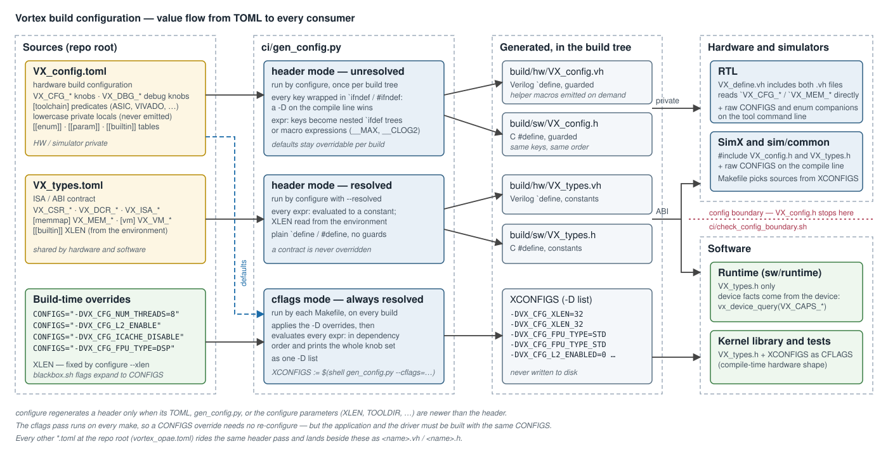
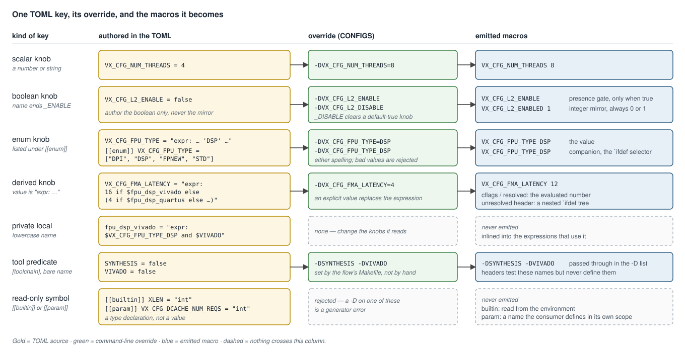

# Build Configuration System — Design

**Scope:** the TOML-driven build-configuration system — the two source files,
the generator and its three output modes, how one knob becomes the macros each
consumer sees, the header pass `configure` runs, the per-build `-D` pass every
Makefile runs, and the hardware/software boundary the two files draw. Covers
the sources ([`VX_config.toml`](../../VX_config.toml),
[`VX_types.toml`](../../VX_types.toml)), the generator
([`ci/gen_config.py`](../../ci/gen_config.py)), the driver
([`configure`](../../configure)), and the boundary guards
([`ci/check_config_boundary.sh`](../../ci/check_config_boundary.sh),
[`ci/check_sw_sim_boundary.sh`](../../ci/check_sw_sim_boundary.sh)).

How to *use* the knobs when running a test — `CONFIGS`, the `blackbox.sh`
flags, rebuilding an application for a non-default shape — is in
[`testing.md`](../testing.md) and [`simulation.md`](../simulation.md). This
document is the mechanism underneath.



---

## 1. Overview

Every configurable value in Vortex is authored **once**, in one of two TOML
files at the repo root, and reaches its consumers through one generator:

1. `configure` runs the generator in **header mode** and writes one Verilog
   and one C header per TOML into the build tree.
2. Each Makefile runs the generator in **cflags mode** on every build, folding
   the command-line `CONFIGS` overrides into a fully resolved `-D` list
   (`XCONFIGS`).
3. RTL and the simulators include the generated headers; the kernel library
   and the tests compile against the `-D` list; the runtime reads only the
   ABI header and asks the device for everything else.

There is no second copy of a default anywhere — not in a Makefile, not in a
SystemVerilog package, not in a C++ header. A value that looks wrong in one
consumer is a stale generated header, never a divergent definition.

---

## 2. The two sources

| file | role | namespaces | consumed by |
|---|---|---|---|
| [`VX_config.toml`](../../VX_config.toml) | hardware **build configuration** — platform shape, ISA extensions, pipeline, caches, FPU, accelerators | `VX_CFG_*`, `VX_DBG_*`, bare `[toolchain]` predicates | RTL and simulators only |
| [`VX_types.toml`](../../VX_types.toml) | the **ISA/ABI contract** — CSR and DCR addresses, the device memory map, the page-table format, perf-counter classes | `VX_CSR_*`, `VX_DCR_*`, `VX_ISA_*`, `VX_MEM_*`, `VX_VM_*` | hardware and software |

`VX_config.toml` holds about 230 `VX_CFG_*` knobs in per-subsystem sections
(`[platform]`, `[isa]`, `[pipeline]`, `[l1cache]`, `[tcu]`, `[raster]`, …).
Keys carry their full prefix in the TOML itself — the generator has no naming
logic, so the spelling in the file is the spelling of the macro.

The split is by **who is allowed to depend on the value**. A cache size is a
hardware build choice: software must work for any value, so it lives in
`VX_config.toml`. A CSR address is a contract: changing it breaks every
compiled kernel, so it lives in `VX_types.toml`. The device memory map
(`[memmap]`) and the page-table format (`[vm]`) are contracts for the same
reason — the hardware decodes those addresses, the linker places code inside
them, and the runtime allocates within them.

The two files are generated by separate passes with separate symbol tables.
The one axis they share is the address width: `VX_config.toml` sees it as the
`VX_CFG_XLEN` enum, `VX_types.toml` as the bare `XLEN` builtin. Both are fed
from the same `configure --xlen`.

---

## 3. The generator

[`ci/gen_config.py`](../../ci/gen_config.py) takes one `--config <toml>`, an
output `--format`, and any number of `-D` overrides, and emits the symbol
table of that one file.

### 3.1 Output modes

| mode | invoked by | expressions | overridable | output |
|---|---|---|---|---|
| header, **unresolved** | `configure` for `VX_config.toml` | translated to preprocessor logic | yes — every key is `` `ifndef ``-guarded | `<build>/hw/VX_config.vh`, `<build>/sw/VX_config.h` |
| header, **resolved** (`--resolved`) | `configure` for `VX_types.toml` | evaluated to constants | no | `<build>/hw/VX_types.vh`, `<build>/sw/VX_types.h` |
| **cflags** | every Makefile, every build | evaluated to constants | it *applies* the overrides | a `-D` list on stdout |

The unresolved header is what lets one build tree serve many configurations.
A default is emitted as

```verilog
`ifndef VX_CFG_NUM_THREADS
`define VX_CFG_NUM_THREADS 4
`endif
```

so a `-DVX_CFG_NUM_THREADS=8` on the tool's command line wins, and every key
derived from it follows — a derived key is emitted as the expression itself
(`` `define VX_CFG_L1_LINE_SIZE `VX_CFG_MEM_BLOCK_SIZE ``) or, when it selects
on a flag, as a nested `` `ifdef `` tree. The contract header is resolved
because a contract has nothing to override.

### 3.2 Expression language

A value written `"expr: …"` is a Python-syntax expression over other keys,
referenced as `$NAME`:

```toml
VX_CFG_DCACHE_NUM_BANKS = "expr: pow(2, clog2(min($VX_CFG_DCACHE_NUM_REQS, 16)))"
VX_CFG_FPU_TYPE = "expr: ('STD' if $ASIC else 'DSP') if $SYNTHESIS else ('DPI' if $dpi_is_enabled else 'STD')"
```

| helper | meaning |
|---|---|
| `min(a, b, …)`, `max(a, b, …)` | folded pairwise |
| `clog2(x)` | ceiling log2 |
| `pow(x, y)` | integer power |
| `up(x)` | `x`, or 1 when `x` is 0 |
| `clamp(x, lo, hi)` | saturate into a range |

In resolved output the expression is evaluated in dependency order. In
unresolved output it is translated: arithmetic becomes a macro expression
using `__MIN` / `__MAX` / `__CLOG2` / `__POW` / `__UP` (each helper macro is
emitted only if some key uses it), and a conditional on flags becomes an
`` `ifdef `` tree. The two must agree — the same expression source produces
both, which is what keeps a Verilator build and a kernel build of the same
`CONFIGS` on the same values.

---

## 4. Key kinds and the macros they become



### 4.1 Boolean knobs and the `_ENABLED` mirror

Every boolean `VX_CFG_X_ENABLE` automatically gets an integer companion
`VX_CFG_X_ENABLED` (`1`/`0`), in all three outputs. The two forms serve
different consumers:

| form | emitted | used for |
|---|---|---|
| `VX_CFG_X_ENABLE` | only when true | `` `ifdef `` / `#ifdef` presence gates |
| `VX_CFG_X_ENABLED` | always, `0` or `1` | arithmetic, `localparam`, C++ `if`, other `expr:` keys |

**Author only the `_ENABLE` boolean.** The mirror is generated, and the
resolver derives it too, so an `expr:` may reference `$VX_CFG_X_ENABLED`
freely (the `VX_CFG_MISA_*` bit-packing is built this way). The two forms
cannot drift, and a feature's on/off truth stays in a single boolean.

A default-true knob is turned off with `-DVX_CFG_X_DISABLE`. The generator
rewrites it to `VX_CFG_X_ENABLE = false`; the unresolved header guards the
default on `` `ifndef VX_CFG_X_DISABLE ``.

### 4.2 Enum knobs and their companions

A key listed under `[[enum]]` emits its value **and** a per-value companion:
`VX_CFG_FPU_TYPE DSP` plus `VX_CFG_FPU_TYPE_DSP`. RTL and C++ select an
implementation on the companion (`` `ifdef VX_CFG_FPU_TYPE_DSP ``). Either
spelling is accepted as an override, and a value outside the declared list is
a generator error rather than a silent fallback.

### 4.3 Names that are never emitted

| kind | spelling | purpose |
|---|---|---|
| private local | lowercase (`fpu_dsp_vivado`, `dpi_is_enabled`) | a helper consumed only by other `expr:` keys; inlined where used |
| `[[builtin]]` | declared with a type (`XLEN = "int"`) | read from the environment; typed and defaulted |
| `[[param]]` | declared with a type (`VX_CFG_DCACHE_NUM_REQS = "int"`) | a name the *consumer* defines in its own scope — the unresolved header passes it through as `DCACHE_NUM_REQS`, an RTL `localparam` |

Builtins and params are read-only: assigning one in a config table, or
overriding one with `-D`, is a generator error.

### 4.4 Unrecognized overrides are not an error

The generator does not reject a `-D` naming a key it does not know — the flag
may be meant for the compiler, not the configuration. The consequence is that
a **misspelled or un-prefixed knob is silently ignored**: `-DL2_ENABLE` or
`-DICACHE_DISABLE` changes nothing, because the keys are `VX_CFG_L2_ENABLE`
and `VX_CFG_ICACHE_ENABLE`. Always spell the full prefix.

---

## 5. The header pass — `configure`

[`configure`](../../configure) runs the header pass over **every** `*.toml` at
the repo root, so `vortex_opae.toml` (the OPAE AFU command and MMIO
constants) lands beside the two main files as `vortex_opae.{vh,h}`:

```
for each <name>.toml:
    <build>/hw/<name>.vh   (--format verilog)
    <build>/sw/<name>.h    (--format cpp)
```

`VX_types` is generated `--resolved`; `XLEN` is exported first so its
`[memmap]` and `[vm]` expressions resolve for the tree's address width.

A header is regenerated only when it is **older than** its TOML, the
generator, or the configure stamp. The stamp (`<build>/.config.stamp`) holds
the configure parameters — `XLEN`, `TOOLDIR`, `OSVERSION`, `PREFIX`, and the
source and build directories — and is rewritten only when one of them changes.

This is the one place a stale artifact can hide. The simulator cores
`#include` the generated header, so a header older than the TOML compiles the
core against old defaults while the RTL and the runtime re-expand the current
ones. Re-run `../configure` from the build directory after any TOML edit; do
not compensate with `-D` overrides in a Makefile.

---

## 6. The per-build pass — `XCONFIGS`

Every Makefile that compiles against the hardware shape resolves it fresh:

```make
XCONFIGS := $(shell python3 $(ROOT_DIR)/ci/gen_config.py \
              --config=$(VORTEX_HOME)/VX_config.toml \
              --cflags='$(CONFIGS) -DVX_CFG_XLEN=$(XLEN)')
```

`VX_CFG_XLEN` has no default in the TOML — it is declared as an enum and must
be supplied, which every Makefile does from the build tree's `XLEN`.

What each consumer does with the result:

| consumer | headers | command line | Makefile selection |
|---|---|---|---|
| RTL (Verilator, Vivado, Yosys) | `VX_config.vh`, `VX_types.vh` via [`VX_define.vh`](../../hw/rtl/VX_define.vh) | raw `CONFIGS` + the enum companions filtered from `XCONFIGS` | RTL source lists and DPI models keyed on `XCONFIGS` |
| SimX, `sim/common` | `VX_config.h`, `VX_types.h` | raw `CONFIGS` | per-extension source lists keyed on `XCONFIGS` |
| kernel library, tests | `VX_types.h` | full `XCONFIGS` | — |
| runtime | `VX_types.h` | — | — |

Two details are load-bearing:

- **RTL gets raw `CONFIGS`, not the resolved list.** Scalar values come from
  the included header; putting the full resolved list on the command line
  would pin every derived key to a constant and fight the header's own
  derivations. Raw `CONFIGS` carries an enum override only as a value
  (`VX_CFG_TCU_TYPE=DPI`), which leaves the RTL's `` `ifdef `` selectors
  unmatched — so the Makefile adds back exactly the enum companions
  (`-DVX_CFG_TCU_TYPE_%`, `-DVX_CFG_FPU_TYPE_%`) the generator resolved.
- **The application and the driver resolve independently.** `blackbox.sh`
  rebuilds only the driver. A kernel compiled with one `CONFIGS` and run
  against a driver built with another disagrees about the hardware shape with
  no diagnostic; rebuild the application with the same `CONFIGS` first.

---

## 7. The hardware/software boundary

`VX_config.h` is private to hardware and the simulators. Software gets each
kind of fact from a different place:

| software needs | source |
|---|---|
| the ISA/ABI contract (CSR/DCR addresses, memory map) | `VX_types.h` |
| a property of the device it is talking to | `vx_device_query(VX_CAPS_*)` |
| a build parameter (`XLEN`, tool paths) | `config.mk` |
| the compile-time hardware shape | `gen_config.py --cflags` → `-D` flags |

The public runtime header
[`vortex2.h`](../../sw/runtime/include/vortex2.h) is fully self-contained — it
includes standard C headers only. The ISA capability bits it declares
(`VX_ISA_EXT_*`) are literal bit positions that must match the packing of
`VX_CFG_MISA_STD` / `VX_CFG_MISA_EXT` in `VX_config.toml`; the device builds
the capability word from those two keys
([`VX_cp_axil_regfile.sv`](../../hw/rtl/cp/VX_cp_axil_regfile.sv),
[`sim/common/cmd_processor.cpp`](../../sim/common/cmd_processor.cpp)) and the
runtime decodes what the device reports
([`caps.h`](../../sw/runtime/common/caps.h)). The runtime never fabricates a
capability from its own build configuration.

Two guards enforce the boundary:

| guard | rule |
|---|---|
| [`ci/check_config_boundary.sh`](../../ci/check_config_boundary.sh) | no file under `sw/` or `tests/` includes `VX_config.h` |
| [`ci/check_sw_sim_boundary.sh`](../../ci/check_sw_sim_boundary.sh) | `sw/{kernel,runtime}` and `sim/`, `hw/` do not reference each other; shared code lives in `sw/common/` |

---

## 8. Naming rules

`VX_CFG_*` is reserved for **configuration knobs** — things a user can set
with `CONFIGS="-D…"`. A macro that is purely derived from other knobs, and
that nobody would set directly, does not carry the prefix:

| kind | where it is defined | spelling | examples |
|---|---|---|---|
| configuration knob | `VX_config.toml` | `VX_CFG_*`, `VX_DBG_*` | `VX_CFG_NUM_THREADS`, `VX_DBG_DEBUG_LEVEL` |
| tool predicate | `VX_config.toml` `[toolchain]` | bare | `ASIC`, `SYNTHESIS`, `VIVADO`, `SV_DPI` |
| contract constant | `VX_types.toml` | `VX_CSR_*`, `VX_DCR_*`, `VX_MEM_*`, … | `VX_MEM_IO_BASE_ADDR` |
| internal flag read by RTL or C++ | [`hw/rtl/VX_define.vh`](../../hw/rtl/VX_define.vh), mirrored in a C++ header when a simulator gates on it | bare | `TCU_META_ENABLE`, `IMUL_DPI`, `IDIV_DPI` |
| helper read only by other `expr:` keys | `VX_config.toml` | lowercase | `dpi_is_enabled`, `fpu_dsp_vivado` |

This keeps `VX_CFG_*` an honest catalog of what is configurable rather than a
mix of knobs and computed results.

---

## 9. Design decisions

### 9.1 Backtick macros, not a SystemVerilog package

RTL reads `` `VX_CFG_* `` and `` `VX_MEM_* `` macros directly; there is no
typed-`localparam` configuration package. One was built and reverted:

- **sv2v drops wildcard re-exports.** The Yosys ASIC flow converts through
  sv2v, which discards `export pkg::*` symbols — the flow failed on
  `L3_CACHE_SIZE` and its siblings.
- **Package compile order is tool-divergent.** Verilator is strict, Vivado
  auto-sorts, VCS is order-sensitive.

Backtick macros are the one representation every tool handles identically.
Do not re-attempt a package without first solving sv2v re-export.

### 9.2 Superseded directions

Recorded to avoid revival:

- `ci/check_public_headers.sh` — replaced by `check_config_boundary.sh`.
- A `VX_gpu_pkg import VX_types_pkg` package-import model — RTL reads
  `VX_types.vh` macros directly (§9.1).
- A generated ISA-signature table — the signatures are two ordinary `expr:`
  keys, `VX_CFG_MISA_STD` and `VX_CFG_MISA_EXT`, built from `_ENABLED`
  mirrors and literal shifts.
