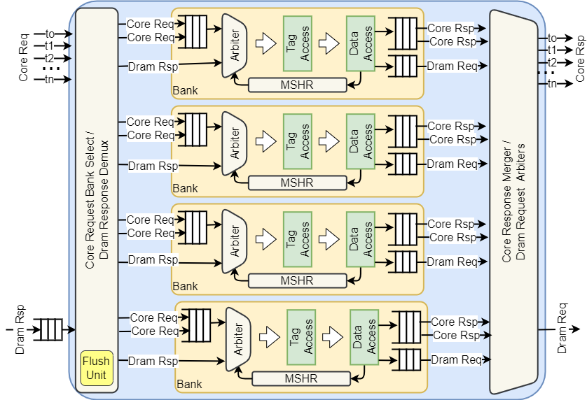

# Vortex Cache Subsystem

The Vortex cache subsystem has the following main properties:

- High-bandwidth transfer with multi-bank parallelism
- Non-blocking pipelined architecture with a per-bank MSHR and fill forwarding
- Configurable design: Dcache, Icache, L2 cache, L3 cache
- Write-through or write-back operation, selected per level by coherence role
- Sectored lines (decoupled tag/fill granularity) at the last-level caches
- Atomic memory operations (AMOs) executed at the last-level cache

All geometry and sizing is driven from `VX_config.toml` — see
[Configuration parameters](#configuration-parameters) below.

## Cache geometry: line, sector, and word

Each cache decouples three independent granules so banking, memory bandwidth, and
tag cost can be tuned separately:

- **Line (`LINE_SIZE`)** — tag granularity; one tag covers a line. Banks interleave
  at the line granule (a whole line lives in one bank).
- **Sector (`SECTOR_SIZE`)** — fill / eviction / memory-transaction granule. A line
  holds `LINE_SIZE/SECTOR_SIZE` sectors, each with its own valid/dirty state, so the
  memory side transacts in sectors while one tag spans the whole line. `SECTOR_SIZE
  == LINE_SIZE` means a single sector per line (no sectoring).
- **Word (`WORD_SIZE`)** — the coalescer output / per-request access granule. The
  number of request ports (and therefore banks) is `NUM_REQS = footprint / WORD`.

The **L2 and L3** caches are sectored: the line is doubled (`2 × MEM_BLOCK`) to halve
the tag count, while the sector stays at `MEM_BLOCK` (the memory-bus transaction size).
The **icache** and **dcache** keep `LINE = SECTOR = MEM_BLOCK` (unsectored).

## Dcache banking for memory-level parallelism (MLP)

Dcache banks come from the coalescer **word size**, not the line: a warp's coalesced
footprint (`lanes × XLEN/8`) is split into `footprint/WORD` requests, one per bank
(`NUM_BANKS = NUM_REQS`, no over-provisioning). The word is reduced ~`sqrt(lanes)`
below the line so the bank count scales with thread count while the word/bus stays
moderate. With `MEM_BLOCK = 64B`, `XLEN = 32`:

| threads | footprint | word | banks | effective MLP (banks × MSHR) |
|--------:|----------:|-----:|------:|-----------------------------:|
| 1   | 4B   | 4  | 1 | 16  |
| 2   | 8B   | 8  | 1 | 16  |
| 4   | 16B  | 8  | 2 | 32  |
| 8   | 32B  | 16 | 2 | 32  |
| 16  | 64B  | 16 | 4 | 64  |
| 32  | 128B | 32 | 4 | 64  |
| 64  | 256B | 32 | 8 | 128 |

Banks interleave at the line, so a single warp reaches `footprint/LINE` banks; the
remaining banks serve **cross-warp** MLP (independent warps hitting different lines)
and scale total outstanding misses via per-bank MSHRs. The miss drain to the next
level is bounded by `L1_MEM_PORTS = min(NUM_BANKS, PLATFORM_MEMORY_NUM_BANKS)`.

The request side of the MLP equation is the LSU's outstanding pool
(`VX_CFG_LSU_PENDING_SIZE`) — the cache can only overlap as many misses as the LSU
keeps in flight. See [lsu_pipeline_design.md](lsu_pipeline_design.md).

## Cache Microarchitecture

The Vortex cache ([hw/rtl/cache/](../../hw/rtl/cache/)) is comprised of multiple
parallel banks behind a pair of crossbars:

- **Bank request dispatch crossbar**: assigns a bank to incoming requests and resolves
  collisions with stalls.
- **Bank response merge crossbar**: merges results from banks back into the outgoing
  core response ports.
- **Memory request multiplexer**: arbitrates bank memory requests onto `MEM_PORTS`
  memory ports.
- **Memory response demultiplexer**: forwards memory responses to the corresponding bank.
- **Flush unit**: reset-time tag initialization and whole-cache flush — see
  [cache_flush_architecture.md](cache_flush_architecture.md).
- **AMO engine**: read-modify-write execution for RISC-V A-extension operations at the
  LLC, with a probe/passthrough path at the non-LLC levels — see
  [atomic_memory_operations.md](atomic_memory_operations.md) and
  [multicache_amo_coherence.md](multicache_amo_coherence.md).

Each bank integrates a non-blocking pipeline with a local Miss Status Holding Register
(MSHR). The bank pipeline consists of the following stages:

- **Schedule**: selects the next request into the pipeline from the incoming core
  request, memory fill, MSHR replay, or flush walk, with priority
  `init > replay > fill > flush > core request`.
- **Tag access**: single-port read/write access to the tag store, plus replacement
  state update and MSHR allocate/probe.
- **Data access**: single-port read/write access to the data store. The pipeline
  payload is one word wide; fills and writebacks stream sectors through a staged
  line buffer rather than carrying full lines through the pipe.
- **Response handling**: core response back to the core.

Key behaviors of the miss path:

- **One miss per line**: requests to a line that already has a miss in flight chain
  onto the existing MSHR entry instead of allocating a new one; replays retire in
  arrival order.
- **Fill forwarding**: when the fill returns, the pending chain is served directly
  from the fill data while the line is written to the array, removing the
  read-after-fill round trip from the miss latency.
- **Sectored fills** (L2/L3): a miss fetches only the missing sector; other sectors
  of the line fill on demand, halving fill bandwidth for strided access.

Deadlocks inside the cache can occur when the MSHR is full and a new request is
already in the pipeline, or when the memory request queue is full while a memory
response arrives. The cache mitigates MSHR deadlocks with an early-full signal
before a new request is issued, and memory deadlocks by ensuring the memory request
queue never fills up (fills reserve their slot at allocation).

## Configuration parameters

All knobs live in `VX_config.toml` and can be overridden per build with
`CONFIGS="-DVX_CFG_<NAME>=<value>"`. After editing the toml, re-run `../configure`
from the build directory so the generated headers pick up the change.

### Hierarchy enables

| Parameter | Default | Effect |
|---|---|---|
| `VX_CFG_ICACHE_ENABLE` | `true` | Instantiate the per-socket icache; disabled, fetches bypass straight to the next level. |
| `VX_CFG_DCACHE_ENABLE` | `true` | Instantiate the per-socket dcache; disabled, LSU traffic bypasses to the next level. |
| `VX_CFG_L2_ENABLE` | `false` | Per-cluster shared L2. **Required for multi-core configurations** — it is the first shared point where stores from different cores become mutually visible. |
| `VX_CFG_L3_ENABLE` | `false` | Global L3 shared by all clusters; required for multi-cluster coherence for the same reason. |

Performance: enabling L2/L3 adds `LATENCY` cycles to every L1 miss but multiplies
effective capacity and converts DRAM round trips into on-chip hits. Disabling a level
turns it into a passthrough that forwards the upstream granule unchanged.

### Global geometry

| Parameter | Default | Effect |
|---|---|---|
| `VX_CFG_MEM_BLOCK_SIZE` | `64` | Memory-bus transaction size in bytes. Anchors every level's line/sector: larger blocks amortize DRAM overhead per transfer but waste bandwidth on sparse access. |
| `VX_CFG_L1_LINE_SIZE` | `MEM_BLOCK` | L1 line = sector = fill granule (icache, dcache, and gfx caches). Smaller lines cut miss fill cost and false sharing at the price of more tags. |
| `VX_CFG_L2_LINE_SIZE` / `VX_CFG_L2_SECTOR_SIZE` | `2×MEM_BLOCK` / `MEM_BLOCK` | Sectored L2: the doubled line halves tag count (BRAM/timing win) while fills stay at the bus granule. |
| `VX_CFG_L3_LINE_SIZE` / `VX_CFG_L3_SECTOR_SIZE` | `2×MEM_BLOCK` / `MEM_BLOCK` | Same sectoring at L3. |

### Per-level knobs

Each level (`ICACHE`, `DCACHE`, `L2`, `L3`) exposes the same family; the table lists
the level-specific defaults where they differ.

**`*_SIZE`** (icache 16KB, dcache 16KB, L2 1MB, L3 2MB) — total capacity in bytes.
The dominant hit-rate knob. Capacity divides evenly across banks
(`lines/bank = SIZE / (LINE × BANKS × WAYS)`), and the set-index width follows from
it. Larger caches raise the SimX `*_LATENCY` model (see below) and consume BRAM;
on FPGA, capacity beyond the working set buys nothing, and past a point the added
tag/index depth pressures timing.

**`*_NUM_WAYS`** (icache 4, dcache 4, L2/L3 8) — set associativity. Reduces conflict
misses for strided or power-of-two access patterns at a mild area cost (parallel tag
compare per way). Diminishing returns beyond 8 ways for typical GPU workloads;
halving ways frees BRAM but makes conflict thrashing likelier when many warps stride
across the same sets.

**`*_REPL_POLICY`** (`fifo` everywhere by default) — victim selection: `0` random,
`1` FIFO (cyclic), `2` pseudo-LRU. PLRU gives the best hit rate on reuse-heavy
workloads but stores per-set tree bits and update logic; FIFO is a single counter per
set and within a few percent on streaming GPU workloads; random is cheapest and
degrades worst-case patterns gracefully.

**`*_MSHR_SIZE`** (16 at every level) — outstanding misses per bank. Total
memory-level parallelism per cache = `NUM_BANKS × MSHR_SIZE`. Also the tag-id space
the next level sees, so it sizes downstream response routing. Raise it when the
next level's latency is long enough that banks stall with all entries pending
(latency-bandwidth product); each entry costs a line-address CAM slot and replay
state, and same-line requests share one entry (chaining), so entries are consumed
per distinct missing line, not per request.

**`*_MRSQ_SIZE`** (icache 0, others 4) — memory response staging queue depth. Elastic
buffering between the memory port and the bank fill path; `0` collapses to a
skid buffer. Deepen only if fill backpressure from bank contention is measured —
responses that cannot enter a bank stall the shared memory port and block other
banks' fills behind them.

**`*_MREQ_SIZE`** (`0` = bank-derived minimum) — memory request (miss egress) queue
depth per bank. The minimum guarantees deadlock freedom (fills always have queue
space reserved); raising it decouples writeback/miss bursts from memory-port
arbitration stalls. Mostly useful in write-back mode where flush or eviction bursts
serialize through this queue.

**`*_CRSQ_SIZE`** (`0` = derived minimum) — core response queue depth per bank.
Buffers hit responses toward the core when the response crossbar backpressures
(multiple banks responding to the same port). Deepen when profiling shows hit
responses stalling the bank pipeline (`crsp_queue_stall`), which otherwise blocks
subsequent accesses to that bank.

**`*_WRITEBACK`** (derived) — write-back vs write-through. Automatically enabled
only where the level is **both** the last-level cache **and** the single coherence
point (dcache: single-core no-L2/L3; L2: single-cluster no-L3; L3: always when
enabled). Write-back removes store write-through traffic entirely — the biggest
bandwidth lever for store-heavy kernels — but is only correct at a shared point,
which is why the expression derives it rather than exposing a free boolean. A
private cache must stay write-through so stores reach shared memory.

**`*_DIRTYBYTES`** (`0`) — per-byte dirty tracking in write-back mode. Evictions
write back only dirty bytes instead of whole lines, saving downstream bandwidth on
partial-line stores, at the cost of a byte-enable RAM per line. Only meaningful
where `WRITEBACK=1`.

**`*_LATENCY`** (derived: `2 + clog2(SIZE/base)` for L1, `4 + …` for L2/L3) — the
SimX timing model's pipeline latency for the level. Scales with capacity so bigger
arrays model slower access. RTL latency is structural (pipeline depth); this knob
only affects the cycle-approximate simulator, and keeping it aligned with the
hardware is what keeps SimX↔RTL cycle parity honest.

### Banking and memory ports

| Parameter | Default | Effect |
|---|---|---|
| `VX_CFG_DCACHE_WORD_SIZE` | `~XLENB×sqrt(2·lanes)`, clamped to `[XLENB, L1_LINE]` | Coalescer output granule. Sets `NUM_REQS = lane footprint / WORD` and therefore the bank count. Smaller words → more banks (more MLP, more crossbar area); larger words → wider single-bank access (fewer conflicts on unit-stride, less cross-warp parallelism). |
| `VX_CFG_DCACHE_NUM_BANKS` | `pow2(min(NUM_REQS, 16))` | Bank count (power of two, capped at 16). More banks multiply both hit bandwidth and total MSHR capacity; bank-conflict stalls appear when a warp's addresses map to the same bank at different lines. |
| `VX_CFG_L2_NUM_BANKS` / `VX_CFG_L3_NUM_BANKS` | `pow2(min(NUM_REQS, 16))` | Same for the shared levels, where `NUM_REQS` counts the upstream cores/clusters. |
| `VX_CFG_L1_MEM_PORTS`, `VX_CFG_L2_MEM_PORTS`, `VX_CFG_L3_MEM_PORTS` | `min(NUM_BANKS, PLATFORM_MEMORY_NUM_BANKS)` | Concurrent transactions a level presents downstream. Ports below the bank count serialize miss drain (fine when hit rate is high); the platform bank count is the real ceiling. |
| `VX_CFG_NUM_ICACHES` / `VX_CFG_NUM_DCACHES` | `SOCKET_SIZE / 4` | L1 instances per socket — up to 4 cores share one L1. Fewer, larger shared L1s improve utilization for coherent working sets; more instances remove inter-core arbitration. |
| `VX_CFG_PLATFORM_MEMORY_NUM_BANKS` | `2` | Platform memory channels; caps every level's `MEM_PORTS`. |

### Tuning summary

- **Miss rate** too high → raise `*_SIZE`, then `*_NUM_WAYS`, then consider `plru`.
- **Miss latency hiding** insufficient (banks idle while misses pend) → raise
  `*_MSHR_SIZE` and check the LSU pending pool upstream; verify `MEM_PORTS` is not
  serializing the drain.
- **Bank conflicts** (hit-path stalls) → more banks via a smaller
  `DCACHE_WORD_SIZE`; check address strides against the line-interleaved mapping.
- **Store bandwidth** bound → enable a shared level so `WRITEBACK` derives to 1
  where legal; add `*_DIRTYBYTES` for partial-line store patterns.
- **BRAM/timing** pressure → cut `*_NUM_WAYS` or `*_SIZE` before cutting banks;
  sectoring at L2/L3 (default) already halves their tag arrays.
