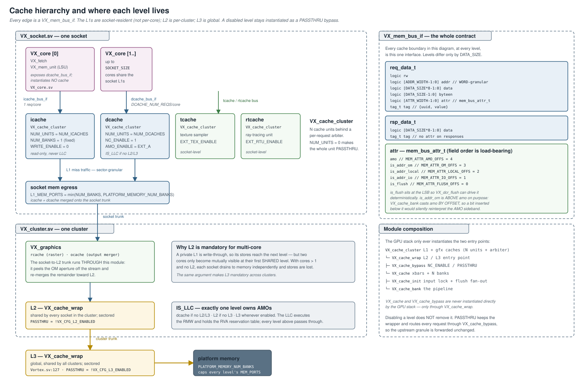
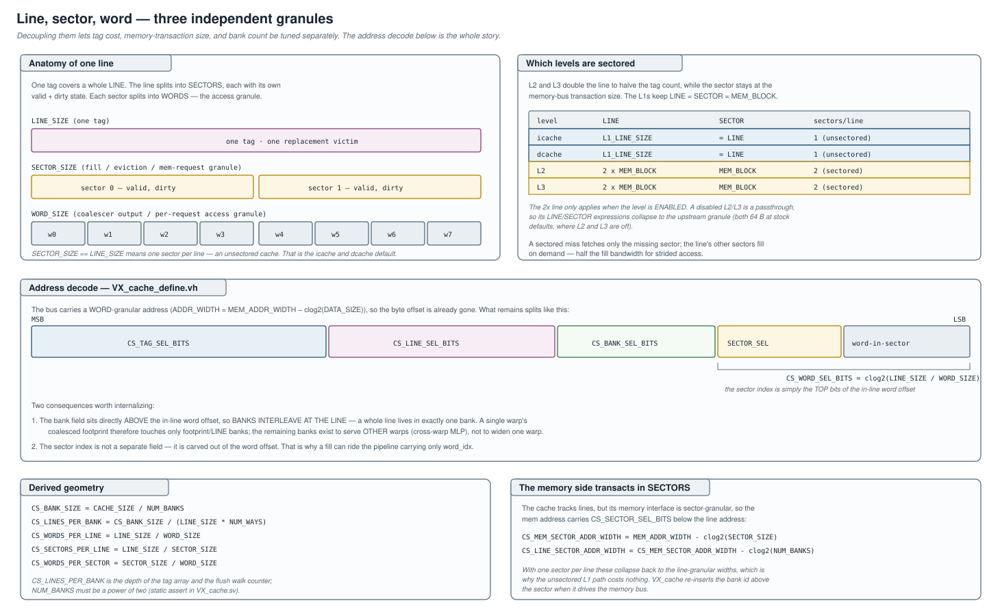
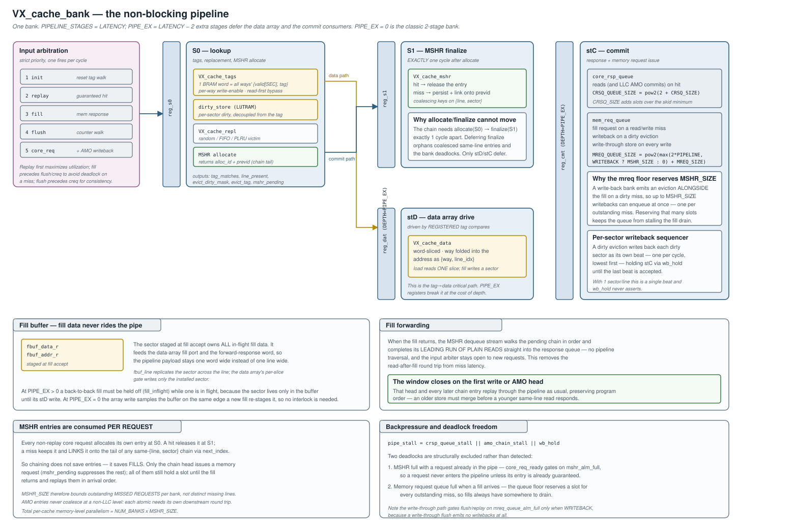
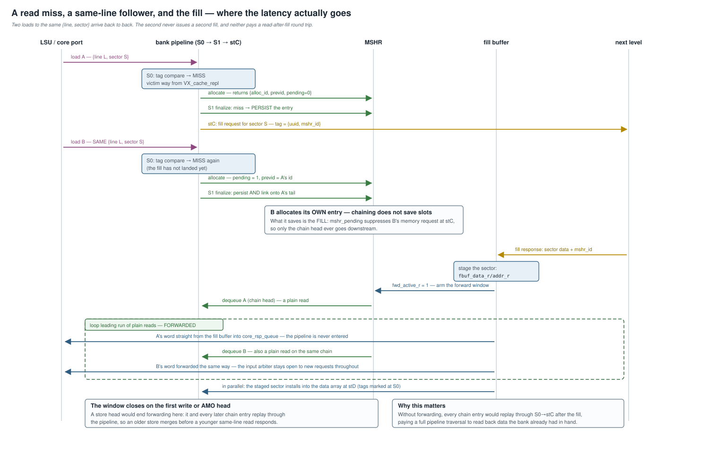
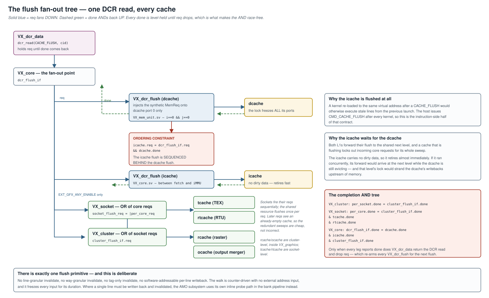
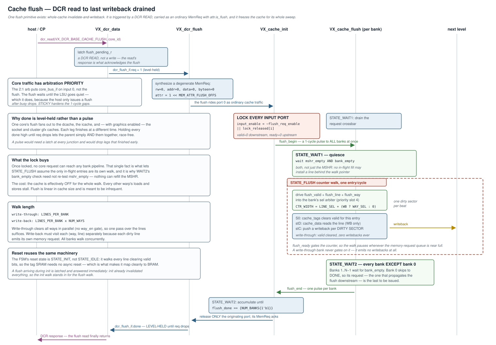

# Vortex Cache Subsystem

The complete reference for the Vortex cache: the bus contract it speaks, the
operations it understands, the bank pipeline that executes them, how it scales,
how it is flushed, and every knob that shapes it.

**Files:** [hw/rtl/cache/](../../hw/rtl/cache/) — 15 modules, ~4.9k lines.

| Module | Role |
|---|---|
| [VX_cache_cluster.sv](../../hw/rtl/cache/VX_cache_cluster.sv) | N cache units behind a per-request arbiter — the L1/gfx entry point |
| [VX_cache_wrap.sv](../../hw/rtl/cache/VX_cache_wrap.sv) | bypass + cache — the L2/L3 entry point |
| [VX_cache_bypass.sv](../../hw/rtl/cache/VX_cache_bypass.sv) | non-cacheable routing and whole-cache passthrough |
| [VX_cache.sv](../../hw/rtl/cache/VX_cache.sv) | four crossbars + N banks |
| [VX_cache_bank.sv](../../hw/rtl/cache/VX_cache_bank.sv) | the pipeline (1294 lines — the heart of the design) |
| [VX_cache_tags.sv](../../hw/rtl/cache/VX_cache_tags.sv) | single-array tag store + decoupled per-sector dirty LUTRAM |
| [VX_cache_data.sv](../../hw/rtl/cache/VX_cache_data.sv) | word-sliced, way-folded data array |
| [VX_cache_mshr.sv](../../hw/rtl/cache/VX_cache_mshr.sv) | miss status holding registers + same-line chaining |
| [VX_cache_repl.sv](../../hw/rtl/cache/VX_cache_repl.sv) | random / FIFO / PLRU victim selection |
| [VX_cache_init.sv](../../hw/rtl/cache/VX_cache_init.sv) | cache-level flush FSM + input lock |
| [VX_cache_flush.sv](../../hw/rtl/cache/VX_cache_flush.sv) | per-bank init/flush walk FSM |
| [VX_cache_amo.sv](../../hw/rtl/cache/VX_cache_amo.sv), [VX_amo_unit.sv](../../hw/rtl/cache/VX_amo_unit.sv), [VX_amo_alu.sv](../../hw/rtl/cache/VX_amo_alu.sv) | atomics at the LLC, probe/passthrough above it |
| [VX_cache_define.vh](../../hw/rtl/cache/VX_cache_define.vh) | geometry macros |

Main properties:

- High-bandwidth transfer with multi-bank parallelism
- Non-blocking pipelined architecture with a per-bank MSHR and fill forwarding
- Configurable design: icache, dcache, L2, L3, and four graphics caches
- Write-through or write-back operation, derived per level from coherence role
- Sectored lines (decoupled tag/fill granularity) at the last-level caches
- Atomic memory operations executed at the last-level cache

All geometry and sizing is driven from `VX_config.toml` — see
[§8 Configuration parameters](#8-configuration-parameters).

---

## 1. Where each level lives



The GPU stack instantiates only two entry points. `VX_cache` and
`VX_cache_bypass` are never instantiated directly — always through
`VX_cache_wrap`.

| Level | Module | Instantiated at | Notes |
|---|---|---|---|
| icache | `VX_cache_cluster` | [VX_socket.sv:134](../../hw/rtl/VX_socket.sv#L134) | `NUM_BANKS=1`, `NUM_REQS=1`, `WRITE_ENABLE=0`, never LLC |
| dcache | `VX_cache_cluster` | [VX_socket.sv:179](../../hw/rtl/VX_socket.sv#L179) | `NC_ENABLE=1`, `AMO_ENABLE=EXT_A`, LLC when no L2/L3 |
| tcache | `VX_cache_cluster` | [VX_socket.sv:350](../../hw/rtl/VX_socket.sv#L350) | texture sampler, `EXT_TEX_ENABLE` |
| rtcache | `VX_cache_cluster` | [VX_socket.sv:475](../../hw/rtl/VX_socket.sv#L475) | ray-tracing unit, `EXT_RTU_ENABLE` |
| rcache | `VX_cache_cluster` | [VX_graphics.sv:237](../../hw/rtl/VX_graphics.sv#L237) | rasterizer, cluster-level |
| ocache | `VX_cache_cluster` | [VX_graphics.sv:458](../../hw/rtl/VX_graphics.sv#L458) | output merger, cluster-level |
| L2 | `VX_cache_wrap` | [VX_cluster.sv:190](../../hw/rtl/VX_cluster.sv#L190) | per-cluster, sectored |
| L3 | `VX_cache_wrap` | [Vortex.sv:127](../../hw/rtl/Vortex.sv#L127) | global, sectored |

The hierarchy is `core → socket → cluster → L2 → L3 → memory`. Two things about
it are easy to get wrong:

**The L1s are socket-resident, not per-core.** [VX_mem_unit.sv](../../hw/rtl/core/VX_mem_unit.sv)
instantiates no cache at all — it only exposes `dcache_bus_if`. Both L1s live in
[VX_socket.sv](../../hw/rtl/VX_socket.sv) and are shared by up to `SOCKET_SIZE`
cores through `VX_cache_cluster`'s per-request arbiter.

**The socket-to-L2 trunk runs through `VX_graphics`**, which peels the OM
aperture off the stream and re-merges the remainder toward L2.

### 1.1 Disabling a level does not remove it

There is no conditional instantiation. A disabled L2/L3 is still elaborated;
`PASSTHRU` routes every request through `VX_cache_bypass`, which forwards the
upstream granule unchanged. For the L1s and gfx caches the same effect comes from
`NUM_UNITS = 0`, since `VX_cache_cluster` derives `PASSTHRU = (NUM_UNITS == 0)`.

This matters when reading the geometry expressions: with L2 and L3 off — the
stock default — their `LINE_SIZE`/`SECTOR_SIZE` expressions collapse to the
upstream granule rather than to their nominal sectored values.

### 1.2 Coherence roles

Exactly one level is the LLC, and it is the only level that executes atomics and
holds the RVA reservation table. Every level above it passes atomics through.

```
DCACHE_IS_LLC = !L2_ENABLED && !L3_ENABLED
L2_IS_LLC     =  L2_ENABLED && !L3_ENABLED
L3_IS_LLC     =  L3_ENABLED
```

SimX computes `is_llc` identically ([socket.cpp:87](../../sim/simx/socket.cpp#L87),
[cluster.cpp:76](../../sim/simx/cluster.cpp#L76), [processor.cpp:80](../../sim/simx/processor.cpp#L80)),
which is what keeps the two models' AMO behavior aligned.

**A shared level is mandatory for multi-core.** A private L1 is write-through, so
its stores do reach the next level — but two cores only become mutually visible at
their first *shared* level. With `cores > 1` and no L2, each socket drains to
memory independently and stores are lost. The same argument makes L3 mandatory
across clusters. See [multicache_amo_coherence.md](multicache_amo_coherence.md).

---

## 2. Request ABI and operation set

Every cache boundary at every level — core to L1, L1 to L2, L2 to L3, L3 to
memory — is one interface: [VX_mem_bus_if](../../hw/rtl/mem/VX_mem_bus_if.sv).
Levels differ only in `DATA_SIZE` and `TAG_WIDTH`. That interface is the entire
contract.

### 2.1 Wire format

```systemverilog
typedef struct packed {
    logic [UUID_WIDTH-1:0]           uuid;
    logic [TAG_WIDTH-UUID_WIDTH-1:0] value;
} tag_t;

typedef struct packed {
    logic                       rw;
    logic [ADDR_WIDTH-1:0]      addr;      // WORD-granular
    logic [DATA_SIZE*8-1:0]     data;
    logic [DATA_SIZE-1:0]       byteen;
    logic [`UP(ATTR_WIDTH)-1:0] attr;      // mem_bus_attr_t
    tag_t                       tag;
} req_data_t;

typedef struct packed {
    logic [DATA_SIZE*8-1:0] data;
    tag_t                   tag;           // responses carry no attr
} rsp_data_t;
```

`ADDR_WIDTH = VX_CFG_MEM_ADDR_WIDTH - clog2(DATA_SIZE)`: the address is
**word-granular**, so the byte offset is already gone by the time the cache sees
it. Both directions are valid/ready.

The `uuid` sub-field is not decoration — it is the ordering and debug identity
that the MSHR, the trace output, and every `RUNTIME_ASSERT` key on.

### 2.2 The attr sideband — the operation selector

There is no `flags` field and no `MEM_REQ_FLAG_*` constant anywhere in the RTL or
SimX. Operations that are not plain read/write are selected by `attr`, typed
`mem_bus_attr_t` ([VX_gpu_pkg.sv:204](../../hw/rtl/VX_gpu_pkg.sv#L204)):

| Field | Offset | Meaning |
|---|---|---|
| `is_flush` | `MEM_ATTR_FLUSH_OFFS = 0` | whole-cache invalidate-and-writeback ([§6](#6-flush-architecture)) |
| `is_addr_io` | `MEM_ATTR_IO_OFFS = 1` | I/O aperture — routed around the cache by `VX_cache_bypass` |
| `is_addr_local` | `MEM_ATTR_LOCAL_OFFS = 2` | local (scratchpad) aperture |
| `is_addr_om` | `MEM_ATTR_OM_OFFS = 3` | OM aperture |
| `amo` | `MEM_ATTR_AMO_OFFS = 4` | AMO sideband, `amo_req_t` |

Two placement decisions are load-bearing and documented as such in the source:

- `is_flush` sits at the LSB so `VX_dcr_flush` can drive it deterministically.
- `is_addr_om` was appended **above** `amo`, not below. `VX_cache_bank` casts the
  AMO sideband **by offset**, so a bit inserted below it would silently shift
  `MEM_ATTR_AMO_OFFS` and reinterpret the atomic. Do not reorder these fields.

### 2.3 The AMO operation set

```systemverilog
typedef struct packed {
    logic [HART_ID_WIDTH-1:0] hart_id;      // for the LLC reservation table
    logic                     amo_unsigned;
    amo_op_e                  amo_op;
    logic                     amo_valid;
} amo_req_t;
```

`amo_op_e`: `LR=0, SC=1, ADD=2, SWAP=3, XOR=4, OR=5, AND=6, MIN=7, MAX=8`.
MINU/MAXU collapse into MIN/MAX plus the `amo_unsigned` bit. The width comes from
the request's `byteen` popcount at the bank; the RHS is read from `data`.

The enum is defined unconditionally so `AMO_ENABLE` can be a plain parameter
rather than an ifdef — with `EXT_A` off, the bits are still allocated in `attr`
but the bank's AMO logic is generated away.

### 2.4 What a bank actually decodes

Inside the bank the request becomes one of five mutually exclusive kinds, which
is the closest thing the cache has to an instruction set:

| Kind | Source | Effect |
|---|---|---|
| `is_init` | reset FSM | clear valid bits for one line, all ways |
| `is_replay` | MSHR dequeue | re-execute a request whose fill has landed |
| `is_fill` | memory response | install a sector into the array |
| `is_flush` | flush FSM | clear one entry; write back if dirty |
| `is_creq` | core port, or a synthetic AMO writeback | read / write / atomic |

---

## 3. Geometry: line, sector, word



Three granules are decoupled so tag cost, memory-transaction size, and bank count
can be tuned independently:

- **Line (`LINE_SIZE`)** — tag granularity. One tag covers a line; one line is
  one replacement victim.
- **Sector (`SECTOR_SIZE`)** — fill / eviction / memory-transaction granule. A
  line holds `LINE_SIZE/SECTOR_SIZE` sectors, each with its own valid and dirty
  state. `SECTOR_SIZE == LINE_SIZE` means one sector per line — unsectored.
- **Word (`WORD_SIZE`)** — coalescer output and per-request access granule.

L2 and L3 are sectored: the line is doubled (`2 × MEM_BLOCK`) to halve the tag
count while the sector stays at `MEM_BLOCK`, the memory-bus transaction size. The
icache and dcache keep `LINE = SECTOR = L1_LINE_SIZE` (unsectored).

### 3.1 Address decode

The word-granular address splits as `[tag | line | bank | sector | word-in-sector]`,
with the sector index carved out of the **top bits of the in-line word offset**
rather than being a field of its own. Two consequences are worth internalizing:

1. **The bank field sits directly above the in-line word offset, so banks
   interleave at the line** — a whole line lives in exactly one bank. A single
   warp's coalesced footprint therefore touches only `footprint/LINE` banks; the
   remaining banks exist to serve *other* warps, not to widen one warp.
2. Because the sector index is part of the word offset, a fill can ride the
   pipeline carrying only `word_idx` and still tell the tag and data stages which
   sector to mark and write.

The memory side transacts in sectors, so the memory address carries
`CS_SECTOR_SEL_BITS` below the line address (`CS_MEM_SECTOR_ADDR_WIDTH`,
`CS_LINE_SECTOR_ADDR_WIDTH`). With one sector per line these collapse back to the
line-granular widths, which is why the unsectored L1 path costs nothing.

### 3.2 Dcache banking for memory-level parallelism

Dcache banks come from the coalescer **word size**, not the line: a warp's
coalesced footprint (`lanes × XLEN/8`) is split into `footprint/WORD` requests,
one per bank (`NUM_BANKS = NUM_REQS`, no over-provisioning). The word is reduced
roughly `sqrt(lanes)` below the block so the bank count scales with thread count
while the word and bus stay moderate. With `MEM_BLOCK = 64B`, `XLEN = 32`:

| threads | footprint | word | banks | effective MLP (banks × MSHR) |
|--------:|----------:|-----:|------:|-----------------------------:|
| 1   | 4B   | 4  | 1 | 16  |
| 2   | 8B   | 8  | 1 | 16  |
| 4   | 16B  | 8  | 2 | 32  |
| 8   | 32B  | 16 | 2 | 32  |
| 16  | 64B  | 16 | 4 | 64  |
| 32  | 128B | 32 | 4 | 64  |
| 64  | 256B | 32 | 8 | 128 |

Since banks interleave at the line, a single warp reaches `footprint/LINE` banks;
the remaining banks serve **cross-warp** MLP — independent warps hitting different
lines — and scale total outstanding misses via per-bank MSHRs. The miss drain to
the next level is bounded by `L1_MEM_PORTS`.

The request side of the MLP equation is the LSU's outstanding pool
(`VX_CFG_LSU_PENDING_SIZE`) — the cache can only overlap as many misses as the
LSU keeps in flight. See [lsu_pipeline_design.md](lsu_pipeline_design.md).

---

## 4. Microarchitecture

`VX_cache` is N banks behind four crossbars ([VX_cache.sv](../../hw/rtl/cache/VX_cache.sv)):

| Crossbar | Module | Shape |
|---|---|---|
| core request | `VX_stream_xbar` | `NUM_REQS → NUM_BANKS`, round-robin, bank-select from the address |
| core response | `VX_stream_omega` | `NUM_BANKS → NUM_REQS` |
| memory request | `VX_stream_omega` | `NUM_BANKS → MEM_PORTS` |
| memory response | `VX_stream_omega` | `MEM_PORTS → NUM_BANKS`, demuxed by the tag |

`VX_cache_init` sits ahead of the request crossbar as the input gate, and each
bank owns a private MSHR, tag store, data array, and queues.

### 4.1 The bank pipeline



A request travels two parallel paths that fork after S0: a **data path**
(`sel → S0 → stD`) carrying the request plus its word payload to the data array,
and a **commit path** (`sel → S0 → S1 → stC`) carrying the request plus the
S0-computed lookup delta to the response and memory-request logic.

- **S0 — lookup.** Tag compare, replacement victim selection, and MSHR allocate.
  Produces `tag_matches`, `line_present`, `evict_dirty_mask`, `evict_tag`,
  `mshr_pending`.
- **S1 — finalize.** MSHR finalize: release the entry on a hit, or persist it and
  link it onto the chain on a miss.
- **stD — data array drive.** Driven by *registered* tag-compare results.
- **stC — commit.** Core response and memory request issue.

`PIPELINE_STAGES = LATENCY` and `PIPE_EX = LATENCY - 2`. `PIPE_EX` extra register
stages defer **only** stD and stC. At `PIPE_EX = 0` — the classic 2-stage bank —
stD collapses into S0 and stC into S1.

**Tags, replacement, and the MSHR cannot be deferred.** The coalescing chain
requires allocate (S0) and finalize (S1) to be exactly one cycle apart; deferring
finalize orphans coalesced same-line entries and the bank deadlocks. Only the
data array and the commit consumers move, which is precisely the point: the array
ends up driven by registered tag compares, breaking the tag→data critical path.
Read and write both move to the same deferred stage, so pipeline order is
preserved and no store→load hazard logic is needed.

### 4.2 Input arbitration

Strict priority; at most one source fires per cycle:

```
init > replay > fill > flush > core_req
```

Replay first maximizes utilization (it is a guaranteed hit); fill precedes flush
and core requests to avoid deadlock on a miss; flush precedes core requests for
consistency. The core-request slot is shared with the synthetic AMO writeback
injected after an LLC atomic commits.

### 4.3 Tag store

One BRAM word holds **all ways'** `{valid[SEC], tag}` for a set, read in parallel
for the hit compare, with a per-way write-enable so a fill or invalidate updates a
single way without a read-modify-write.

Per-sector **dirty** state is decoupled into a side LUTRAM
(`NUM_WAYS × SEC` bits per set, per-bit write-enable). This keeps the wide
tag-compare→dirty-set loop off the tag BRAM's write path: a write hit changes
neither the tag nor the valid vector, so it does **not** write the tag store at
all — only the dirty LUTRAM.

Both arrays are read one cycle ahead (`raddr = line_idx_n`) in read-first mode,
with an explicit same-set bypass for a fill committed on the previous cycle. That
bypass must **hold across a pipe stall** (`~stall`-gated): when a fill is followed
by a dependent replay and the pipe stalls in between — for example during a
multi-beat per-sector writeback — a plain 1-cycle buffer would expire mid-stall
and the replay would spuriously miss the just-filled line.

### 4.4 Data array

Word-sliced and way-folded. The line is split into `CS_WORDS_PER_LINE`
independent word slices, and the way dimension is folded into the array address as
`{way, line_idx}` rather than replicated as `NUM_WAYS` parallel full-line arrays.
The way is resolved at read-issue — hit way for a core access, victim way for a
fill or flush:

- a load reads **only** the slice selected by `word_idx`
- a store writes only that slice, byte-enabled
- a fill writes the fetched sector's slices in parallel
- a writeback or flush reads all slices in parallel

This removes both the all-ways data read and the late `NUM_WAYS:1` line mux of a
parallel-access design. The per-byte dirty mask (when `DIRTY_BYTES=1`) stays as
one line-indexed array per way in LUTRAM: it is narrow, off the load path, and
must be clearable for every way during the line-only init walk, which the
way-folded layout cannot do in a single pass.

### 4.5 MSHR and same-line chaining

**Entries are consumed per request, not per line.** Every non-replay core request
allocates its own entry at S0. A hit releases it at S1; a miss persists it and
links it onto the tail of any existing same-`{line, sector}` chain via
`next_index`.

So chaining does not save entries — it saves **fills**. Only the chain head issues
a memory request; `mshr_pending` suppresses the rest at stC. All of them still
hold a slot until the fill returns and replays them in arrival order.

`MSHR_SIZE` therefore bounds **outstanding missed requests per bank**, not
distinct missing lines. Total per-cache memory-level parallelism is
`NUM_BANKS × MSHR_SIZE`.

Coalescing keys on `{line, sector}`, not just the line: a fill installs one
sector, so same-line different-sector misses each get their own fill and each
replay then hits its own filled sector. AMO entries are excluded from matching at
a non-LLC level — each atomic needs its own downstream round trip, because RVA is
non-commutative. At the LLC, atomics chain in arrival order like any other request.

One subtlety worth knowing: an allocate never links behind a chain tail that is
being consumed **this cycle**. It would finalize one cycle after the tail is
invalidated and be orphaned with nothing to wake it. Excluded, the requester
proceeds as a fresh hit or miss — safe, because a draining chain implies its fill
has already completed.

### 4.6 Fill buffer and fill forwarding



**Fill data never rides the pipeline.** The sector staged at fill accept
(`fbuf_data_r`/`fbuf_addr_r`) owns all in-flight fill data and feeds both the
data-array fill port and the forward-response word. That is what keeps the
pipeline payload one word wide instead of one line wide.

When the fill returns, the MSHR dequeue stream walks the pending chain in order —
including late joiners — and completes its **leading run of plain reads** straight
into the response queue. No pipeline traversal, and the input arbiter stays open
to new requests. This removes the read-after-fill round trip from miss latency.

The window closes on the **first write or AMO head**. That head and every later
chain entry replay through the pipeline as usual, preserving program order: an
older store must merge before a younger same-line read responds.

Two details make it correct:

- The head is claimed only when the response slot is free this cycle — the
  commit-stage response has priority. Otherwise the head stays visible to the
  arbiter and drains through the normal replay path, so a busy hit stream cannot
  starve the chain.
- At `PIPE_EX > 0` a back-to-back fill is held off (`fill_inflight`) while one is
  in flight, because the sector lives only in the buffer until its stD write. At
  `PIPE_EX = 0` the array write samples the buffer on the same edge a new fill
  re-stages it, so no interlock is needed.

### 4.7 Commit: responses and memory requests

The core response queue depth is `pow2(2 + CRSQ_SIZE)` — a registered-skid
minimum of 2 plus the configured extra slots.

The memory request queue depth is:

```
MREQ_QUEUE_SIZE = pow2(max(2 * PIPELINE_STAGES, WRITEBACK ? MSHR_SIZE : 0) + MREQ_SIZE)
```

The `MSHR_SIZE` term is the interesting one. A write-back bank emits an eviction
**alongside** the fill on a dirty miss, so up to `MSHR_SIZE` writebacks can
enqueue at once — one per outstanding miss. Reserving that many slots keeps the
queue from stalling the very fill drain that would free them.

A dirty eviction writes back each dirty sector as its own sector-sized beat: the
sequencer drains one per cycle, lowest first, holding stC via `wb_hold` until the
last beat is accepted. With one sector per line this is a single beat and
`wb_hold` never asserts.

### 4.8 Backpressure and deadlock freedom

```
pipe_stall = crsp_queue_stall || amo_chain_stall || wb_hold
```

Two deadlocks are structurally excluded rather than detected:

1. **MSHR full with a request already in the pipeline.** `core_req_ready` gates on
   `mshr_alm_full`, so a request never enters the pipeline unless its entry is
   already guaranteed.
2. **Memory request queue full when a fill arrives.** The queue floor reserves a
   slot for every outstanding miss, so fills always have somewhere to drain.

Note that flush and fill gate on `mreq_queue_alm_full` only when `WRITEBACK` — a
write-through bank emits no writebacks, so there is nothing to reserve for.
Replay is the mirror image: it gates only when **not** `WRITEBACK` and the
replayed request is a write (`replay_rw`), because a write-through bank forwards
every write downstream and so does need a slot for it.

---

## 5. Parallelism and scaling

The design scales along four axes, and they compose multiplicatively:

| Axis | Knob | What it buys | What it costs |
|---|---|---|---|
| Banks | `*_NUM_BANKS` | hit bandwidth and total MSHR capacity | crossbar area; bank-conflict stalls |
| Outstanding misses | `*_MSHR_SIZE` | latency hiding per bank | a CAM slot + replay state per entry |
| Memory ports | `*_MEM_PORTS` | miss drain rate | downstream fabric width |
| Cache units | `NUM_UNITS` | removes inter-core arbitration | replicated tag/data arrays |

**Banks.** Bank count is a power of two (static assert) and comes from
`NUM_REQS`, which for the dcache is the coalescer's output count. Because banks
interleave at the line, more banks widen *cross-warp* throughput, not a single
warp's footprint. Bank-conflict stalls appear when a warp's addresses map to the
same bank at different lines.

**Outstanding misses.** Raise `MSHR_SIZE` when the next level's latency is long
enough that banks stall with all entries pending — the latency-bandwidth product.
It is also the tag-id space the next level sees, so it sizes downstream response
routing.

**Memory ports.** `MEM_PORTS ≤ NUM_BANKS` (static assert). Ports below the bank
count serialize the miss drain, which is fine when the hit rate is high.
`PLATFORM_MEMORY_NUM_BANKS` is the real ceiling: every level's `MEM_PORTS`
expression mins against it.

**Cache units.** `VX_cache_cluster` puts `NUM_UNITS` independent caches behind a
per-request arbiter, with `NUM_INPUTS ≥ NUM_CACHES`. The default is
`up(SOCKET_SIZE / 4)` — up to four cores share one L1. Fewer, larger shared L1s
improve utilization for coherent working sets; more instances remove inter-core
arbitration at the cost of replicated arrays and lost sharing.

**Pipeline depth.** `LATENCY` is a scaling axis too, but a timing one rather than
a throughput one: it trades pipeline depth for a shorter tag→data path. Every
stage added is a cycle on every hit, so it buys frequency, not bandwidth.

---

## 6. Flush architecture

The cache exposes exactly **one** flush primitive: a whole-cache
invalidate-and-writeback, gated on `attr.is_flush`. There is no line-granular
invalidate, no way-granular invalidate, no tag-only invalidate, and no
software-addressable per-line writeback. The only thing software can ask for is
"drain this cache."

A flush walks every line in every way and:

- in **write-back** mode, emits a writeback for each dirty sector, then clears
  valid and dirty;
- in **write-through** mode, clears valid only — the line is already coherent with
  memory, so no writeback is ever emitted.

The same machinery is reused for reset-time tag initialization.

### 6.1 The trigger and the fan-out tree



The flush is triggered by a DCR **read** of `VX_DCR_BASE_CACHE_FLUSH` — a read,
not a write, because the read's *response* is what acknowledges completion.
[VX_dcr_data.sv](../../hw/rtl/core/VX_dcr_data.sv) latches `flush_pending_r`,
holds `dcr_flush_if.req` high, and returns the DCR response only once `done`
comes back.

From `VX_core` the request fans out to six possible destinations through six
`VX_dcr_flush` instances — dcache, icache, tcache, rtcache, rcache, ocache —
and the completions AND back up:

```
VX_cluster:  per_socket.done = cluster_flush_if.done
VX_socket:   per_core.done   = cluster_flush_if.done & tcache.done & rtcache.done
VX_core:     dcr_flush_if.done = dcache.done & icache.done & cluster_flush_if.done
```

**`done` is level-held, not a pulse.** Each leg finishes at a different time;
holding every `done` high until `req` drops is what lets each parent simply AND
them together race-free. A pulse would need a latch at every junction and would
drop legs that finished early.

**The icache flush is sequenced behind the dcache flush:**

```systemverilog
assign dcr_flush_icache_if.req = dcr_flush_if.req && dcr_flush_dcache_if.done;
```

Both L1s forward their flush to the shared next level, and a cache that is
flushing locks out incoming core requests for its whole sweep. The icache carries
no dirty data and so retires almost immediately; if it ran concurrently, its
forward would arrive at the next level while the dcache is still evicting, and
that level's lock would strand the dcache's writebacks upstream of memory.

The icache is flushed at all because a kernel re-loaded to the same virtual
address after a `CACHE_FLUSH` would otherwise execute stale lines from the
previous launch. The host issues `CMD_CACHE_FLUSH` after every kernel launch — see
[command_processor.md](command_processor.md).

### 6.2 VX_dcr_flush — injecting the request

`VX_dcr_flush` synthesizes a degenerate `MemReq` (`rw=0, addr=0, data=0,
byteen=0, attr = 1 << MEM_ATTR_FLUSH_OFFS`) and merges it into the cache's port 0
stream through a 2:1 `VX_mem_bus_arb`.

**Core traffic sits on the priority input, not the flush.** The flush waits until
upstream is quiescent — which it reliably is, because the host only issues
`CACHE_FLUSH` after `busy` drops, so once the LSU adapter buffers drain the core
input goes idle and the flush wins. `STICKY=1` hardens against any one-cycle gap
in core valid during the drain.

Two registers guard re-injection: `flush_inflight_r` prevents a second synthetic
request while one is in flight, and `flush_done_r` holds `done` stably high after
the first completion until the initiator drops `req`. Without that latch, a shared
`req` across several instances would make the fast ones re-flush forever while
waiting on the slow one.

Only **port 0** of the dcache is routed through `VX_dcr_flush`
([VX_mem_unit.sv:381](../../hw/rtl/core/VX_mem_unit.sv#L381), `i==0 && j==0`). The
input lock inside `VX_cache_init` is what propagates the freeze to every other
port.

### 6.3 End-to-end sequence



### 6.4 VX_cache_init — the input lock

`VX_cache_init` is a 5-state FSM (`IDLE → WAIT1 → FLUSH → WAIT2 → DONE`) sitting
between the cache's input ports and the request crossbar.

```systemverilog
wire input_enable = ~flush_req_enable || lock_released[i];
assign core_bus_out_if[i].req_valid = core_bus_in_if[i].req_valid && input_enable;
assign core_bus_in_if[i].req_ready  = core_bus_out_if[i].req_ready && input_enable;
```

While a flush is in flight every input port presents `valid=0` downstream and
`ready=0` upstream, so upstream stalls. Only the port that originated the flush is
unlocked (`lock_released_n = flush_req_mask`), so its `MemReq` enters the cache and
generates the acknowledging response; the rest unlock on the return to IDLE.

- `STATE_WAIT1` waits for `BANK_SEL_LATENCY × NUM_BANKS` outstanding crossbar
  requests to drain. When there is no crossbar latency this state is bypassed and
  IDLE goes straight to FLUSH.
- `STATE_FLUSH` is one cycle: it pulses `flush_begin` to **all** banks at once.
- `STATE_WAIT2` accumulates `flush_done |= flush_end` until every bank has
  reported.

That lock is the load-bearing piece for correctness. Once engaged, no core request
can reach any bank pipeline — which is what lets the per-bank walk assume the only
in-flight entries are its own.

### 6.5 VX_cache_flush — the per-bank walk

A 6-state FSM per bank, about 14 flip-flops:

| State | Purpose |
|---|---|
| `STATE_INIT` | **the reset state.** Walks `[0, 2^LINE_SEL_BITS)` driving `cache_tags.init`, clearing all ways' valid bits. Never writes back — lines are X at reset. |
| `STATE_IDLE` | wait for `flush_begin` |
| `STATE_WAIT1` | wait for `mshr_empty` **and** `bank_empty` |
| `STATE_FLUSH` | counter walk; drives `flush_valid`, `flush_line`, `flush_way`; increments on `flush_ready` |
| `STATE_WAIT2` | **every bank except bank 0** waits for `bank_empty` |
| `STATE_DONE` | one-cycle `flush_end` pulse |

**The counter width depends on the write policy:**

```
CTR_WIDTH = CS_LINE_SEL_BITS + (WRITEBACK ? CS_WAY_SEL_BITS : 0)
```

Write-through walks each line once — `VX_cache_tags` clears all ways in parallel,
since `do_flush = flush && (!WRITEBACK || way_en)` drops the way gate. Write-back
walks each `(way, line)` separately because each dirty line emits its own memory
request.

**`STATE_WAIT2` is every bank *except* bank 0.** Bank 0 goes straight to DONE:

```systemverilog
state_n = (BANK_ID == 0) ? STATE_DONE : STATE_WAIT2;
```

Bank 0 is the canonical egress that propagates the flush downstream to lower
levels, and that request must be issued **last**. The other banks therefore hold
their `flush_end` until their own writebacks have drained; since `VX_cache_init`
waits for the AND of all `flush_end`, bank 0's downstream forward cannot be
overtaken.

`flush_ready = flush_grant && ~(WRITEBACK && mreq_queue_alm_full) && ~pipe_stall`
gates the counter, so under write-back with a near-full egress queue the walk
pauses until it drains.

### 6.6 What flush does to the arrays

**Tags** ([VX_cache_tags.sv](../../hw/rtl/cache/VX_cache_tags.sv)):

```systemverilog
wire do_flush = flush && (!WRITEBACK || way_en);   // WT: all ways at once
assign line_write[i] = do_init || do_fill || do_flush || do_inval;
wire [SEC-1:0] valid_wr = (do_init || do_flush) ? {SEC{1'b0}} : ...;
```

A flush fires a tag write at `line_idx` with the whole per-sector valid vector
zeroed. In write-back mode the dirty LUTRAM is cleared for all sectors of that way
in the same cycle (`dclr_all`).

**Data** ([VX_cache_data.sv](../../hw/rtl/cache/VX_cache_data.sv)):

```systemverilog
wire slice_read = (read && word_en) || ((fill || flush) && WRITEBACK);
```

In write-back mode every slice is read on flush so the writeback path picks up the
line; the dirty-byte LUTRAM reads on flush too, so the writeback's byteen tracks
per-byte dirty marks. In write-through mode neither happens — the data array
ignores `flush` entirely.

### 6.7 Cost

**Area is essentially free.** The flush subsystem reuses the bank's existing
tag/data write ports and the existing memory-request queue.

| Component | Storage |
|---|---|
| `VX_cache_flush` | 3 bits state, 1 bit pending, ~10 bits counter — ~14 FF/bank |
| `VX_cache_init` | 3 bits state, `NUM_BANKS`-bit `flush_done`, `NUM_REQS`-bit `lock_released`, UUID register |
| `VX_dcr_flush` | 2 bits (`flush_inflight_r`, `flush_done_r`) + a 2:1 arbiter |
| tag / data RAM | **no extra storage** |
| mreq queue | **no extra entries** |

**Time** is linear in cache size:

| Mode | Walk cycles per bank |
|---|---|
| write-through | `LINES_PER_BANK` |
| write-back | `LINES_PER_BANK × NUM_WAYS` |

All banks walk concurrently. For the default L1 dcache (16KB, 64B lines, 4 ways)
`LINES_PER_BANK` is small and the walk is tens of cycles. For a 1MB 8-way 4-bank
L2 it is `256 × 8 = 2048` walk cycles per bank, plus writeback cycles for the dirty
fraction serialized through `mreq_queue`.

Pre-flush latency is dominated by `STATE_WAIT1` waiting for `mshr_empty` — worst
case the longest in-flight memory round trip.

**Throughput coupling:** because flush outranks core requests in the bank arbiter
*and* the input lock blocks all new traffic for the duration, the cache is
effectively off for the whole walk. Every other warp's loads and stores stall.
Flush is intended as an infrequent, coarse operation; it is not a fine-grained
primitive.

### 6.8 Correctness invariants

1. **Atomicity against normal traffic.** Once a flush is in flight no core request
   reaches a bank pipeline — enforced by the `VX_cache_init` input lock.
2. **The bank is fully quiesced before the walk starts.** `STATE_WAIT1` waits for
   `mshr_empty && bank_empty` — both, not just the MSHR. Otherwise a fill could
   install a fresh line behind the walk pointer and survive the flush.
3. **Reset-time valid bits are zero** without async reset on the tag SRAM, via the
   `STATE_INIT` walk. This is what lets the tag array map cleanly to BRAM. The
   bank's highest-priority `init_valid` masks every other source while it runs.
4. **All banks finish before the cache acks** — `VX_cache_init` waits for the AND
   of `flush_end` across all banks before unlocking the originating input.
5. **Bank 0's downstream forward goes out last** — banks 1..N−1 hold `flush_end`
   until `bank_empty`.
6. **The init walk is one-shot per reset.** `flush_pending_r` only records a
   `flush_begin` arriving *during* init; it never re-enters `STATE_INIT`.

Edge cases:

- **Flush during init** → `flush_pending_r` records it, and `STATE_DONE` fires as
  soon as init completes. The init walk stands in for the flush walk, which is
  correct because init invalidated everything anyway.
- **Multiple ports racing the flush flag** → the loop in `STATE_IDLE` counts down,
  so the last write wins and it latches the lowest-indexed one's UUID; all flagged
  ports unlock together at the end.
- **Flush during a fill-forward drain** is asserted impossible
  (`RUNTIME_ASSERT(~(flush_fire && fwd_pending))`) — `STATE_WAIT1`'s `mshr_empty`
  precondition already excludes it.
- **`STATE_WAIT2`'s `bank_empty` does not re-check `mshr_empty`.** It does not need
  to: WAIT1 established it and the input lock guarantees nothing can refill.

### 6.9 Why flush is not the substrate for line-granular invalidation

It is whole-cache only, counter-driven with no external address input, and it
freezes every cache input for the duration of the walk.

Where a single line must be written back and invalidated — the non-LLC levels
forwarding an atomic downstream — the AMO subsystem uses its own inline probe path
in the bank pipeline instead: the request probes the tag, emits a writeback if the
line is dirty, invalidates the single line, and forwards the operation, all
without stalling unrelated traffic. It reuses the same tag/data write ports but
bypasses the flush FSM and `VX_cache_init` entirely. See
[multicache_amo_coherence.md](multicache_amo_coherence.md) and
[atomic_memory_operations.md](atomic_memory_operations.md).

---

## 7. The SimX model

[sim/simx/mem/cache.cpp](../../sim/simx/mem/cache.cpp) (~1.9k lines) is a
structural, cycle-approximate twin — not a functional shortcut. It mirrors the RTL
closely enough to be a parity oracle:

| Feature | RTL | SimX |
|---|---|---|
| Bank pipeline | `PIPELINE_STAGES = LATENCY` register stages | `TFifo` of depth `config.latency`; one request processed per tick |
| Input priority | `init > replay > fill > flush > creq` | `replay > fill > flush > core_req` |
| MSHR | linked chain, keyed `{line, sector}` | `class MSHR`, linear scan, keyed `(set_id, addr_tag, sector_id)` |
| Sectors | per-sector valid/dirty | `sector_t` with per-byte `dirty_mask` |
| Fill forwarding | leading run of plain reads, closes on write/AMO | `processForward()`, identical closing rule |
| AMOs | LLC commits, non-LLC probes and forwards | `amo_unit_` at LLC; `AmoProbe` above it |
| Flush | per-bank set × way walk | per-bank set × way × sector walk |

`Cache::Config` fields: `bypass, C, L, S, W, A, B, addr_width, num_inputs,
mem_ports, write_back, write_reponse, mshr_size, latency, repl_policy, is_llc`
(`write_reponse` is misspelled in the source). `bypass` mirrors RTL `PASSTHRU`.

**SimX's flush is not a shortcut.** `flush_begin()` only *arms* the walk — and
no-ops entirely for a write-through cache, since there is no dirty state to evict.
The real work is `processFlush()`, called every tick, which:

1. refuses to start while `pending_fill_reqs_ != 0 || !pipe_req_->empty() ||
   !mshr_.empty()` — the same drain barrier as the RTL's `STATE_WAIT1`, and for the
   same reason;
2. emits one writeback per dirty **sector** with `byteen = sec.dirty_mask`,
   stalling and resuming at the same sector when `mem_req_out` is full;
3. clears `flushing_` when the walk terminates.

`Impl::flush_begin()` fans out to every bank and `Impl::flush_done()` ANDs them —
structurally the same shape as `VX_cache_init`.

See [simx_simulator_architecture.md](simx_simulator_architecture.md).

---

## 8. Configuration parameters

### 8.1 How a knob reaches the hardware

`VX_config.toml` is consumed by [ci/gen_config.py](../../ci/gen_config.py), driven
from [configure](../../configure), which emits **`<build>/hw/VX_config.vh`** and
**`<build>/sw/VX_config.h`**. (`hw/rtl/VX_define.vh` is hand-written and holds
derived macros that are *not* config knobs — it is not generated.)

A knob reaches a module parameter in three hops:

1. **`gen_config.py`** emits the knob three ways: as a `` `define VX_CFG_* `` in
   `VX_config.vh` (Verilog), as a `constexpr` in `VX_config.h` (C++), and via
   `--cflags` as a `-D` override for Makefiles.
2. **`VX_gpu_pkg.sv`** re-exports those macros as typed localparams and closes the
   `[[param]]` externals — `DCACHE_NUM_REQS`, `L2_NUM_REQS`, `L3_NUM_REQS`. SimX
   closes the same externals independently in `sim/simx/constants.h`.
3. **`VX_socket.sv` / `VX_cluster.sv` / `Vortex.sv`** bind them to module
   parameters at the instantiation site.

Emission is **unresolved** — each knob becomes an `ifndef`-guarded macro — which is
what makes `CONFIGS="-DVX_CFG_<NAME>=<value>"` work. After editing the toml,
re-run `../configure` from the build directory so the generated headers pick up
the change.

Three knobs are declared `[[param]]` and supplied by the consumer rather than
valued in the toml: `VX_CFG_DCACHE_NUM_REQS`, `VX_CFG_L2_NUM_REQS`,
`VX_CFG_L3_NUM_REQS`. They are closed in `VX_gpu_pkg.sv` for RTL and
`sim/simx/constants.h` for SimX. Do not read them out of a bare
`gen_config.py --cflags` dump — unvalued `[[param]]` ints default to 0 there, which
makes any expression that depends on them produce a meaningless value.

### 8.2 Hierarchy enables

These live in `[platform]`, not in the cache sections.

| Parameter | Default | Effect |
|---|---|---|
| `VX_CFG_ICACHE_ENABLE` | `true` | Sets `NUM_ICACHES`; disabled ⇒ 0 ⇒ the unit becomes PASSTHRU and fetches bypass to the next level. |
| `VX_CFG_DCACHE_ENABLE` | `true` | Same for the dcache. |
| `VX_CFG_L2_ENABLE` | `false` | Per-cluster shared L2. **Required for multi-core** — the first shared point where stores from different cores become mutually visible. |
| `VX_CFG_L3_ENABLE` | `false` | Global L3 shared by all clusters; required for multi-cluster coherence for the same reason. |

Enabling L2/L3 adds `LATENCY` cycles to every L1 miss but multiplies effective
capacity and converts DRAM round trips into on-chip hits.

### 8.3 Global geometry

| Parameter | Default | Effect |
|---|---|---|
| `VX_CFG_MEM_BLOCK_SIZE` | `64` | Memory-bus transaction size. Anchors every level's line/sector: larger blocks amortize DRAM overhead but waste bandwidth on sparse access. |
| `VX_CFG_L1_LINE_SIZE` | `MEM_BLOCK` | L1 line = sector = fill granule (icache, dcache, gfx caches). |
| `VX_CFG_L2_LINE_SIZE` | `2×MEM_BLOCK` **if L2 enabled**, else `L1_LINE_SIZE` | Doubled line halves tag count. |
| `VX_CFG_L2_SECTOR_SIZE` | `MEM_BLOCK` **if L2 enabled**, else `L1_LINE_SIZE` | Fills stay at the bus granule. |
| `VX_CFG_L3_LINE_SIZE` / `VX_CFG_L3_SECTOR_SIZE` | same shape, keyed on `L3_ENABLE`, falling back to `L2_SECTOR_SIZE` | |

The `if enabled` conditions are not decoration: at stock defaults (L2 and L3 off)
every one of these resolves to 64, because a passthrough level must forward the
upstream granule unchanged.

### 8.4 Per-level knobs

Each level (`ICACHE`, `DCACHE`, `L2`, `L3`) exposes most of the same family.

**`*_SIZE`** (icache 16KB, dcache 16KB, L2 1MB, L3 2MB) — total capacity. The
dominant hit-rate knob. Capacity divides across banks
(`CS_LINES_PER_BANK = SIZE / (LINE × BANKS × WAYS)`) and the set-index width
follows from it. Larger caches raise `*_LATENCY` (below) and consume BRAM; on
FPGA, capacity beyond the working set buys nothing and eventually pressures
timing.

**`*_NUM_WAYS`** (icache 4, dcache 4, L2/L3 8) — set associativity. Reduces
conflict misses for strided or power-of-two patterns at a mild area cost. Because
the tag store packs all ways into one BRAM word, extra ways widen that word rather
than adding arrays. Diminishing returns past 8 for typical GPU workloads.

**`*_REPL_POLICY`** (`fifo` everywhere) — `0` random, `1` FIFO, `2` PLRU. PLRU
gives the best hit rate on reuse-heavy workloads but stores per-set tree bits;
FIFO is a single counter per set and within a few percent on streaming GPU
workloads; random is cheapest and degrades gracefully.

**`*_MSHR_SIZE`** (16 everywhere) — outstanding **missed requests** per bank (see
[§4.5](#45-mshr-and-same-line-chaining) — *not* distinct lines). Total MLP per
cache = `NUM_BANKS × MSHR_SIZE`. Also the tag-id space the next level sees. Raise
it when the next level's latency is long enough that banks stall with all entries
pending.

**`*_MRSQ_SIZE`** (icache 0, others 4) — memory response staging queue depth.
Elastic buffering between the memory port and the bank fill path; `0` collapses to
a skid buffer. Deepen only if fill backpressure from bank contention is measured —
responses that cannot enter a bank stall the shared memory port and block other
banks' fills behind them.

**`*_MREQ_SIZE`** (`0` everywhere) — **extra** memory-request queue slots *over*
the derived floor, not the depth itself. The floor already guarantees deadlock
freedom; raising this decouples writeback/miss bursts from memory-port arbitration
stalls. Mostly useful in write-back mode.

**`*_CRSQ_SIZE`** (`0` everywhere) — **extra** core-response queue slots over the
registered-skid minimum of 2. Deepen when profiling shows hit responses stalling
the bank pipeline (`crsp_stalls`), which otherwise blocks subsequent accesses to
that bank.

**`*_WRITEBACK`** (derived) — write-back vs write-through:

```
DCACHE_WRITEBACK = int(dcache_is_llc and single_core)
L2_WRITEBACK     = int(l2_is_llc     and single_cluster)
L3_WRITEBACK     = int(l3_is_llc)                          # L3 is always global
```

Write-back is legal only where the level is **both** the LLC **and** the single
coherence point — which is why this derives rather than exposing a free boolean. A
private cache acting as LLC across multiple cores has no shared coherence point,
so its dirty data would never become visible and it must stay write-through. L3
needs no topology conjunct because it is global by construction.

Note the consequence at stock defaults: with L2 and L3 off and one core, **the
dcache is a write-back LLC** (`DCACHE_WRITEBACK = 1`).

**`*_DIRTYBYTES`** (`0`) — per-byte dirty tracking in write-back mode. Evictions
write back only dirty bytes instead of whole sectors, saving downstream bandwidth
on partial-line stores, at the cost of a byte-enable LUTRAM per way. Only
meaningful where `WRITEBACK=1` (static assert).

**`*_LATENCY`** — **an RTL parameter, not just a simulator knob.**

```
ICACHE_LATENCY = 2 + max(0, clog2(ICACHE_SIZE) - clog2(16384))
DCACHE_LATENCY = 2 + max(0, clog2(DCACHE_SIZE) - clog2(16384))
L2_LATENCY     = 4 + max(0, clog2(L2_SIZE)     - clog2(1048576))
L3_LATENCY     = 4 + max(0, clog2(L3_SIZE)     - clog2(2097152))
```

It feeds `VX_cache_bank`'s `LATENCY` parameter, where `PIPELINE_STAGES = LATENCY`
and `PIPE_EX = LATENCY - 2` insert real register stages that defer the data array
and commit consumers ([§4.1](#41-the-bank-pipeline)) — **and** the SimX pipe FIFO
depth. The same number drives both models, which is what makes SimX↔RTL cycle
parity meaningful here rather than coincidental.

The `max(0, …)` floor is load-bearing: shrinking a cache below its base size
cannot drive latency below 2 (L1) or 4 (L2/L3), because `LATENCY >= 2` is a static
assert and the classic bank needs both stages. Each base constant equals that
level's own default size.

**Icache exceptions.** The icache has no `NUM_BANKS`, `WRITEBACK`, `DIRTYBYTES`,
`LINE_SIZE`, `WORD_SIZE`, or `SECTOR_SIZE` knob. Its geometry beyond size and ways
is fixed in `VX_gpu_pkg.sv` and at its instantiation (`NUM_BANKS=1`, `NUM_REQS=1`,
`WRITE_ENABLE=0`). Likewise L2/L3 have no `WORD_SIZE` knob — `L2_WORD_SIZE` is
`L1_LINE_SIZE` and `L3_WORD_SIZE` is `L2_SECTOR_SIZE`.

### 8.5 Banking and memory ports

| Parameter | Default | Effect |
|---|---|---|
| `VX_CFG_DCACHE_WORD_SIZE` | `min(L1_LINE_SIZE, min(MEM_BLOCK_SIZE, (XLEN/8) × pow(2, (clog2(NUM_LSU_LANES)+1)/2)))` | Coalescer output granule. Sets `NUM_REQS` and therefore the bank count. Smaller words → more banks (more MLP, more crossbar area); larger words → wider single-bank access. The `pow(2, (clog2(lanes)+1)/2)` term is a power-of-two rounding of a square root — there is no `sqrt` helper in the generator. |
| `VX_CFG_DCACHE_NUM_BANKS` | `pow(2, clog2(min(DCACHE_NUM_REQS, 16)))` | Bank count. |
| `VX_CFG_L2_NUM_BANKS` / `VX_CFG_L3_NUM_BANKS` | `pow(2, clog2(min(<L>_NUM_REQS, 16)))` | Identical form; `NUM_REQS` counts upstream sockets/clusters. |
| `VX_CFG_L1_MEM_PORTS` | `min(DCACHE_NUM_BANKS, PLATFORM_MEMORY_NUM_BANKS)` when either L1 is enabled | Concurrent transactions presented downstream. |
| `VX_CFG_L2_MEM_PORTS` / `VX_CFG_L3_MEM_PORTS` | `min(<L>_NUM_BANKS, PLATFORM_MEMORY_NUM_BANKS)` when enabled | Same. |
| `VX_CFG_NUM_ICACHES` / `VX_CFG_NUM_DCACHES` | `up(SOCKET_SIZE / 4)` if enabled, else `0` | L1 instances per socket. `up()` clamps to 1, so `SOCKET_SIZE < 4` still yields one cache — the `0` branch is reserved for the disable case. |
| `VX_CFG_PLATFORM_MEMORY_NUM_BANKS` | `2` | Platform memory channels; caps every level's `MEM_PORTS`. |

The `min(…, 16)` in the bank expressions **is** the bank cap, and it applies
identically at all three levels — the dcache is not special.

### 8.6 Tuning summary

- **Miss rate** too high → raise `*_SIZE`, then `*_NUM_WAYS`, then consider `plru`.
- **Miss latency hiding** insufficient (banks idle while misses pend) → raise
  `*_MSHR_SIZE` and check the LSU pending pool upstream; verify `MEM_PORTS` is not
  serializing the drain.
- **Bank conflicts** (hit-path stalls) → more banks via a smaller
  `DCACHE_WORD_SIZE`; check address strides against the line-interleaved mapping.
- **Store bandwidth** bound → enable a shared level so `WRITEBACK` derives to 1
  where legal; add `*_DIRTYBYTES` for partial-line store patterns.
- **BRAM / timing** pressure → cut `*_NUM_WAYS` or `*_SIZE` before cutting banks;
  sectoring at L2/L3 (default) already halves their tag arrays. If the tag→data
  path is the critical one, raising `*_LATENCY` buys frequency at a cycle per hit.

---

## 9. Performance counters

With `PERF_ENABLE`, each cache exports a `cache_perf_t`
([VX_cache.sv](../../hw/rtl/cache/VX_cache.sv)): `reads`, `writes`,
`read_misses`, `write_misses`, `evictions`, `bank_stalls`, `mshr_stalls`,
`mem_stalls`, `crsp_stalls`.

Two of these are easy to misread:

- `bank_stalls` is the request crossbar's **collision** count, not a bank-internal
  stall.
- `mshr_stalls` counts cycles where `mshr_alm_full` is asserted — the admission
  gate — not failed allocations.

`VX_cache_cluster` sums them across its units via `PERF_CACHE_ADD`. SimX exports
the same set plus `mem_latency`, accumulated as `pending_fill_reqs_` per tick.

---

## 10. Verification

- [hw/unittest/cache/](../../hw/unittest/cache/) — a standalone Verilator bench
  (`VX_cache_top.sv`) parameterized from the dcache defaults.
- `DBG_TRACE_CACHE` — per-bank tracing of every fire: tag hit/miss, fill, replay,
  fill-forward, writeback, write-through, and the full MSHR table dump.
- Runtime assertions guard the invariants that are otherwise invisible: MSHR
  in-use allocation, invalid release, invalid fill, missed replay, fill-forward
  address mismatch, dirty-byte/dirty-line disagreement, and flush during a
  fill-forward drain.
- SimX↔RTL cycle parity — see [simx_simulator_architecture.md](simx_simulator_architecture.md).
