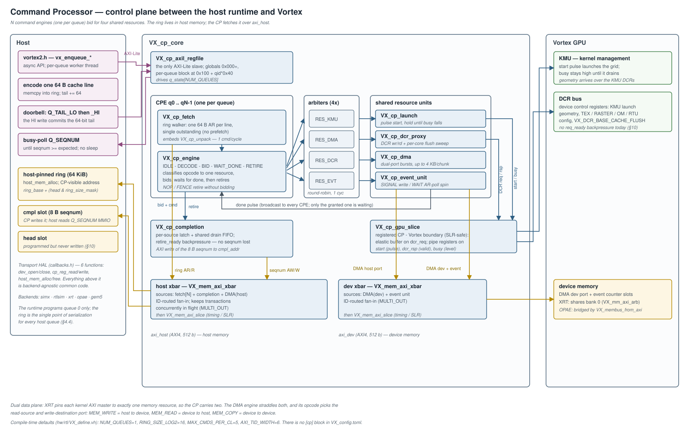
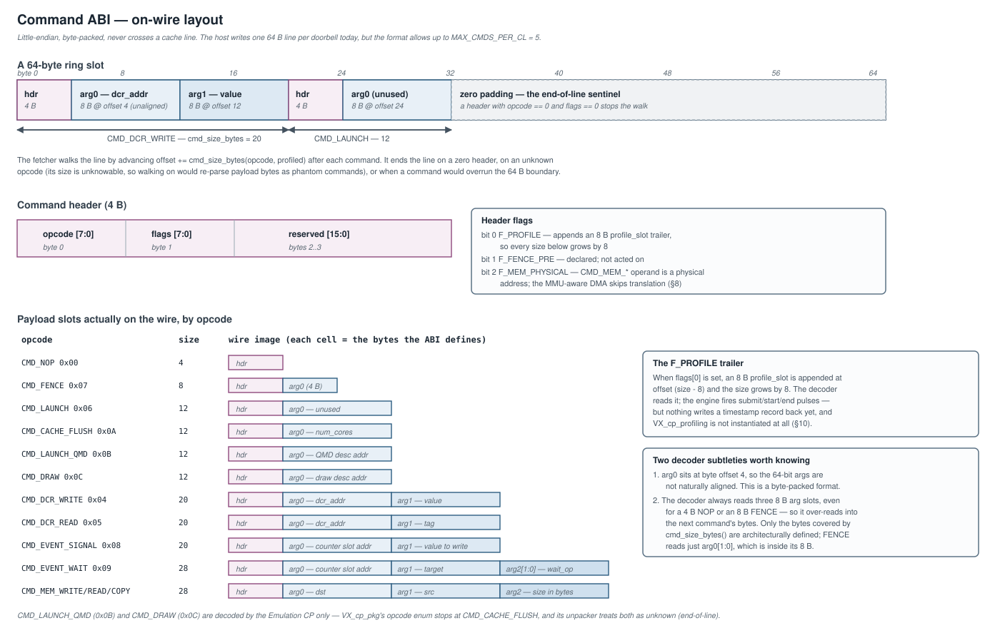
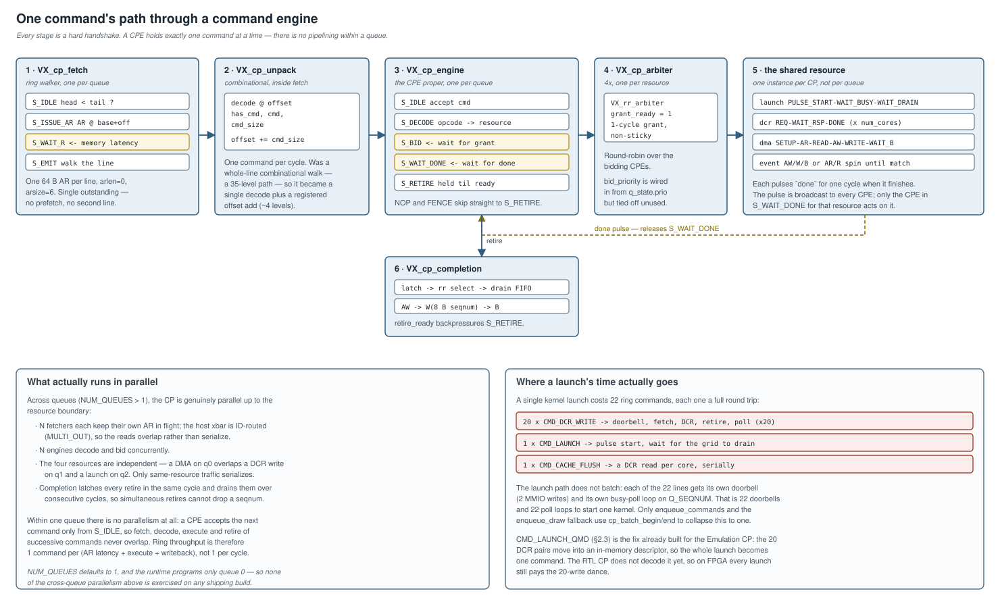
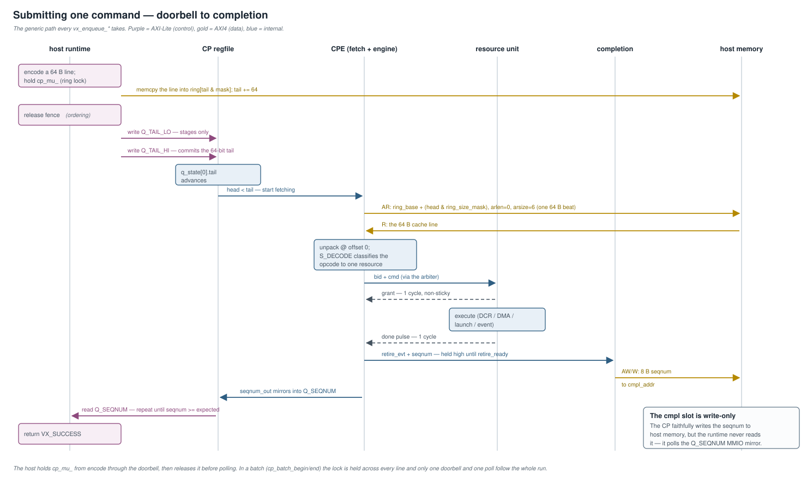
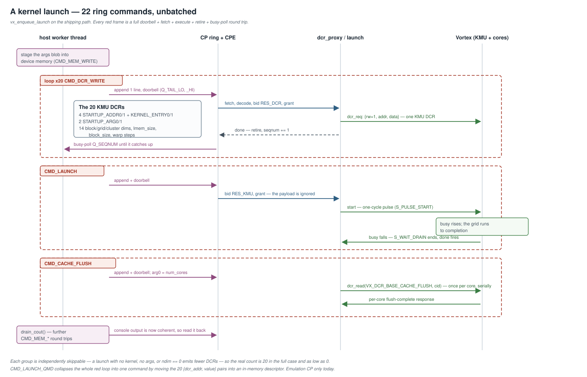
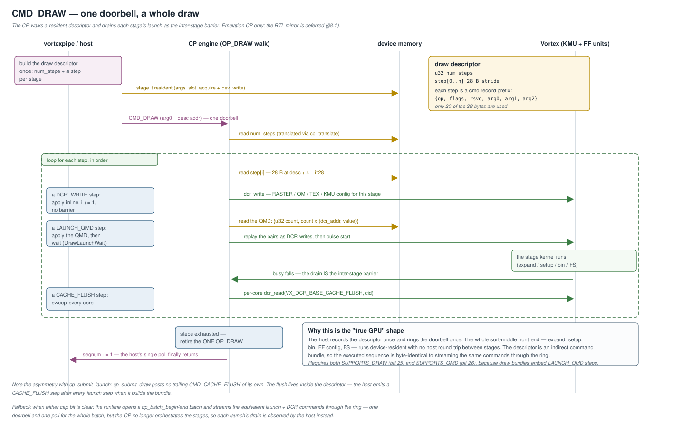

# Command Processor (CP) — Design

**Scope:** the Vortex Command Processor control plane — the hardware
([`hw/rtl/cp/`](../../hw/rtl/cp/)), its functional twin used by the
simulators ([`sim/common/cmd_processor.cpp`](../../sim/common/cmd_processor.cpp)),
and the async runtime that drives it
([`sw/runtime/include/vortex2.h`](../../sw/runtime/include/vortex2.h)).
This is the complete CP reference: ABI, command ISA, microarchitecture,
parallelism and scaling, and the interface to the rest of the GPU stack.

Terminology used throughout this document:

- **RTL CP** — the SystemVerilog hardware in `hw/rtl/cp/*.sv`.
- **Emulation CP** (a.k.a. **Simulation CP**) — the C++ model
  `sim/common/cmd_processor.{h,cpp}`, instantiated and ticked by the
  simx / rtlsim / gem5 backends.

The CP is the single control plane through which the host submits work
to the GPU: memory transfers, DCR (device control register) programming,
kernel launch, fences, events, and cache maintenance. On FPGA targets
(XRT and OPAE) it is the **sole** launch/DCR path — the legacy AP_CTRL
launch FSM and per-AFU DCR machinery have been removed.

---

## 1. Architecture overview

The CP is **N parallel command engines** (one per queue), feeding **four
round-robin arbiters** that serialize access to four shared resources:
the kernel-management unit (KMU launch), the DMA engine, the DCR bus, and
the event unit. The command ring lives in **host memory**; the CP fetches
from it over a dedicated AXI host port and writes completions back to host
memory over the same port.

The shape is deliberate. The host's only per-command costs are a `memcpy`
into a pinned ring and one doorbell write; everything after that —
fetching, decoding, sequencing, and reporting completion — is the device's
job. That is what makes device-orchestrated work (§8.1) possible at all:
once the CP can execute a command stream, a whole draw can become one
command it expands on-device.

Implemented in [`VX_cp_core.sv`](../../hw/rtl/cp/VX_cp_core.sv).

### 1.1 Compile-time parameters

The engine count, ring size, commands-per-line bound, and AXI ID width are
preprocessor macros with `ifndef` defaults in
[`hw/rtl/VX_define.vh:32-43`](../../hw/rtl/VX_define.vh#L32):
`VX_CP_NUM_QUEUES=1`, `VX_CP_RING_SIZE_LOG2=16` (→ 64 KiB ring),
`VX_CP_MAX_CMDS_PER_CL=5`, `VX_CP_AXI_TID_WIDTH=6`. They live in that
globally-included header rather than in `VX_cp_pkg.sv` so every CP module
*and* AFU wrapper resolves them during preprocessing;
[`VX_cp_pkg.sv:31-50`](../../hw/rtl/cp/VX_cp_pkg.sv#L31) mirrors the same
guards and lifts them into `localparam`s. Any value can be overridden with
a `-D` flag.

> **There is no `[cp]` block in `VX_config.toml`.** The CP is not wired
> into the TOML configuration system; `VX_define.vh` is the only source of
> these defaults. A build that wants multiple queues must pass
> `-DVX_CP_NUM_QUEUES=<n>` by hand.

---

## 2. Command ABI and ISA

A command is a 4-byte header plus an opcode-specific payload, packed into
64-byte cache lines. The decoded record is `cmd_t` in
[`VX_cp_pkg.sv:97-103`](../../hw/rtl/cp/VX_cp_pkg.sv#L97).

### 2.1 Wire format and packing rules

The header is `{ reserved[15:0], flags[7:0], opcode[7:0] }`
([`VX_cp_pkg.sv:84-88`](../../hw/rtl/cp/VX_cp_pkg.sv#L84)) with `opcode` at
byte 0 and `flags` at byte 1. Args follow immediately: `arg0` at byte
offset 4, `arg1` at 12, `arg2` at 20, and the optional `profile_slot` at
`size - 8`. The format is **little-endian and byte-packed** — `arg0` at
offset 4 means the 64-bit args are *not* naturally aligned.

A command never crosses a cache line. The unpacker
([`VX_cp_unpack.sv`](../../hw/rtl/cp/VX_cp_unpack.sv)) decodes exactly one
command at a given byte offset and reports `cmd_size`, which the fetch FSM
adds to the offset to reach the next one. It reports end-of-line when:

- there is no room for a 4 B header (`offset + 4 > 64`),
- the header is the zero sentinel (`opcode == 0 && flags == 0`),
- the opcode is one this CP does not decode — its size is unknowable, so
  walking on would re-parse payload bytes as phantom commands, or
- the command would overrun the 64 B boundary.

Two decoder subtleties matter when reading the RTL. First, `CMD_NOP` is a
*valid* 4 B opcode, but a NOP whose flags are also zero is
indistinguishable from padding and therefore terminates the line — NOP is
only reachable as a real command with a non-zero flag. Second, the decoder
unconditionally reads three 8 B arg slots regardless of `cmd_size`, so for
a 4 B NOP or an 8 B FENCE it over-reads into the following command's
bytes. Only the bytes covered by `cmd_size_bytes()`
([`VX_cp_pkg.sv:183-201`](../../hw/rtl/cp/VX_cp_pkg.sv#L183)) are
architecturally defined; FENCE reads only `arg0[1:0]`, which is inside its
8 bytes.

**Header flags** ([`VX_cp_pkg.sv:81-82`](../../hw/rtl/cp/VX_cp_pkg.sv#L81)):

| Bit | Name | Meaning |
|---|---|---|
| 0 | `F_PROFILE` | Appends an 8 B `profile_slot` trailer; every size below grows by 8. |
| 1 | `F_FENCE_PRE` | Declared in the package; not acted on by any consumer. |
| 2 | `F_MEM_PHYSICAL` | `CMD_MEM_*` device operand is a physical address — the MMU-aware DMA skips translation (§8). Emulation CP only ([`cmd_processor.h:160`](../../sim/common/cmd_processor.h#L160)). |

### 2.2 Opcode map

Opcodes are the low 8 bits of the header
([`VX_cp_pkg.sv:63-75`](../../hw/rtl/cp/VX_cp_pkg.sv#L63)); on-wire sizes
come from `cmd_size_bytes`
([`VX_cp_pkg.sv:183-201`](../../hw/rtl/cp/VX_cp_pkg.sv#L183)).

| Opcode | Value | Size (B) | Resource | RTL CP | Emu CP | Purpose |
|---|---|---|---|---|---|---|
| `CMD_NOP` | 0x00 | 4 | — | yes | yes | Padding / ring alignment |
| `CMD_MEM_WRITE` | 0x01 | 28 | DMA | yes | yes | Host → device copy |
| `CMD_MEM_READ` | 0x02 | 28 | DMA | yes | yes | Device → host copy |
| `CMD_MEM_COPY` | 0x03 | 28 | DMA | yes | yes | Device → device copy |
| `CMD_DCR_WRITE` | 0x04 | 20 | DCR | yes | yes | Write a device control register |
| `CMD_DCR_READ` | 0x05 | 20 | DCR | yes | yes | Read a DCR (result in `Q_LAST_DCR_RSP`) |
| `CMD_LAUNCH` | 0x06 | 12 | KMU | yes | yes | Pulse KMU start, wait for drain |
| `CMD_FENCE` | 0x07 | 8 | — | yes | yes | Ordering barrier (retires as a NOP today, §10) |
| `CMD_EVENT_SIGNAL` | 0x08 | 20 | EVENT | yes | yes | Write a counter slot |
| `CMD_EVENT_WAIT` | 0x09 | 28 | EVENT | yes | yes | Spin until a counter satisfies a compare |
| `CMD_CACHE_FLUSH` | 0x0A | 12 | DCR | yes | yes | Per-core cache flush sweep |
| `CMD_LAUNCH_QMD` | 0x0B | 12 | KMU | **no** | yes | Atomic launch: KMU descriptor read from memory (§2.3) |
| `CMD_DRAW` | 0x0C | 12 | KMU | **no** | yes | Device-orchestrated graphics draw (§8.1) |

`+8 B` to any size when `F_PROFILE` is set.

> **The last two opcodes are Emulation-CP only.** `VX_cp_pkg`'s
> `cp_opcode_e` enum stops at `CMD_CACHE_FLUSH`, so `cmd_opcode_valid()`
> ([`VX_cp_pkg.sv:163-178`](../../hw/rtl/cp/VX_cp_pkg.sv#L163)) rejects
> 0x0B and 0x0C and the RTL unpacker treats both as end-of-line. Each is
> capability-gated (§6) so the runtime only emits it where it is decoded.

### 2.3 Per-opcode semantics

- **`CMD_MEM_*`** — `arg0` = dst, `arg1` = src, `arg2` = size in bytes.
  The opcode selects the DMA's read-source and write-destination port
  (§3.1). `F_MEM_PHYSICAL` suppresses VA translation.
- **`CMD_DCR_WRITE`** — `arg0` = DCR address (12 bits used), `arg1` = value.
- **`CMD_DCR_READ`** — `arg0` = DCR address, `arg1` = tag placed on the DCR
  data bus. The response lands in `Q_LAST_DCR_RSP` (`+0x30`), which the
  host reads after observing the seqnum advance.
- **`CMD_LAUNCH`** — payload carries nothing the hardware reads.
  `VX_cp_launch` only pulses `start`, and `VX_cp_core` explicitly discards
  the granted command (`UNUSED_VAR (granted_kmu_cmd)`,
  [`VX_cp_core.sv:309`](../../hw/rtl/cp/VX_cp_core.sv#L309)). Grid geometry
  must already have been programmed by preceding `CMD_DCR_WRITE`s — which
  is exactly why a launch costs 22 commands (§4.4).
- **`CMD_LAUNCH_QMD`** — `arg0` points at an in-memory KMU descriptor,
  `{u32 count, count × (u32 dcr_addr, u32 value)}`. The CP reads it and
  replays the pairs through the DCR write path, then pulses start —
  collapsing the 20-write launch dance into one command
  ([`cmd_processor.cpp:308-322`](../../sim/common/cmd_processor.cpp#L308)).
  This is the NVIDIA QMD model. A 64-pair backstop guards a corrupt count.
- **`CMD_FENCE`** — scope masks in `arg0[1:0]` (`FENCE_DMA_BIT`,
  `FENCE_GPU_BIT`, [`VX_cp_pkg.sv:120-121`](../../hw/rtl/cp/VX_cp_pkg.sv#L120)).
- **`CMD_EVENT_WAIT`** — compare op in `arg2[1:0]`
  (`WAIT_OP_EQ/GE/GT/NE`, [`VX_cp_pkg.sv:109-114`](../../hw/rtl/cp/VX_cp_pkg.sv#L109)).
- **`CMD_CACHE_FLUSH`** — `arg0` = number of cores. Provides AMD
  `ACQUIRE_MEM`-style cache maintenance; the host fills `arg0` from
  `VX_CAPS_NUM_CORES`.

---

## 3. RTL CP module inventory

`hw/rtl/cp/` — 17 files, ~2900 LOC. Interfaces are split into separate
`VX_cp_*_if.sv` bundles per the project rule that `RTL_PKGS` carries only
`*_pkg.sv`.

| Module | Role |
|---|---|
| [`VX_cp_pkg.sv`](../../hw/rtl/cp/VX_cp_pkg.sv) | Opcodes, header/`cmd_t`/`cpe_state_t` structs, resource enum, `cmd_opcode_valid`, `cmd_size_bytes`. |
| [`VX_cp_core.sv`](../../hw/rtl/cp/VX_cp_core.sv) | Top level: regfile, N×(fetch+engine), 4 arbiters, the 4 resource units, completion, dual AXI xbars + slices, `cp_busy`/`irq` aggregation. |
| [`VX_cp_axil_regfile.sv`](../../hw/rtl/cp/VX_cp_axil_regfile.sv) | The only AXI-Lite slave. Global regs + per-queue blocks; atomic doorbell commit; caps registers; free-running cycle counter. |
| [`VX_cp_fetch.sv`](../../hw/rtl/cp/VX_cp_fetch.sv) | Per-queue ring walker: ARs one 64 B cache line at `ring_base + (head & mask)`, single outstanding (no prefetch). Embeds `VX_cp_unpack`. |
| [`VX_cp_unpack.sv`](../../hw/rtl/cp/VX_cp_unpack.sv) | Per-offset single-command decoder (one command/cycle; refactored from a combinational whole-line walk that was a 35-level path). |
| [`VX_cp_engine.sv`](../../hw/rtl/cp/VX_cp_engine.sv) | Per-queue FSM `IDLE→DECODE→BID→WAIT_DONE→RETIRE`; classifies opcode→resource and retires via valid/ready handshake. |
| [`VX_cp_arbiter.sv`](../../hw/rtl/cp/VX_cp_arbiter.sv) | Thin wrapper over `VX_rr_arbiter`, instantiated 4× (one per resource). |
| [`VX_cp_launch.sv`](../../hw/rtl/cp/VX_cp_launch.sv) | KMU start/busy wrapper: pulse start, hold grant until `busy` deasserts (drain). |
| [`VX_cp_dcr_proxy.sv`](../../hw/rtl/cp/VX_cp_dcr_proxy.sv) | DCR req/rsp gateway; also drives the per-core `CMD_CACHE_FLUSH` sweep; publishes last read in `Q_LAST_DCR_RSP`. |
| [`VX_cp_dma.sv`](../../hw/rtl/cp/VX_cp_dma.sv) | Dual-port burst DMA (`axi_host` + `axi_dev`); opcode routes ports; ≤4 KB INCR chunks. |
| [`VX_cp_event_unit.sv`](../../hw/rtl/cp/VX_cp_event_unit.sv) | `EVENT_SIGNAL` write + `EVENT_WAIT` poll-spin against counter slots. |
| [`VX_cp_completion.sv`](../../hw/rtl/cp/VX_cp_completion.sv) | Per-source 1-deep latch + shared drain FIFO with `retire_ready` backpressure; AXI write of 8 B seqnum to `cmpl_addr`. |
| [`VX_cp_gpu_slice.sv`](../../hw/rtl/cp/VX_cp_gpu_slice.sv) | Registered CP↔Vortex boundary (§7.1): elastic buffer on `dcr_req`, pipe registers on `start`/`dcr_rsp`/`busy`. |
| [`VX_cp_profiling.sv`](../../hw/rtl/cp/VX_cp_profiling.sv) | Free-running cycle counter. **Not instantiated anywhere** — see §10. |
| [`VX_cp_axil_s_if.sv`](../../hw/rtl/cp/VX_cp_axil_s_if.sv), [`VX_cp_gpu_if.sv`](../../hw/rtl/cp/VX_cp_gpu_if.sv), [`VX_cp_engine_bid_if.sv`](../../hw/rtl/cp/VX_cp_engine_bid_if.sv) | AXI-Lite slave / GPU DCR+start-busy / CPE-bid interface bundles. |

The AXI data path reuses the standard Vortex library rather than
CP-private modules: `VX_mem_axi_if`, `VX_mem_axi_xbar`, and
`VX_mem_axi_slice`.

Per-module Verilator unit tests live under `hw/unittest/cp_*`
(`cp_arbiter, cp_axil_regfile, cp_axi_path, cp_core, cp_dcr_proxy,
cp_dma, cp_engine, cp_launch, cp_unpack`).

### 3.1 Dual AXI topology

`VX_cp_core` builds **two** AXI crossbars
([`VX_cp_core.sv:388-478`](../../hw/rtl/cp/VX_cp_core.sv#L388)):

- **Host xbar** — fan-in of all fetch engines + completion + the DMA
  host port → one `axi_host` master that reaches host (pinned) memory.
- **Device xbar** — DMA device port + event unit → one `axi_dev` master
  that reaches device memory.

Both are `VX_mem_axi_xbar` with `MULTI_OUT=1`: sources leave the top
`LOG2UP(N)` ID bits free, the xbar tags them with the source index and
demuxes B/R responses back, so the CP's sources keep concurrent
transactions in flight. Each master is then followed by a
`VX_mem_axi_slice` to break the long, routing-dominated path to far-side
memory so the kernel clock can close.

The split exists because XRT pins each kernel AXI master to exactly one
memory resource. `VX_cp_dma` therefore straddles both and routes by opcode
([`VX_cp_dma.sv:95-96`](../../hw/rtl/cp/VX_cp_dma.sv#L95)):
`MEM_WRITE` = host→dev, `MEM_READ` = dev→host, `MEM_COPY` = dev→dev.

---

## 4. Microarchitecture: pipeline, arbitration, and scaling

Each queue has a `cpe_state_t`
([`VX_cp_pkg.sv:130-141`](../../hw/rtl/cp/VX_cp_pkg.sv#L130)): `ring_base`,
`ring_size_mask`, `head_addr`, `cmpl_addr`, `tail`, `head`, `seqnum`,
`prio`, `enabled`, `profile_en`. The regfile owns the host-writable
fields; `head` and `seqnum` flow back up from the CPE as telemetry.

### 4.1 Fetch and decode

`VX_cp_fetch` runs `S_IDLE → S_ISSUE_AR → S_WAIT_R → S_EMIT`. It ARs a
single 64 B beat (`arlen=0`, `arsize=6`, INCR) at
`ring_base + (head & ring_size_mask)` whenever `enabled && head < tail`,
latches the line, then walks it one command per cycle through the embedded
`VX_cp_unpack`, advancing a registered `offset += cmd_size`. When the line
is exhausted it advances `head` by 64 and returns to `S_IDLE`.

There is **one outstanding AR per queue and no prefetch** — the next line
is not requested until the current one is fully consumed.

### 4.2 The engine FSM

`VX_cp_engine` runs `S_IDLE → S_DECODE → S_BID → S_WAIT_DONE → S_RETIRE`
([`VX_cp_engine.sv:126-185`](../../hw/rtl/cp/VX_cp_engine.sv#L126)). It
classifies each opcode to one of `RES_KMU/RES_DMA/RES_DCR/RES_EVT`
([`VX_cp_pkg.sv:149-154`](../../hw/rtl/cp/VX_cp_pkg.sv#L149)), raises a bid
to that resource's arbiter, waits for the resource's `done` pulse, then
retires through `VX_cp_completion` using a valid/ready handshake
([`VX_cp_engine.sv:173-181`](../../hw/rtl/cp/VX_cp_engine.sv#L173)) so no
seqnum is dropped when multiple engines retire in the same cycle. `NOP`
and `FENCE` classify as "no resource" and go straight to `S_RETIRE`.

The `done` pulses are broadcast from the shared resource modules to every
CPE. That is safe *as long as only one CPE is waiting on a given resource*
— see §4.4.

A CPE accepts a new command only in `S_IDLE`, so **within one queue
nothing overlaps**: fetch, decode, execute, and retire of successive
commands are strictly serial. Per-queue throughput is one command per
(AR latency + execute + writeback), not one per cycle.

### 4.3 Arbitration and completion

The four arbiters are plain round-robin
([`VX_cp_arbiter.sv`](../../hw/rtl/cp/VX_cp_arbiter.sv)), each a thin
wrapper over `VX_rr_arbiter` with `grant_ready` tied high — the grant lasts
exactly one cycle and is non-sticky. `VX_cp_engine` drives `bid_priority`
from `q_state.prio`, but the arbiter ties it off unused
([`VX_cp_arbiter.sv:41`](../../hw/rtl/cp/VX_cp_arbiter.sv#L41)); see §10.

`VX_cp_completion` latches each source's retire in a per-source pending
register, round-robin-selects one per cycle into a shared drain FIFO
(depth `2 × NUM_QUEUES`), and writes the 8 B seqnum to that queue's
`cmpl_addr` (`awsize=3`, `wstrb[7:0]=0xFF`). If two CPEs retire on the same
cycle both latch immediately and drain on consecutive cycles; if the FIFO
fills, `retire_ready` stays low and the engine stalls in `S_RETIRE`,
propagating backpressure to fetch instead of dropping a seqnum.

### 4.4 Parallelism and scaling

Across queues the design is genuinely parallel up to the resource
boundary: N fetchers each keep an AR in flight over an ID-routed xbar, N
engines decode and bid concurrently, and the four resources are
independent, so a DMA on q0 overlaps a DCR write on q1 and a launch on q2.
Only same-resource traffic serializes.

**None of that is exercised today.** `VX_CP_NUM_QUEUES` defaults to 1
(§1.1) and the runtime programs only queue 0 (§9), so every shipping build
is a single-engine CP. Three things gate raising it:

1. **The launch ABI.** Because `CMD_LAUNCH` carries no payload (§2.3), grid
   geometry lives in *global* KMU DCR state. Two queues launching
   concurrently would interleave each other's `CMD_DCR_WRITE`s.
   `CMD_LAUNCH_QMD` is the fix — it makes a launch self-describing — and
   it exists in the Emulation CP but not the RTL CP.
2. **Resource re-entry.** The arbiters grant for one cycle with no
   in-flight tracking, and the resource units latch their command only in
   their own `S_IDLE`. A second grant issued while a unit is busy is
   ignored by the unit, but the newly-granted CPE still advances to
   `S_WAIT_DONE` and will retire on the *first* command's `done` pulse —
   its own command never executes. Multi-queue therefore needs the
   arbiters to hold the grant for the resource's whole occupancy (as
   `VX_cp_launch` already assumes for KMU), or the resource units to
   backpressure the arbiter.
3. **The host serializes anyway.** All host queues funnel into one ring
   behind one mutex (§9).

The **host-side** scaling limit is the launch path, not the ring: 22
commands per launch, unbatched, each with its own doorbell and its own
busy-poll loop (§9). `CMD_LAUNCH_QMD` collapses the 20 DCR writes to one
command; batching collapses 22 doorbells to one. Both are implemented in
the Emulation CP and the runtime; the RTL CP needs the QMD mirror.

### 4.5 The submit handshake end to end

---

## 5. Register map (AXI-Lite)

`VX_cp_axil_regfile` is the sole AXI-Lite slave; the map is documented at
[`VX_cp_axil_regfile.sv:12-45`](../../hw/rtl/cp/VX_cp_axil_regfile.sv#L12).
Addresses are CP-internal (0-based); a backend at a platform base offset
subtracts it first.

**Globals** (`0x000–0x0FF`):

| Offset | Name | Access | Contents |
|---|---|---|---|
| `0x000` | `CP_CTRL` | RW | bit0 = enable_global, bit1 = reset_all |
| `0x004` | `CP_STATUS` | RO | bit0 = busy, bit1 = error |
| `0x008` | `CP_DEV_CAPS` | RO | `[7:0]` NUM_QUEUES, `[15:8]` RING_SIZE_LOG2_MAX, `[23:16]` AXI_TID_WIDTH — plus feature bits 24-26 on the Emulation CP (§6) |
| `0x010` | `CP_CYCLE_LO` | RO | free-running cycle counter, low 32 |
| `0x014` | `CP_CYCLE_HI` | RO | high 32 |
| `0x018` / `0x01C` | `GPU_DEV_CAPS_LO/HI` | RO | device-config caps (§6) |
| `0x020` / `0x024` | `GPU_ISA_CAPS_LO/HI` | RO | ISA caps (§6) |

**Per-queue block** at `0x100 + qid*0x40`:

| Offset | Name | Access | Contents |
|---|---|---|---|
| `+0x00` / `+0x04` | `Q_RING_BASE_LO/HI` | RW | ring base address |
| `+0x08` / `+0x0C` | `Q_HEAD_ADDR_LO/HI` | RW | where the CP would publish head |
| `+0x10` / `+0x14` | `Q_CMPL_ADDR_LO/HI` | RW | where the CP publishes the seqnum |
| `+0x18` | `Q_RING_SIZE_LOG2` | RW | mask derived as `(1 << value) - 1` |
| `+0x1C` | `Q_CONTROL` | RW | bit0 = enable, bit1 = reset pulse, bits[3:2] = prio, bit4 = profile_en |
| `+0x20` | `Q_TAIL_LO` | WO | staging (reads return the staged value) |
| `+0x24` | `Q_TAIL_HI` | WO | staging **+ atomic commit** (reads return committed HI) |
| `+0x28` | `Q_SEQNUM` | RO | latest retired seqnum |
| `+0x2C` | `Q_ERROR` | RO | per-queue error word (reserved; tied to 0) |
| `+0x30` | `Q_LAST_DCR_RSP` | RO | last `CMD_DCR_READ` response |

Three ABI rules are load-bearing:

- **Atomic tail.** The host writes `Q_TAIL_LO` into a staging register
  *without* advancing `tail`, then writes `Q_TAIL_HI`, which stages the
  high half **and** commits the full 64-bit value in the same cycle
  ([`:329-332`](../../hw/rtl/cp/VX_cp_axil_regfile.sv#L329)). Writing only
  `Q_TAIL_LO` does not advance the queue. `Q_TAIL_HI` must be written last.
- **A queue runs only if both enables are set:**
  `q_state.enabled = Q_CONTROL[0] & CP_CTRL[0]`
  ([`:388`](../../hw/rtl/cp/VX_cp_axil_regfile.sv#L388)).
- **`wstrb` is ignored** — every host write is treated as a full 32 bits
  ([`:97-99`](../../hw/rtl/cp/VX_cp_axil_regfile.sv#L97)). Sub-word writes
  are not supported.

Reads are registered (AR latches, R returns the decoded value the next
cycle). Undecoded addresses return `0xDEADBEEF` with DECERR on both
channels.

> **FPGA/sim divergence:** the RTL regfile has **no** `CP_SATP_LO/HI`
> registers. The Emulation CP *does* (`0x028/0x02C`,
> [`cmd_processor.cpp:72-73`](../../sim/common/cmd_processor.cpp#L72)),
> and the runtime writes them only when VM is advertised. See §8.

---

## 6. Capability registers

A single source of truth for device/ISA capabilities is exposed through
the CP and consumed identically by every backend:

- RTL: `GPU_DEV_CAPS` / `GPU_ISA_CAPS` RO regs
  ([`VX_cp_axil_regfile.sv:117-135`](../../hw/rtl/cp/VX_cp_axil_regfile.sv#L117)).
- Emulation CP: the same packing
  ([`cmd_processor.cpp:27-46`](../../sim/common/cmd_processor.cpp#L27)).
- Runtime: one `decode_caps()` in
  [`sw/runtime/common/caps.h`](../../sw/runtime/common/caps.h), read over
  the CP regfile on every backend.

The duplicated capability blocks have been removed from both AFU shells —
neither `VX_afu_wrap.sv` nor `vortex_afu.sv` mentions caps any more, so the
CP regfile is the only producer on every target.

**`GPU_DEV_CAPS`** (`0x018`/`0x01C`) — producers and decoder agree exactly:

| Bits | Width | Field | Decoded as |
|---|---|---|---|
| `[7:0]` | 8 | `VX_ISA_IMPL_ID` | `VX_CAPS_VERSION` |
| `[10:8]` | 3 | log2 threads/warp | `VX_CAPS_NUM_THREADS` |
| `[13:11]` | 3 | log2 warps/core | `VX_CAPS_NUM_WARPS` |
| `[16:14]` | 3 | log2 socket_size | `VX_CAPS_SOCKET_SIZE` |
| `[19:17]` | 3 | log2 cluster_size | (only via `NUM_CORES`) |
| `[22:20]` | 3 | log2 num_clusters | `VX_CAPS_NUM_CLUSTERS` |
| `[25:23]` | 3 | log2 issue_width | `VX_CAPS_ISSUE_WIDTH` |
| `[33:26]` | 8 | log2 local_mem_size | `VX_CAPS_LOCAL_MEM_SIZE` |
| `[36:34]` | 3 | log2 num_mem_banks | `VX_CAPS_NUM_MEM_BANKS` |
| `[41:37]` | 5 | mem_bank_size, biased by 20 | `VX_CAPS_MEM_BANK_SIZE` |
| `[63:42]` | 22 | reserved | — |

`VX_CAPS_NUM_CORES` is derived, not a field:
`num_clusters × cluster_size × socket_size`. `CACHE_LINE_SIZE`,
`GLOBAL_MEM_SIZE`, `CLOCK_RATE`, `PEAK_MEM_BW` and the VM ids are not
encoded here — `decode_caps` returns false and the backend resolves them.

**`GPU_ISA_CAPS`** (`0x020`/`0x024`) is returned raw by `decode_caps`
(`VX_CAPS_ISA_FLAGS`); the decoding macros live in `vortex2.h`:
`[29:0]` RISC-V MISA standard bits, `[31:30]` an XLEN code
(`1 << (code + 4)`, produced as `clog2(XLEN) - 4`), `[63:32]` Vortex
extension bits (ICACHE, DCACHE, L2CACHE, L3CACHE, LMEM, ZICOND, TEX,
RASTER, OM, TCU, DXA, RTU).

**Feature bits live in `CP_DEV_CAPS` (`0x008`), not `GPU_DEV_CAPS`** — the
upper byte of the CP's own caps word is free, and the Emulation CP uses it
([`cmd_processor.cpp:106-123`](../../sim/common/cmd_processor.cpp#L106)):

| Bit | Name | Meaning |
|---|---|---|
| 24 | `VM_ENABLED` | The CP DMA does a page-table walk (§8) |
| 25 | `SUPPORTS_DRAW` | The CP decodes `CMD_DRAW` / `OP_DRAW` (§8.1) |
| 26 | `SUPPORTS_QMD` | The CP decodes `CMD_LAUNCH_QMD` (§2.3) |

**The RTL CP hardwires all three to zero.** Its `CP_DEV_CAPS` read returns
`{8'd0, AXI_TID_W, RING_SIZE_LOG2_MAX, NUM_QUEUES}`
([`VX_cp_axil_regfile.sv:177-180`](../../hw/rtl/cp/VX_cp_axil_regfile.sv#L177)),
so on FPGA every launch takes the 20-DCR fallback, SATP is never
programmed, and draws stream as a ring batch. The runtime consumes the
bits at open ([`device.cpp:274-282`](../../sw/runtime/common/device.cpp#L274))
and branches accordingly, so the graphics driver calls `vx_enqueue_draw`
unconditionally on every backend.

---

## 7. Resource units

- **KMU launch** ([`VX_cp_launch.sv`](../../hw/rtl/cp/VX_cp_launch.sv)) —
  `IDLE→PULSE_START→WAIT_BUSY→WAIT_DRAIN`; holds the KMU grant until
  `busy` falls, so a queue serializes its own launches. `done` fires on the
  falling edge of `busy`, which makes **the kernel drain itself the
  barrier** — the property §8.1 depends on.
- **DCR proxy** ([`VX_cp_dcr_proxy.sv`](../../hw/rtl/cp/VX_cp_dcr_proxy.sv)) —
  `IDLE→REQ→(WAIT_RSP)→DONE`. Writes complete at `REQ`; reads wait for
  `dcr_rsp_valid`. `CMD_CACHE_FLUSH` re-enters `REQ` once per core,
  sweeping a DCR *read* of `VX_DCR_BASE_CACHE_FLUSH` with the target core
  index in `dcr_req_data[15:0]`, and retires only once the last core's
  flush completes ([`:105-134`](../../hw/rtl/cp/VX_cp_dcr_proxy.sv#L105)).
- **DMA** ([`VX_cp_dma.sv`](../../hw/rtl/cp/VX_cp_dma.sv)) — dual-port
  multi-beat bursts in ≤4 KB INCR chunks (`MAX_BURST` = 64 × 64 B beats),
  each chunk clipped so no burst crosses a 4 KB boundary on either
  operand. A chunk is read fully into a buffer, then written out:
  sequential, not pipelined.
- **Event unit** ([`VX_cp_event_unit.sv`](../../hw/rtl/cp/VX_cp_event_unit.sv)) —
  `EVENT_SIGNAL` writes a counter slot (`awsize=3`, `wstrb[7:0]=0xFF`);
  `EVENT_WAIT` ARs the slot and re-issues until the compare passes
  ([`:124-129`](../../hw/rtl/cp/VX_cp_event_unit.sv#L124)), the AXI
  round-trip providing natural rate limiting.
- **Completion** ([`VX_cp_completion.sv`](../../hw/rtl/cp/VX_cp_completion.sv)) —
  see §4.3.

`irq` pulses for one cycle after any queue retires
([`VX_cp_core.sv:505-517`](../../hw/rtl/cp/VX_cp_core.sv#L505)) but is not
yet wired to a host ISR (§10).

### 7.1 The CP↔GPU boundary

Everything the CP does to Vortex crosses one interface, `VX_cp_gpu_if`
([`VX_cp_gpu_if.sv`](../../hw/rtl/cp/VX_cp_gpu_if.sv)): a DCR request
(`valid/rw/addr/data/ready`), a DCR response (`valid/data`), and the
launch handshake (`start`, `busy`). That is the entire contract — the CP
has no other visibility into the GPU.

`VX_cp_core` keeps an internal `gpu_if_int` and exposes the external
`gpu_if` through [`VX_cp_gpu_slice.sv`](../../hw/rtl/cp/VX_cp_gpu_slice.sv),
which registers the crossing in both directions for an SLR-safe boundary:
a `VX_elastic_buffer` (full skid) on the `dcr_req` valid/ready stream, and
plain `VX_pipe_register`s on `start` (a pulse), `dcr_rsp` (valid-only), and
`busy` (a level).

Because that is the whole interface, everything the CP configures — KMU
launch geometry, TEX/RASTER/OM/RTU state, cache maintenance — is just DCR
traffic. The CP knows nothing about what any DCR means; the meanings live
in `VX_types.toml` and are the GPU's business. A kernel launch is the
composite shown below.

---

## 8. Emulation / Simulation CP

[`sim/common/cmd_processor.{h,cpp}`](../../sim/common/cmd_processor.cpp)
is a functional C++ twin (`vortex::CommandProcessor`): single-threaded,
one `tick()` per cycle, modelling a single queue (`q0_`). It is embedded
and ticked by the **simx, rtlsim, and gem5** backends inside their
`cp_reg_*` MMIO handlers (e.g.
[`sw/runtime/rtlsim/vortex.cpp:49,75-82`](../../sw/runtime/rtlsim/vortex.cpp#L49));
`host_mem_alloc` returns a `malloc` buffer whose pointer doubles as the
device-visible address.

It reaches the rest of the simulator through six hooks
([`cmd_processor.h:74-100`](../../sim/common/cmd_processor.h#L74)):
`dram_read`, `dram_write`, `vortex_dcr_write`, `vortex_dcr_read`,
`vortex_start`, `vortex_busy`. Its engine FSM mirrors the RTL's
(`Idle/Decode/Bid/WaitDone/Retire`) plus two states for the draw walk, and
its `LaunchState` mirrors `VX_cp_launch` exactly. Having no arbiters is not
a divergence — with one queue the RTL's arbiters are degenerate too.

The Emulation CP's MMIO map matches the RTL regfile **plus**:

- `CP_SATP_LO/HI` at `0x028/0x02C`
  ([`cmd_processor.cpp:72-73`](../../sim/common/cmd_processor.cpp#L72)),
- the `CP_DEV_CAPS` feature bits 24-26 (§6),
- a software page-table walk `cp_translate` (Sv32/Sv39, megapage-aware,
  [`:157-201`](../../sim/common/cmd_processor.cpp#L157)) honoring the
  `MEM_FLAG_PHYSICAL` flag ([`:519-520`](../../sim/common/cmd_processor.cpp#L519)),
- byte-exact `CMD_MEM_*` copies, staged through a 64 KiB bounce buffer
  ([`:531-541`](../../sim/common/cmd_processor.cpp#L531)),
- the two extra opcodes, `CMD_LAUNCH_QMD` (§2.3) and `CMD_DRAW` (§8.1).

This means **CP DMA is MMU-aware in simulation but not on FPGA** — a
deliberate phased rollout (runtime + emulation first, RTL walker later;
see §10). Two smaller divergences: `CP_STATUS` returns only the busy bit
(no error bit), and unknown MMIO offsets are silently ignored on write
rather than raising DECERR.

### 8.1 Device-orchestrated graphics draw (`CMD_DRAW` / `OP_DRAW`)

The Emulation CP implements `CMD_DRAW` (0x0C) so a whole graphics draw is **one
command the CP expands device-side**, not a host-recorded sequence of launches +
DCR writes. `CMD_DRAW`'s `arg0` points at a resident **draw descriptor**
(`{u32 num_steps, DrawStep steps[]}`, 28 B/step); the CP walks it with a
`DrawStep/DrawLaunchWait` FSM
([`cmd_processor.cpp:449-461,557-579`](../../sim/common/cmd_processor.cpp#L449)),
issuing each stage's DCR config + KMU launch and **draining each launch as the
inter-stage barrier** — the same drain-ordering the sort-middle front end
(expand→setup→bin→RASTER→FS→OM) needs, with no host round-trip mid-draw. The host
records the descriptor once and rings the doorbell once. A corrupt `num_steps` is
clamped to 256.

Each step is the 28-byte prefix of an ordinary command record, so the executed
sequence is byte-identical to streaming the same commands through the ring — the
descriptor is an indirect command bundle, nothing more. The host emits two steps
per stage (a `CP_OP_LAUNCH_QMD` followed by a `CP_OP_CACHE_FLUSH`) and one per DCR
write; only 20 of each step's 28 bytes are populated.

Because draw bundles embed `LAUNCH_QMD` steps, the runtime requires **both**
`SUPPORTS_DRAW` **and** `SUPPORTS_QMD` before taking this path
([`queue.cpp:767-768`](../../sw/runtime/common/queue.cpp#L767)). Note also that
`cp_submit_draw` posts no trailing `CMD_CACHE_FLUSH` of its own, unlike
`cp_submit_launch` — the flush lives inside the descriptor instead.

The device side is shipped and validated on simx+rtlsim (`vx_enqueue_draw` →
`cp_submit_draw`). The **RTL CP mirror is deferred**: it clears both cap bits, so
on the FPGA path the runtime streams the equivalent launch+DCR ring batch. A
future `OP_TRACE`/`OP_DISPATCH` would extend the same mechanism to
ray-tracing/compute so a mixed raster+RT frame becomes one CP batch.

---

## 9. Runtime architecture

The runtime ([`sw/runtime/`](../../sw/runtime/)) is built around a
**`callbacks_t` dlopen dispatcher** with a minimal 6-function transport
HAL ([`sw/runtime/common/callbacks.h:39-68`](../../sw/runtime/common/callbacks.h#L39)):
`dev_open/close`, `cp_reg_write/read`, `host_mem_alloc/free`. Everything
above that — command encoding, queues, events, buffers, VM — is
backend-agnostic common code. `host_mem_free` is keyed by the CP-visible
address, not the host pointer, and there is no explicit sync callback:
host memory must already be coherent with the CP's `axi_host` view.

Layout:

- [`include/vortex2.h`](../../sw/runtime/include/vortex2.h) — the async
  API; [`include/vortex.h`](../../sw/runtime/include/vortex.h) — legacy
  API layered over it; helper headers `dxa.h`, `graphics.h`, `tensor.h`.
- [`common/`](../../sw/runtime/common/) — `device.cpp` (CP submit path),
  `queue.cpp` (per-queue worker threads + launch encoding), `event.cpp`,
  `buffer.cpp`, `module.cpp`, `vm.{h,cpp}`, `caps.h`, `callbacks.{h,inc}`,
  legacy wrappers, `vortex2_internal.h`.
- Backends: `simx/`, `rtlsim/`, `xrt/`, `opae/`, `gem5/`, and the `stub/`
  dispatcher.

**Init.** `Device::cp_init()`
([`device.cpp:232`](../../sw/runtime/common/device.cpp#L232)) allocates the
ring (64 KiB), head slot, and cmpl slot; zeroes them; then programs
**queue 0 only** — ring base, head addr, cmpl addr, `Q_RING_SIZE_LOG2=16`,
`Q_CONTROL=0x1`, and finally `CP_REG_CTRL=0x1`
([`:256-264`](../../sw/runtime/common/device.cpp#L256)). The global enable
is written **last**, after the per-queue enable. It then reads
`CP_DEV_CAPS` once and latches the VM / DRAW / QMD feature bits
([`:274-282`](../../sw/runtime/common/device.cpp#L274)); `CP_SATP_LO/HI` is
written only inside the `if (vm_enabled_)` branch
([`:305-306`](../../sw/runtime/common/device.cpp#L305)) — so on every RTL
CP today (§6) SATP is never programmed.

**Submit path.** Each `vx_enqueue_*` pushes a `Command` lambda onto a
per-queue worker FIFO ([`queue.cpp:28`](../../sw/runtime/common/queue.cpp#L28)
spawns the worker; the push is at
[`:145`](../../sw/runtime/common/queue.cpp#L145)); the worker waits on
dependencies, encodes **one command into one 64 B cache line**, memcpys it
into the ring, rings the `Q_TAIL_LO`/`Q_TAIL_HI` doorbell behind a release
fence, and busy-polls `Q_SEQNUM` — with no sleep — until it reaches the
expected value ([`device.cpp:434-454`](../../sw/runtime/common/device.cpp#L434)).
`cp_batch_begin`/`cp_batch_end` hold the ring lock across many lines so a
whole run costs one doorbell and one poll.

> The runtime **never reads the cmpl slot or the head slot**. Both are
> allocated and their addresses programmed, but completion is detected
> purely through the `Q_SEQNUM` MMIO mirror. The CP does write the cmpl
> slot faithfully; nothing consumes it.

**Launch encoding.** A kernel launch emits **20** `CMD_DCR_WRITE`s
([`queue.cpp:401-427`](../../sw/runtime/common/queue.cpp#L401)) — 4 for the
startup/entry PCs, 2 for the args pointer, and 14 for block/grid/cluster
dims, lmem size, block size and warp steps — then `CMD_LAUNCH`, then
`CMD_CACHE_FLUSH` with `arg0 = num_cores`, then a COUT drain
([`device.cpp:502-520`](../../sw/runtime/common/device.cpp#L502)). Each
group is independently skippable through the legacy escape hatches (no
kernel, empty args, `ndim == 0`), so the real count ranges from 20 down to
0. This path does **not** batch: all 22 lines take the non-batch
`cp_submit_cl_`, so one launch costs 22 doorbells and 22 poll loops. Only
`enqueue_commands` and the `enqueue_draw` fallback batch.

**Queues and serialization.** `vx_queue_create` makes an unbounded number
of host `Queue` objects, each with its own worker thread. `enqueue_mu_` is
a *per-Queue* member, so it does not serialize across queues; the actual
cross-queue serializer is `Device::cp_mu_`, the ring lock. Since the
non-batch path releases `cp_mu_` between every line, two concurrent host
queues can interleave their `CMD_DCR_WRITE`s with each other's
`CMD_LAUNCH` — and KMU DCR state is global (§2.3), so that is a real race.
Only the batched paths are safe against it.

Device-side events are deliberately unused: `CMD_EVENT_SIGNAL`/`WAIT` exist
in RTL, but a blocking wait at the head of a single shared in-order ring
would deadlock a cross-queue wait-before-signal, so timeline events resolve
host-side instead. They become usable once queues get independent rings.

> **vortex2.h surface:** the header keeps first-class
> `vx_module_h` and `vx_kernel_h` handles
> ([`vortex2.h:52-53`](../../sw/runtime/include/vortex2.h#L52)) plus
> rect-copy, fill-buffer, perf-dump, and max-occupancy helpers.

### 9.1 FPGA backends

- **XRT** ([`hw/rtl/afu/xrt/VX_afu_wrap.sv`](../../hw/rtl/afu/xrt/VX_afu_wrap.sv)) —
  AXI-Lite is split on bit 12: `0x000–0x0FFF` → a minimal `VX_afu_ctrl`
  ap_ctrl stub + SCOPE; `0x1000–0x1FFF` → the CP regfile. The legacy
  launch FSM, DCR path, and dev-caps were **removed**; CP is the sole
  launch/DCR path (`vx_start = cp_gpu_if.start`). A dedicated
  `m_axi_host` port carries the ring
  ([`:299-320`](../../hw/rtl/afu/xrt/VX_afu_wrap.sv#L299)); `axi_dev`
  shares Vortex's memory bank 0 through a 2-master `VX_mm_axi_arb`
  ([`:533`](../../hw/rtl/afu/xrt/VX_afu_wrap.sv#L533)), which holds a
  sticky owner per channel. The CP's narrower TID is zero-padded up to the
  platform ID width, and `PLATFORM_MEMORY_OFFSET` is subtracted from its
  addresses before the arbiter.
- **OPAE** ([`hw/rtl/afu/opae/vortex_afu.sv`](../../hw/rtl/afu/opae/vortex_afu.sv)) —
  `VX_cp_core` instantiated at [`:325`](../../hw/rtl/afu/opae/vortex_afu.sv#L325).
  MMIO uses a word-address bit-10 demux (the 0x1000 byte boundary) to the
  CP regfile; CCI-P packs AW+W into one `mmioWrValid` pulse and has no B
  channel, so the shim presents them together and ties `bready` high.
  `axi_host` reaches host memory over CCI-P through `VX_membus_from_axi`
  ([`:369`](../../hw/rtl/afu/opae/vortex_afu.sv#L369)); `axi_dev` is
  bridged to `VX_mem_bus` and shares local memory with Vortex's bank-0
  port. The CCI-P AFU has no platform interrupt pin, so the CP's `irq` is
  left unconsumed. The runtime
  ([`sw/runtime/opae/vortex.cpp`](../../sw/runtime/opae/vortex.cpp))
  implements `cp_reg_*` at `CP_BASE=0x1000` and `host_mem_alloc`.

---

## 10. Not implemented

The following gaps remain **open**.

**Correctness gaps (RTL ↔ emulation divergence):**

1. **Byte-exact DMA in RTL.** `VX_cp_dma` rounds transfer size up to a
   64 B multiple (`rem_beats=(arg2+63)>>6`, `wstrb='1'`,
   [`VX_cp_dma.sv:119`](../../hw/rtl/cp/VX_cp_dma.sv#L119)) while the
   Emulation CP is byte-exact
   ([`cmd_processor.cpp:531-541`](../../sim/common/cmd_processor.cpp#L531)).
   Non-cache-line-aligned transfers can over-write on FPGA. Needs tail
   `wstrb` on the last beat.
2. **VM in RTL.** Add `CP_SATP_LO/HI` regfile decode + a hardware
   page-table walker + TLB in `VX_cp_dma`, and route `F_MEM_PHYSICAL`, so
   FPGA matches the simulator's MMU-aware DMA. Today VM works on
   simx/rtlsim/gem5 and silently no-ops on FPGA.
3. **Real `CMD_FENCE` semantics.** The engine retires FENCE as a NOP
   ([`VX_cp_engine.sv:109-112`](../../hw/rtl/cp/VX_cp_engine.sv#L109));
   it should honor `FENCE_DMA_BIT` / `FENCE_GPU_BIT` ordering.
4. **`dcr_req_ready` backpressure.** `VX_cp_dcr_proxy` assumes the DCR bus
   accepts every request in one cycle
   ([`:115-122`](../../hw/rtl/cp/VX_cp_dcr_proxy.sv#L115)); `VX_cp_core`
   discards `dcr_req_ready` outright
   ([`:340`](../../hw/rtl/cp/VX_cp_core.sv#L340)) even though
   `VX_cp_gpu_slice` now carries a real elastic buffer that can stall.
5. **Resource re-entry under multi-queue** (§4.4, item 2). A grant landing
   on a busy resource unit is silently dropped while the granted CPE still
   retires on the previous command's `done`. Latent at `NUM_QUEUES=1`;
   blocking for anything more.

**Performance / feature gaps:**

6. **QMD `CMD_LAUNCH_QMD` in the RTL CP.** The atomic-launch opcode, the
   in-memory descriptor format, the runtime encoder, and the
   `SUPPORTS_QMD` gate all exist and are validated on the Emulation CP
   (§2.3); the RTL CP does not decode 0x0B and advertises 0. Until it does,
   every FPGA launch pays the 20-`CMD_DCR_WRITE` dance, and per-queue
   launch concurrency stays blocked on item 5.
7. **`CMD_DRAW` in the RTL CP** (§8.1) — same shape: shipped in emulation,
   cap bit cleared in RTL.
8. **Multi-queue everywhere.** RTL is parameterized on `NUM_QUEUES` but
   defaults to 1; the Emulation CP models only `q0_`; the runtime programs
   only queue 0 and funnels every host queue through one ring lock (§9).
   Real concurrency depends on items 5 and 6.
9. **Batch the launch path.** `enqueue_launch` submits its 22 commands
   unbatched — 22 doorbells, 22 busy-polls — while `cp_batch_begin/end`
   already exists and is used by `enqueue_commands`. Cheap win independent
   of item 6.
10. **EVENT_WAIT fairness + backoff.** `EVENT_WAIT` holds its arbiter
    grant for the whole wait
    ([`VX_cp_event_unit.sv:124-129`](../../hw/rtl/cp/VX_cp_event_unit.sv#L124));
    it should release between polls and back off.
11. **Priority arbitration.** `VX_cp_engine` already drives `bid_priority`
    from `q_state.prio`; `VX_cp_arbiter` ties it off
    ([`:41`](../../hw/rtl/cp/VX_cp_arbiter.sv#L41)). Wire it through.
12. **Profiling writeback.** [`VX_cp_profiling.sv`](../../hw/rtl/cp/VX_cp_profiling.sv)
    is **not instantiated by anything** — `VX_cp_axil_regfile` carries its
    own free-running counter for `CP_CYCLE_LO/HI` at `0x010/0x014` (the
    profiling module's header comment claiming `0x040/0x044` is stale).
    The engine fires `submit_evt`/`start_evt`/`end_evt` per command and
    `VX_cp_core` discards them ([`:521-528`](../../hw/rtl/cp/VX_cp_core.sv#L521)).
    To give `vx_event_get_profiling` hardware backing: instantiate the
    module, emit the 32 B `{queued,submit,start,end}` record, and add a
    `CP_CYCLE_FREQ_HZ` register.
13. **Interrupt path.** Add IP_ISR/IER/GIER in the AFU and
    `xrt::ip::interrupt` so the runtime sleeps instead of busy-polling
    `Q_SEQNUM` (the `irq` pulse already exists,
    [`VX_cp_core.sv:505`](../../hw/rtl/cp/VX_cp_core.sv#L505)).
14. **Host-coherent completion mailbox / `head_addr` writeback.** The CP
    tracks `head` internally and never DMAs it to `head_addr`; the runtime
    likewise ignores the cmpl slot it programs (§9). A cacheable host
    mailbox would let both replace the per-poll MMIO read.
15. **A CP DCR range.** `command_processor` has no DCR block of its own for
    CP↔GPU coordination / multi-context KMU. The range once earmarked for
    it (`0x080–0x0BF`) is now occupied by `[dcr_om]` in `VX_types.toml`, so
    this needs a fresh allocation rather than the old reservation.
16. **Opcode-constant duplication.** The command opcodes are re-declared in
    `VX_cp_pkg.sv`, `cmd_processor.h`, `device.cpp` **and** `queue.cpp`,
    with no shared header — four copies of one ABI, and a standing drift
    hazard.
