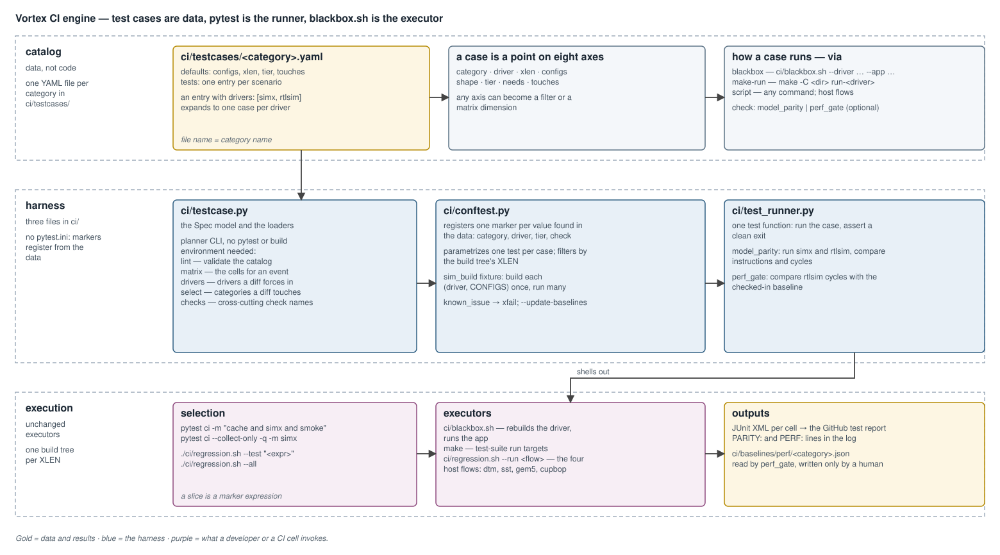
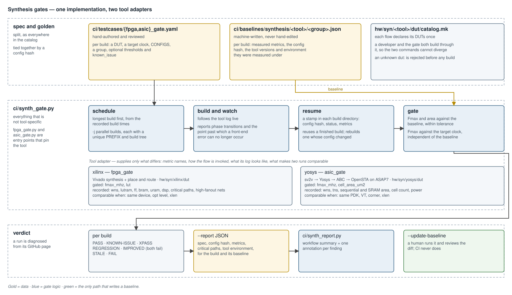
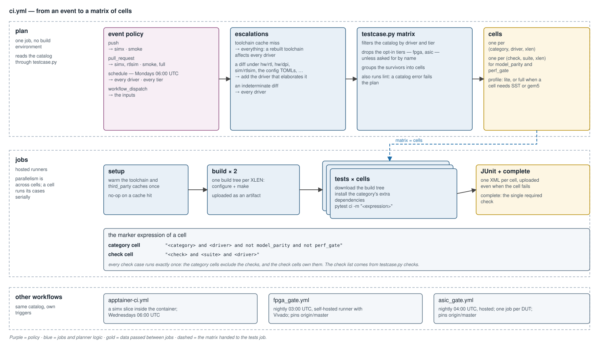

# Continuous Integration — Design

**Scope:** the Vortex test architecture — the declarative test catalog, the
pytest harness that runs it, the cross-driver and baseline checks
(`model_parity`, `perf_gate`), the synthesis gates (`fpga_gate`,
`asic_gate`), and the GitHub workflows that fan the catalog out. Covers the
catalog ([`ci/testcases/`](../../ci/testcases/)), the harness
([`ci/testcase.py`](../../ci/testcase.py),
[`ci/conftest.py`](../../ci/conftest.py),
[`ci/test_runner.py`](../../ci/test_runner.py)), the gates
([`ci/perf_baseline.py`](../../ci/perf_baseline.py),
[`ci/synth_gate.py`](../../ci/synth_gate.py)), the golden data
([`ci/baselines/`](../../ci/baselines/)), and the workflows
([`.github/workflows/`](../../.github/workflows/)).

How to run a test by hand — drivers, `blackbox.sh` flags, rebuilding an
application for a non-default configuration — is in
[`testing.md`](../testing.md) and [`simulation.md`](../simulation.md). This
document is the architecture underneath.



---

## 1. Overview

Vortex tests are **declarative data run by pytest**.

1. A **catalog** of YAML files describes every test case — what to run, on
   which driver, with which configuration, at which tier.
2. A **harness** of three Python files turns the catalog into pytest tests,
   with one marker per value, so that any slice is a marker expression.
3. The **executors** are unchanged: `ci/blackbox.sh`, the test suites' `make`
   targets, and a few host scripts. The harness shells out and asserts a
   clean exit.
4. A **planner** reads the same catalog, with no build environment, and
   emits the matrix of cells a GitHub workflow runs.

The catalog holds 648 cases in 35 categories. It is the single source of
truth: the same files drive a developer's local run and every CI cell, so the
two cannot drift.

### 1.1 Why the tests are data

The previous engine was about 1400 lines of bash with the driver hard-coded
into each of some 400 invocations. Every limitation followed from that one
fact:

| limitation of tests-as-code | what tests-as-data gives |
|---|---|
| the driver is baked into every line | a driver is a marker: `-m simx` |
| three execution styles, no single seam | one `via` field, one place to filter, time and report |
| coverage cannot be queried | `--collect-only` lists what would run |
| build and run are entangled | a fixture builds each `(driver, CONFIGS)` once |
| `CONFIGS` repeated as an environment prefix | one `configs` field per case builds the application and the driver alike |
| a category is one job | a category is a set of cells |
| no metadata | `tier`, `needs`, `touches`, `xlen` are first-class |

---

## 2. The test-case model

A case is a point in a space of eight axes. Keeping them explicit is what
lets any one become a filter or a matrix dimension.

| axis | values | role |
|---|---|---|
| `category` | `amo`, `cache`, `tensor`, `graphics`, … | what is exercised |
| `driver` | `simx`, `rtlsim`, `xrt`, `opae` — selected by the markers `simx`, `rtlsim`, `xrtsim`, `opaesim` | cost |
| `xlen` | 32, 64 | which build tree |
| `configs` | `-DVX_CFG_…` | what must be rebuilt |
| `shape` | cores, warps, threads, L2, L3; `args` | the hardware shape and the workload |
| `tier` | `smoke`, `full`, `nightly`; `fpga`, `asic` | when it runs |
| `needs` | `mpi`, `sst`, `gem5`, … | what the environment must provide |
| `touches` | source paths | which changes it covers |

`xlen` is an **outer** dimension. It is a collection-time filter against the
ambient build tree and is never expanded inside a run: `build32/` and
`build64/` are separate trees.

---

## 3. Engine

### 3.1 The catalog

One file per category, [`ci/testcases/<category>.yaml`](../../ci/testcases/).
Fields map one to one onto `blackbox.sh` flags.

```yaml
category: amo
defaults:
  configs: "-DVX_CFG_EXT_A_ENABLE"
  xlen: [32, 64]
  tier: smoke
  touches: [hw/rtl/cache, sim/simx/amo, sim/simx/mem]
tests:
  - id: base
    app: amo
    drivers: [simx, rtlsim]                 # two cases

  - id: mc-l3
    app: amo
    drivers: [simx, rtlsim]
    configs+: "-DVX_CFG_L2_WRITEBACK=0"     # appended to the default
    shape: {cores: 4, l2cache: true, l3cache: true}
    args: "-n8"
    tier: full
```

| field | meaning |
|---|---|
| `drivers` | the entry expands to one case per driver |
| `configs` / `configs+` | replace, or append to, the category default |
| `via` | how the case executes (below) |
| `check` | a cross-driver or baseline assertion (§3.3, §3.4) |
| `known_issue` | a reason string; the case becomes a tracked expected failure |

| `via` | executes | used by |
|---|---|---|
| `blackbox` (default) | `ci/blackbox.sh --driver=… --app=…` | most categories |
| `make-run` | `make -C <dir> run-<driver>`, with `{driver}` and `{xlen}` substituted | ISA tests, Vulkan, HIP |
| `script` | an arbitrary command | unit tests, synthesis, the host flows |

**Every knob carries the `VX_CFG_` prefix.** The configuration generator does
not reject a `-D` it does not recognize, so an un-prefixed or misspelled
knob changes nothing and the case silently runs the default
([`build_configuration_system.md`](build_configuration_system.md) §4.4).

#### Expected failures

A case with `known_issue:` still builds and runs. `conftest.py` marks it
`xfail`, so its failure does not fail the run; if it starts passing it
surfaces as `XPASS`. Reserve it for triaged, documented breakage.
`needs:` does not skip either — it records what a cell must provision, and a
missing dependency is a real failure.

#### Lint rules

`ci/testcase.py lint` runs in every plan. Two of its rules exist because of
a specific failure:

| rule | what it prevents |
|---|---|
| a file's name equals its `category:` | a renamed file silently changing which cell a case lands in |
| a file may not be named after a check | the planner once emitted the check's cell as a side effect of a category *named* after it; renaming that category deleted the cell and every `check:` case with it, and the gate went away **green** |

### 3.2 The harness

Three files in `ci/`, and no configuration file: markers are registered from
the data, the test module is discovered by its `test_` prefix, and the run
passes `ci` as the path.

| file | role |
|---|---|
| [`testcase.py`](../../ci/testcase.py) | the `Spec` model, the loaders, and the planner CLI. No pytest dependency, so the plan job imports it freely. |
| [`conftest.py`](../../ci/conftest.py) | registers one marker per value in the data; parametrizes one test per case; filters by the ambient XLEN; provides the `sim_build` fixture |
| [`test_runner.py`](../../ci/test_runner.py) | the single test function: run the case, assert a clean exit |

| need | pytest mechanism |
|---|---|
| case → test matrix | `pytest_generate_tests` parametrizes from the data |
| selection | one marker per value, `-m "cache and simx and smoke"` |
| build once, run many | a fixture keyed on `(driver, CONFIGS)` |
| report | `--junitxml` |
| dry run | `--collect-only` |
| typo protection | `--strict-markers` — markers come from the data, so an unknown one is an error |

| planner command | output |
|---|---|
| `lint` | validates the catalog |
| `matrix` | the cells for a driver and tier selection, as JSON |
| `drivers` | the drivers a diff forces in (§4.1) |
| `select` | the categories whose `touches` a diff hits |
| `checks` | the names of the cross-cutting checks |

Selection is ordinary pytest:

```bash
VX_XLEN=32 pytest ci -m "cache and simx and smoke" --strict-markers
pytest ci --collect-only -q -m "simx"          # what would run
```

#### Serial within a cell

Successive `CONFIGS` build into the same `sim/` output, so two build keys
built concurrently in one tree clobber each other. **Cases run serially
within a cell**, and parallelism is taken across GitHub matrix cells, each
its own runner and build tree. An in-tree `pytest -n auto` was tried and
raced the Verilator builds.

### 3.3 Checks and `model_parity`

A check is an assertion across runs rather than a clean exit.

| | `model_parity` | `perf_gate` |
|---|---|---|
| compares | SimX against rtlsim, same case | rtlsim against a checked-in baseline |
| asserts | instructions equal; cycles within tolerance | cycles within tolerance; instructions equal |
| tolerance | 5 %, overridable per case or per category | 2 %, one constant |
| golden data | none | `ci/baselines/perf/<category>.json` |
| tier | `full` | `full` |
| pinned to | the rtlsim driver, which elaborates the RTL | the rtlsim driver |

**A check is a marker, never a file or a category.** Each check gets one cell
of its own — `-m "<check> and rtlsim"` sweeps every such case catalog-wide —
and every category cell excludes the check markers, so a check case runs
exactly once. The workflow reads the check list from `testcase.py checks`
rather than holding a copy.

#### `model_parity`

SimX is the RTL's timing model, not only a functional oracle. A parity case
is **not** driver-expanded: the runner executes the same application,
arguments and configuration on both drivers as two legs of one case, and
compares the runtime's final `PERF: instrs=…, cycles=…` line.

- **Instructions must match exactly.** Both drivers are deterministic
  ISA-level executions, so any difference is functional divergence.
- **Cycles must agree within the tolerance.**

Every case prints a `PARITY:` line with both counts and the gap, so a green
run still leaves a trend in the log.

The pipeline cases live in `ci/testcases/core.yaml`. Each extension carries
its own parity case with only that extension enabled, so a regression is
attributable. Workloads are sized so that steady state dominates — a tiny
kernel is all boot and dispatch skew, and its gap ratio is noise.

**Never widen a tolerance to absorb a divergence.** Model the behavior, or
mark the case `known_issue` while it is investigated.

### 3.4 `perf_gate`

rtlsim cycle counts are deterministic and host-independent, so the threshold
absorbs only benign micro-changes; there is no noise to handle.

| aspect | rule |
|---|---|
| staleness guards | a baseline entry carries a `config_hash` of the case and the workload's instruction count; a mismatch of either is an error asking for regeneration, not a comparison |
| regression | cycles above the baseline by more than the tolerance — fails |
| improvement | cycles **below** by more than the tolerance — **also fails**, asking for the baseline to be updated, so that the gain is locked in and a later regression back to the old number is still caught |
| updating | `pytest ci -m perf_gate --update-baselines`, run by a human, reviewed as a diff |

**CI never passes `--update-baselines`.** An automatically updated baseline
would absorb every regression. The same discipline applies to image goldens.

The benchmarks reuse the parity workloads. A case carries exactly one check,
so the parity and perf views of one workload are two cases.

### 3.5 Synthesis gates



`perf_gate` catches a change that costs cycles. The synthesis gates catch one
that costs **timing closure or area**: they synthesize a catalog of designs
and assert the results against golden baselines.

| | `fpga_gate` | `asic_gate` |
|---|---|---|
| flow | Vivado synthesis, place and route | sv2v → Yosys → ABC → OpenSTA, on ASAP7 |
| design tree | `hw/syn/xilinx/dut` | `hw/syn/yosys/dut` |
| gated | `fmax_mhz`, `lut` | `fmax_mhz`, `cell_area_um2` |
| also recorded | `wns_ns`, `lutram`, `ff`, `bram`, `uram`, `dsp`, critical paths, high-fanout nets | `wns_ns`, `tns_ns`, `seq_area_um2`, `sram_area_um2`, `cell_count`, `power_mw` |
| comparable when | same device, optimization level, xlen | same PDK, VT, corner, xlen |
| runner | self-hosted, licensed Vivado | hosted, one job per design |
| default tolerance | 5 % | 5 % |

Neither is a pytest cell. A cell is a build tree plus a driver; a synthesis
build is neither, and both gates are hours long. They are standalone scripts
driven by their own workflows, and their tiers are **opt-in**: an empty tier
selection means "everything a cell can run", which excludes them.

#### One implementation, two adapters

[`ci/synth_gate.py`](../../ci/synth_gate.py) holds everything that is not
tool-specific — catalog loading, the config hash, threshold resolution,
`known_issue`, the resumable session, the scheduler, the gate and the report.
A tool adapter supplies only what differs: metric names, how the flow is
invoked, what its log looks like, and which environment fields make two runs
comparable. `fpga_gate.py` and `asic_gate.py` are entry points that pin the
tool.

#### Spec and baseline

| file | written by | holds |
|---|---|---|
| `ci/testcases/{fpga,asic}_gate.yaml` | a person | per build: a design, a target clock, `CONFIGS`, a group, optional `thresholds` and `known_issue` |
| `ci/baselines/synthesis/{xilinx,yosys}/<group>.json` | the gate | measured metrics, the config hash, the tool versions and environment |

Groups are `core`, `tensor`, `graphics`, `dxa` and `vm`. `asic_gate` uses the
same group names and gates a subset of the builds (§4.5), so where the two
gates share a design, a divergence between the tools on the same module is a
finding, not noise.

The config hash ties the two files together: edit the spec, and the gate
refuses to compare against numbers recorded for the old one. Its
tool-specific half is the device and optimization level for Vivado and the
PDK, VT and corner for Yosys.

Each flow declares its designs once, in `dut/catalog.mk`. A developer and the
gate both build through it, so the command CI runs and the command a
developer runs cannot diverge.

#### What is asserted

| assertion | reason |
|---|---|
| each gated metric within tolerance of its baseline | regression detection |
| an improvement beyond tolerance also fails | the gain must be recorded |
| Fmax within tolerance of the **target clock**, independent of the baseline | a baseline recorded below target must not let a build pass by matching it |

Thresholds resolve most-specific first: a build's own `thresholds`, then a
global per-metric threshold, then the global default.

**Fmax means different things on the two flows.** Vivado's router reports
what the implemented design achieved. ABC maps to the target period and
stops, so a Yosys design that closes does so with picoseconds of margin and
its Fmax sits just above its clock by construction. On the ASIC side
**cell area is the sensitive metric** and Fmax is mostly met-or-missed —
which is what the target-clock assertion checks. It also makes the slack
source matter: worst *negative* slack clamps at zero, so the flow reports the
signed worst slack instead.

| verdict | meaning | fails the run |
|---|---|---|
| `PASS` | within tolerance | no |
| `REGRESSION` | a gated metric got worse | yes |
| `IMPROVED` | a gated metric got better; record it | yes |
| `STALE` | the spec or the tool changed since the baseline | yes |
| `FAIL` | the build produced no metrics | yes |
| `KNOWN-ISSUE` | a tracked expected failure | no |
| `XPASS` | a known issue stopped reproducing; clear the flag | no |
| `RECORDED` | a baseline was written | no |

#### Running a multi-hour sweep

| mechanism | what it does |
|---|---|
| scheduling | longest build first, from the recorded build times, so the longest is in flight from the start; `-j` caps parallel builds and each build's tool threads are derived from it |
| isolation | every build gets a unique `PREFIX`, hence its own tree and log. On the Yosys flow this is load-bearing: its Makefile caches generated sources and does not regenerate them when the include set changes, so two designs sharing a tree would synthesize the first one's sources |
| early-failure watch | the runner follows each log and announces the point past which a front-end error can no longer occur — the end of RTL elaboration for Vivado, the end of source generation and sv2v conversion for Yosys. A build that fails before it is reported as failed before synthesis, with its error lines quoted |
| resumable sessions | each build directory carries a stamp of config hash, status and metrics. `--resume` reuses a build finished for this config, lets an unfinished one continue from its checkpoint, and rebuilds one whose config changed |
| progress | phase transitions as they land, with a heartbeat between; `-v` streams the raw log |

State lives beside the build tree it describes, not in a central session
file, so it survives a kill and cannot desynchronize from what is on disk.

Metrics come from one `synth_summary.csv` per build, written by the flow
itself, so the gate needs no report parser. Build time is recorded and never
gated: it is too host-dependent to assert, and it is what the scheduler
orders the queue by.

#### Critical paths

On the Vivado flow each build also records its ten worst unique critical
paths — slack, logic levels, clock group, start and end point — whether or
not timing closed. A design that meets its target still has a worst path,
and watching where it sits across commits turns an Fmax regression from a
number into a location. They are never gated.

---

## 4. Workflows



### 4.1 `ci.yml`

| job | does |
|---|---|
| `plan` | applies the event policy and the escalations, runs `testcase.py matrix` and `lint`, emits the cells |
| `setup` | warms the toolchain and third-party caches once; a no-op on a cache hit |
| `build` | one build tree per XLEN, uploaded as an artifact |
| `tests` | one job per cell: `pytest ci -m "<expression>"`, JUnit out |
| `complete` | the single required check |

`setup` exists so that a cold cache prepares the toolchain once, not once per
XLEN.

| event | drivers | tiers |
|---|---|---|
| `push` | `simx` | `smoke` |
| `pull_request` | `simx`, `rtlsim` | `smoke`, `full` |
| `schedule`, Mondays | all | all |
| `workflow_dispatch` | the inputs | the inputs |

A push runs the cheap, high-signal driver and defers the Verilator runs to
the pull-request gate.

#### Escalations

The event policy is a floor. Two conditions raise it:

| condition | effect | reason |
|---|---|---|
| the toolchain cache missed | every driver, every tier | the toolchain will be rebuilt, which affects everything |
| the diff touches RTL, DPI models, a simulator's own sources, or a configuration TOML | the driver that elaborates it is added | SimX is a separate C++ model and cannot exercise the RTL; an RTL change with SimX-only coverage is untested |
| the diff is indeterminate — a new branch, a force-push | every driver | there is no base to compare against |

AFU paths additionally force the `xrt` and `opae` drivers.

`touches` supports path-scaled selection of cases as well
(`matrix --changed-from`, `select`). `ci.yml` applies the diff to driver
escalation only; every category of the selected tier still runs.

### 4.2 `setup-vortex`

The cache and dependency boilerplate is one composite action,
parameterized by a profile — `lite`, or `full` when a cell needs SST or
gem5. A `prepare` input, true only in the `setup` job, makes it populate the
caches on a miss; every other job only restores.

### 4.3 `apptainer-ci.yml`

Validates that the build and a test slice work **inside the container** — an
environmental signal, not functional coverage. It is deliberately not folded
into `ci.yml`. It reuses `setup-vortex`, runs a SimX slice, and its weekly
run is offset from the host's so that a failure is attributable to the
container.

### 4.4 `fpga_gate.yml`

Nightly, on the self-hosted runner with Vivado. It **hard-pins
`origin/master`**: whatever branch the schedule fires on, what is gated is
master's head.

| behavior | detail |
|---|---|
| skip when unchanged | the runner keeps the last gated SHA; a run whose master matches is a no-op unless forced |
| when the SHA is recorded | once the gate reaches a verdict, pass or regression. A red master is not re-synthesized every night — the failed run is the record. A build error does not record, so the next night retries |
| diagnosis | the workflow summary is [`synth_report.py`](../../ci/synth_report.py)'s rendering of the report: every build's metrics against its baseline, the reason behind each verdict that is not a pass, and the critical paths and high-fanout nets |
| annotations | one per finding, naming the build and the metric |
| artifacts | the summary and the report JSON as files a browser opens directly; every build's log and reports as one archive |
| a skipped night | republishes the gated commit's results with a link to the run that produced them, so an unchanged red master does not read as an empty run |

### 4.5 `asic_gate.yml`

Nightly, on hosted runners. It needs no license and no dedicated machine;
what it needs is time — one to two hours per design — so its builds **fan
out to one job each**.

| job | does |
|---|---|
| `plan` | reads the spec and emits one matrix entry per build, longest first |
| `toolchain` | warms the toolchain cache ahead of the matrix |
| `synth` | one build per job, `fail-fast: false` — each design is an independent measurement |
| `report` | joins the per-job reports into one summary and records the SHA marker |

It pins master and skips an unchanged commit like `fpga_gate.yml`, but a
hosted runner keeps no state, so the marker is a cache entry keyed by the
SHA and the spec's hash.

The `toolchain` job exists because the cache key carries the commit the
toolchain pin resolves to: refreshing the prebuilt toolchain misses it by
construction, and without the warm job a toolchain bump would surface as
every design failing at once.

**A hosted runner's 16 GB of memory bounds the build list, not its clock.**
Yosys holds the whole elaborated netlist in memory and offers no cap, so a
design that needs more does not fail — the VM is killed under it, and the
job ends with no report, indistinguishable from an infrastructure outage.
The largest designs — `top`, `gfx`, `tensor`, `vm` — are therefore gated on
`fpga_gate` only, and `core` and `tex` are gated at a reduced width. Measure a design's peak memory before
adding it: an over-budget design costs a silent job kill, not a red gate.

---

## 5. Running locally and coverage

`ci/regression.sh` is the local entry point into the same catalog:

```bash
./ci/regression.sh --all                      # every category, this tree's XLEN
./ci/regression.sh --test tensor              # a category
./ci/regression.sh --test "tensor and simx"   # any marker expression
```

Both wrap `pytest [-m …] ci`. The script also holds the four host flows that
do not fit the common shape — `dtm`, `sst`, `gem5`, `cupbop`. They are
multi-step flows with special builds, so they stay as shell functions that
the catalog's `via: script` cases call through an internal `--run <flow>`.
Users reach them like any other category, with `--test <flow>`.

### 5.1 Graphics and Vulkan coverage

The graphics stack is swept along the **fixed-function axis** — each of TEX,
RASTER and OM either present in hardware or emulated in SIMT software —
because that boundary is the recurring graphics bug surface.

| coverage | category | cases |
|---|---|---|
| each fixed-function unit alone, and all three | `graphics` | `gfx_tex`, `gfx_raster`, `gfx_om`, `gfx_draw3d` |
| early-Z | `graphics` | `gfx_earlyz-*` |
| every hardware/software combination | `vulkan` | `ff-*`, from all-hardware to `ff-all-sw` |
| ray tracing and hybrid frames | `vulkan` | `rt-*`, `gfx-rt-*`, `gfx-multidraw` |

Combinations that need a software stage the driver does not yet route are
`known_issue`. They still build and run, so the coverage is tracked rather
than absent, and an `XPASS` announces when the support lands.

### 5.2 Adding a case

A new case in a catalog file is included in the plan automatically. No
workflow edit is needed; a new category needs only its file.

---

## 6. Design decisions

| decision | reason |
|---|---|
| pytest, not a custom runner | load, select, run and report is a solved problem; Python is already on the CI path |
| not `ctest` | it is CMake's, and Vortex builds with GNU Make only |
| YAML for the catalog | a list of records with comments; TOML is awkward for record arrays and JSON has no comments |
| baselines are checked in and human-updated | a regenerated baseline is a reviewed diff; an auto-updated one hides regressions |
| an improvement fails a gate | it forces the gain to be recorded, so it can be defended |
| gates diagnose from the GitHub page | a nightly that needs a login to the runner to read is not read |
