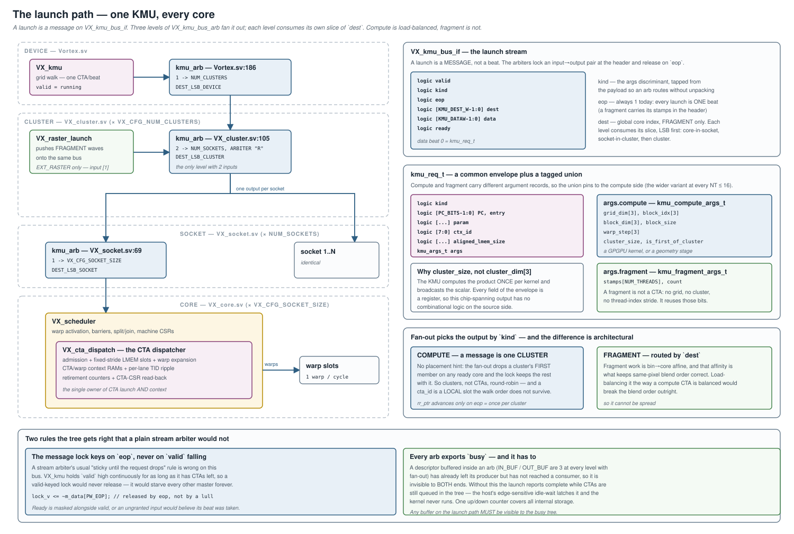
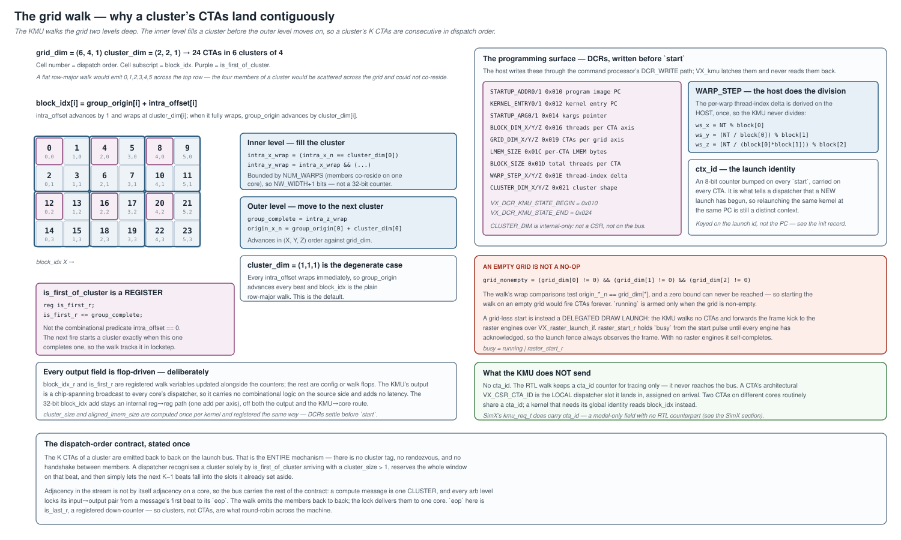
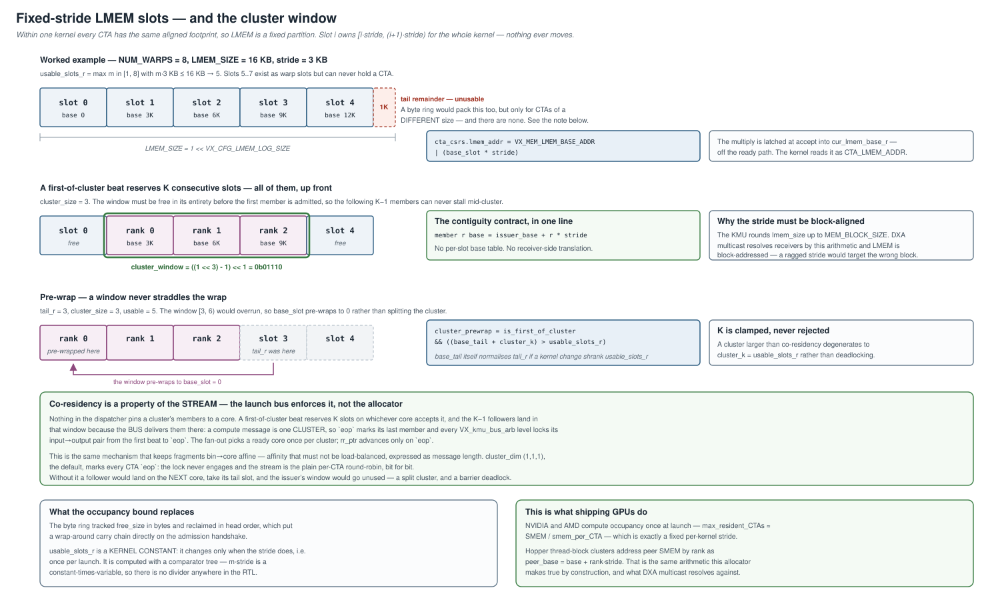
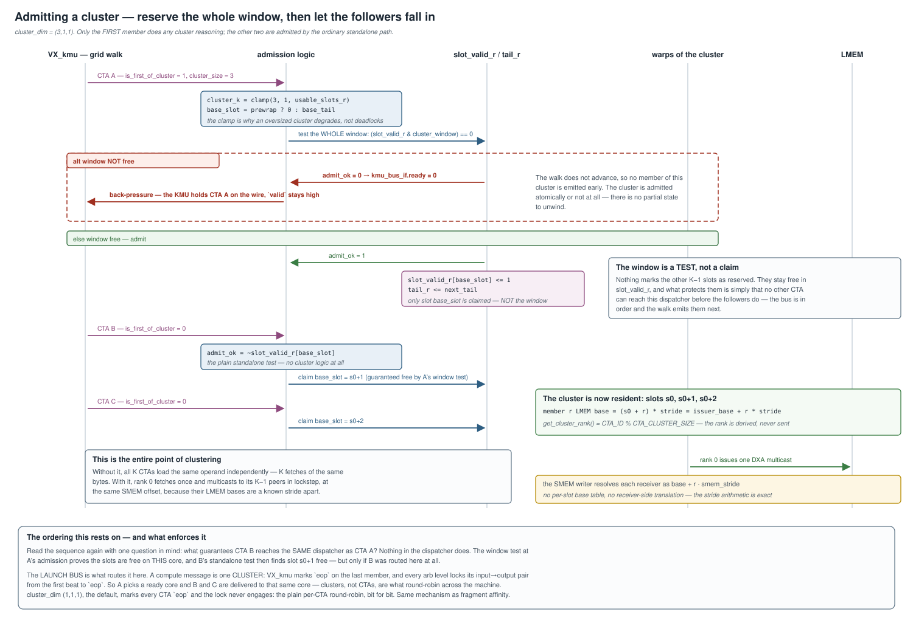
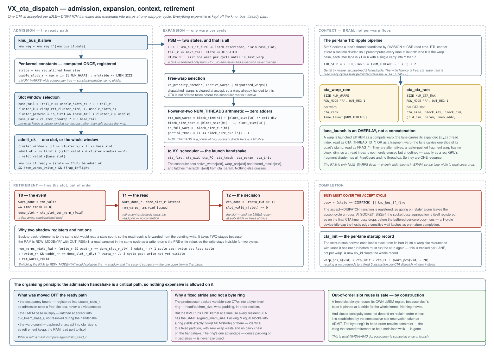
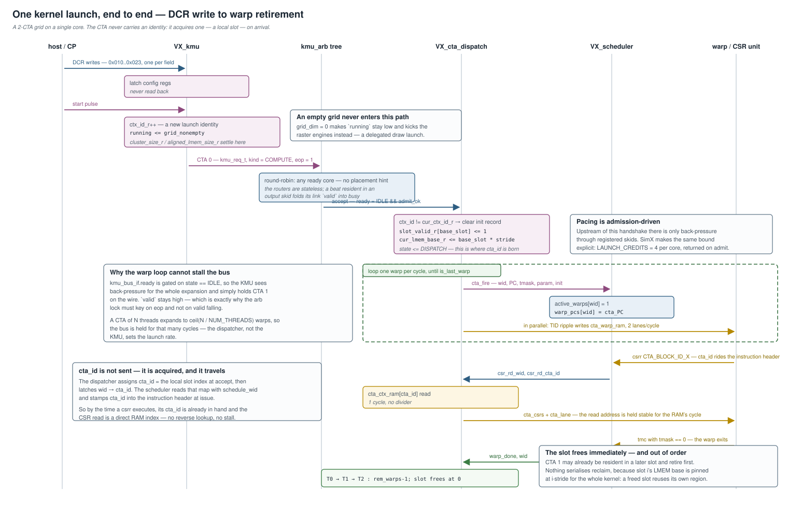

# CTA Dispatch Architecture — Design

**Scope:** how a kernel launch becomes running warps — the KMU's grid walk,
the launch bus and its fan-out tree, per-core CTA admission, the
fixed-stride LMEM allocator that makes **clustering** work, the context
tables behind the CTA CSRs, and warp retirement. This is the path from a
host DCR write to a warp executing `csrr` on `VX_CSR_CTA_BLOCK_ID_X`.

| Layer | File |
|---|---|
| Grid walk (device) | [`hw/rtl/VX_kmu.sv`](../../hw/rtl/VX_kmu.sv) |
| Launch bus | [`hw/rtl/interfaces/VX_kmu_bus_if.sv`](../../hw/rtl/interfaces/VX_kmu_bus_if.sv) |
| Fan-out tree | [`hw/rtl/core/VX_kmu_bus_arb.sv`](../../hw/rtl/core/VX_kmu_bus_arb.sv) |
| CTA dispatcher (per core) | [`hw/rtl/core/VX_cta_dispatch.sv`](../../hw/rtl/core/VX_cta_dispatch.sv) |
| Warp lifecycle | [`hw/rtl/core/VX_scheduler.sv`](../../hw/rtl/core/VX_scheduler.sv) |
| Types | [`hw/rtl/VX_gpu_pkg.sv`](../../hw/rtl/VX_gpu_pkg.sv) |
| SimX model | [`sim/simx/kmu/`](../../sim/simx/kmu/), [`sim/simx/cta_dispatcher.cpp`](../../sim/simx/cta_dispatcher.cpp) |
| Host surface | [`sw/runtime/common/queue.cpp`](../../sw/runtime/common/queue.cpp), [`sw/runtime/include/vortex2.h`](../../sw/runtime/include/vortex2.h) |
| Kernel surface | [`sw/kernel/include/vx_spawn2.h`](../../sw/kernel/include/vx_spawn2.h) |

Related: [`kernel_entry_and_dispatch.md`](kernel_entry_and_dispatch.md) covers
what a warp *runs* once launched; [`dxa_async_copy_multicast.md`](dxa_async_copy_multicast.md)
is the main consumer of the clustering contract;
[`command_processor.md`](command_processor.md) covers how the DCR writes
and the `start` pulse get there.

---

## 1. The launch path



There is **one KMU per processor** ([`Vortex.sv:186`](../../hw/rtl/Vortex.sv#L186)),
and it broadcasts to every core through three levels of `VX_kmu_bus_arb`:

| Level | File | Shape | `dest` slice |
|---|---|---|---|
| Device | [`Vortex.sv:186`](../../hw/rtl/Vortex.sv#L186) | 1 → `VX_CFG_NUM_CLUSTERS` | `KMU_DEST_LSB_DEVICE` |
| Cluster | [`VX_cluster.sv:105`](../../hw/rtl/VX_cluster.sv#L105) | 2 → `NUM_SOCKETS` | `KMU_DEST_LSB_CLUSTER` |
| Socket | [`VX_socket.sv:69`](../../hw/rtl/VX_socket.sv#L69) | 1 → `VX_CFG_SOCKET_SIZE` | `KMU_DEST_LSB_SOCKET` |

`NUM_SOCKETS = UP(VX_CFG_NUM_CORES / VX_CFG_SOCKET_SIZE)`
([`VX_gpu_pkg.sv:149`](../../hw/rtl/VX_gpu_pkg.sv#L149)). The cluster level is
the only one with two inputs: input 0 is the KMU trunk, input 1 is
`VX_raster_launch` pushing fragment waves onto the same bus
([`VX_cluster.sv:94-101`](../../hw/rtl/VX_cluster.sv#L94), `EXT_RASTER` only).

At the leaf, `VX_core` passes the bus to `VX_scheduler`, which instantiates
`VX_cta_dispatch` as a child ([`VX_scheduler.sv:86`](../../hw/rtl/core/VX_scheduler.sv#L86)).
The dispatcher is the single owner of CTA launch *and* CTA context: admission,
the LMEM allocator, the context tables, the TID pipeline, and the CSR
read-back. The scheduler keeps only warp lifecycle.

### 1.1 Everything on this path must be visible to `busy`

Each arb exports a `busy` built from one up/down counter over all its
internal storage. This is not decoration. `IN_BUF`/`OUT_BUF` are 3 at every
level that fans out, and a descriptor sitting in one of those buffers has
left its producer but not reached a consumer — it is invisible to **both**
ends. Without the counter, the device reports idle while CTAs are still
queued in the tree, and the host's edge-sensitive idle-wait latches that as
completion. The busy tree is
`VX_cta_dispatch → VX_scheduler:546 → VX_core:504 → VX_socket:747 → VX_cluster:386`,
with `kmu_arb_busy` OR'd in at the socket and cluster levels.

The same hazard bites inside the dispatcher, which is why `busy` covers the
accept cycle and not just `state == DISPATCH`
([`VX_cta_dispatch.sv:572`](../../hw/rtl/core/VX_cta_dispatch.sv#L572)) — see §5.5.

---

## 2. The launch ABI

### 2.1 The programming surface

The host writes the KMU's DCRs (`0x010`–`0x023`, spanning
`VX_DCR_KMU_STATE_BEGIN`..`VX_DCR_KMU_STATE_END`) and then pulses `start`.
`VX_kmu` latches them and never reads them back, so they must all settle
before `start` — which the command processor's ordered DCR-write path
guarantees.

Two fields are computed by the **host**, not the hardware
([`queue.cpp:354-360`](../../sw/runtime/common/queue.cpp#L354)):

```c
ws_x = NUM_THREADS % block[0];
ws_y = (NUM_THREADS / block[0]) % block[1];
ws_z = (NUM_THREADS / (block[0] * block[1])) % block[2];
```

`WARP_STEP` is the per-warp thread-index delta. Doing the division once on
the host is what lets the dispatcher advance `thread_idx` with three adds and
two compares instead of a divider (§5.3).

`CLUSTER_DIM_{X,Y,Z}` is **internal-only**: not a CSR, and not on the launch
bus. It is sized `NW_WIDTH+1` at the source rather than stored 32-bit and
sliced at each use, because cluster members are co-resident on one core and
therefore bounded by `NUM_WARPS`.

### 2.2 `VX_kmu_bus_if` — the wire contract

```systemverilog
logic                   valid;
logic                   kind;   // KMU_KIND_COMPUTE | KMU_KIND_FRAGMENT
logic                   eop;    // last beat of the message
logic [KMU_DEST_W-1:0]  dest;   // placement hint (fragment only)
logic [KMU_DATAW-1:0]   data;   // beat 0 = kmu_req_t
logic                   ready;
```

The unit of arbitration is a **message**, not a beat: the arbs lock an
input→output pair at the first beat and release on `eop`, never
load-balancing across it. A message is therefore *whatever must land
together*, which differs by kind:

| Kind | Message | `eop` |
|---|---|---|
| COMPUTE | one **cluster** (K CTAs) | last member — `VX_kmu.sv:is_last_r` |
| FRAGMENT | one wave | always 1 — `VX_raster_launch.sv:148` |

Every launch is a single beat: a fragment carries its stamps in the header
([`VX_gpu_pkg.sv:752`](../../hw/rtl/VX_gpu_pkg.sv#L752)), so nothing on this
bus is multi-beat. A message spans several beats only because a compute
message is a whole cluster — `eop` delimits it, not the beat count. §4.5 is
why.

The lock keys on `eop`, deliberately **not** on `valid` falling. `VX_kmu`
holds `valid` high continuously for as long as it has CTAs left to issue, so
the usual "sticky until the request drops" rule would never release and would
starve every other master forever.

The master must hold `valid` bubble-free from the first beat through `eop`.
`VX_kmu` satisfies this trivially (`valid = running`), and it matters: a
mid-message bubble would let another master's beat interleave into the same
output stream, which for a compute message means splitting a cluster.

### 2.3 `kmu_req_t` — envelope plus tagged union

A launch is either a **compute** launch (a CTA grid: a GPGPU kernel, or a
graphics geometry stage such as vertex shading or binning, which run as
compute grids too) or a **fragment** launch (a pixel wave a rasterizer
pushes). They carry different argument records, so `kmu_req_t`
([`VX_gpu_pkg.sv:741-749`](../../hw/rtl/VX_gpu_pkg.sv#L741)) is a common
envelope plus a `kind`-discriminated union:

| Envelope | Meaning |
|---|---|
| `kind` | the `args` discriminant |
| `PC`, `entry` | program image PC and kernel entry PC |
| `param` | kargs pointer |
| `ctx_id` | 8-bit launch identity, bumped every `start` |
| `aligned_lmem_size` | per-CTA LMEM footprint, rounded to `MEM_BLOCK_SIZE` |

`args.compute` ([`:705-713`](../../hw/rtl/VX_gpu_pkg.sv#L705)) carries
`grid_dim[3]`, `block_idx[3]`, `block_dim[3]`, `block_size`, `warp_step[3]`,
`cluster_size`, `is_first_of_cluster`. `args.fragment`
([`:726-730`](../../hw/rtl/VX_gpu_pkg.sv#L726)) carries `stamps[NUM_THREADS]`
and `count`. The union **pins to the compute side** — compute is the wider
variant at every supported `NT ≤ 16`, so a fragment always leaves headroom
and there is no zero-width padding edge. `PACKAGE_ASSERT` catches the `NT=32`
fragment case, which would overflow.

Two things are worth noticing about what is *not* here:

- **`cluster_size` is a scalar, not `cluster_dim[3]`.** The KMU computes the
  product once per kernel into `cluster_size_r` and broadcasts that
  ([`VX_kmu.sv:97-98`](../../hw/rtl/VX_kmu.sv#L97), `:306`).
- **There is no `cta_id`.** The RTL walk keeps a `cta_id` counter for tracing
  only; it never reaches the bus. A CTA's architectural `VX_CSR_CTA_ID` is
  the *local dispatcher slot* it lands in, assigned on arrival. Two CTAs on
  different cores routinely share one. A kernel that needs a global identity
  reads `block_idx`.

### 2.4 Routing — and why the two kinds differ

`kind` selects the fan-out rule ([`VX_kmu_bus_arb.sv:200-201`](../../hw/rtl/core/VX_kmu_bus_arb.sv#L200)):

- **COMPUTE** → round-robin over the ready outputs. A cluster carries no
  placement hint, so the fan-out drops its first member on any ready core and
  the message lock keeps the rest with it. This is what spreads a grid across
  the machine.
- **FRAGMENT** → routed by this level's slice of `dest`. Fragment work is
  bin→core affine, and that affinity is what keeps same-pixel blend order
  correct; load-balancing it would break the blend order outright.

The round-robin pointer advances only on `eop`, and `rr_sel` scans
descending from `rr_ptr` so the nearest ready output wins. Since a compute
message is a whole cluster (§4.5), `rr_ptr` advances once per *cluster* — so
clusters, not CTAs, are the unit of load balancing.

Both rules are the same idea: affinity that must not be load-balanced is
expressed as message length, and the arb never has to unpack `data` to
honour it.

---

## 3. The grid walk



`VX_kmu` walks the grid **two levels deep**
([`VX_kmu.sv:149-293`](../../hw/rtl/VX_kmu.sv#L149)):

- `intra_offset[i]` advances by 1 and wraps at `dcr_cluster_dim[i]`.
- When the full intra-cluster volume wraps (`group_complete`),
  `group_origin[i]` advances by `dcr_cluster_dim[i]` in (X, Y, Z) order
  against `grid_dim`.
- The effective `block_idx[i] = group_origin[i] + intra_offset[i]`.

The inner level fills a cluster before the outer level moves on, so the K
CTAs of a cluster are **consecutive in dispatch order**. `cluster_dim =
(1,1,1)` — the default — makes every `intra_offset` wrap immediately, which
reproduces the plain row-major walk.

`intra_offset` is sized `NW_WIDTH+1`, not 32 bits: cluster members are
co-resident on one core, so the value is bounded by `NUM_WARPS`, and keeping
it narrow keeps the nested wrap chain narrow.

### 3.1 `is_first_of_cluster` is a register

```systemverilog
reg is_first_r;                      // VX_kmu.sv:80
is_first_r <= group_complete;        // VX_kmu.sv:265
```

It is **not** a combinational `intra_offset == 0` predicate. The next fire
begins a cluster exactly when this one completes one, so the walk tracks it
in lockstep with the counters.

That is a deliberate choice, and it generalises: `block_idx_r` and
`is_first_r` are *registered walk variables*, and every other output field is
a config or walk flop. The KMU's output is a chip-spanning broadcast to every
core's dispatcher, so it carries no combinational logic on the source side
and adds no latency. The 32-bit `block_idx` add stays an internal reg→reg
path (one add per axis), off both the output and the KMU→core route.

### 3.2 An empty grid is not a no-op

```systemverilog
wire grid_nonempty = (dcr_grid_dim[0] != 0)
                  && (dcr_grid_dim[1] != 0)
                  && (dcr_grid_dim[2] != 0);
```

The walk's wrap comparisons test `origin_*_n == dcr_grid_dim[*]`, and a zero
bound can never be reached — so starting the walk on an empty grid would fire
CTAs **forever**. `running <= grid_nonempty` is the guard.

A grid-less `start` is instead a **delegated draw launch**: the KMU walks no
CTAs and forwards the frame kick to the raster engines over
`VX_raster_launch_if`. `raster_start_r` holds `busy` from the start pulse
until every engine acknowledges, so the launch fence always observes the
frame; with no raster engines it self-completes. Hence
`busy = running | raster_start_r` ([`VX_kmu.sv:327`](../../hw/rtl/VX_kmu.sv#L327)).

---

## 4. CTA admission and LMEM placement



`NUM_CTA_SLOTS = VX_CFG_NUM_WARPS`
([`VX_cta_dispatch.sv:55`](../../hw/rtl/core/VX_cta_dispatch.sv#L55)) — a core
holds at most one CTA per warp slot. Multiple CTAs co-reside, one slot each;
that co-residence *is* the clustering.

### 4.1 The fixed-stride allocator

Within one kernel every CTA has the same aligned footprint, so LMEM is
partitioned into equal slots of pitch `stride = aligned_lmem_size`. Slot *i*
owns bytes `[i·stride, (i+1)·stride)` **for the whole kernel**.

- **Occupancy bound.** `usable_slots_r` = the largest *m* in `[1, NUM_WARPS]`
  with `m·stride ≤ LMEM_SIZE`, computed by a `NUM_WARPS`-wide comparator tree
  and **registered** ([`:326-343`](../../hw/rtl/core/VX_cta_dispatch.sv#L326)).
  `m·stride` is constant-times-variable, so there is no divider. `stride == 0`
  ⇒ all slots usable; a stride exceeding LMEM clamps to 1 rather than 0.
- **Standalone admission.** Round-robin `tail_r` over `[0, usable_slots_r)`;
  admit when `slot_valid_r[base_slot] == 0`.
- **Slot LMEM base** = `base_slot · stride`, a small multiply latched at
  accept into `cur_lmem_base_r` — off the ready path — and exposed as
  `cta_csrs.lmem_addr = VX_MEM_LMEM_BASE_ADDR | cur_lmem_base_r`.
- **Retirement** clears `slot_valid_r[slot]` when the CTA's last warp exits:
  immediate and out of order.

### 4.2 The cluster window



A first-of-cluster beat reserves K = `cluster_size` **consecutive** usable
slots, pre-wrapping to 0 if the window would overrun `usable_slots_r`:

```systemverilog
cluster_k       = clamp(eff_cluster_size, 1, usable_slots_r);
cluster_prewrap = is_first_of_cluster && ((base_tail + cluster_k) > usable_ext);
base_slot       = cluster_prewrap ? 0 : base_tail;
cluster_window  = ((1 << cluster_k) - 1) << base_slot;
admit_ok        = is_first_of_cluster ? ((slot_valid_r & cluster_window) == 0)
                                      : ~slot_valid_r[base_slot];
```

All K must be free **up front**, so the following members never stall
mid-cluster. K is clamped, never rejected: a cluster larger than co-residency
degenerates rather than deadlocking.

The window is a **test, not a claim** — nothing marks the other K−1 slots
reserved. They stay free in `slot_valid_r`, and what protects them is only
that no other CTA reaches this dispatcher before the followers do.

Members 2..K are admitted by the ordinary standalone path (`is_first = 0`),
so member *r* lands at `issuer_base + r·stride`. That is the entire
contiguity contract, and it is what DXA multicast resolves against: the
issuer emits its own LMEM-relative address and the SMEM writer resolves each
receiver as `base + r·smem_stride` — no per-slot base table, no
receiver-side translation. The stride must be `MEM_BLOCK_SIZE`-aligned (the
KMU rounds it) because LMEM is block-addressed; a ragged stride would target
the wrong block.

`get_cluster_rank()` is derived, never sent:
`CTA_ID % CTA_CLUSTER_SIZE` ([`vx_spawn2.h:133`](../../sw/kernel/include/vx_spawn2.h#L133)).

### 4.3 Why fixed-stride rather than a byte ring

The predecessor was a byte-level ring (`lmem_size_ram`, `head_r`,
`lmem_tail_r`, `free_size_r`, wrap padding, in-head-order reclaim) whose
machinery existed to pack *variable-size* CTAs densely while keeping cluster
members byte-contiguous. But the KMU runs **one kernel at a time** (single
DCR config, sequential walk, one `ctx_id` per launch), so **every resident
CTA has the same `aligned_lmem_size`**. Packing N equal blocks into a ring
yields exactly `floor(LMEM_SIZE / stride)` of them — *identical* to a fixed
partition, but with zero wrap-pad waste and no ring carry chain on the
`kmu_bus_if.ready` handshake. The ring's one advantage is never exercised.

Out-of-order reuse is safe by construction: a freed slot reuses its **own**
region, because slot *i*'s base is pinned at `i·stride`. And cluster
contiguity does not depend on reclaim order — it is established by the
reservation taken at admit.

This matches shipping GPUs: NVIDIA and AMD compute occupancy once at launch
(`max_resident_CTAs ≈ SMEM / smem_per_CTA`, a fixed per-kernel stride), and
Hopper thread-block clusters address peer SMEM by rank as
`peer_base = base + rank·stride`.

### 4.4 Nothing expensive on the ready path

```systemverilog
assign kmu_bus_if.ready = (state == IDLE) && admit_ok
                       && !rem_warps_write_r && !frag_inflight;
```

The occupancy bound is registered, the LMEM multiply is latched at accept,
and the warp count is captured at accept into `cta_size_r` so retirement
keeps the RAM read port to itself. What remains on the handshake is a mask
compare against `slot_valid_r`.

`frag_inflight` is a fragment-only interlock: a fragment launch's stamps land
in the warp record `TID_STAGES` cycles after the warp fires, but
`frag_stamps_r` is a single bank, so a new launch must not overwrite it while
an earlier fragment warp is still in that pipeline. Holding the header off
costs a launch bubble; pipelining the stamps instead would cost
`NUM_THREADS × LANE_LAUNCH_BITS` per stage — the whole record replicated.
It is tied to 0 in a build with no rasterizer.

### 4.5 What actually keeps a cluster on one core

Everything above describes what a dispatcher does once a cluster's members
reach it. None of it explains why they reach the *same* dispatcher — and
nothing in `VX_cta_dispatch` does. **The launch bus is what pins them.**

A compute message is one **cluster**, not one CTA. `VX_kmu` marks `eop` on
the cluster's last member, and every `VX_kmu_bus_arb` level locks its
input→output pair from a message's first beat until `eop`. So the fan-out
picks a ready core for the first member, and the lock delivers every follower
to that same core. Clusters — not CTAs — are what round-robin across the
machine, because `rr_ptr` advances only on `eop`.

This is deliberately the *same* mechanism that keeps fragments bin→core
affine (§2.4). Both are affinity that must not be load-balanced, so both are
expressed as message length rather than as a second, parallel lock.

`cluster_dim = (1,1,1)` — the default — makes every CTA its own message:
`eop` is 1 on every beat, the lock never engages, and the stream is the plain
per-CTA round-robin, bit for bit.

`eop` is the walk's own `group_complete` predicate, registered one beat early
([`VX_kmu.sv:208-243`](../../hw/rtl/VX_kmu.sv#L208)). Both properties matter:

- **Derived from the walk**, using the same wrap flags the walk latches, so it
  cannot drift from the CTA it describes. A separate counter over
  `cluster_size` would be a second source of truth for the same predicate, and
  it could disagree — `cluster_size` is a *registered* product while the walk
  reads `dcr_cluster_dim` combinationally, and the product is truncated to
  `NW_WIDTH+1` bits. Either gap ends a grid on a beat with `eop` low, which
  latches the arbiters' lock with no `eop` ever arriving: the launch stream
  wedges until reset. A `RUNTIME_ASSERT` ties the two derivations together so a
  future edit cannot reintroduce the drift silently.
- **Registered**, because every field this module drives onto the bus is
  (§3.1).

Two preconditions make this sound, both already enforced:

- **`grid_dim` must be a whole multiple of `cluster_dim` per axis.** The walk
  advances `group_origin` by `cluster_dim` and tests `origin_*_n ==
  grid_dim[*]`, so a non-multiple would never hit the bound and the walk would
  emit CTAs forever. The runtime rejects it with `VX_ERR_INVALID_VALUE`
  ([`queue.cpp:306-318`](../../sw/runtime/common/queue.cpp#L306)). It also
  guarantees each cluster is complete, so `running` always drops on an `eop`
  beat and the message never truncates.
- **`cluster_dim` is never 0.** The runtime normalises zeros to 1; the KMU's
  DCR block resets it to (1,1,1) for the legacy path that writes DCRs
  directly, and the counter clamps a 0 product to 1. A zero would otherwise
  make `eop` unreachable and lock the stream permanently.

SimX has no bus, so its `Kmu` carries the lock itself: it refuses to hand a
cluster's remaining members to any core but the one that took the first
([`kmu.cpp:95-111`](../../sim/simx/kmu/kmu.cpp#L95)).

**Why this is load-bearing rather than an optimisation.** The obvious
consequence of a split cluster is that LMEM peers resolve to another CTA's
region — a silent wrong answer. The *first* consequence is a deadlock, and it
lands earlier: a cluster rendezvous uses `vortex::group_barrier`, which
deliberately does not embed the caller's CTA id, so all members share **one
per-core hardware bar_unit slot**
([`vx_barrier.h:99-108`](../../sw/kernel/include/vx_barrier.h#L99)). Split a
K-member cluster across two cores and each core sees fewer than K arrivals
against a `num_peers` of K, and both sides wait forever — before any
multicast is issued.

Verified on `cta_cluster` (K = `NUM_WARPS` = 4), which hangs at `--cores=2`
without the message lock and passes with it, on both SimX and rtlsim. §11.

---

## 5. Dispatcher microarchitecture



### 5.1 The FSM

Two states ([`:122-123`](../../hw/rtl/core/VX_cta_dispatch.sv#L122)). `IDLE`
accepts one CTA (latching the descriptor, claiming `base_slot`, advancing
`tail_r`); `DISPATCH` emits one warp per cycle until `is_last_warp`. Because
`ready` is gated on `state == IDLE`, admission and expansion never overlap:
the KMU sees back-pressure for the whole expansion and holds the next CTA on
the wire with `valid` still high — which is exactly why the arb lock must key
on `eop`. A CTA of N threads expands over `ceil(N / NUM_THREADS)` cycles, so
the dispatcher, not the KMU, sets the launch rate.

### 5.2 Warp expansion

A `VX_priority_encoder` over `~(active_warps | dispatched_warps)` picks the
free warp; `dispatched_warps` is cleared at accept and prevents offering the
same warp twice before the scheduler marks it active.

`NUM_THREADS` is a power of two, so every divide is a bit slice
([`:224-239`](../../hw/rtl/core/VX_cta_dispatch.sv#L224)):

```systemverilog
cta_num_warps   = block_size_r[hi] + |block_size_r[lo];   // ceil(block_size / NT)
block_size_next = {block_size_r[hi] - 1, block_size_r[lo]};
is_full_warp    = |block_size_cur[hi];
partial_tmask   = (1 << block_size_cur[lo]) - 1;
```

`block_size_cur = warp_fire_r ? block_size_next : block_size_r` — the
registered `block_size_r` retires the previously latched warp's threads a
cycle late, so the count left for the warp being latched now excludes them.

### 5.3 Context tables and the TID ripple

Storing per-warp context as full-record flops is too expensive, so it lives
in two `VX_dp_ram`s (both `RDW_MODE="R"`, `OUT_REG=1`):

- **`cta_ctx_ram`** — per CTA slot: `cta_size`, `block_idx[3]`,
  `block_dim[3]`, `grid_dim[3]`, `entry`, `param`, `lmem_addr`,
  `cluster_size`. Written at launch, read by `csr_rd_cta_id`.
- **`cta_warp_ram`** — per warp: `cta_rank` and `lane_launch[NUM_THREADS]`.
  Written by the TID pipeline, read by `csr_rd_wid`.

SimX derives each lane's thread coordinate by **division at CSR-read time**.
RTL cannot afford a runtime divider, so it precomputes all lanes at launch:
lane 0 is the warp base, each later lane is +1 in X with a single carry into
Y then Z. The expansion is a serial ripple, so it is pipelined `TID_STEP = 2`
lanes/cycle over `TID_STAGES = ceil((NUM_THREADS-1)/2)` stages. The added
write latency is hidden because `cta_warp_ram` is read many cycles after
launch (fetch/decode/issue ≫ `TID_STAGES`). This has no SimX counterpart.

**`lane_launch` is an overlay, not a concatenation** ([`cta_lane_t`,
`VX_gpu_pkg.sv:828-838`](../../hw/rtl/VX_gpu_pkg.sv#L828)). A warp is
launched *either* as a compute warp (the lane carries its expanded `{x,y,z}`
thread index, read as `CTA_THREAD_ID_*`) *or* as a fragment warp (the lane
carries one slice of its quad's stamp, read as `FRAG_*`). They are
alternatives, not companions: a raster-pushed fragment warp has no
`block_dim`, so a thread index is not merely unused but undefined — exactly
as a real GPU's fragment shader has `gl_FragCoord` and no `threadIdx`. So
they are one resource. Which view applies is a property of the **warp**, not
of whatever launch the header stage is holding, so `is_frag_warp` rides the
pipeline alongside it. The RAM is only `NUM_WARPS` deep and therefore
entirely width-bound in BRAM — the lane width is what costs area.

A quad's four lanes share **one** stamp (lane *l* holds slice `l & 3`), so
`FRAG_LANE_BITS = FRAG_STAMP_BITS / 4` — a quarter of a naive per-lane copy.

### 5.4 Retirement

`warp_done` is `tmc_valid && (tmc.tmask == 0)`
([`VX_scheduler.sv:84`](../../hw/rtl/core/VX_scheduler.sv#L84)) — a warp
retires by masking all its threads off. The decode is a three-stage pipeline:

| | |
|---|---|
| T0 | `done_slot = cta_slot_per_warp_r[warp_done_wid]` — a flop array, so the combinational read skips the registered `raddr` a DP-RAM would need |
| T1 | `warp_done_r` / `done_slot_r` latched; `rem_warps_ram` read issued (retirement exclusively owns the read port) |
| T2 | `cta_done = (rem_warps_rdata_fwd == 1)` → `slot_valid_r[slot] <= 0` |

Back-to-back retirements to the same slot need write forwarding, and it takes
**two** shadow stages because `RDW_MODE="R"` + `OUT_REG=1` means a read
sampled in the same cycle as a write returns the pre-write value — so the
write stays invisible for two cycles. `_r` covers the 1-cycle gap, `_rr` the
2-cycle gap.

### 5.5 `busy`

```systemverilog
assign busy = (state == DISPATCH) || kmu_bus_if_fire;
```

The accept→DISPATCH transition is registered, so gating on `state` alone
leaves the accept cycle un-busy. At `SOCKET_SIZE > 1` the socket busy
aggregation is itself registered, so on the final CTA `kmu_busy` drops before
the buffered per-core busy rises — a 1-cycle device-idle gap the host's
edge-sensitive wait latches as premature completion. Covering the accept
cycle closes it.

### 5.6 `cta_init` — the per-lane startup record

The startup stub derives each lane's stack from its hart id, so a warp slot
relaunched with lanes it has **not** run before must run the stub again. This
is tracked per **lane**, not per warp (`warp_init_lanes_r`), and
`slot_needs_init[w] = |(launch_tmask & ~warp_init_lanes_r[w])` is resolved
per slot — off the `warp_id_n` path, so the encoder still feeds only a 1-bit
mux. A new `ctx_id` clears the whole record, which is why the identity is
keyed on the **launch id and not the PC**: relaunching the same kernel is
still a distinct context.

The scheduler consumes it as:

```systemverilog
warp_pcs_n[cta_wid] = cta_init ? cta_PC : (warp_pcs[cta_wid] - from_fullPC(20));
```

Reusing a warp skips the one-time prologue and rewinds to the kernel's
per-CTA dispatch window — a fixed 20-byte (5-instruction) sequence that
reloads the entry pointer and kargs before re-calling.

---

## 6. The dispatcher ↔ scheduler contract



Only `VX_scheduler` may be the `.master` of `VX_sched_csr_if`, so the
dispatcher exposes a **plain-signal data contract** — no interface ownership
transfer, no modport conflict — which the scheduler wires into
`sched_csr_if`:

```systemverilog
input  wire [NW_WIDTH-1:0]       csr_rd_wid;       // = sched_csr_if.csr_rd_wid
input  wire [NCTA_WIDTH-1:0]     csr_rd_cta_id;    // = sched_csr_if.csr_rd_cta_id
output cta_csrs_t                cta_rd_csrs;      // -> sched_csr_if.cta_csrs
output cta_lane_t [NT-1:0]       cta_rd_lane;      // -> sched_csr_if.cta_lane
input  wire [NW_WIDTH-1:0]       schedule_wid;     // scheduled warp ->
output wire [NCTA_WIDTH-1:0]     schedule_cta_id;  //   its CTA id
```

The scheduler retains exactly the two couplings that mutate scheduler-owned
warp state:

1. **Warp activation** on `cta_fire`/`cta_wid`/`cta_PC`/`cta_tmask`/`cta_init`
   — writes `active_warps`, `warp_pcs`, `thread_masks`
   ([`VX_scheduler.sv:175-182`](../../hw/rtl/core/VX_scheduler.sv#L175)).
2. **`mscratch_r`** latched from `cta_param`. Per-warp state written from
   three sources (CTA launch, CSR write, wspawn), so it stays in the
   scheduler.

### 6.1 `cta_id` travels with the instruction

`cta_id` is not looked up at CSR-read time — it rides the pipeline. The
dispatcher latches `wid → cta_id` at launch (`cta_id_per_warp_r`); the
scheduler indexes that with `schedule_wid` and stamps `schedule_cta_id` into
the instruction header at issue
([`VX_scheduler.sv:497`](../../hw/rtl/core/VX_scheduler.sv#L497)); the CSR
unit reads it back out of the header
(`read_cta_id = execute_if.data.header.cta_id`,
[`VX_csr_unit.sv:111`](../../hw/rtl/core/VX_csr_unit.sv#L111)). So by the time
a `csrr` executes, its `cta_id` is already in hand and the read is a direct
RAM index — one cycle, no reverse lookup, no divider.

---

## 7. The CTA CSR surface

Uniform (per-warp / per-CTA) CSRs resolve in `VX_csr_data.sv:210-224` from
`sched_csr_if.cta_csrs`; per-lane CSRs resolve in `VX_csr_unit.sv:214-222`
from `cta_lane`.

| CSR | Addr | Source |
|---|---|---|
| `VX_CSR_CTA_ID` | `0xCD0` | local dispatcher slot |
| `VX_CSR_CTA_RANK` | `0xCD1` | `cta_warp_ram.cta_rank` |
| `VX_CSR_CTA_SIZE` | `0xCD2` | `cta_ctx_ram.cta_size` |
| `VX_CSR_CTA_THREAD_ID_{X,Y,Z}` | `0xCD3`–`0xCD5` | `cta_lane.compute.thread_idx` (per lane) |
| `VX_CSR_CTA_BLOCK_ID_{X,Y,Z}` | `0xCD6`–`0xCD8` | `cta_ctx_ram.block_idx` |
| `VX_CSR_CTA_BLOCK_DIM_{X,Y,Z}` | `0xCD9`–`0xCDB` | `cta_ctx_ram.block_dim` |
| `VX_CSR_CTA_GRID_DIM_{X,Y,Z}` | `0xCDC`–`0xCDE` | `cta_ctx_ram.grid_dim` |
| `VX_CSR_CTA_LMEM_ADDR` | `0xCDF` | `cta_ctx_ram.lmem_addr` |
| `VX_CSR_CTA_CLUSTER_SIZE` | `0xCE0` | `cta_ctx_ram.cluster_size` |
| `VX_CSR_CTA_ENTRY` | `0xCE1` | `cta_ctx_ram.entry` |
| `VX_CSR_FRAG_POS` / `VX_CSR_FRAG_PID` | `0xCE2`–`0xCE3` | `cta_lane.fragment` (per lane, `EXT_RASTER`) |

`FRAG_*` and `CTA_THREAD_ID_*` read the two views of the same lane bits — the
CSR unit picks the view the accessed CSR calls for.

Kernel-side helpers ([`vx_spawn2.h`](../../sw/kernel/include/vx_spawn2.h)):
`get_local_group_id()` → `CTA_ID`, `get_cluster_size()` → `CTA_CLUSTER_SIZE`,
`get_cluster_rank()` → `CTA_ID % cluster_size`, `get_sub_group_id()` →
`CTA_RANK`, `get_num_sub_groups()` → `CTA_SIZE`, `__local_mem()` →
`CTA_LMEM_ADDR`.

Host-side, `cluster_dim[3]` is a field of `vx_launch_info_t`
([`vortex2.h:202`](../../sw/runtime/include/vortex2.h#L202)).

---

## 8. Parallelism and scaling

| Axis | Scales with | Note |
|---|---|---|
| CTAs in flight per core | `NUM_WARPS` | one slot per warp; `min` with `floor(LMEM/stride)` |
| Warps per CTA | `ceil(block_size / NUM_THREADS)` | expansion cost in cycles |
| Launch rate | 1 CTA per `ceil(block_size/NT)` cycles per core | dispatcher-limited, not KMU-limited |
| Cores fed | `NUM_CLUSTERS × NUM_CORES` | one KMU, three arb levels |
| Cluster size K | ≤ `usable_slots_r` | clamped, not rejected |

The KMU is a **single serial walker** for the whole device: one CTA per
cycle, maximum. With enough cores that is the launch bottleneck for
short-CTA kernels — a CTA that expands to one warp consumes one dispatcher
cycle, so a device of N cores cannot start more than one CTA per cycle in
aggregate regardless of N. It is not a bottleneck for realistic CTA sizes,
where expansion dominates.

Area scales as: `cta_ctx_ram` is `NUM_CTA_MAX`-deep (`= NUM_WARPS`), and
`cta_warp_ram` is `NUM_WARPS`-deep × `NUM_THREADS × LANE_LAUNCH_BITS` wide —
the latter is width-bound, which is what motivates the lane overlay (§5.3).
`TID_STAGES` grows with `NUM_THREADS`, which is invisible at NT=4 and is what
makes `frag_inflight` necessary by NT=16.

---

## 9. The SimX model

SimX is the structural reference this design mirrors: a single
[`CtaDispatcher`](../../sim/simx/cta_dispatcher.cpp) owns CTA launch *and*
context (no separate storage object), `step()` returns the full
`cta_warp_record_t`, and the scheduler owns it as a child, copying the record
into per-warp state via `activate_warp(wid, rec)`. The fixed-stride allocator
mirrors line for line (`usable_slots()` + round-robin `tail_slot_`), and RTL
is cycle-for-cycle identical to it on `vecadd` / `sgemm` / `sgemm_tcu_wg` /
`sgemm_tcu_wg_dxa_mcast`.

The differences are deliberate, not drift:

| | RTL | SimX |
|---|---|---|
| Per-lane thread index | precomputed at launch by the TID ripple | divided at CSR-read time |
| CTA/warp context | BRAM (`cta_ctx_ram`, `cta_warp_ram`) | plain struct fields |
| `usable_slots` | comparator tree | `lmem_capacity_ / stride` |
| Bus payload | `cluster_size` (scalar), `aligned_lmem_size` | `cluster_dim[3]`, raw `lmem_size` |
| `cta_id` on the bus | absent | present (model-only, unused as identity) |
| Stride rounding | in the KMU | in the dispatcher |
| Fragment path | through `kmu_bus_if` → `VX_cta_dispatch` | injected at the scheduler by the FWD |

The last row is the significant one: in RTL a fragment wave is a launch that
traverses the same bus and the same dispatcher as a CTA, whereas SimX's
per-core Fragment Work Distributor injects fragment warps directly at the
scheduler ([`scheduler.h:133-152`](../../sim/simx/scheduler.h#L133)). The
`kmu_req_t` union and `lane_launch` overlay exist only on the RTL side.

The `cluster_dim[3]`-vs-`cluster_size` split is a real ABI divergence, though
a benign one — SimX computes the product where RTL receives it
([`cta_dispatcher.cpp:107-109`](../../sim/simx/cta_dispatcher.cpp#L107)).

---

## 10. Open items

1. **Raster fan-in latency behind a compute cluster.** The cluster-level arb
   is the one with two inputs (KMU and `VX_raster_launch`), and its fan-in
   lock masks the other input for the length of a message. A compute cluster
   therefore holds the merged stream for K beats — including any cycles the
   KMU spends back-pressured — and fragment dispatch waits. This is zero-cost
   today (`cluster_dim` is (1,1,1) on every graphics path, so `eop` is 1 every
   beat and the lock never engages) and it is a latency effect, not a
   correctness one. It becomes real only if a geometry stage ever launches
   clustered while raster is pushing. The fix then is to lock the fan-out
   without the fan-in — but that needs a separate cluster sideband and a `sel`
   that exempts fragments, which is more area for a case that does not exist
   yet.

2. **Cluster larger than co-residency degenerates.** `cluster_k` is clamped to
   `usable_slots_r` (§4.2), so the window test reserves fewer slots than the
   message has members. The extra members still land on the same core (the
   lock holds) but serialise into slots as they free, and are not
   co-resident — so a `group_barrier` rendezvous over the full K would
   deadlock. Clamping keeps the allocator from deadlocking; it does not make
   an oversized cluster work. The runtime does not reject
   `cluster_size > floor(LMEM/stride)`.

3. **Cross-core (DXA Path B) multicast.** Contiguity is local per core, and
   receiver bases on other cores have no rendezvous (the issuer is intra-core
   only). A cross-core DSMEM path would need a new mechanism. This is a
   designed boundary, not a gap.

4. **Concurrent multi-kernel residency.** Fixed-stride slots assume a single
   resident kernel (true today: one `ctx_id` at a time). Two kernels with
   different `aligned_lmem_size` co-resident would need per-context stride.

5. **Retirement RDW cleanup.** `rem_warps_ram` uses `RDW_MODE="R"` with
   two-tier write forwarding
   ([`:283-289`](../../hw/rtl/core/VX_cta_dispatch.sv#L283)); switching to
   `RDW_MODE="W"` collapses the `_rr` shadow and the second compare (§5.4).

6. **PPA quantification.** The fixed-stride allocator's expected −672 flops
   and critical-path removal have no before/after Yosys/OpenSTA report;
   relevant to the U55C @ 300 MHz target. The cluster `eop` adds one flop plus
   a three-way compare on the walk's next state to `VX_kmu`, unmeasured but
   reg→reg and off the output path.

**Superseded directions** (recorded to avoid revival): the
`VX_cta_table_if.sv` interface and the three dispatcher translation tables
(`slot_to_lmem_base_r`, `slot_to_wid_base_r`, `wid_to_lmem_base_r`) plus the
DXA receive-side translator in `VX_mem_unit.sv` — all **deleted** in favour
of the contiguity + stride-arithmetic model. (`cta_slot_per_warp_r` is
correctly retained for retirement.)

---

## 11. Verification

| Test | Covers |
|---|---|
| [`tests/regression/cta_cluster/`](../../tests/regression/cta_cluster/) | `cluster_dim` launch + DXA multicast broadcast SAXPY; K fills one core |
| [`tests/regression/dxa_copy_mcast/`](../../tests/regression/dxa_copy_mcast/) | multicast against the stride contract (5 CI cells) |
| [`tests/regression/sgemm2_dxa_mcast/`](../../tests/regression/sgemm2_dxa_mcast/) | multicast under a real GEMM |
| [`tests/regression/sgemm_tcu_wg_dxa_mcast/`](../../tests/regression/sgemm_tcu_wg_dxa_mcast/) | multicast + TCU workgroup |

### 11.1 The coverage shape

Multi-core itself is well covered — 65 of the catalog's ~550 cells run
`shape.cores > 1` or `shape.clusters > 1`, across `sgemm`, `diverge`,
`gfx_draw3d`, `dogfood`, `amo`, `occupancy` and more. What matters for §4.5 is
narrower: **only four apps set `cluster_dim` at all**, and they are the only
ones that can exercise the message lock.

| App | Uses `cluster_dim` | Multi-core cells |
|---|---|---|
| `cta_cluster` | yes — K = `NUM_WARPS` | `cta_cluster-mc`, `cta_cluster-2c2s` |
| `dxa_copy_mcast` | yes — K = receiver count | `dxa_copy_mcast-mc`, `dxa_copy_mcast-2c2s` |
| `sgemm2_dxa_mcast` | yes | none |
| `sgemm_tcu_wg_dxa_mcast` | yes | none |

Before those cells, every one of the 18 cluster/multicast cells ran at 1
cluster × 1 core, where each fan-out level is 1-wide and the lock never
engages — and `cta_cluster`, the dedicated cluster test, was not in the
catalog at all. That is precisely why §4.5 could regress unnoticed: the
mechanism had **zero** coverage while the surrounding multi-core paths had
plenty.

`-mc` (2 cores) exercises the cluster-level arb's fan-out lock; `-2c2s`
(2 clusters × 2 cores) additionally locks the device-level arb, so the two
together cover both fan-out levels a cluster traverses.

### 11.2 Results

All cells run `xlen: [32, 64]` on both drivers, per the `dxa.yaml` defaults.
`--cores=2 --l2cache` is the configuration that deadlocks without the message
lock — the `l2cache` is not incidental: `cores ≥ 2` without a shared L2 is
independently broken, so it has to be enabled for the cell to be testing
clustering rather than that.

| Test | Topology | 32-bit | 64-bit |
|---|---|---|---|
| `cta_cluster-1` | 1 core | simx, rtlsim | simx, rtlsim |
| `cta_cluster-mc` | 2 cores + L2 | simx, rtlsim | simx, rtlsim |
| `cta_cluster-2c2s` | 2 clusters × 2 cores + L2 | simx, rtlsim | simx, rtlsim |
| `dxa_copy_mcast-mc` | 2 cores + L2 | simx, rtlsim | simx, rtlsim |
| `dxa_copy_mcast-2c2s` | 2 clusters × 2 cores + L2 | simx, rtlsim | simx, rtlsim |

### 11.3 What is still uncovered

- **No `model_parity` cell exercises the lock.** Every parity cell runs either
  `cluster_dim = 1` or a single core, so none of them constrains SimX and RTL
  to agree on *clustered* multi-core timing. The two models arrive at
  co-residency differently — the RTL fan-out picks a ready core, SimX hands the
  cluster to whichever core asks first — so their cycles may legitimately
  differ there. A parity cell would need its tolerance justified rather than
  assumed, which is why one is not added here.
- **`sgemm2_dxa_mcast` and `sgemm_tcu_wg_dxa_mcast`** remain single-core only.
