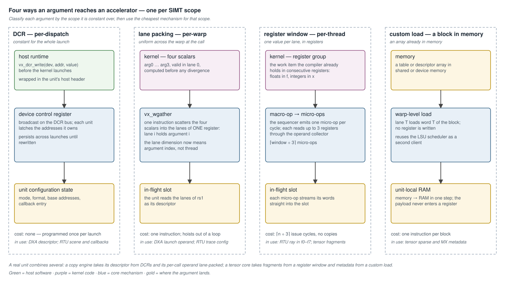
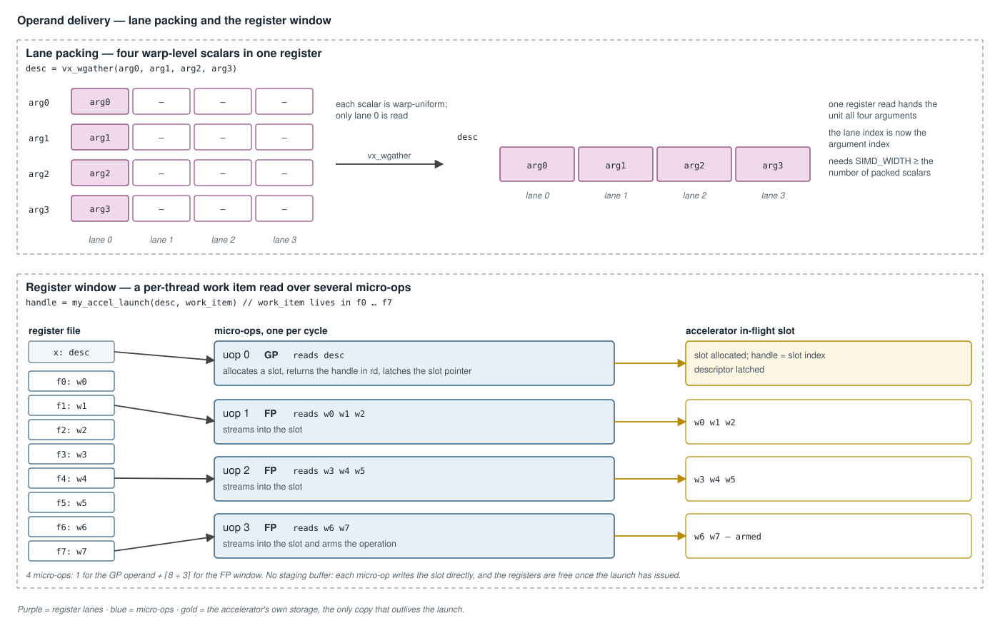
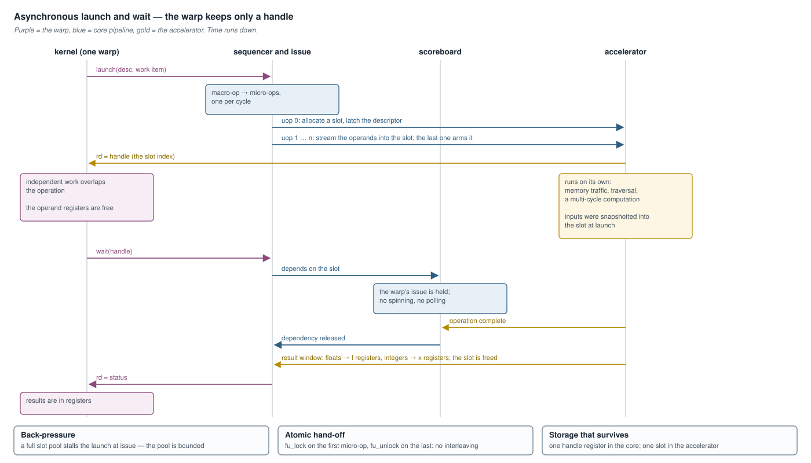

# Custom Accelerator ISA Extensions — Design Guide

**Scope:** how to give a fixed-function accelerator a good SIMT-visible
instruction interface in Vortex — how a warp passes arguments in and gets
results out, cheaply. Covers the argument-scope taxonomy, the four delivery
mechanisms, instruction encoding, how a wide-operand instruction executes as
micro-ops, result return, the asynchronous launch/wait pattern, and the
mistakes that make an interface expensive. The mechanisms are those of the
core: the micro-op sequencer
([`VX_uop_sequencer.sv`](../../hw/rtl/core/VX_uop_sequencer.sv)), the operand
collector ([`VX_opc_unit.sv`](../../hw/rtl/core/VX_opc_unit.sv)), the
scoreboard, the DCR bus, and the LSU scheduler.

It applies to any accelerator — a tensor core, a copy engine, a traversal
engine, a codec, a crypto or sort unit. The units that ship use every pattern
here: the tensor core
([`tensor_core_wgmma_engine.md`](tensor_core_wgmma_engine.md)), the copy
engine ([`dxa_async_copy_multicast.md`](dxa_async_copy_multicast.md)), and
the ray-tracing unit
([`ray_tracing_architecture.md`](ray_tracing_architecture.md)).

Read this **before** designing the kernel-facing intrinsics. The datapath is
rarely the hard part; the instruction surface is, and it is the hardest part
to change later.



---

## 1. The problem: arguments do not fit in an instruction

A RISC-V instruction reads at most three source registers and writes one. An
accelerator usually needs more per invocation — a copy descriptor is a dozen
fields, a matrix fragment is 8 to 24 registers, a ray is eight floats.

The naive fix is a per-lane **special register file** that the kernel fills
one slot at a time with `set` instructions and reads back with `get`
instructions. It is the single worst mistake in this space (§8). The craft is
moving many arguments to the accelerator without that overhead.

The key observation: **arguments live at different SIMT scopes, and each
scope has a different cheapest delivery mechanism.** Classify every argument
first, then pick the mechanism.

| scope | meaning | divergent | mechanism |
|---|---|---|---|
| per-dispatch | constant for the whole kernel launch | no | DCR (§2.1) |
| per-warp | uniform across the warp at the call site | usually not | lane packing (§2.2) |
| per-thread | one value per lane, already in registers | yes | register window (§2.3) |
| a block in memory | a per-thread or per-warp array | either | custom load (§2.4) |
| per-CTA | shared by a thread block | no | shared memory, barrier-gated |

Putting a per-dispatch constant in a per-thread register, or a per-thread
value in a DCR, is always wrong.

---

## 2. The four mechanisms

In increasing per-call cost. A real unit combines several.

| unit | per-dispatch | per-warp | per-thread | block in memory |
|---|---|---|---|---|
| copy engine (DXA) | descriptors in DCRs | launch operand, lane-packed | — | — |
| ray-tracing unit | scene and callback entries in DCRs | trace configuration, lane-packed | the ray, in `f0`–`f7` | — |
| tensor core | — | — | fragments, in register groups | sparse and MX metadata |

### 2.1 DCR — per-dispatch configuration

Launch-global state — enables, a mode or format selector, a callback entry,
a base address the whole launch shares — goes in **device control
registers**, written by the host runtime before the kernel launches.

```c
// Host side, once per launch.
vx_dcr_write(dev, MY_ACCEL_CONFIG,  pack_config(mode, fmt));
vx_dcr_write(dev, MY_ACCEL_BASE_LO, (uint32_t)(buffer_addr & 0xffffffff));
vx_dcr_write(dev, MY_ACCEL_BASE_HI, (uint32_t)(buffer_addr >> 32));
```

| property | |
|---|---|
| cost per call | none |
| delivery | broadcast on the DCR bus; each unit latches the addresses it owns |
| lifetime | persists until rewritten — a launch must program everything it depends on |
| host API | wrap the writes in a runtime header, so the unit has a clean host interface |

Addresses are allocated in [`VX_types.toml`](../../VX_types.toml), because a
DCR address is a contract between the runtime and the hardware.

**Rule:** a value identical for every thread of the launch is a DCR. A value
the kernel chooses **per invocation** — a pointer it picks on each call — is
not per-dispatch, however much it looks like configuration. Keep it in the
instruction.

### 2.2 Lane packing — `vx_wgather`

The least obvious mechanism and the most useful. A SIMT register is a vector
of `SIMD_WIDTH` lanes. A warp-uniform value would normally be replicated into
every lane, wasting the width. Instead, **pack several distinct scalars into
the lanes of one register** and let the accelerator read lane *i* as argument
*i*.

```c
// lane 0 = arg0, lane 1 = arg1, lane 2 = arg2, lane 3 = arg3
uint32_t desc = vx_wgather(arg0, arg1, arg2, arg3);

// One instruction hands all four to the accelerator.
uint32_t handle = my_accel_launch(desc, /* per-thread operands */);
```

[`vx_wgather`](../../sw/kernel/include/vx_intrinsics.h) reads its four
operands from one source lane and scatters them across the lanes of the
result. `vx_wgather_from` names a source lane other than 0.

| property | |
|---|---|
| cost per call | one instruction, register-domain only; loop-invariant scalars hoist |
| capacity | `SIMD_WIDTH` scalars per register |
| requirement | the scalars must be warp-uniform — the lane dimension now means argument index |
| requirement | they must be valid in the source lane whatever the active mask, so compute them **before** any divergence |

A value that genuinely differs per thread belongs in §2.3 or §2.4.

### 2.3 Register window — per-thread operands

The per-thread work item already lives in the register file as a contiguous
group. The accelerator instruction names the base and reads the whole window
by convention. There is no marshalling: the window **is** the compiler's
register allocation.

Because a window exceeds three read ports, the instruction is a macro-op
(§4).

| property | |
|---|---|
| cost per call | `⌈window ÷ 3⌉` issue cycles |
| copies | none — the micro-ops stream the registers into the accelerator |

Two rules are load-bearing:

- **Split by type.** Vortex has separate integer and float register files.
  Float operands go in an FP window and integer operands in GP registers, so
  each is read from its natural file. Float data forced through a GP window
  costs a move per word, which is the marshalling the window was meant to
  avoid.
- **Reserve a register group the allocator can satisfy.** A group of `N`
  generally has to be `N`-aligned and caller-saved. In the RISC-V calling
  convention the only 8-aligned, entirely caller-saved range is `f0`–`f7`;
  every 8-aligned integer range contains `zero`, `ra`, `sp`, `gp`, `tp` or
  callee-saved registers, and the other float groups of eight straddle
  callee-saved ones. Two accelerators that both want `f0`–`f7` cannot be live
  in the same kernel region — usually acceptable, since they are distinct
  workloads.

### 2.4 Custom load — memory straight into the accelerator

When the data already lives in memory, or is large, do not route it through
the register file at all. Define a **load** that reads memory and writes
directly into the accelerator's own RAM, with no register destination.

```c
// rs1 = base address, warp-broadcast. Lane T loads base[T];
// hardware writes it into the accelerator's RAM at the slot the
// instruction names. The payload never enters a register.
my_accel_ld(slot, base_addr);
```

| property | |
|---|---|
| cost per call | one instruction per block |
| register pressure | none for the payload |
| memory port | none of its own — a second client of the LSU scheduler ([`lsu_pipeline_design.md`](lsu_pipeline_design.md)) |
| ordering | a scoreboard bit the load sets and the consumer reads, so a consumer issued right behind the load waits for it |

The tensor core loads its sparse-validity and scale tables this way: the
destination slot is in the `rd` field and the format in the `rs2` field, both
as immediates.

**Window or load?** A register window for the small, just-computed work
item; a custom load for a block that already sits in memory. They compose.

---

## 3. Encoding the instruction

Register-operand custom instructions have two candidate formats.

| | R-type | R4-type |
|---|---|---|
| source registers | 2 — `rs1`, `rs2` | 3 — `rs1`, `rs2`, `rs3` |
| sub-operation field | `funct7`, 7 bits | `funct2`, 2 bits |
| best when | configuration in `rs1`, a window base in `rs2`, many sub-operations or formats | three distinct register operands, few sub-operations |

The trade is a third source register against five bits of encoding space.

**The instruction format does not limit how wide an operand a macro-op
reads.** Each micro-op reads up to three registers whatever the macro
instruction's format, and a window is addressed by a base plus a convention,
not by spending a register field. Choosing R-type costs nothing in operand
throughput.

**Prefer R-type.** With the patterns above the per-call operands collapse to
a lane-packed register, a window base, and a handle or result. That fits,
and `funct7` then encodes many sub-operations plus a format or slot
selector — valuable because custom opcode space is scarce: four opcodes of
eight `funct3` rows each.

Use R4 when three register operands are genuinely distinct — neither
lane-packable nor a contiguous group. `vx_wgather` is one: it has four
independent scalar operands, and spends its `funct2` on the source lane.

A register **field** may also carry an immediate. The tensor instructions
put formats and flags in `rd`, `rs1` and `rs2`; decode reads the field
without reading a register.

---

## 4. How a wide-operand instruction executes



A single issue collects at most three source registers and reserves one
writeback. An instruction that needs more is a **macro-op**, serviced by two
mechanisms the core already has.

| mechanism | role |
|---|---|
| sequencer | a per-warp expander. It takes the macro-op and emits a run of ordinary micro-ops, one per cycle, each naming its own source and destination registers. It back-pressures the instruction buffer until the run drains. The macro-op itself never commits; its micro-ops do. |
| operand collector | reads each micro-op's registers from the banked register file and assembles them for the functional unit. Its port count is why a group read takes several cycles. |

The sequencer decides **how many micro-ops and which registers**; the
operand collector **fetches them**. An instruction that is not a macro-op
passes through the sequencer unchanged.

### 4.1 Adding an expander

Expanders are combinational rewrites of the fetched instruction, selected by
a priority encoder in the sequencer:

| slot | expander | macro-ops |
|---|---|---|
| `UOP_PACKLD` | [`VX_uop_packld.sv`](../../hw/rtl/core/VX_uop_packld.sv) | packed loads |
| `UOP_TCU` | [`VX_tcu_uops.sv`](../../hw/rtl/tcu/VX_tcu_uops.sv) | WMMA, WGMMA |
| `UOP_GFX` | [`VX_gfx_uops.sv`](../../hw/rtl/core/VX_gfx_uops.sv) | ray-trace windows, fragment export |

**A slot is expensive.** Each one is a full instruction-buffer entry on the
sequencer's output mux plus a bit of its priority encoder. Two macro-ops
whose selects are mutually exclusive should share an expander rather than
each own a slot, which is why the ray-tracing windows and the fragment
export live in one.

### 4.2 Counting micro-ops

The count is `⌈registers ÷ 3⌉`, with the operand set grouped by register
file. A launch reading one GP descriptor word and an eight-word FP work item
is **four** micro-ops — one GP and `⌈8 ÷ 3⌉` FP — not nine and not three.
The ray-tracing `TRACE` is exactly this shape.

### 4.3 Holding the unit across the run

A run that hands the accelerator a multi-beat item must not interleave with
another warp's. The expander sets `fu_lock` on the first micro-op and
`fu_unlock` on the last; the scoreboard latches the lock to the granted warp
and gates every other warp's issue until the release. A single-micro-op
instruction carries both, which is the scoreboard's default and locks
nothing.

The accelerator's input side then needs **one** hold register, not one per
warp.

---

## 5. Returning results

| path | use for | cost |
|---|---|---|
| register writeback | the few hot scalars the kernel needs immediately | `⌈results ÷ write ports⌉` micro-ops |
| memory | bulk results | ordinary loads in the kernel |

Split a mixed result by type exactly as for operands: float outputs to FP
registers, integer outputs and a status word to GP registers. The
ray-tracing `wait` writes hit distances and barycentrics to `f0`–`f2` and
identifiers to integer registers.

---

## 6. Asynchronous by design



A long-latency accelerator — a copy, a traversal, a multi-cycle
computation — should not block the warp for its duration. The launch returns
a **handle**; a separate `wait` blocks on it.

```c
uint32_t h   = my_accel_launch(desc, work_item);   // returns at once
// ... independent work overlaps the operation ...
uint32_t sts = my_accel_wait(h, &result);          // blocks in the scoreboard
```

| step | what happens |
|---|---|
| launch | the inputs are snapshotted into the accelerator's own in-flight slot; the slot index is the handle |
| run | the accelerator proceeds on its own; the warp's operand registers are free |
| wait | the warp's issue is held by the scoreboard until the slot completes — no spinning, no polling |
| back-pressure | a full slot pool stalls the launch at issue |

Only the handle persists in the core across the operation, and the latency
is hidden without the kernel doing anything.

---

## 7. What "efficient" means

Three axes, which mostly align.

| axis | principle |
|---|---|
| latency | take the operation off the kernel's critical path (§6). Only the issue-to-dispatch hand-off is serial, and spreading a window across register-file banks shortens it. |
| register storage | hold the work item in registers only during issue. After the launch, only the handle survives. |
| accelerator storage | the in-flight slot is intrinsic — an asynchronous work item must be remembered while it runs. Add nothing else. |

**Stream to the destination; never replicate.** The launch's first micro-op
allocates the slot and returns its index. The rest write the work item
directly into that slot. There is no staging buffer and no second copy of
the register file; the only transient state is a write pointer. The launch
is, in effect, a store of the work item into the accelerator.

---

## 8. Anti-patterns

Each of these was built or drafted, and each is wrong.

| anti-pattern | why | instead |
|---|---|---|
| per-slot special-register marshalling | one `set` per field, one `get` per result, and a dedicated per-lane RAM — around sixteen instructions to issue one work item | register window + lane packing + DCRs |
| ignoring argument scope | every argument pays the most expensive mechanism | classify first (§1) |
| field-by-field delivery | one instruction per field | a window or a custom load moves the block |
| a staging buffer ahead of the accelerator | a second copy with no lifetime benefit | stream into the slot (§7) |
| float data in a GP window | a move per word | split by type (§2.3) |
| one register per micro-op | three times the issue cycles | `⌈n ÷ 3⌉`, grouped by file (§4.2) |
| a per-call pointer in a DCR | "configuration goes in DCRs" — but a per-invocation binding is not per-dispatch | keep it in the instruction (§2.1) |
| a private read port on the register file | area, and a second arbitration to get wrong | share the operand collector |
| a private memory port for a loader | a second staging queue, pool and cache port | a client of the LSU scheduler (§2.4) |

---

## 9. Modeling in SimX

| rule | reason |
|---|---|
| classify the instruction in decode: functional unit, operation, source and destination register types, macro-op or not | the timing model and the RTL must agree on what is issued |
| every memory access is a real request through a channel | reading memory behind the timing model's back produces results the RTL cannot reproduce |
| the micro-op generator mirrors the RTL expander's order and count | the per-micro-op cycle accounting is what gives the macro-op its latency |
| a bounded in-flight pool with real back-pressure | an unbounded queue hides exactly the stalls the design must survive |
| deterministic ordering: insertion-order containers, stable arbitration | runs reproduce bit for bit |

A module may touch another only through its channels — see
[`simobject.md`](simobject.md).

---

## 10. Decision checklist

For each argument:

1. The same for the whole launch? → **DCR**, programmed by the host.
2. Warp-uniform, and no more than `SIMD_WIDTH` of them? → **lane-pack** with
   `vx_wgather`.
3. Per-thread, in registers, just computed? → **register window** — floats
   in FP, integers in GP.
4. A block already in memory? → **custom load** into the accelerator's RAM.

For the instruction:

5. Long-latency? → **launch and wait**, with a handle.
6. Multi-beat hand-off? → hold the unit with `fu_lock` / `fu_unlock`.
7. Results: registers for the hot scalars, memory for bulk.
8. Inputs stream straight into the accelerator's slot — never a staging
   buffer, never a replica of the register file.
