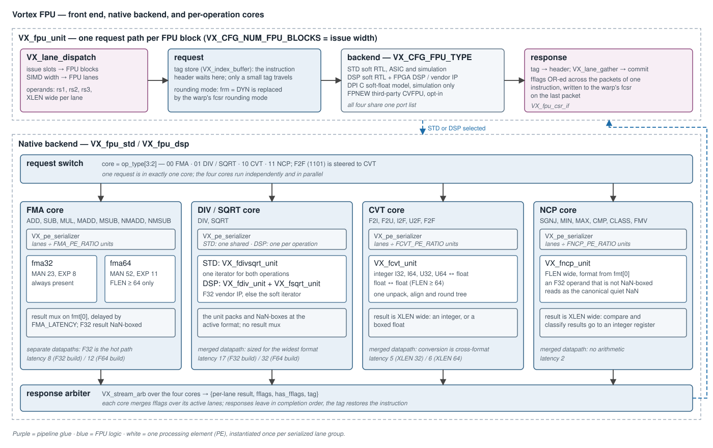
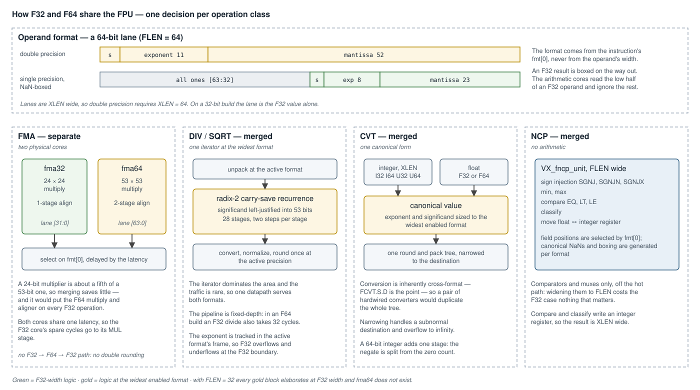
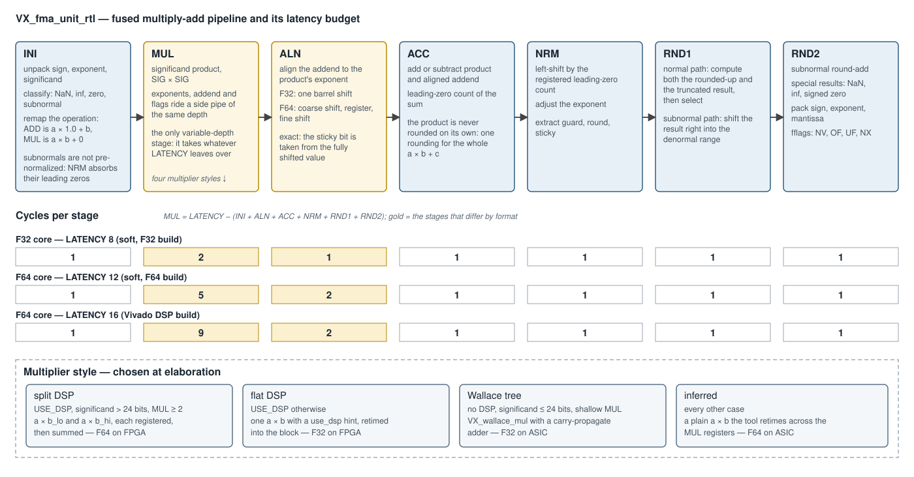

# Floating-Point Unit (FPU) — Design

**Scope:** the Vortex floating-point unit for the RISC-V F and D extensions —
the pipeline front end, the operation encoding, how single and double
precision share hardware, the four per-operation cores and their pipelines,
the backends and the vendor-IP selection inside them, configuration, and the
SimX model. Covers the RTL ([`hw/rtl/fpu/`](../../hw/rtl/fpu/)) and the SimX
model ([`sim/simx/fpu_unit.cpp`](../../sim/simx/fpu_unit.cpp)).

The arithmetic leaf units are also instantiated outside the FPU: the
ray-tracing unit reuses the fused multiply-add and the divider for its
geometry math ([`ray_tracing_architecture.md`](ray_tracing_architecture.md)).
This document is the FPU deep-dive.



---

## 1. Overview

The FPU is a **fixed set of four per-operation cores** behind a shared
front end:

1. [`VX_fpu_unit`](../../hw/rtl/fpu/VX_fpu_unit.sv) takes dispatched
   instructions, parks each instruction's header in a tag store, resolves the
   rounding mode, and submits the operands to the backend.
2. The **backend** steers the request to one of four cores by operation
   class — fused multiply-add, divide/square-root, conversion, and
   non-computational.
3. Each core **serializes** the request's lanes over its processing elements
   and runs them through a fixed-latency pipeline.
4. A response arbiter merges the four cores' results; the front end restores
   the header from the tag, accumulates the exception flags, and commits.

The cores run independently, so a long divide does not block an add. Results
leave in completion order — the tag, not the order, identifies the
instruction.

Four backends implement the same port list. Two are native Vortex RTL and are
the subject of this document: `VX_fpu_std` (soft RTL) and `VX_fpu_dsp` (soft
RTL plus FPGA DSP blocks and vendor IP). The other two are
`VX_fpu_dpi`, a C soft-float model for simulation, and `VX_fpu_fpnew`, the
third-party CVFPU library.

---

## 2. Front end — `VX_fpu_unit`

One request path is generated per **FPU block**
(`VX_CFG_NUM_FPU_BLOCKS`, the issue width), each `VX_CFG_NUM_FPU_LANES` lanes
wide (the SIMD width).

| element | role |
|---|---|
| `VX_lane_dispatch` | maps issue slots onto FPU blocks and SIMD lanes onto FPU lanes; an instruction wider than the lane count is split into packets |
| tag store (`VX_index_buffer`, `VX_CFG_FPU_QUEUE_SIZE`) | holds the instruction header while the operands are in the backend; bounds the operations in flight |
| rounding-mode resolve | a request with `frm = DYN` takes the issuing warp's rounding mode from `fcsr`; `MISC` operations reuse the `frm` field as a sub-operation and are left alone |
| flag accumulation | flags are OR-ed across the packets of one instruction and written to the warp's `fcsr` on the last packet, through a registered `VX_fpu_csr_if` |
| `VX_lane_gather` | reassembles the blocks onto the commit interface |

The header carries the decoded writeback bit through the tag store rather
than forcing it on the way out: a compare may target integer `x0`, which
decode does not reserve, and a forced writeback would trip the invalid
writeback assertion.

Operands reach the backend as three `XLEN`-wide values per lane — `rs1`,
`rs2`, `rs3`.

---

## 3. Operation encoding

Decode emits a 4-bit operation, a 2-bit `fmt`, and a 3-bit `frm`
([`VX_gpu_pkg.sv`](../../hw/rtl/VX_gpu_pkg.sv)). The top two operation bits
**are** the core index.

| `op_type` | operation | core | `fmt` | `frm` |
|---|---|---|---|---|
| `0000` | `ADD` | FMA | `[0]` double, `[1]` subtract | rounding mode |
| `0001` | `MUL` | FMA | `[0]` double | rounding mode |
| `0010` | `MADD` | FMA | `[0]` double, `[1]` subtract | rounding mode |
| `0011` | `NMADD` | FMA | `[0]` double, `[1]` subtract | rounding mode |
| `0100` | `DIV` | DIV/SQRT | `[0]` double | rounding mode |
| `0101` | `SQRT` | DIV/SQRT | `[0]` double | rounding mode |
| `1000` / `1001` | `F2I` / `F2U` | CVT | `[0]` float is double, `[1]` integer is 64-bit | rounding mode |
| `1010` / `1011` | `I2F` / `U2F` | CVT | `[0]` float is double, `[1]` integer is 64-bit | rounding mode |
| `1100` | `CMP` | NCP | `[0]` double | `LE` = 0, `LT` = 1, `EQ` = 2 |
| `1101` | `F2F` | **CVT** | `[0]` destination is double | rounding mode |
| `1110` | `MISC` | NCP | `[0]` double | `SGNJ`, `SGNJN`, `SGNJX`, `CLASS`, `MVXW`, `MVWX`, `FMIN`, `FMAX` = 0–7 |

`F2F` is the one exception to the index rule: its top bits say NCP, and the
request switch steers it to CVT.

Subtraction is not an operation. `SUB`, `MSUB` and `NMSUB` are `ADD`, `MADD`
and `NMADD` with `fmt[1]` set, and the FMA core folds the sign into its
operands.

---

## 4. Format model



### 4.1 `FLEN` and NaN-boxing

`VX_CFG_FLEN` is the single width knob for the floating-point data path: 64
with the D extension, 32 without. The backends thread it to the leaf units,
which derive the per-format exponent and mantissa widths; every
double-precision block sits under a `FLEN >= 64` generate, so an `FLEN = 32`
build elaborates the F32-only RTL and carries **no** 64-bit datapath.

The active format is selected **per instruction from `fmt[0]`**, never from
the operand width. A single-precision value in a 64-bit lane is NaN-boxed —
upper 32 bits all ones. Every unit boxes its F32 results on the way out. The
arithmetic cores read the low 32 bits of an F32 operand; the
non-computational unit additionally checks the box and treats an unboxed F32
operand as the canonical quiet NaN, as the specification requires.

**Double precision requires `XLEN = 64`.** Operand lanes are `XLEN` wide, so
there is no place to carry a 64-bit value on a 32-bit build;
`VX_CFG_EXT_D_ENABLE` defaults to on exactly when `XLEN` is 64. The reverse
combination — `XLEN = 64` with D disabled — is supported: F32 values are
boxed into the 64-bit lane.

### 4.2 Separate or merged, per operation class

The D extension requires F, so F32 hardware is always present. The question
for each operation class is whether F64 is a second datapath beside it
(**separate**) or one wide datapath that also runs F32 (**merged**). The area
merging saves is bounded by what the F32 version would have cost.

| class | choice | rationale |
|---|---|---|
| FMA | **separate** | a 24-bit multiplier is about a fifth of a 53-bit one, so merging saves little while putting the F64 multiply and aligner on every F32 operation — the hot path |
| DIV / SQRT | **merged** | the iterator dominates the area and traffic is rare |
| CVT | **merged** | conversion is inherently cross-format; one unpack, align and round tree sized to the widest format |
| NCP | **merged** | comparators and muxes only, off the hot path |

Only FMA is duplicated. The invariant this protects: **enabling D must not
slow or grow the F32 FMA path.**

---

## 5. Lane serialization

Each core wraps its units in a
[`VX_pe_serializer`](../../hw/rtl/libs/VX_pe_serializer.sv): `NUM_LANES`
lanes share `NUM_PES` processing elements, with

```
NUM_PES = max(1, NUM_LANES / VX_CFG_<core>_PE_RATIO)
```

At a ratio of 1 — the default for every core — each lane has its own unit and
a request takes one pass. A higher ratio trades latency for area: the
serializer feeds the lanes through the units in groups and reassembles the
result. The per-request fields that every lane shares — operation, `fmt`,
`frm` — travel once, beside the lanes.

The units are **fixed-latency pipelines with a clock enable**, not
handshaking blocks. The serializer owns the enable, so back-pressure stalls
every unit of a core together and the latency is a constant the serializer
can count.

---

## 6. FMA — `VX_fma_unit`



[`VX_fma_unit_rtl.sv`](../../hw/rtl/fpu/VX_fma_unit_rtl.sv) is one parametric
core (`MAN_BITS`, `EXP_BITS`, `LATENCY`). The backend instantiates it as
`fma32` (23, 8) and, with `FLEN >= 64`, as `fma64` (52, 11), and selects the
result on `fmt[0]` delayed by the latency.

### 6.1 Operation remap

Every FMA-class operation is computed as `a × b + c`:

| operation | `a × b` | `c` |
|---|---|---|
| `MADD`, `NMADD` | `a × b`, negated for `NMADD` | `c`, sign adjusted by `fmt[1]` and `NMADD` |
| `ADD` | `a × 1.0` | `b` |
| `MUL` | `a × b` | zero, given the **product's** sign |

The zero addend of a multiply takes the product's sign so that a zero product
keeps the IEEE multiply sign — `(+0) × (−0)` is `−0`, and adding a
same-signed zero preserves it.

### 6.2 Stages

| stage | cycles | work |
|---|---|---|
| INI | 1 | unpack, classify, remap; flush subnormal inputs to zero when subnormals are disabled |
| MUL | `LATENCY` − the rest | significand product; exponents, addend and flags ride a side pipe of the same depth |
| ALN | 1 (F32), 2 (F64) | align the addend to the product |
| ACC | 1 | add or subtract; leading-zero count |
| NRM | 1 | normalize by the registered count |
| RND1 | 1 | normal-path round by select-add; subnormal-path right shift |
| RND2 | 1 | subnormal round-add; special results; pack; flags |

The minimum latency is 7 for F32 and 8 for F64. Two stages are split only
where the width demands it:

- **The aligner** is the routing-critical path at the F64 width, so for F64
  it is a coarse shift, a register, and a fine shift. The split is exact —
  `(x >> coarse) >> fine` equals `x >> amount`, and the sticky bit is taken
  from the fully shifted value. F32 keeps a single stage.
- **The rounder** is two stages at every width, so that full subnormal
  handling closes timing. The extra cycle came out of the multiplier's
  budget; the external latency did not change.

Subnormal operands are not pre-normalized. The raw significand goes through
the multiplier and the normalizer's leading-zero count absorbs the extra
zeros, with the exponent compensating.

### 6.3 The multiplier

The style is chosen at elaboration from `USE_DSP`, the significand width and
the MUL depth (figure above). The split form exists because a flat 53 × 53
multiply maps onto a DSP cascade whose partial sums chain combinationally
between blocks and cannot meet timing; splitting one operand and
**registering each partial product** forces a registered output per segment.
The `use_dsp` attribute is an FPGA hint that ASIC synthesis ignores, so the
source is the same on both.

### 6.4 Area parameters

| parameter | 1 | 0 |
|---|---|---|
| `SUBNORM_ENABLE` | full IEEE subnormals | flush-to-zero: subnormal inputs read as signed zero, subnormal results flush |
| `EXCEPT_ENABLE` | NaN and infinity handling, flags | finite operands assumed, flags tied to zero |

The FPU runs both at 1 in the soft cores. The ray-tracing unit instantiates
the same units with both at 0 for its geometry path.

---

## 7. DIV / SQRT

### 7.1 The iterator

[`VX_fdivsqrt_unit.sv`](../../hw/rtl/fpu/VX_fdivsqrt_unit.sv) is a
non-restoring radix-2 recurrence in **carry-save** form — no carry
propagation inside the loop — shared by division and square root. It is
sized for the widest enabled format and runs the same recurrence whatever
the operation's format; only the ends are format-aware.

| stage | cycles | work |
|---|---|---|
| PRE | 1 | unpack at the active format; left-justify the significand into the wide datapath |
| INI | 1 | set up the partial remainder and divisor, or the partial root |
| SRT | 13 (F32 build), 28 (F64 build) | two recurrence steps per stage |
| CONV | 1 | carry-save to binary, sign correction |
| NRM | 1 | normalize, round once at the active precision, pack and box |

| build | significand | SRT stages | latency |
|---|---|---|---|
| `FLEN = 32` | 24 | 13 | 17 |
| `FLEN = 64` | 53 | 28 | 32 |

The latency is structural: the unit asserts `LATENCY` equals the sum above.
**In an F64 build an F32 divide takes the full 32 cycles.** The exponent is
tracked in the active format's frame, so an F32 operation rounds once at
24-bit precision and overflows or underflows at the F32 boundary — there is
no double rounding through the wider datapath.

### 7.2 Single-function specializations

[`VX_fdiv_unit_rtl.sv`](../../hw/rtl/fpu/VX_fdiv_unit_rtl.sv) and
[`VX_fsqrt_unit_rtl.sv`](../../hw/rtl/fpu/VX_fsqrt_unit_rtl.sv) are the same
recurrence with the other operation's path removed. They exist so that a
consumer needing only one operation does not pay for both, and so that each
can sit behind a backend selector (§9.2).

| backend | units | request paths |
|---|---|---|
| `VX_fpu_std` | one merged `VX_fdivsqrt_unit` | one serializer; `FDIV_LATENCY` must equal `FSQRT_LATENCY` |
| `VX_fpu_dsp` | `VX_fdiv_unit` and `VX_fsqrt_unit` | an inner switch, two serializers, an inner arbiter; the two latencies are independent |

---

## 8. CVT and NCP

### 8.1 CVT — `VX_fcvt_unit`

[`VX_fcvt_unit.sv`](../../hw/rtl/fpu/VX_fcvt_unit.sv) converts integer to
float, float to integer, and float to float through one canonical internal
value sized to the widest enabled format.

- **Unpack** selects the source format's fields, re-biases, and left-aligns.
- **Round and pack** narrows the canonical value to the destination through
  one shared tree, reused for every format pair.
- **Narrowing** (`FCVT.S.D`) handles a subnormal destination by
  denormalizing and rounding with a correct guard/round/sticky split, and
  overflow to infinity.
- The integer side is `XLEN` wide: I32, I64, U32, U64.

Latency is `VX_CFG_FCVT_LATENCY` on a 32-bit build and **one more on a
64-bit build**, where the 64-bit negate is split from the leading-zero
count.

### 8.2 NCP — `VX_fncp_unit`

[`VX_fncp_unit.sv`](../../hw/rtl/fpu/VX_fncp_unit.sv) handles sign
injection, minimum and maximum, the three comparisons, classify, and the
moves between float and integer registers, in one `FLEN`-wide unit that
selects field positions from `fmt[0]`. Latency is `VX_CFG_FNCP_LATENCY`.

Its result is `XLEN` wide, because comparisons and classify write an integer
register. [`VX_fp_classifier`](../../hw/rtl/fpu/VX_fp_classifier.sv) and
[`VX_fp_rounding`](../../hw/rtl/fpu/VX_fp_rounding.sv) are format-generic
helpers instantiated per format by the units above.

---

## 9. Backends

### 9.1 Selection

| `VX_CFG_FPU_TYPE` | module | selected when |
|---|---|---|
| `STD` | `VX_fpu_std` | ASIC synthesis; simulation without DPI |
| `DSP` | `VX_fpu_dsp` | FPGA synthesis |
| `DPI` | `VX_fpu_dpi` | simulation with DPI — the default for `rtlsim` |
| `FPNEW` | `VX_fpu_fpnew` | explicit override only |

`VX_fpu_std` and `VX_fpu_dsp` share the front half of every core. They
differ in the DIV/SQRT structure (§7.2) and in what the leaf units resolve
to.

### 9.2 Leaf selectors and vendor IP

`VX_fma_unit`, `VX_fdiv_unit` and `VX_fsqrt_unit` are **selectors**: each
instantiates either the soft core or the FPGA vendor's hardened
floating-point operator.

```
USE_VENDOR_IP = USE_DSP ∧ (SUBNORM_ENABLE == 0) ∧ F32 ∧ (VIVADO ∨ QUARTUS)
```

| condition | reason |
|---|---|
| `USE_DSP` | the DSP backend passes 1; the STD backend passes `VX_CFG_FPU_USE_DSP`, which only changes the soft multiplier's style |
| `SUBNORM_ENABLE == 0` | the vendor operators are flush-to-zero; the DSP backend sets this on a Vivado or Quartus flow |
| F32 | only single-precision operators are generated |
| vendor flow | the operators do not exist elsewhere |

Anything else — F64, an ASIC flow, simulation, a configuration that needs
subnormals — gets the soft core, where `USE_DSP` keeps its soft meaning.

What the vendor path gives up:

| property | soft core | vendor operator |
|---|---|---|
| rounding | all five RISC-V modes | round-to-nearest-even only; `frm` is ignored |
| subnormals | full IEEE | flush-to-zero |
| flags | NV, DZ, OF, UF, NX | Xilinx: NV, DZ, OF, UF — **no inexact**; Altera: none |
| latency | structural | fixed by the generated IP |

So an FPGA build of the DSP backend is faster and smaller in F32 and is
**not IEEE-conformant** in F32: it cannot round toward zero or infinity and
never reports inexact. A simulation of the DSP backend exercises the soft
cores and is conformant.

---

## 10. Configuration

[`VX_config.toml`](../../VX_config.toml) `[fpu]`:

| knob | default | meaning |
|---|---|---|
| `VX_CFG_EXT_F_ENABLE` | true | the F extension |
| `VX_CFG_EXT_D_ENABLE` | `XLEN == 64` | the D extension |
| `VX_CFG_FLEN` | 64 with D, else 32 | floating-point data width |
| `VX_CFG_FPU_TYPE` | §9.1 | backend |
| `VX_CFG_FPU_USE_DSP` | 1 on FPGA synthesis | soft multipliers target DSP blocks |
| `VX_CFG_NUM_FPU_BLOCKS` | issue width | request paths |
| `VX_CFG_NUM_FPU_LANES` | SIMD width | lanes per request |
| `VX_CFG_FPU_QUEUE_SIZE` | `2 × SIMD_WIDTH / NUM_FPU_LANES` | tag-store depth |
| `VX_CFG_F{MA,DIV,SQRT,CVT,NCP}_PE_RATIO` | 1 | lanes per processing element |
| `VX_CFG_FNCP_LATENCY` | 2 | |
| `VX_CFG_FCVT_LATENCY` | 5 | plus one at `XLEN = 64` |

The arithmetic latencies are derived from the backend and the flow:

| | `FMA` | `FDIV` | `FSQRT` |
|---|---|---|---|
| STD, F32 build | 8 | 17 | 17 |
| STD, F64 build | 12 | 32 | 32 |
| DSP, simulation, F32 / F64 build | 8 / 12 | 17 / 32 | 17 / 32 |
| DSP, Vivado | 16 | 28 | 28 |
| DSP, Quartus | 4 | 15 | 10 |
| DPI | 8 / 12 | 15 | 10 |
| FPNEW | 8 / 12 | 16 | 16 |

The Vivado and Quartus rows are the vendor operators' fixed latencies.

---

## 11. SimX model

[`FpuUnit`](../../sim/simx/fpu_unit.cpp) computes results with the
`rvfloats` soft-float library and models timing with the configured unit
latencies:

| operation class | modeled latency |
|---|---|
| FMA | `VX_CFG_FMA_LATENCY` |
| DIV, SQRT | `VX_CFG_FDIV_LATENCY`, `VX_CFG_FSQRT_LATENCY` |
| CVT | `VX_CFG_FCVT_LATENCY` |
| NCP | `VX_CFG_FNCP_LATENCY` |

Its response port has one slot per tag (`VX_CFG_FPU_QUEUE_SIZE`). As in the
RTL, an operation holds its tag from acceptance until its result is taken off
that port, so the tags, not the pipeline depth, bound the operations in
flight, and a result waiting on the commit arbiter keeps its tag:

- At full bandwidth (`NUM_FPU_BLOCKS == ISSUE_WIDTH` and
  `NUM_FPU_LANES == SIMD_WIDTH`) the commit arbiter reads the response port
  directly and frees the tag when it grants the result. The result also takes
  the one registered stage the other units cross into commit, so an FMA
  commits `VX_CFG_FMA_LATENCY + 1` cycles after it enters.
- At partial bandwidth the lane-gather stage takes the result off the port and
  frees the tag.

---

## 12. Verification

| what | where | checks |
|---|---|---|
| leaf units | `hw/unittest/{fma,fdiv,fsqrt,fcvt,fdivsqrt}_unit`, run by `make -C hw/unittest run-fpu` | bit-exact result and flags against soft-float, over every RISC-V rounding mode, in the default and the area-reduced configurations |
| FPU RTL end to end | `riscv` category, `isa-32f-dsp`: `rtlsim` rebuilt with the DSP backend, running `rv32uf` | the soft cores under the full pipeline, F32 |
| ISA conformance | `riscv` category, every other lane: `rv32uf`, `rv64uf`, `rv64ud` | decode, the front end and writeback — arithmetic comes from the DPI model |
| STD backend on hardware | `config2` category, `dogfood` with `-DVX_CFG_FPU_TYPE_STD` on `xrt` | the soft cores on the FPGA |
| timing and area | the `core` device under test in `fpga_gate` / `asic_gate` | the FPU as integrated |

The unit tests are executed, not only built, by the `hw-fpu` CI case, so a
divergence from soft-float fails CI.

`rtlsim` defaults to the DPI backend, so an ordinary ISA run does **not**
exercise the FPU's arithmetic RTL. `isa-32f-dsp` is the one lane that does,
and it is F32 only: the F64 soft cores are covered by the unit tests alone.

---

## 13. Known limitations

- **F64 division and square root on a Vivado DSP build.** The latency keys
  resolve to the vendor operators' 28 cycles, but only F32 uses the vendor
  operator; the F64 path is the soft iterator, which is structurally 32
  cycles. The iterator's latency assertion is compiled out under synthesis,
  so the mismatch is silent. FPGA builds are 32-bit today, where the F64
  path does not exist.
- **Vendor operators are not IEEE-conformant** (§9.2): round-to-nearest-even
  only, flush-to-zero, no inexact flag.
- **SimX conversion latency at `XLEN = 64`.** The RTL adds a stage; SimX
  models `VX_CFG_FCVT_LATENCY` on every build, one cycle short.
- **Double precision on a 32-bit build** (§4.1) is not supported by the
  operand path.
