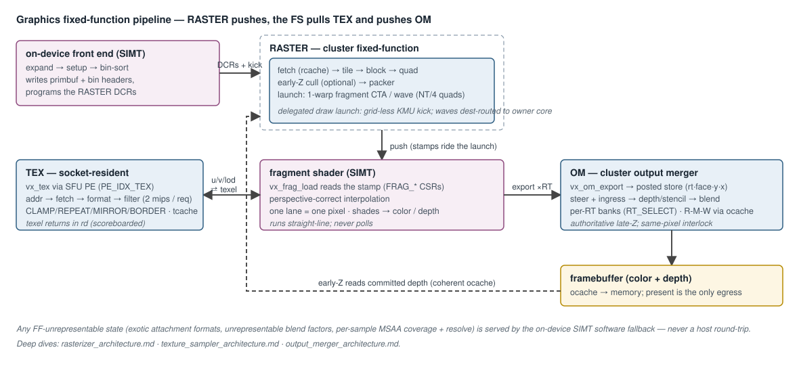

# Graphics Hardware Stack (RASTER / TEX / OM) — Design

**Scope:** the Vortex graphics fixed-function (FF) hardware — the
rasterizer (RASTER), the texture sampler (TEX), and the output-merger /
ROP (OM) — plus the SIMT-side plumbing that binds them (the fragment
dispatch path and the shared graphics register window). Covers the RTL
([`hw/rtl/raster/`](../../hw/rtl/raster/), [`hw/rtl/tex/`](../../hw/rtl/tex/),
[`hw/rtl/om/`](../../hw/rtl/om/), [`hw/rtl/VX_graphics.sv`](../../hw/rtl/VX_graphics.sv)),
the SimX models ([`sim/simx/raster/`](../../sim/simx/raster/),
[`sim/simx/tex/`](../../sim/simx/tex/), [`sim/simx/om/`](../../sim/simx/om/)),
and the kernel ABI.

This document covers the **hardware microarchitecture, ISA, dispatch, and
VM tie-in**. The complementary **software / compiler / rendering pipeline**
(the vortexpipe Gallium driver, the on-device front end, NIR→Vortex
lowering, `vkCmdDraw` flow) is documented in
[`graphics_software_stack.md`](graphics_software_stack.md) and
[`vortexpipe_architecture.md`](vortexpipe_architecture.md). The rasterizer
deep-dive — buffer ABI and memory layout, binning, DCR reference, fetch
engine, walker stages, parallelism, and the CTA-dispatch hook — is
[`rasterizer_architecture.md`](rasterizer_architecture.md); the output-merger
deep-dive — export ISA/aperture ABI, steer/ingress transport, ROP pipeline,
ocache interface, and ordering — is
[`output_merger_architecture.md`](output_merger_architecture.md); the
texture-sampler deep-dive — `vx_tex` ISA/SIMT integration, texture ABI,
sampler pipeline, tcache, and scaling — is
[`texture_sampler_architecture.md`](texture_sampler_architecture.md); and the
ray-tracing deep-dive — `vx_rt_*` ISA/hit-window ABI, the async traversal
microarchitecture, the candidate-return proceed loop, CW-BVH format, and
scaling — is [`ray_tracing_architecture.md`](ray_tracing_architecture.md).

The three units are RISC-V ISA extensions under `custom1` (`INST_EXT2 =
0x2B`), advertised via `MISA` bits TEX=6, RASTER=7, OM=8, each gated by
`VX_CFG_EXT_{TEX,RASTER,OM}_ENABLE`.

---

## 1. Architecture overview

The graphics units are **shared** fixed-function engines (not per-core):
RASTER and OM are cluster-level, TEX is **socket-resident** (per-socket
sampler cores + private tcache, in
[`VX_socket.sv`](../../hw/rtl/VX_socket.sv)). RASTER **pushes** fragment
work onto the SIMT cores; the fragment shader invokes TEX through a per-core
**SFU processing element** ([`VX_sfu_unit.sv`](../../hw/rtl/core/VX_sfu_unit.sv),
`PE_IDX_TEX`) and exports to the OM by **storing to its aperture**. Each
unit has a dedicated cache — tcache (textures, socket), rcache (raster
tile/prim buffers, cluster), ocache (color + depth framebuffers, cluster,
coherent with early-Z reads). The cluster wrapper
[`VX_graphics.sv`](../../hw/rtl/VX_graphics.sv) instantiates the RASTER/OM
arbiters, cores, caches, and DCR fan-out.

The on-device front end bin-sorts primitives and programs the RASTER DCRs;
the covered-quad stamp rides the launch into the FS; the texel returns in a
scoreboarded register; the OM export is a posted aperture store; and early-Z
reads committed depth back through the coherent ocache. Per-unit deep dives:
[`rasterizer_architecture.md`](rasterizer_architecture.md),
[`texture_sampler_architecture.md`](texture_sampler_architecture.md),
[`output_merger_architecture.md`](output_merger_architecture.md).

The pre-doctrine **pull** model (`vx_rast`/`vx_rast_begin` polled by the
shader, per-`(warp,pid,lane)` CSR latch, a sticky cross-core arbiter) has
been **retired** in favor of this push/launch path (§4).

---

## 2. ISA, opcodes, and state

- **Opcodes** (all under `custom1 = 0x2B`), decoded by funct3 in
  [`VX_decode.sv`](../../hw/rtl/core/VX_decode.sv):
  - `vx_om_export` — funct3=3, R4-type: fragment export to the OM aperture.
  - `vx_tex` — funct3=5, R4-type: texture sample; u/v/lod in registers, texel in rd.
  - funct3=6 and funct3=7 belong to the **RTU** (the hit-window reads
    `CB_RET`/`GETWF`/`GETW`, and `vx_rt_wtrace`/`vx_rt_wait`) — the graphics
    `SETW`/`GETW` window ops are retired; see
    [`ray_tracing_architecture.md`](ray_tracing_architecture.md).
  - RASTER has **no kernel op** in v2 — the raster engine launches the
    fragment shader (push); there is no shader-issued raster instruction.
- **Kernel intrinsics**
  ([`sw/kernel/include/vx_graphics.h`](../../sw/kernel/include/vx_graphics.h)):
  `vx_om_export(...)`, `vx_tex(...)`, and the fragment-stamp readers
  `vx_frag_load` / `vx_frag_pos` / `vx_frag_pid` — the FS reads its stamp
  straight out of the warp's launch registers via the `FRAG_POS`/`FRAG_PID`
  CSRs; no window op and no memory traffic.
- **DCR state** ([`VX_types.toml`](../../VX_types.toml)):
  - **TEX** `0x040–0x056`: per-stage addr / logdim / format / filter / wrap,
    the per-level `MIPOFF` byte-offset table, and the `BORDER` colour a
    `CLAMP_TO_BORDER` tap returns.
  - **RASTER** `0x060–0x069`: tbuf/pbuf addrs+stride, tile_count, scissor,
    and the fragment-shader launch descriptor `FRAG_ENTRY_LO/HI`
    (0x066/0x067), `FRAG_PARAM_LO/HI` (0x068/0x069) — the CP/runtime writes
    these so the raster engine can launch the FS with no host round-trip
    (full register reference in
    [`rasterizer_architecture.md`](rasterizer_architecture.md) §4).
  - **OM** `0x080–0x097`: color/depth buffer addrs + pitches, depth
    func/writemask, full stencil state, blend mode/func/const, logic-op,
    `EARLYZ_SAFE` (0x092) — the per-draw gate that arms early-Z — the
    aperture geometry (`APERTURE_{XBITS, YBITS, RECORD_SHIFT, DEPTH_ONLY}`),
    and `RT_SELECT` (0x097), which names the colour attachment the
    per-attachment registers program (`VX_OM_MAX_RT` banks — MRT). The OM
    carries **no CSRs**: per-export state (the attachment index, the face)
    rides the aperture address.
  DCRs are broadcast to all cluster instances; each raster instance
  self-selects its tile stripe by `INSTANCE_IDX`.
- **Perf** MPM classes RASTER=12, TEX=13, OM=14.

### 2.1 The graphics register window (FF↔SIMT handoff)

FF operands and results move in **registers**: TEX takes u/v/lod and returns its
texel in rd, the OM exports through its **aperture** (an ordinary store), and a
fragment's stamp rides its **launch** and is read as CSRs. The only register window
left is the RTU's hit window (RTL
[`VX_rtu_unit.sv`](../../hw/rtl/rtu/VX_rtu_unit.sv)), which the RTU writes and
the shader reads. This satisfies the **interface law**: every FF↔SIMT
value is scope-partitioned to the window, single-issue, and — critically —
handed off through **scoreboarded** registers so the op retires in order
(C1–C3), with no shared mutable side-band outliving the op (C4). `vx_tex`
returns its texel through a scoreboarded rd; `vx_om_export` is a posted
store (`rd = x0`, fire-and-forget — the OM's `busy` output is its only
completion signal); RASTER delivers its payload inside the launch message,
landed in the FS warp's launch registers before the warp activates.

---

## 3. RTL module inventory

### 3.1 RASTER ([`hw/rtl/raster/`](../../hw/rtl/raster/))

A cluster-shared, fixed-point coverage walker feeding a push dispatcher.
The math path fetches its bin stripe (`VX_raster_mem` via rcache, striped by
`INSTANCE_IDX`) and walks **tile → block → quad** (`te` → `be` →
`slice`/`edge`/`extents` → `qe`), emitting 2×2 covered-quad stamps under the
**Vulkan top-left fill rule** so a shared edge is covered by exactly one
triangle (no cracks, no double-cover). The dispatch path then runs optional
early-Z (`VX_raster_earlyz`, §5), compacts sparse quads into dense fragment
waves (`VX_raster_packer`), and launches each wave as one 1-warp fragment
CTA (`VX_raster_launch`, §4). The old per-core pull consumer
(`VX_raster_unit`) and window dispatcher (`VX_raster_dispatch`) are
**removed**. Full fetch/walk/launch microarchitecture, the fill-rule
derivation, and the parallelism model are in
[`rasterizer_architecture.md`](rasterizer_architecture.md).

### 3.2 TEX ([`hw/rtl/tex/`](../../hw/rtl/tex/))

**Socket-resident**: a per-core SFU PE (`VX_tex_unit`, outstanding-op tag
store) fans into the socket sampler (`VX_tex_core`) over `VX_tex_bus_arb`,
backed by a socket-private read-only tcache. The core pipeline is
address-gen → texel fetch → pixel-format decode (7 fixed formats) →
bilinear filter, with CLAMP/REPEAT/MIRROR/BORDER wrap — a `BORDER` tap
returns the `TEX_BORDER` DCR colour instead of a texel. A mip-linear sample
carries **both bracketing levels in one request** (one tap set per level)
and lerps them by the weight in the lod operand's fraction bits — real
trilinear in a single op. `vx_tex` otherwise takes an integer mip level; a
lane derives it from its 2×2 quad neighbours via
`vx_tex_auto_lod()` (helper lanes keep the derivative shuffle fed). Full
ISA/ABI/pipeline/tcache spec in
[`texture_sampler_architecture.md`](texture_sampler_architecture.md).

### 3.3 OM ([`hw/rtl/om/`](../../hw/rtl/om/))

The fragment export is a **posted store to a virtual aperture**
(`vx_om_export` → 1–2 ordinary word stores tagged `is_addr_om`/`is_addr_io`
by the LSU). The transport peels the write off the socket→L2 trunk
(`VX_om_steer`), reconstructs `{rt, x, y, face}` and pairs colour+depth
(`VX_om_ingress`), and arbitrates into `VX_om_core`, which runs
depth/stencil (`VX_om_ds`) then blend (`VX_om_blend`) or logic-op
(`VX_om_logic_op`) and read-modify-writes color+depth through the ocache
(`VX_om_mem`). Colour state is **per attachment** (`VX_OM_MAX_RT` banks
latched under `RT_SELECT`); a fragment exports once per attachment, the
`rt` field of its aperture address selecting the bank. A **same-pixel
R-M-W interlock** stalls a later same-address
fragment's read until the earlier write leaves; the OM is the
**authoritative late-Z** even when early-Z is active. Full
export/transport/pipeline/ordering spec in
[`output_merger_architecture.md`](output_merger_architecture.md).

### 3.4 Cluster glue

[`VX_graphics.sv`](../../hw/rtl/VX_graphics.sv) is a real wrapper module
(kept, not inlined into `VX_cluster.sv`): it instantiates the raster/om
arbiters and cores, the rcache/ocache as `VX_cache_cluster` instances
(TEX and its tcache live in [`VX_socket.sv`](../../hw/rtl/VX_socket.sv)),
sets each raster core's `INSTANCE_IDX`, exposes the ocache read port early-Z
uses, and fans DCRs out per unit.
[`VX_cluster.sv`](../../hw/rtl/VX_cluster.sv) carries the per-socket bus
arrays, the `gfx_busy` aggregation (so the device stays busy while raster
dispatch / packer / early-Z have work in flight), and perf aggregation.

---

## 4. Fragment dispatch v2 (RASTER → SIMT, push/launch)

The RASTER control path is a **push** model — the root fix for the
recurring multi-core / multi-drawcall dropped-draw-call class. Its four
defining properties:

- **Push, not pull.** `VX_raster_launch` launches a 1-warp fragment CTA per
  packed wave onto the wave's owner core (via the KMU bus, merged with the
  device-KMU stream by `VX_kmu_bus_arb`). The shader never polls — it runs
  straight-line and reads its payload with `vx_frag_load` (C1–C3);
  `vx_rast` and the bcoord CSRs are gone.
- **In-launch delivery.** The wave's stamps ride inside the launch message
  and `VX_cta_dispatch` lands them in the warp's launch-register RAM before
  activation; the FS reads them back as the `FRAG_POS`/`FRAG_PID` CSRs — no
  shared side-band outlives the launch (C4). A wave is sized off
  `NUM_THREADS`: `NUM_THREADS/4` quads of four adjacent lanes, one lane =
  one pixel (helper lanes included, so derivatives always have neighbours).
- **DCR-launched.** The FS entry/argument descriptor rides the RASTER DCRs
  (`FRAG_ENTRY_LO/HI`, `FRAG_PARAM_LO/HI`); a draw is a **grid-less KMU
  launch** — the KMU's **delegated draw launch**: it walks no CTAs and
  forwards the frame kick to every raster engine, which self-services the
  draw with no host round-trip
  ([`cta_dispatch_architecture.md`](cta_dispatch_architecture.md) §3.2).
- **Device-busy.** Each engine holds `busy` from the frame kick until fully
  drained; the cluster ORs the engines and launch-arb occupancy into
  `gfx_busy`, so the device never reports idle mid-frame.

The launch-message layout, owner affinity, and the `VX_cta_dispatch` hook
are detailed in
[`rasterizer_architecture.md`](rasterizer_architecture.md) §9. SimX models
this dispatch 1:1 with the RTL for trace-diffable parity.

---

## 5. Early-Z (occlusion cull)

`VX_raster_earlyz` ([`hw/rtl/raster/VX_raster_earlyz.sv`](../../hw/rtl/raster/VX_raster_earlyz.sv))
is a **read-only** occlusion stage upstream of the shader: it evaluates each
covered pixel's screen-space depth plane (bit-identical to the FS/OM late-Z
math), reads committed depth through the coherent ocache, and narrows the
coverage mask; the ROP remains the authoritative late-Z. Gated by
`VX_CFG_RASTER_EARLYZ` (compile) + `VX_DCR_OM_EARLYZ_SAFE` (per-draw; armed
only for monotone `LESS`/`LEQUAL` with no stencil). The stage mechanics are
in [`rasterizer_architecture.md`](rasterizer_architecture.md) §7.5; the
**correctness argument that makes early-Z image-identical** — canonical here,
since that doc refers back to it — follows.

### 5.1 Correctness — strict-behind cull

The committed depth early-Z reads is **not causally pinned** to the
fragment: it may already contain the fragment's own eventual write, a
co-planar (equal-depth) write, or a causally-later nearer write (fragments
do not reach the OM strictly in submission order). So a covered pixel may
be dropped only when it is **strictly behind** the read depth — the
**reflexive relaxation** of the depth func (`LESS`/`LEQUAL` → cull iff
`cand > stored`; `GREATER`/`GEQUAL` → cull iff `cand < stored`; other
funcs never early-cull). A visible fragment has `cand == final-buffer depth
≤ any value early-Z reads`, so strict-behind can never cull it: enabling
early-Z is **image-identical** to the ROP-only path, independent of read
freshness or pipeline ordering. Culling on equality (testing with the exact
func) is the bug that would drop own/co-planar/final writes. The SimX model
(`earlyz_occluded`) mirrors the RTL compare (`earlyz_func` →
`VX_om_compare`) bit-for-bit.

---

## 6. SimX models

SimX ([`sim/simx/{raster,tex,om}/`](../../sim/simx/)) mirrors each unit as a
`*Core` (and, for TEX/OM, a `*Unit` SFU-PE) driving real `MemReq`/`MemRsp`
traffic against the rcache/tcache/ocache, applying the shared host-reference
primitives (`Rasterizer`, `DepthTencil`, `Blender`, `TextureSampler` from
[`sw/common/gfx_ff_model.h`](../../sw/common/gfx_ff_model.h)). `raster_core.cpp`
holds the producer FSM + TE/BE walker + early-Z (`early_z_cull`); the
per-core raster consumer is header-only (`raster_unit.h`) since the pull
consumer retired. SimX is the **SimX-first** development + evaluation engine
and the correctness oracle; the RTL FF datapaths are built out (§7), and the
features SimX was once alone in modelling are now built on both sides.

---

## 7. State of the hardware datapaths

- **RASTER** — coverage math, early-Z, packer, and fragment dispatch are in
  RTL and exercised on rtlsim; the old pull consumer is deleted.
- **OM / TEX** — the **fixed-point datapaths are built out in RTL** and run on
  rtlsim (`VX_om_core`: mem-RMW → depth/stencil → blend + folded logic-op;
  `VX_tex_core`: addr → mem → format-decode (7 formats) → bilinear; mip LOD
  supplied per lane via `vx_tex_auto_lod`). They are **not stubs**. The features
  that were once RTL deficits are built **and driven**: **TEX trilinear** (both
  bracketing levels in one request), **TEX clamp-to-border** (the `BORDER` DCR
  colour), and **OM MRT** (`VX_OM_MAX_RT` colour attachments over one shared
  depth attachment, banked under `RT_SELECT`). The vortexpipe driver programs
  all three — the `MIPOFF` table, the border colour, the per-attachment banks —
  so mipmapped, bordered and multi-attachment draws run on the FF units.
- **Conformance** — no Vulkan CTS harness on hardware yet.

So the critical path to FF acceleration on the U55C is now **timing
sign-off at 300 MHz**, not building or reaching the datapaths.

The FF invariant holds: **no floating-point datapath inside any FF unit**
(fixed-point, mobile-class). Anything the FF units cannot represent (exotic
attachment formats, unrepresentable blend factors, per-sample MSAA coverage
and its resolve) is served by the on-device SIMT software fallback
(`sw/gfx/libgfx_sw.mk`, `gfx_sw_abi.cpp`, the `msaa_resolve_k` device
kernel), never by the host.

---

## 8. VM / pinned-buffer tie-in

Under `VX_CFG_VM_ENABLE` the per-core MMU translates VA→PA for kernel LSU
traffic, but the RASTER/TEX/OM AXI masters **bypass** the MMU and use the
physical addresses written into their DCRs. `VX_MEM_PHYS` buffers are
identity-mapped and carved from a dedicated pinned slab so VA == PA. DCR
writes targeting graphics buffer-address registers are validated against
the pinned slab on the CP submit path (returning `VX_ERR_INVALID_VALUE`
for a PA outside the slab). The slab size is `VX_CFG_VM_PINNED_REGION_SIZE`
(overridable via `VORTEX_VM_PINNED_SIZE`). Tests allocate every HW-bound
buffer with `VX_MEM_PHYS` and omit it for write-only LSU buffers. The
VM/MMU subsystem is documented in
[`virtual_memory_subsystem.md`](virtual_memory_subsystem.md).

---

## 9. Scope boundaries and companion documents

This document is the FF **overview**: the shared ISA surface, the C1–C5
interface law, the push/launch dispatch design, the early-Z correctness
argument, the dual-path principle (FF fast path + mandatory on-device SIMT
software fallback), and the VM tie-in. Per-unit microarchitecture lives in
the deep-dive docs linked in the intro
([`rasterizer_architecture.md`](rasterizer_architecture.md),
[`texture_sampler_architecture.md`](texture_sampler_architecture.md),
[`output_merger_architecture.md`](output_merger_architecture.md),
[`ray_tracing_architecture.md`](ray_tracing_architecture.md)); the software
side (vortexpipe driver, on-device front end, CP orchestration) in
[`graphics_software_stack.md`](graphics_software_stack.md),
[`vortexpipe_architecture.md`](vortexpipe_architecture.md), and
[`command_processor.md`](command_processor.md).

**Superseded / rejected directions** (recorded to avoid revival): the
`vx_rast` pull + `pos_mask==0` sentinel + per-`(warp,pid,lane)` CSR latch
dispatch protocol (replaced by push/launch, §4); the cocogfx dependency
(eliminated in favor of `sw/common/gfx_ff_model.cpp`); inlining
`VX_graphics.sv` into `VX_cluster.sv` (the wrapper was kept); and
reset-clean DCRs (rejected for the BRAM cost).
