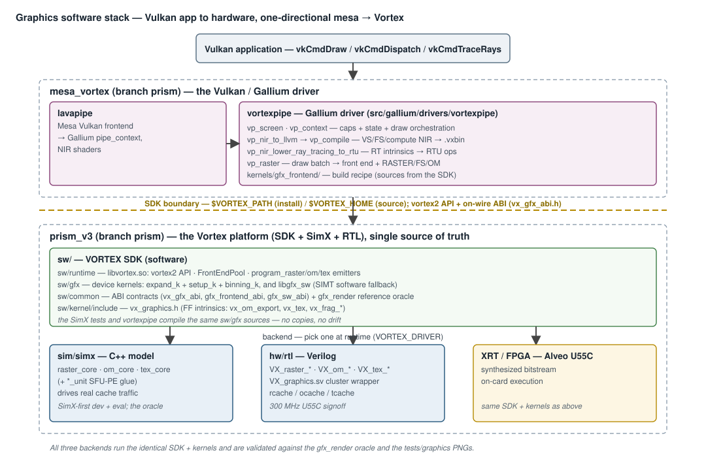
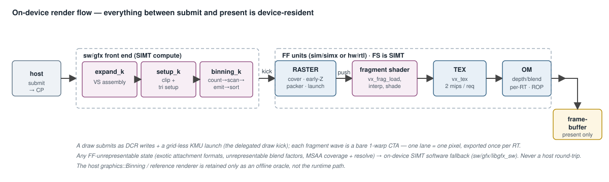
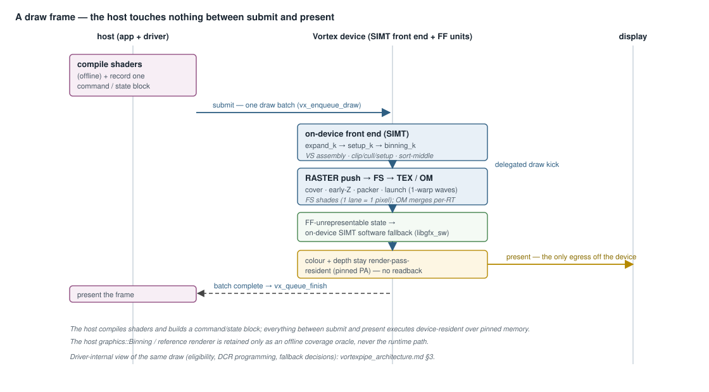
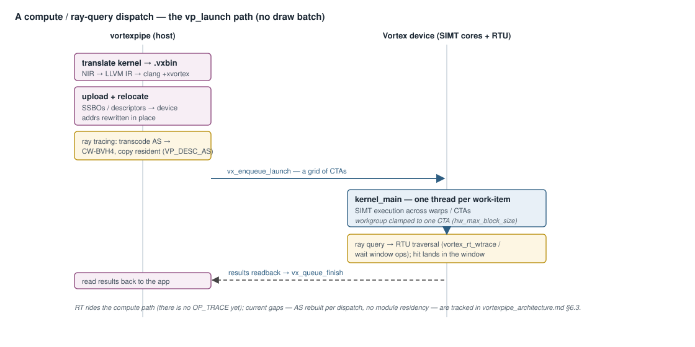

# Vortex Graphics Software Stack — Design

**Scope:** a map of *where every graphics-related source lives* across the two
repositories that make up the Vortex graphics stack, and how they compose from
the Vulkan application down to the hardware. Covers the **mesa_vortex**
vortexpipe driver and the **Vortex platform** (this tree: SDK software, SimX
models, RTL). This is an orientation/index document; the per-layer detail lives
in the companion docs.

**Companion docs:**
[`vortexpipe_architecture.md`](vortexpipe_architecture.md) (the driver / NIR
lowering / draw flow),
[`graphics_hardware_stack.md`](graphics_hardware_stack.md)
(the RASTER/TEX/OM hardware microarchitecture, fragment dispatch, early-Z, and
SimX models),
[`command_processor.md`](command_processor.md) (the
CP that sequences a draw device-side).

**Two trees:**
- **`mesa_vortex`** (branch `prism`) — the Vulkan/Gallium **driver** (vortexpipe).
- **this tree** (`vortex_v3/prism_v3`, branch `prism`) — the Vortex **platform**:
  the SDK (runtime + device kernels + ABI), the SimX models, and the RTL. It is
  the single unified source-of-truth (graphics + PRISM RTU).

The driver consumes the platform as an SDK (`$VORTEX_PATH` install for
headers/libs, `$VORTEX_HOME` source for the device kernels + toolchain) — a
one-directional `mesa → Vortex` dependency, the same way a userspace driver
consumes a GPU SDK.

### On-device, host-untouched draws

The render path is fully device-resident: everything
between *submit* and *present* is device-resident and host-untouched. The host
compiles shaders and builds a command/state block; the on-device front end
(vertex assembly → triangle setup → bin-sort) and the FF units (RASTER pushes
fragments → FS runs `vx_tex`/`vx_om_export`) execute the whole draw over
resident memory. The host `Binning()` / reference renderer is retained only as an
**offline oracle**, not the runtime path. Where the FF units cannot represent a
state, an **on-device SIMT software fallback** covers it — never a host round
trip.

---

## 1. `mesa_vortex` — the Vulkan/Gallium driver

All graphics code is the **vortexpipe** Gallium driver, which lavapipe (Mesa's
Vulkan frontend) drives. Path: `src/gallium/drivers/vortexpipe/`.

| File | Contains |
|------|----------|
| `vp_public.h` / `vp_private.h` | Public screen-create entry + internal driver structs (device handle, caps, compiled-kernel cache) |
| `vp_screen.c` | `pipe_screen`: opens the Vortex device, queries caps (`has_rtu`/`tex`/`raster`/`om`), advertises formats |
| `vp_context.c` | `pipe_context`: state tracking + draw/dispatch orchestration — the driver core |
| `vp_nir_to_llvm.c` | NIR shader → LLVM IR codegen for VS / FS / compute; FS emits `vx_tex` (funct3=5) and `vx_om_export` (funct3=3, aperture store) |
| `vp_nir_lower_ray_tracing_to_rtu.c` | Lowers Vulkan ray-tracing intrinsics → PRISM RTU ops |
| `vp_compile.c` | LLVM IR → `.vxbin` (drives llvm-vortex clang `+xvortex` + `vxbin.py`) |
| `vp_launch.c` | Loads a `.vxbin` and launches compute / VS kernels on the device |
| `vp_raster.cpp` | Emits the draw batch (expand → setup → bin → FS → OM); the on-device front end is the default path, host `graphics::Binning` retained as an oracle |
| `meson.build` | Build; consumes the Vortex SDK via pkg-config (`$VORTEX_PATH`) |

### `kernels/gfx_frontend/` — the on-device front-end build recipe

| File | Contains |
|------|----------|
| `gfx_frontend_kernel.cpp` | Compile unit (one `#include` of the SDK front end) → `expand_k` + `setup_k` + `binning_k` |
| `Makefile` | Builds `gfx_frontend.vxbin`; **consumes the kernel sources from `$VORTEX_HOME/sw/gfx`** (no copies) |
| `README.md` | Provenance + ownership note |

> The driver owns only the **build recipe**; the kernel *sources* live in the
> SDK (`sw/gfx`, below). This is the single-source-of-truth arrangement: the
> SimX tests and the driver compile the *same* files.

---

## 2. The Vortex platform (this tree) — SDK, SimX, RTL

Graphics spans `sw/` (software), `sim/` (SimX models), `hw/` (RTL), and `tests/`.

### 2.1 Software — `sw/`

| Dir | Contains |
|-----|----------|
| [`sw/common/`](../../sw/common/) | **Contracts + oracle.** [`vx_gfx_abi.h`](../../sw/common/vx_gfx_abi.h) (on-wire RASTER buffer ABI — `rast_prim_t`/`rast_bin_header_t`, `fixed_t<F>` = the HW contract); [`gfx_frontend_abi.h`](../../sw/common/gfx_frontend_abi.h) (front-end host/device ABI — `pipe_arg_t`, `PIPE_STAGE_*`, `setup_vertex_t`); [`gfx_sw_abi.h`](../../sw/common/gfx_sw_abi.h) (the SIMT software-fallback OM/blend ABI); [`gfx_ff_model.cpp`](../../sw/common/gfx_ff_model.cpp)/[`.h`](../../sw/common/gfx_ff_model.h) (the **reference FF model / golden oracle** — `Rasterizer`, `DepthTencil`, `Blender`, `TextureSampler`, over the `RasterDCRS`/`OMDCRS`/`TexDCRS` state blocks) |
| [`sw/gfx/`](../../sw/gfx/) | **Device front-end + SW-fallback kernel sources (single source of truth).** [`gfx_frontend_k.h`](../../sw/gfx/gfx_frontend_k.h) (`expand_k`+`setup_k`+`binning_k`, the VS-assembly + parallel sort-middle front end); [`gfx_sw_abi.cpp`](../../sw/gfx/gfx_sw_abi.cpp) + [`libgfx_sw.mk`](../../sw/gfx/libgfx_sw.mk) (on-device SIMT software rasterizer/ROP fallback) |
| [`sw/runtime/`](../../sw/runtime/) | Host driver layer in `libvortex.so`: [`common/graphics.cpp`](../../sw/runtime/common/graphics.cpp)/[`include/graphics.h`](../../sw/runtime/include/graphics.h) — device-resident front-end launch (`FrontEndPool`, DrawCommands) + FF register emitters (`program_raster/om/tex`); host `graphics::Binning` retained as an oracle |
| [`sw/kernel/include/`](../../sw/kernel/include/) | [`vx_graphics.h`](../../sw/kernel/include/vx_graphics.h) — device-side graphics intrinsics (`vx_om_export`, `vx_tex`, fragment-stamp readers `vx_frag_load`/`vx_frag_pos`/`vx_frag_pid`) |

**Attribute interpolation is perspective-correct** (done in the FS/software, not
the FF units). Triangle setup ([`gfx_setup.h`](../../sw/common/gfx_setup.h))
premultiplies each colour/texcoord varying by the vertex `1/w` and emits a
per-primitive `a·(1/w)` plane per varying plus a max-normalized `1/w` plane
(`rast_attribs_t.rhw`); the FS interpolates every plane affinely in screen space
then divides the varyings by the interpolated `1/w` to recover the
perspective-correct value. Depth stays a screen-space affine plane (`attribs.z`),
which is already correct without a divide. The `1/w` normalization keeps the
fixed-point (Q7.24) planes in range for near geometry — the common scale cancels
in the divide, so this is exact. Where `w` is constant across a triangle the
result reduces exactly to plain affine interpolation. The **Vulkan top-left fill
rule** (see the hardware doc) is applied identically in the SW-raster fallback
([`gfx_frag_rast.h`](../../sw/common/gfx_frag_rast.h)) and the SimX model.

### 2.2 SimX models — `sim/simx/` (the SimX-first dev + evaluation engine)

| Dir | Contains |
|-----|----------|
| [`sim/simx/raster/`](../../sim/simx/raster/) | `raster_core.*` (RasterCore: tile/prim walk, TE/BE descent → covered quads, fragment dispatch, `early_z_cull`) + `raster_unit.h` (header-only PE glue; the pull consumer retired) |
| [`sim/simx/om/`](../../sim/simx/om/) | `om_core.*` + `om_unit.*` — depth / stencil / blend / ROP with the same-pixel R-M-W interlock |
| [`sim/simx/tex/`](../../sim/simx/tex/) | `tex_core.*` + `tex_unit.*` — sampler: address / filter / format-decode |

The SimX models `#include` [`gfx_ff_model.h`](../../sw/common/gfx_ff_model.h) +
[`vx_gfx_abi.h`](../../sw/common/vx_gfx_abi.h) as their oracle and on-wire types
— which is why those headers stay owned by the SDK rather than moving to the
driver.

### 2.3 RTL hardware — `hw/rtl/`

| Dir | Contains |
|-----|----------|
| [`hw/rtl/raster/`](../../hw/rtl/raster/) | `VX_raster_*` — rasterizer FF: coverage math (`mem`/`te`/`be`/`slice`/`edge`/`extents`/`qe`), **fragment dispatch v2** (`packer` → `dispatch`, push/launch), **early-Z** (`earlyz`), `arb`, `dcr` |
| [`hw/rtl/tex/`](../../hw/rtl/tex/) | `VX_tex_*` — sampler FF (addr / format / lerp / wrap / sampler / sat / stride / csr) |
| [`hw/rtl/om/`](../../hw/rtl/om/) | `VX_om_*` — output-merger FF (ds / compare / stencil_op / blend* / logic_op / mem) |
| [`hw/rtl/VX_graphics.sv`](../../hw/rtl/VX_graphics.sv) | Graphics cluster wrapper — instantiates raster/tex/om arbiters + cores + caches, exposes the early-Z ocache read port, fans out DCRs |

### 2.4 Tests — `tests/`

| Dir | Contains |
|-----|----------|
| [`tests/graphics/`](../../tests/graphics/) | Image-validated end-to-end: `gfx_draw3d` (trace replay, incl. the early-Z config), `gfx_raster`/`tex`/`om`/`tex4*` (single FF), `gfx_pipeline_raster`/`om`/`tex` (on-device front end → FF) |
| [`tests/regression/`](../../tests/regression/) | Kernel-level: `gfx_setup_kernel`, `gfx_binsort_kernel`, `gfx_pipeline_kernel` |
| [`tests/unittest/gfx_binsort/`](../../tests/unittest/gfx_binsort/) | Host-reference bin-sort unit test |

---

## 3. The stack

The application's Vulkan calls enter lavapipe, which drives the vortexpipe
Gallium driver (state tracking, NIR→`.vxbin` compile, draw orchestration).
Across the **SDK boundary** the driver consumes the prism_v3 platform:
`sw/runtime` (the `libvortex.so` runtime), `sw/gfx` (the device kernels),
`sw/common` (ABI contracts + the `gfx_ff_model` oracle), and
`sw/kernel/include` (FF intrinsics). The same SDK + kernels then run on any
one backend — SimX, RTL, or FPGA — selected at runtime.

### On-device render flow (all device-resident)

The `sw/gfx` front end (`expand_k` → `setup_k` → `binning_k`) transforms and
bin-sorts primitives; RASTER **pushes** fragment CTAs at the shader (the
covered-quad stamp rides the launch and is read back with `vx_frag_load` —
no shader-issued `vx_rast` pull); the FS invokes TEX/OM as scoreboarded SFU
ops. The FF stages run on SimX or RTL; the FS is always SIMT. Dispatch and
early-Z detail is in
[`graphics_hardware_stack.md`](graphics_hardware_stack.md) §4–§5.

### Sequence — a draw frame

The temporal view of the same flow, across the host↔device boundary. The host
submits once and presents once; the entire pipeline in between runs
device-resident over pinned memory:

### Sequence — a compute / ray-query dispatch

Compute and ray tracing take the `vp_launch` path instead of a draw batch: the
host uploads and relocates buffers (and, for RT, transcodes the acceleration
structure to CW-BVH4 and copies it resident), launches a grid of CTAs, and
reads the results back.

The driver-internal view of a draw (eligibility, DCR programming, the fallback
decisions) is in [`vortexpipe_architecture.md`](vortexpipe_architecture.md) §3.

---

## 4. The two boundaries

- **SDK boundary** — mesa consumes the Vortex SDK: `$VORTEX_PATH` (install) for
  headers + `libvortex.so`, and `$VORTEX_HOME` (source) for the `sw/gfx` kernel
  sources + the kernel toolchain. One-directional: `mesa → Vortex`. The on-wire
  ABI ([`vx_gfx_abi.h`](../../sw/common/vx_gfx_abi.h)) is the hardware contract
  and stays SDK-owned.
- **Backend boundary** — the same SDK + kernels run on **SimX** (the SimX-first
  development + cycles/perf evaluation target), **RTL** (300 MHz U55C signoff),
  or **FPGA**, selected at runtime (`VORTEX_DRIVER`).

## 5. Single source of truth

The on-device kernels live once, in [`sw/gfx/`](../../sw/gfx/) (front end +
software fallback) and [`sw/kernel/include/`](../../sw/kernel/include/)
(intrinsics). The SimX graphics tests compile them to validate the SimX models,
and vortexpipe compiles the *same files* to `gfx_frontend.vxbin` to launch them
— no duplication, no drift. The front-end ABI
([`gfx_frontend_abi.h`](../../sw/common/gfx_frontend_abi.h)) stays in `sw/common`
because the host runtime (`FrontEndPool`) also includes it.
