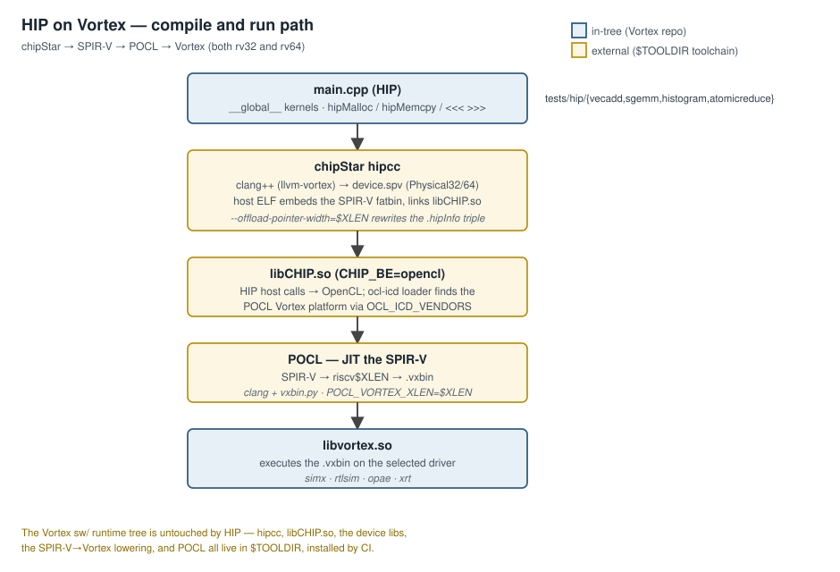
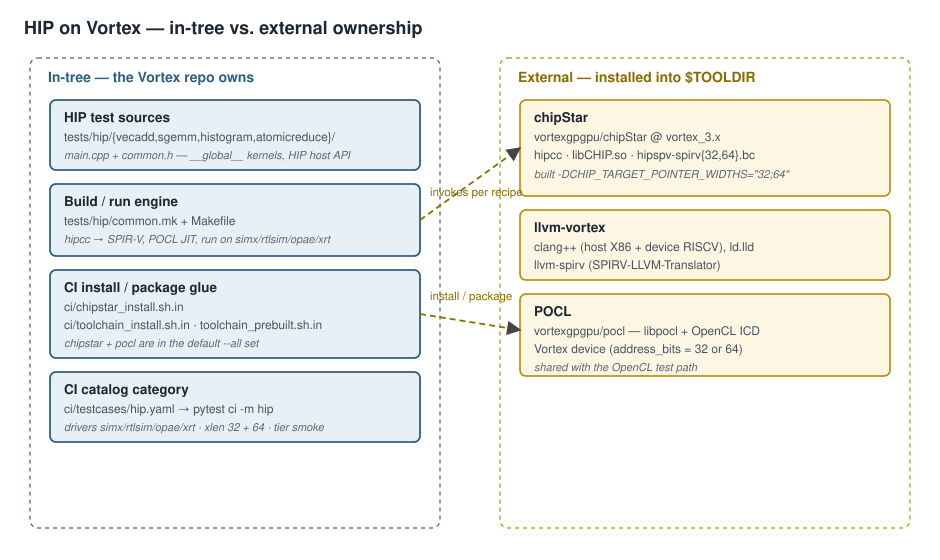

# HIP on Vortex (via chipStar) — Design

**Scope:** how a HIP program compiles and runs on Vortex today. The
working path is **chipStar → SPIR-V → POCL → Vortex**, with both 64-bit
(rv64) and 32-bit (rv32) supported. This document covers the in-tree glue
(CI install scripts + the HIP test suite) and the external toolchain it
orchestrates.

> **Note on a separate, unbuilt direction.** A bespoke HIP toolchain
> (a `HIPVortex` Clang driver, a native `libhip_vortex` runtime on
> `vortex2.h`, and an out-of-tree `vortex_mlir` dialect) is **not
> implemented**. Its key motivation that the chipStar path cannot
> satisfy — exposing Vortex-specific intrinsics (WMMA/WGMMA/TMA)
> through HIP headers — is described in §5.

---

## 1. The compilation and execution path

The Vortex `sw/` runtime tree itself is untouched by HIP — everything
load-bearing (hipcc, `libCHIP.so`, device libs, the SPIR-V→Vortex
lowering, the runtime) is external, installed by CI into `$TOOLDIR`.

---

## 2. In-tree components

| Path | Role |
|---|---|
| [`ci/chipstar_install.sh.in`](../../ci/chipstar_install.sh.in) | Producer: clones `vortexgpgpu/chipStar @ vortex_3.x`, builds with `-DCHIP_TARGET_POINTER_WIDTHS="32;64"` against `$TOOLDIR/llvm-vortex` + `$TOOLDIR/pocl`, installs hipcc, `libCHIP.so`, and `hipspv-spirv{32,64}.bc`. |
| [`ci/toolchain_install.sh.in`](../../ci/toolchain_install.sh.in) | `chipstar()` + `pocl()` fetch prebuilt tarballs; both in the default `--all` set. |
| [`ci/toolchain_prebuilt.sh.in`](../../ci/toolchain_prebuilt.sh.in) | `chipstar()` packages `$TOOLDIR/chipstar` into a tarball. |
| [`tests/hip/common.mk`](../../tests/hip/common.mk) | The real build/run engine: chipStar hipcc → SPIR-V, POCL JITs to Vortex, runs on simx/rtlsim/opae/xrt. Passes `--offload-pointer-width=$(XLEN)` and `POCL_VORTEX_XLEN=$(XLEN)`. |
| [`tests/hip/`](../../tests/hip/) | Four real HIP tests (`__global__` kernels, `hipMalloc`/`hipMemcpy`/`<<<>>>`/`hipDeviceSynchronize`): [`vecadd`](../../tests/hip/vecadd/), [`sgemm`](../../tests/hip/sgemm/), and the atomics pair [`histogram`](../../tests/hip/histogram/) + [`atomicreduce`](../../tests/hip/atomicreduce/). `TESTS` and the per-backend sweep live in [`tests/hip/Makefile`](../../tests/hip/Makefile). |
| [`ci/testcases/hip.yaml`](../../ci/testcases/hip.yaml) | The `hip` catalog category — one case per driver, each `make -C tests/hip run-{driver}`, over `xlen: [32, 64]` at `tier: smoke`. Selected with `pytest ci -m hip` (the `regression.sh --test hip` wrapper routes through the same catalog). |

There is **no in-tree HIP runtime shim** — the references to chipStar/hipcc
in [`sw/runtime/common/device.cpp`](../../sw/runtime/common/device.cpp),
[`sw/runtime/include/vortex2.h`](../../sw/runtime/include/vortex2.h), and
[`sw/runtime/vortex-kernel.pc.in`](../../sw/runtime/vortex-kernel.pc.in) are
comments naming downstream consumers, not code.

**Atomics are gated behind the A extension.** `histogram` and `atomicreduce`
use `atomicAdd`, which lowers to a hardware RVA `amoadd.w`, so
[`tests/hip/Makefile`](../../tests/hip/Makefile) puts both on its `EXCLUDE`
list — the default sweep builds the no-atomics config and only `vecadd`/`sgemm`
run. Exercise the atomics pair explicitly with
`CONFIGS="-DVX_CFG_EXT_A_ENABLE"`.

---

## 3. 32-bit (rv32) support

The headline capability: rv32 HIP works end-to-end. `common.mk` passes
`--offload-pointer-width=$(XLEN)` and sets `POCL_VORTEX_XLEN=$(XLEN)`; the
chipStar install builds both `hipspv-spirv32.bc` and `hipspv-spirv64.bc`.
rv32 emits `Physical32` SPIR-V, which POCL's rv32 Vortex device
(`address_bits=32`) accepts. This required, in the external repos:

- **llvm_vortex** (`vortex_3.x`): Clang HIPSPV accepts `spirv32`
  (`Driver.cpp`, `HIPSPV.cpp`).
- **chipStar** (`vortex_3.x`): a multi-width device library
  (`CHIP_TARGET_POINTER_WIDTHS` CMake cache var) + hipcc/ROCm-Device-Libs
  patches (carried as `HIPCC-patches/` + `ROCm-Device-Libs-patches/`).

rv32 `vecadd` and `sgemm` PASS on SimX; the broader chipStar conformance
smoke is "mixed" (~36% passing, catalogued in the fork's
`known-failures-vortex32.txt`).

---

## 4. Architecture notes

- **chipStar is the OpenCL backend** (`CHIP_BE=opencl`): HIP host calls map
  to OpenCL, and device code is SPIR-V JIT-compiled by POCL to a Vortex
  `.vxbin`. POCL — the device driver, the SPIR-V→LLVM pipeline, the JIT to
  `.vxbin`, and the kernel builtin library — is shared with the native
  OpenCL path and is documented in
  [OpenCL on Vortex (PoCL)](opencl_on_vortex.md); the SPIR-V front end this
  path relies on is the `ENABLE_SPIRV` opt-in described there.
- **External vs in-tree split** is deliberate: the Vortex repo owns only
  the test sources, the build/run `common.mk`, and the CI install/
  regression glue. The toolchain is versioned in `vortexgpgpu/chipStar`,
  `llvm_vortex`, and `vortexgpgpu/pocl`.

---

## 5. Proposed but not yet implemented

1. **Hardware-extension exposure via HIP**: `nvcuda::wmma`-style
   HIP headers exposing Vortex WMMA/WGMMA/TMA/async-barrier intrinsics.
   The chipStar/SPIR-V path structurally cannot reach Vortex-specific
   intrinsics.
2. **MLIR research middleware**: an out-of-tree
   `vortex_mlir` dialect, `vortex-opt`, and GPUToVortex/VortexToLLVM
   lowerings — zero code exists.
3. **Native `libhip_vortex` runtime**:
   direct `hipMalloc → vx_mem_alloc` on the Vortex runtime, removing the
   POCL JIT layer — only a stub exists externally.
4. **chipStar conformance long-tail** (rv32): subgroups, FP64 atomics,
   image support, and `sizeof(size_t)==8` device assumptions — catalogued,
   not fixed. POD-arg width drift (host `size_t`=8 vs device=4 on rv32) is
   an accepted risk with no host-narrowing fix.

**Known discrepancies to fix** (not future work): stale "rv64-only"
comments in `tests/hip/common.mk` headers — the toolchain now supports
rv32, but these comment sites were never updated.
