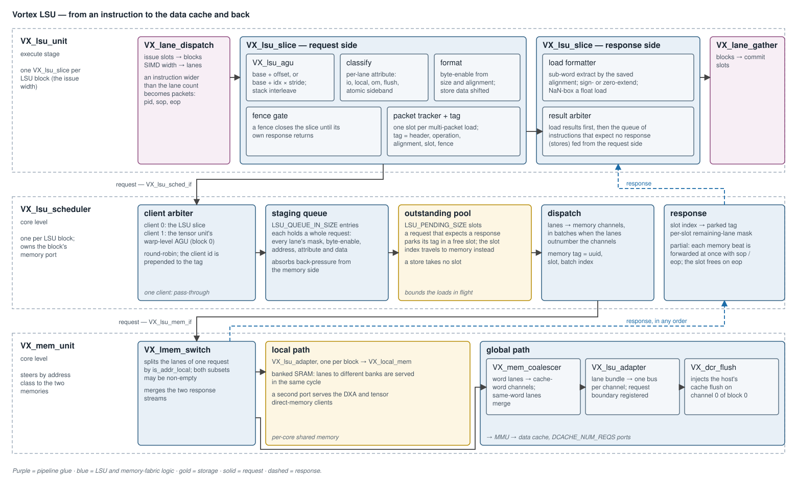
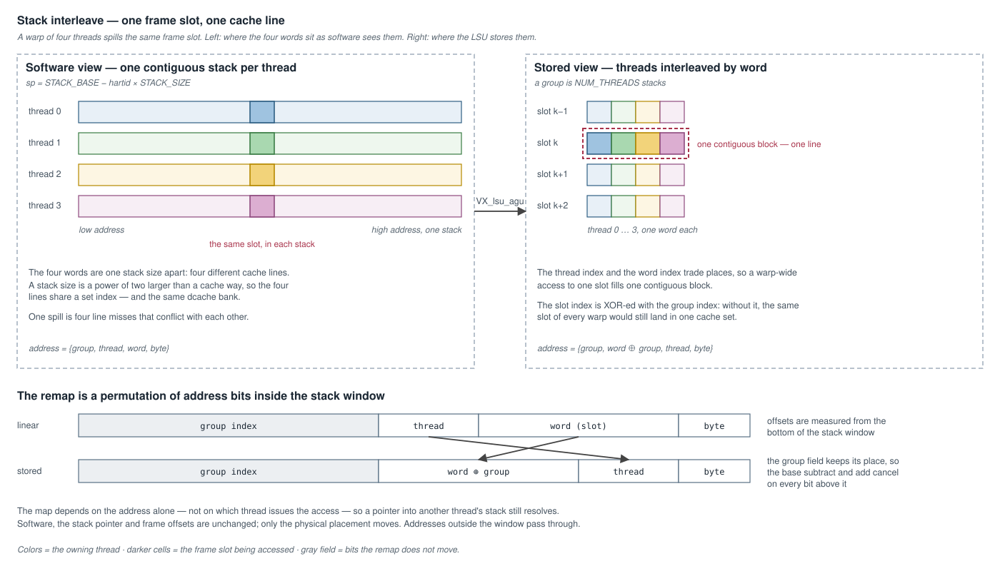
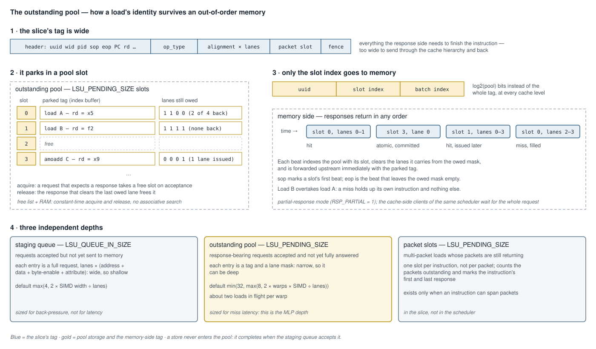

# Load/Store Unit (LSU) — Design

**Scope:** the path a memory instruction takes from the execute stage to the
data cache or local memory and back — address generation and the stack
interleave, per-lane classification and formatting, fence ordering,
multi-packet tracking, the shared memory scheduler and its outstanding pool,
address-class steering, coalescing, and the response path. Covers the RTL
([`VX_lsu_unit.sv`](../../hw/rtl/core/VX_lsu_unit.sv),
[`VX_lsu_slice.sv`](../../hw/rtl/core/VX_lsu_slice.sv),
[`VX_lsu_agu.sv`](../../hw/rtl/core/VX_lsu_agu.sv),
[`VX_lsu_scheduler.sv`](../../hw/rtl/core/VX_lsu_scheduler.sv),
[`VX_mem_scheduler.sv`](../../hw/rtl/libs/VX_mem_scheduler.sv),
[`VX_mem_unit.sv`](../../hw/rtl/core/VX_mem_unit.sv)) and the SimX model
([`sim/simx/lsu_unit.cpp`](../../sim/simx/lsu_unit.cpp)).

What happens past the LSU's memory port is documented elsewhere: the data
cache in [`cache_subsystem.md`](cache_subsystem.md), address translation in
[`virtual_memory_subsystem.md`](virtual_memory_subsystem.md), and the
atomics that ride this path in
[`atomic_memory_operations.md`](atomic_memory_operations.md). This document
is the LSU deep-dive.



---

## 1. Overview

A memory instruction crosses three modules:

1. **`VX_lsu_unit`**, in the execute stage, holds one **slice** per LSU
   block. A slice turns an instruction into a memory request: it generates
   the per-lane addresses, classifies and formats each lane, enforces fence
   ordering, and packs everything the response will need into a tag.
2. **`VX_lsu_scheduler`**, at core level, owns the block's memory port. It
   stages requests, parks each load's tag in an **outstanding pool**, and
   dispatches the lanes. It is shared: the tensor unit's warp-level address
   generator is a second client of the same scheduler.
3. **`VX_mem_unit`** steers each lane by address class — to local memory, or
   through the coalescer to the data cache.

Responses return **in any order**. The slot index carried through memory
recovers the parked tag, and each response beat is formatted and committed as
it arrives.

The design's purpose is **memory-level parallelism**: a load that misses
holds up its own instruction and nothing else.

---

## 2. Address generation — `VX_lsu_agu`

All address arithmetic lives in
[`VX_lsu_agu.sv`](../../hw/rtl/core/VX_lsu_agu.sv), one instance per lane.
The slice contains none.

| form | address | used by |
|---|---|---|
| plain | `rs1 + sext(offset)` | loads, stores, fences, atomics |
| packed load | `rs1 + idx × rs2`, `idx` = `offset[1:0]` | the packed-load micro-ops |

Both forms are *base + addend*, so the form select sits ahead of a 3:2
compressor and a single carry-propagate adder serves both. The packed form's
two-bit multiply is a shift-and-add folded into the compressor — there is no
multiplier.

### 2.1 Stack interleave



The kernel ABI gives each hardware thread a contiguous stack
(`sp = VX_MEM_STACK_BASE_ADDR − hartid << VX_MEM_STACK_LOG2_SIZE`). The same
frame slot across a warp's threads then sits one stack apart — `NUM_THREADS`
separate cache lines with the same set index, all in one dcache bank.

With `VX_CFG_LSU_STACK_INTERLEAVE_ENABLE` (on by default) the AGU remaps
every address inside the stack window so that, within each group of
`NUM_THREADS` stacks, offset `{thread, word, byte}` is stored as
`{word ⊕ group, thread, byte}`. A warp-wide spill fills one contiguous
block — the layout NVIDIA local memory and AMD scratch use.

Load-bearing properties:

- **The map is a function of the address alone.** It does not depend on the
  issuing thread, so a pointer into another thread's stack still resolves.
  Software, `sp`, and frame offsets are unchanged.
- **The XOR with the group index is what spreads warps across sets.** A
  group spans a power of two larger than a cache way; without the skew, the
  same frame slot of every warp would share a set.
- **It costs two narrow operations, not three wide ones.** Written naively
  the map subtracts the window base, permutes, and adds the base back. The
  permutation moves bits only inside the group field and the group index
  keeps its position, so the subtract and add cancel on every bit above the
  field; the window base has trailing zeros, so the field itself needs
  arithmetic only on the bits above them.
- **Window membership is a narrow compare.** Both window bounds are asserted
  to be multiples of the stack size, so the test uses only the bits above it.

The AGU sits between the lane-dispatch registers and the scheduler's staging
queue, which is why every operation in it is reduced to the narrowest width
that is provably equivalent.

---

## 3. The slice — request side

[`VX_lsu_slice.sv`](../../hw/rtl/core/VX_lsu_slice.sv).

### 3.1 Classification

Each lane carries a `mem_bus_attr_t`
([`VX_gpu_pkg.sv`](../../hw/rtl/VX_gpu_pkg.sv)) through the scheduler's user
channel and on into the memory fabric:

| field | set when | consumed by |
|---|---|---|
| `is_flush` | the instruction is a fence | the data cache: a flush request |
| `is_addr_io` | the address is in the IO range, or in the OM aperture | the cache: bypassed, uncached |
| `is_addr_local` | the address is in the local-memory window | `VX_lmem_switch` |
| `is_addr_om` | the address is in the OM fragment-export aperture | the cluster's OM steer |
| `amo` | the instruction is an atomic | the commit point |

The local-memory test is an **equality on the block-address bits above the
window**. The window base is asserted aligned to the capacity, so the prefix
compare is exact and needs no end address — which is not representable when
the window ends at the top of the address space.

An OM aperture store is presented to the cache hierarchy as an ordinary IO
store: `is_addr_io` is asserted alongside `is_addr_om`. Uncached, bypassed
and posted is exactly the behavior a fragment export wants, and no cache
level needs to know the aperture exists.

### 3.2 Formatting

| what | how |
|---|---|
| request address | the word address; the low bits are kept as the lane's **alignment** |
| byte-enable | from the access size and the alignment |
| store data | shifted left by the alignment, so it sits at its byte position in the word |
| request direction | store, unless the instruction is an atomic — atomics always travel as `rw = 0` |

**Misaligned access is not supported.** An address that is not a multiple of
the access size is a runtime assertion, not a handled fault.

### 3.3 Fence ordering

A fence is a **total barrier on its slice**. The slice sets `fence_lock` when
a fence's last packet is accepted and clears it when that fence's response
returns. While locked, the slice accepts nothing.

The fence itself travels to memory as a request with `is_flush`, behind every
request the slice issued before it, so its response proves they have drained.
Only the last packet of a multi-packet fence is sent; the earlier packets
complete immediately.

### 3.4 Multi-packet tracking

When the lane count is below the SIMD width, one instruction is dispatched as
several **packets**, each with its own `pid`. Packets are independent memory
requests and their responses interleave. The writeback path, though, needs to
know when the *instruction* begins and ends.

The slice keeps `VX_CFG_LSU_PENDING_SIZE` packet slots, present only when an
instruction can span packets:

| event | action |
|---|---|
| a load's first packet is accepted | mark the slot's start flag |
| each load packet accepted | count it |
| a load's last packet is accepted | mark the slot's end flag; the slot is taken and the next instruction gets another |
| a packet's final response | uncount it |
| the final response, end flag set, count at 1 | that response is the instruction's last; release the slot |

This separates the **memory-level** start and end of a response, which the
scheduler reports per request, from the **instruction-level** start and end
the writeback sees.

### 3.5 The tag

Everything the response side needs rides in the request tag:

```
{ header, op_type, per-lane alignment, packet slot, is_fence }
```

The header carries the instruction's identity — uuid, warp, thread mask,
`pid`, destination register, writeback flag. The width is fixed in the
package and asserted against the slice, so the two cannot drift.

### 3.6 Instructions with no response

A store that writes no register, and the early packets of a fence, have
nothing to wait for. They enter a small queue on the request side and
complete as soon as the scheduler accepts the request. The result arbiter
merges that queue with the load results, **load results first**.

---

## 4. The scheduler

[`VX_lsu_scheduler.sv`](../../hw/rtl/core/VX_lsu_scheduler.sv) is
instantiated once per LSU block in
[`VX_core.sv`](../../hw/rtl/core/VX_core.sv). It wraps one
[`VX_mem_scheduler`](../../hw/rtl/libs/VX_mem_scheduler.sv), the generic
library block also used by the caches' other clients.

### 4.1 Clients

| client | source | present |
|---|---|---|
| 0 | the block's `VX_lsu_slice` | always |
| 1 | the tensor unit's warp-level address generator | on block 0, when the tensor metadata path is enabled |

Arbitration is round-robin, and the granted client's index is prepended to
the tag so the response is routed back. With a single client the arbiter is
a pass-through with no tag extension.

Sharing one scheduler is what lets a second memory client reuse the LSU's
staging, pool, coalescer and cache port rather than owning a port of its own.

### 4.2 The outstanding pool



The pool is an index buffer — a free list and a RAM. A request that expects
a response takes a free slot **when it is accepted**, writes its tag there,
and carries only the slot index onward:

```
memory tag = { uuid, slot index, batch index }
```

Consequences:

- **Responses can arrive in any order.** The slot index routes a response to
  its tag; the slot is released by the response that clears the last owed
  lane, not by arrival order.
- **No associative search.** Acquire and release are constant-time.
- **The tag stays narrow through the cache hierarchy.** Every level below
  carries `log2(pool)` bits instead of the instruction header.
- **Stores do not take a slot.** A stream of stores does not stall behind a
  full pool; it is limited only by the staging queue.
- **Atomics do.** They travel as `rw = 0` and return a value.

Each slot also holds a **remaining-lane mask**, written from the request's
thread mask on acquire and cleared lane by lane as responses arrive.

### 4.3 Three depths

| structure | knob | default | holds | sized for |
|---|---|---|---|---|
| staging queue | `VX_CFG_LSU_QUEUE_IN_SIZE` | `max(4, 2 × SIMD / lanes)` | whole requests, every lane's address and data | back-pressure |
| outstanding pool | `VX_CFG_LSU_PENDING_SIZE` | `min(32, max(8, 2 × warps × SIMD / lanes))` | a tag and a lane mask | miss latency |
| memory-side queue | derived | `max(pool, LSU_LINE_SIZE / word)` | the coalescer's in-flight entries | covering the pool |

The staging queue and the pool are deliberately decoupled. A staging entry is
`lanes ×` (address + data + byte-enable + attribute) wide and is expensive to
deepen; a pool entry is a tag. Decoupling them lets the pool be provisioned
for about two loads in flight per warp without widening the staging queue.

The memory-side depth is **not** a knob. It sets the width of the tag's
index field facing the data cache and must cover the pool, so it is derived
from the pool size.

### 4.4 Dispatch and batching

The scheduler is instantiated with `LINE_SIZE = WORD_SIZE` and one memory
channel per lane, so inside the LSU's scheduler nothing is merged and nothing
is batched: a request's lanes leave together, one per channel. The library
block can also slice a request whose lanes outnumber its channels into
sequential batches, tagging each with a batch index; the LSU does not use
that mode.

### 4.5 Partial responses

The scheduler runs with `RSP_PARTIAL = 1`. Each memory response beat is
forwarded upstream at once, carrying the lanes it answers, with

- `sop` on the first beat of a slot, and
- `eop` on the beat that leaves the slot's remaining-lane mask empty.

So a request whose lanes hit different cache banks, or partly miss, commits
its lanes as they arrive. The alternative mode, used by clients that need the
whole vector at once, buffers the lanes and answers once.

The one hazard is a slot acquired in the same cycle a response for it is
consumed. Both events write the slot's mask and the retiring update lands
last, so the new occupant would inherit its predecessor's remainder, complete
on its first beat, and release the slot with lanes still owed. The scheduler
asserts that the two never coincide on one slot.

---

## 5. Steering and the two memories — `VX_mem_unit`

[`VX_mem_unit.sv`](../../hw/rtl/core/VX_mem_unit.sv).

### 5.1 `VX_lmem_switch`

Splits the lanes of **one** request by `is_addr_local`. Both subsets may be
non-empty: a request is accepted when whichever subsets exist are accepted.
The attribute passes through untouched on both paths.

### 5.2 Local path

Each LSU block has its **own** adapter into
[`VX_local_mem`](../../hw/rtl/mem/VX_local_mem.sv). A shared adapter would
close a loop through its pack and unpack buffers and deadlock with more than
one block.

Local memory is a banked SRAM, so lanes addressing different banks are served
in the same cycle. Its second port is shared by the direct-memory clients —
the DXA writes and the tensor unit's reads.

### 5.3 Global path

| stage | role |
|---|---|
| `VX_mem_coalescer` | merges word-sized lanes onto data-cache-word channels; lanes addressing the same cache word become one request |
| `VX_lsu_adapter` | turns the lane bundle into one memory bus per channel; registers the request boundary |
| `VX_dcr_flush` | injects the host's cache-flush request, on channel 0 of block 0 |

The coalescer exists when there is more than one lane and the data-cache
word is wider than an LSU word; otherwise the path is a pass-through that
asserts the cache's tag can hold the pool's slot index. An atomic lane is
marked `no_merge`: two read-modify-writes to one word are two operations.

The number of cache ports follows from the word sizes:

```
DCACHE_CHANNELS = max(1, NUM_LSU_LANES × LSU_WORD_SIZE / DCACHE_WORD_SIZE)
DCACHE_NUM_REQS = NUM_LSU_BLOCKS × DCACHE_CHANNELS
```

### 5.4 Busy reporting

The block reports **empty** only when no store is in flight anywhere on the
global path — not in the coalescer, and not in the adapter's request buffer.
That signal folds into the core's `busy`, so the end-of-kernel cache flush is
ordered strictly behind the last store.

---

## 6. The slice — response side

The response tag is unpacked back into the header, operation, per-lane
alignment and packet slot. Each lane is then formatted:

| format | result |
|---|---|
| `B`, `H`, `W` | the sub-word at the saved alignment, sign-extended |
| `BU`, `HU`, `WU` | the same, zero-extended |
| `D` | the full word |
| `W`, float destination, `XLEN = 64` | NaN-boxed: upper 32 bits all ones |

The formatter needs the alignment the request was issued with, which is why
it rides in the tag rather than being recomputed.

---

## 7. Memory-level parallelism

What each mechanism contributes, in rough order:

| mechanism | effect |
|---|---|
| outstanding pool | up to `LSU_PENDING_SIZE` loads in flight per block, answered in any order |
| partial responses | a request's lanes commit as they return, not all-or-nothing |
| store decoupling | stores take no pool slot and do not wait behind loads |
| coalescing | lanes to one cache word cost one request, freeing channels |
| per-block independence | `ISSUE_WIDTH` slices issue independently; one stalled on a miss does not block the others |
| stack interleave | a warp-wide stack access is one line, not `NUM_THREADS` conflicting lines |

The pool depth bounds the throughput of a block at
`min(1, LSU_PENDING_SIZE / average load latency)` requests per cycle. With
hits the slice's own one-request-per-cycle rate binds; at long latencies the
pool does.

---

## 8. Configuration

[`VX_config.toml`](../../VX_config.toml) `[lsu]`:

| knob | default | meaning |
|---|---|---|
| `VX_CFG_NUM_LSU_BLOCKS` | issue width | slices, schedulers, memory ports |
| `VX_CFG_NUM_LSU_LANES` | SIMD width | lanes per request |
| `VX_CFG_LSU_STACK_INTERLEAVE_ENABLE` | true | §2.1 |
| `VX_CFG_LSU_LINE_SIZE` | `min(lanes × XLEN/8, L1_LINE_SIZE)` | the coalescer's default output granule |
| `VX_CFG_LSU_QUEUE_IN_SIZE` | §4.3 | staging depth |
| `VX_CFG_LSU_PENDING_SIZE` | §4.3 | outstanding-pool depth |

`NUM_THREADS` must be a power of two for the stack interleave, and a stack
access must fit a word (`FLEN ≤ XLEN`).

---

## 9. SimX model and performance counters

[`LsuUnit`](../../sim/simx/lsu_unit.h) mirrors the structure with the same
two depths: a staging ring of `VX_CFG_LSU_QUEUE_IN_SIZE` and a pending table
of `VX_CFG_LSU_PENDING_SIZE` per block, a `FenceController` for the slice
barrier, and `LsuUopGen` for the packed-load micro-ops. The memory side
follows the RTL module for module — `local_mem_switch`, `mem_coalescer`,
`lsu_mem_adapter` ([`sim/simx/mem/`](../../sim/simx/mem/)).

Perf: MPM class `MEM` — `MEM_READS` (0xB03), `MEM_WRITES` (0xB04), `MEM_LT`
(0xB05, accumulated latency), `MEM_BANK_ST` (0xB06, bank conflicts),
`LMEM_READS` / `LMEM_WRITES` / `LMEM_BANK_ST` (0xB07–0xB09), and
`COALESCER_MISS` (0xB0A).

A simulation-only watchdog in the scheduler tracks each pool slot's age and
asserts when one exceeds a fixed cycle bound, which turns a lost response
into a failure at the slot that lost it.

---

## 10. Not implemented

- **Misaligned access.** No splitting; the software contract requires
  aligned addresses.
- **Prefetching.** Every request is demand-driven.
- **Address-ranged fences.** A fence is a total barrier on its slice; there
  is no ordering between specific address ranges.
- **Temporal coalescing.** Lanes of one request merge; two requests issued
  on consecutive cycles to the same cache word each pay their own request.
- **Request reordering.** Requests leave the staging queue in arrival order,
  so a request behind one that is back-pressured waits with it.
