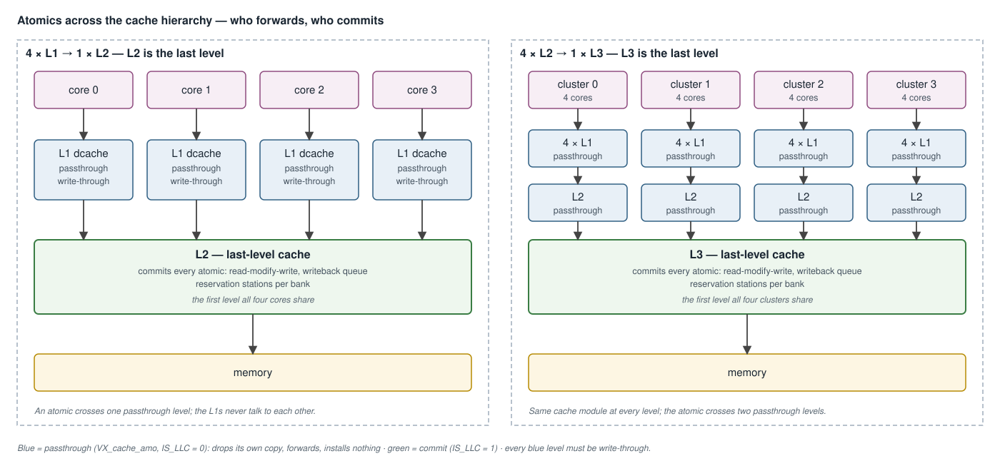
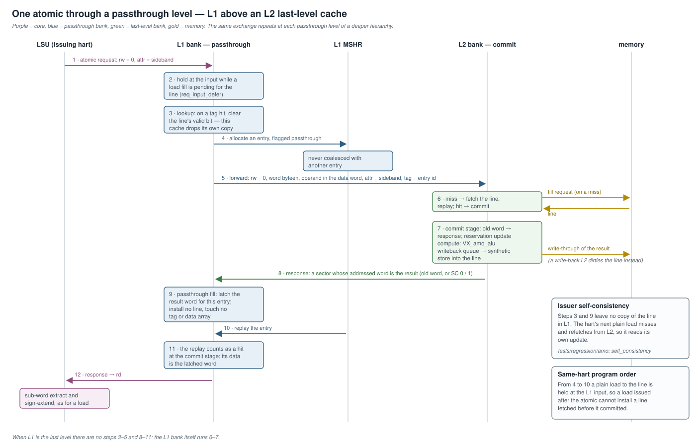
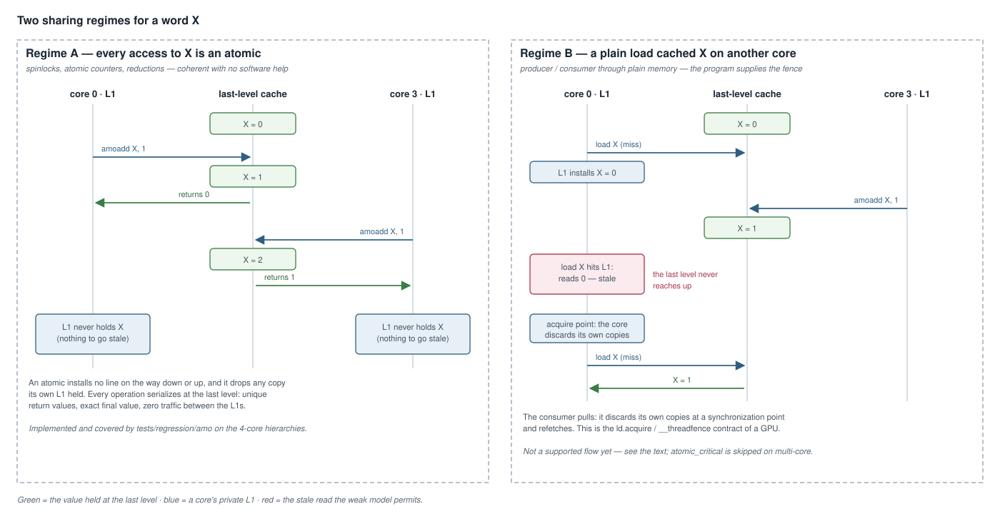

# Multi-Cache AMO Coherence — Design

**Scope:** how RISC-V "A"-extension atomics behave across a multi-level cache
hierarchy — the coherence model, the passthrough role of every cache above
the last level, issuer self-consistency, same-line ordering, forward progress
for `LR`/`SC` across a long round trip, and what the model deliberately leaves
to software. Covers the RTL
([`VX_cache_amo.sv`](../../hw/rtl/cache/VX_cache_amo.sv),
[`VX_cache_bank.sv`](../../hw/rtl/cache/VX_cache_bank.sv),
[`VX_cache_tags.sv`](../../hw/rtl/cache/VX_cache_tags.sv),
[`VX_cache_mshr.sv`](../../hw/rtl/cache/VX_cache_mshr.sv),
[`VX_amo_unit.sv`](../../hw/rtl/cache/VX_amo_unit.sv)) and the SimX model
([`sim/simx/mem/cache.cpp`](../../sim/simx/mem/cache.cpp),
[`sim/simx/amo/`](../../sim/simx/amo/)).

Decode, the LSU sideband, the read-modify-write kernel, the reservation
stations, and the commit datapath at the last-level bank are in
[`atomic_memory_operations.md`](atomic_memory_operations.md) and assumed
here. The cache bank itself is in
[`cache_subsystem.md`](cache_subsystem.md). This document is the
multi-level deep-dive.



---

## 1. Overview

Exactly one cache level — the **last-level cache (LLC)** — commits atomics
and holds the reservation stations. Every level above it is a
**passthrough**: it forwards the atomic down, returns the result up, and
keeps no copy of the line.

```
DCACHE_IS_LLC = ¬L2 ∧ ¬L3
L2_IS_LLC     =  L2 ∧ ¬L3
L3_IS_LLC     =  L3
```

The coherence model is **GPU-weak, pull-based**: atomics are coherent with
each other with no software help; inner caches are write-through and are not
kept coherent by hardware; cross-core visibility of *plain* data is the
consumer's responsibility at a synchronization point.

| property | how it holds |
|---|---|
| atomic vs. atomic, any cores | every atomic serializes at the LLC |
| a hart reads its own atomic through a plain load | the issuing cache drops its copy as the atomic passes (§5.2) |
| same-hart program order, atomic vs. load | the younger access waits at the bank input (§5.3) |
| `LR`/`SC` forward progress across the round trip | the reservation holder is protected (§5.4) |
| another core's plain load sees a remote atomic | **not by hardware** — Regime B (§6) |

---

## 2. The problem

Committing every atomic at the LLC bank is sufficient when there is a single
L1, because that L1 *is* the LLC. Once an L2 or an L3 is enabled, three more
things must hold:

1. **Correctness across levels.** An atomic arriving at a bank that is not
   the LLC must reach the LLC and have its result routed back, without
   leaving a stale or duplicate copy of the line behind.
2. **Issuer self-consistency.** A hart that issues an atomic and then plain
   loads the same address must observe its own update, although its L1 is
   write-through and not coherent.
3. **`LR`/`SC` forward progress.** `LR` and `SC` become two separate round
   trips to the LLC. The window between them grows from a few cycles to a
   full miss round trip, and every contending hart's `LR` can land inside
   it.

A fourth concern — a plain load on **another** core holding a copy of a line
that was then atomically updated — is the weak model's deferred case.

---

## 3. Reference architecture: how GPUs do this

The cross-vendor pattern is consistent, and it is pull-based rather than
directory-based:

- **Atomics resolve at the shared L2 or memory partition**, in dedicated
  read-modify-write units, with the line held for the duration. NVIDIA
  performs the operation at each memory partition's atomic operation unit;
  PowerVR reserves the L2 line so that it cannot be read or written until the
  atomic has completed; Mali resolves atomics near the L2 coherency point.
- **Per-core L1 caches are write-through and not hardware-coherent.** Stores
  travel to the level at which a coherence policy is enforced.
- **Cross-core visibility is restored at synchronization points**, by flush
  or invalidate on the consumer side, not by snooping.

Sources:
[GPU atomics at the memory partition (HPCA'13)](https://www2.cs.sfu.ca/~ashriram/papers/2013_HPCA_GPUCoherence.pdf),
[non-coherent write-through L1 (US 9047197)](https://image-ppubs.uspto.gov/dirsearch-public/print/downloadPdf/9047197),
[barrier-initiated flush and invalidate (US 9563561)](https://image-ppubs.uspto.gov/dirsearch-public/print/downloadPdf/9563561),
[PowerVR L2-locked atomics (US 8108610)](https://image-ppubs.uspto.gov/dirsearch-public/print/downloadPdf/8108610),
[Mali Bifrost (Hot Chips 28)](https://old.hotchips.org/wp-content/uploads/hc_archives/hc28/HC28.22-Monday-Epub/HC28.22.10-GPU-HPC-Epub/HC28.22.110-Bifrost-JemDavies-ARM-v04-9.pdf).

---

## 4. Design decisions

| question | decision | rationale |
|---|---|---|
| Coherence scope | atomic-triggered, weak | plain store-to-load visibility across cores stays the program's responsibility, as on every real GPU; the smallest change |
| How is a remote stale copy cleaned? | **pull** | the consumer invalidates its own inner cache; the LLC never pushes invalidations upward |
| Topology | the same cache module at every level | the mechanism lives inside the one reusable cache, so a deeper hierarchy costs nothing new (§5.5) |
| Reservation storage | a bounded, line-indexed station set per LLC bank | independent of the hart count; forward progress comes from protecting the holder, not from one slot per hart |
| Passthrough bookkeeping | reuse the miss → fill → replay path | no second side-table and no second response route through the bank |

**Rejected: push with a directory or snoop filter.** Back-invalidating remote
inner caches from the LLC would make plain data coherent with no software
fence, but it needs an upstream probe channel, a per-line sharer directory,
an acknowledge and ordering protocol, and recursive re-probing through each
level — a coherence subsystem that scales with the core count and that real
GPUs avoid.

**Rejected: one reservation slot per hart.** It guarantees forward progress
trivially, but it is `NUM_HARTS` line addresses and a `NUM_HARTS`-way compare
in every LLC bank. SimX still models reservations this way
([`atomic_memory_operations.md`](atomic_memory_operations.md) §8).

---

## 5. Mechanisms



### 5.1 Passthrough

`VX_cache_amo` with `IS_LLC = 0`. The bank's existing miss path is reused
rather than building a separate table:

| step | what happens | where |
|---|---|---|
| allocate | the atomic takes an ordinary MSHR entry, flagged as a passthrough | `ptw_flag[]`, the MSHR's `amo_table` |
| forward | a memory request leaves with `rw = 0`, the word's byte-enable, the operand in the data word, and the attribute carrying the sideband | the bank's memory-request queue |
| fill | the response is recognized as a passthrough fill: the addressed word is latched, **no line is installed** | `is_passthru_fill_sel`, `ptw_word[]` |
| replay | the entry replays and counts as a hit at the commit stage; its response data is the latched word | `is_amo_replay_st1` |

A passthrough entry is **never coalesced**. The MSHR masks flagged entries
out of its address match and the requester is forced non-pending, so each
atomic makes its own round trip. At the LLC the opposite holds: same-line
atomics that miss together coalesce on one fill and replay back to back.

A passthrough entry is also held until its downstream response returns, not
released on a hit the way a load's entry is.

### 5.2 Issuer self-consistency

As the atomic is forwarded, the issuing cache **invalidates its own copy**:
[`VX_cache_tags.sv`](../../hw/rtl/cache/VX_cache_tags.sv) takes an
`invalidate` input that clears the addressed sector's valid bit on a tag
match. The match excludes a line being filled in the same cycle. Only the
valid vector is written; the tag is left in place.

The hart's next plain load therefore misses and refetches from the LLC. With
§5.1 installing nothing on the way back, this gives the core invariant:

> **An atomic never leaves a copy of its line in any cache above the LLC.**

The only way an inner cache can hold a line that is being atomically updated
is a **plain load** on that core.

### 5.3 Same-line age ordering

A load followed by an atomic to the same line — or the reverse — can race the
invalidate against an in-flight fill. The younger access is held at the bank
input until the older one drains:

| incoming | waits while | so that |
|---|---|---|
| an atomic | a line-filling request is pending for its line | its invalidate lands on the installed line, not before it |
| a plain load | an atomic passthrough is pending for its line | the load cannot install a line fetched before the atomic committed |

The MSHR exposes the two conditions as probes of the waiting request's
address. They are consumed **registered**, which keeps the MSHR's address
compare off the request-ready path; two extra terms close the windows a
registered result cannot see — an allocation in the lookup stage this cycle,
and an entry that became persistent last cycle. The defer is therefore a
superset of the exact condition: it can hold a request one cycle longer than
necessary, and never shorter.

### 5.4 `LR`/`SC` forward progress

Above an LLC, the `LR`→`SC` window is a full round trip. Every hart
contending one word maps to the same reservation station, so if each `LR`
overwrote the station, the holder's reservation would be gone before its
`SC` arrived and no `SC` would ever succeed.

The station therefore **refuses an `LR` from a different hart for a line it
already holds**, for a bounded number of refusals. The holder's `SC` lands
first and one hart wins each round. The bound — 63 refusals at a cache LLC —
is sized for the miss round trip and frees a station whose holder abandoned
its attempt. Mechanism and sizing are in
[`atomic_memory_operations.md`](atomic_memory_operations.md) §5.3.

Any committed store to the line breaks the reservation, whichever hart made
it: an atomic's own store, the LLC's write hit, and a plain store arriving
write-through from a level above. This is why the levels above the LLC must
be write-through — a write-back level could absorb a store the LLC never
sees.

### 5.5 Deeper hierarchies

The mechanism is per-cache and the same module is instantiated at every
level. Under an L3, an atomic travels L1 → L2 → L3, invalidating its line in
the L1 **and** in the L2 on the way down, and the L3 commits. There is no
per-level special case and no inter-level message beyond the ordinary
request and response.

`AMO_ENABLE` on each cache is driven by `VX_CFG_EXT_A_ENABLED` alone, not
gated to the LLC, so the levels above it synthesize the passthrough. The
role is selected inside the bank by `IS_LLC`.

### 5.6 Commit serialization at the LLC

The LLC commits one atomic instruction at a time. `commit_busy` holds off new
core requests from the lookup-stage prediction through the compute stage and
the writeback, so an atomic to a different line cannot reach the commit stage
while the previous result is still in flight. It is zero at every
passthrough bank — serialization applies only where atomics commit.

---

## 6. The two regimes



### 6.1 Regime A — atomic-only sharing

Spinlocks, atomic counters, reductions: the common case. No inner cache ever
holds the line, every operation serializes at the LLC, and there is no
coherence traffic between the L1s at all. Fully implemented in both models.

### 6.2 Regime B — a plain load cached the line

If core 0 plain-loaded a word, caching its line, and core 3 then atomically
updates it, core 0's copy is stale. The LLC never reaches up. The weak model
resolves this the way a GPU does: the **consumer** discards its own copies at
an acquire point and refetches.

There is no dedicated acquire-invalidate. What exists today:

| model | what a `fence` does to the issuing core's data cache |
|---|---|
| RTL | the LSU sends the fence as a request with `is_flush` set, which starts the **whole-cache flush**; on a write-through cache the walk clears every valid bit |
| SimX | the fence is an ordering barrier in the LSU only; a flush of a write-through cache is a no-op and no line is invalidated |

So an RTL `fence` happens to give the consumer-side invalidate, at the cost
of a full flush walk that locks the cache's inputs for its duration, and
SimX does not model it. **The two models disagree, and no regression case
exercises fence-managed cross-core visibility** — `atomic_critical`, which
runs plain loads and stores inside a lock, is skipped on multi-core
configurations for exactly this reason.

Programs that share data across cores through plain memory are outside what
is validated. Share through atomics, or through the single shared level.

---

## 7. Atomics under a deep bank pipeline

A large cache cannot close timing with tag read, way compare and data access
in one cycle, so a bank's depth is a parameter
([`cache_subsystem.md`](cache_subsystem.md) §4.1). With the default sizes the
L1 runs at depth 2 and an L2 or L3 at depth 4, so **the LLC of a multi-level
hierarchy is a deep bank**. The depth beyond two stages is
`PIPE_EX = LATENCY − 2`, and it separates the lookup stage from the commit
stage by that many cycles.

| concern | at `PIPE_EX = 0` | at `PIPE_EX > 0` |
|---|---|---|
| where the engine's commit ports attach | the second stage | the commit stage, `PIPE_EX` stages later, aligned with the deferred data read |
| `commit_busy` between prediction and commit | the two are adjacent | a `PIPE_EX`-deep shift of the prediction bridges the gap |
| reservation look-ahead address | the lookup-stage request | the request one stage before commit |
| writeback-queue key compares | combinational at commit | registered a stage early when the word spans several lanes |
| passthrough release decision | evaluated at the commit port | evaluated on the second-stage request, where the MSHR decides |

The MSHR itself is **not** deferred: its chain needs allocate and finalize
exactly one cycle apart, so those stay in the first two stages at every
depth. Reservations and passthrough ordering are keyed on line addresses, not
cycle counts, so they are unaffected by depth.

At `PIPE_EX = 0` every one of these collapses to the two-stage bank.

---

## 8. SimX model

| mechanism | RTL | SimX |
|---|---|---|
| passthrough | MSHR entry + latched result word | a dedicated `AmoProbe` request type and an 8-entry passthrough table |
| response routing | MSHR replay | the memory tag space is partitioned: passthrough ids sit above the MSHR ids |
| self-invalidate | tag-store `invalidate` | the probe invalidates the addressed sector on a hit |
| a dirty copy at the probe | cannot occur — levels above the LLC are write-through | the probe writes it back first |
| age ordering | registered MSHR probes | the probe is deferred in `processInputs` while the line has a pending fill |
| reservations | bounded stations, holder protected | one reservation per hart |

The models agree on results and differ in `LR`/`SC` retry counts, so an
application that uses `LR`/`SC` cannot host a `model_parity` case
([`atomic_memory_operations.md`](atomic_memory_operations.md) §8).

---

## 9. Verification

The multi-core cases in
[`ci/testcases/amo.yaml`](../../ci/testcases/amo.yaml) run
`tests/regression/amo` over both hierarchies:

| case | hierarchy | drivers | tier |
|---|---|---|---|
| `mc-l2` | 4 cores, 4 × L1 → 1 × L2 | simx | full |
| `mc-l3` | 4 cores, L1 → L2 → L3, `L2_WRITEBACK = 0` | simx, rtlsim | full |

Two cases in the suite exist for this design:

- `lrsc_counter` — the forward-progress case for §5.4. It livelocks on a
  design that lets any `LR` overwrite the station.
- `self_consistency` — each hart caches a private word, atomically
  increments it, and must read the increment back through a plain load. It
  fails on a design without the self-invalidate (§5.2) or without commit
  serialization (§5.6).

`atomic_critical` is skipped when `cores > 1` (§6.2).

---

## 10. Not implemented

- **A dedicated acquire-invalidate** (§6.2) — a consumer-side invalidate that
  clears the inner cache's valid bits without the full flush walk, modeled
  identically in RTL and SimX, with a regression case for fence-managed
  visibility.
- **rtlsim coverage of the L2-as-LLC hierarchy.** `mc-l2` runs on SimX only.
- **Push coherence** with a directory or snoop filter (§4) — revisit only if
  a strong cross-core guarantee is ever required.
- **Per-line acquire invalidate**, finer than a whole-cache invalidate, if
  profiling shows bulk invalidation costs hit rate.
