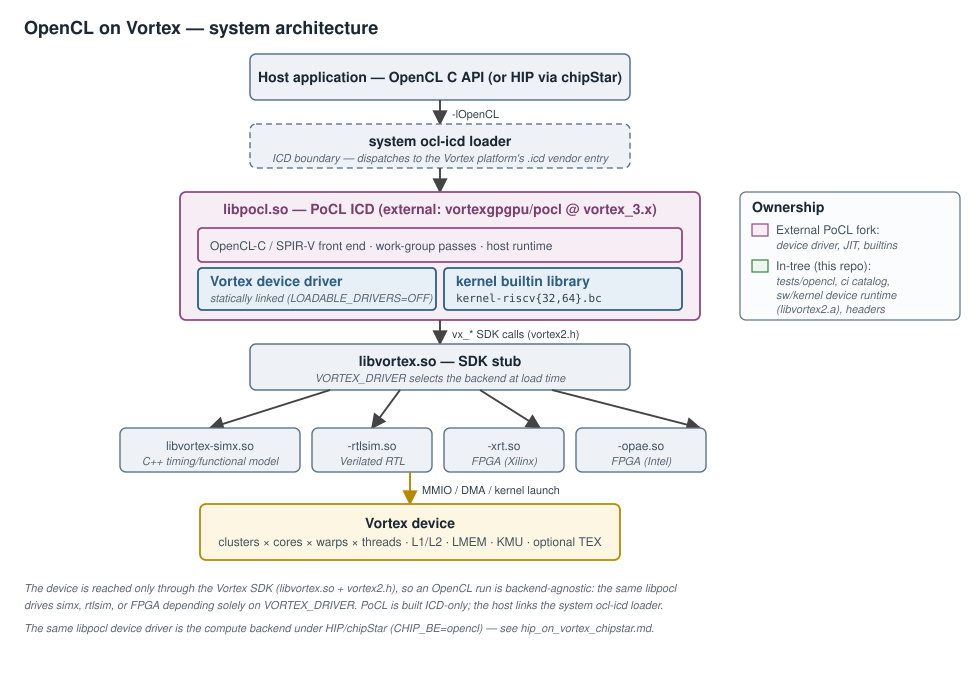
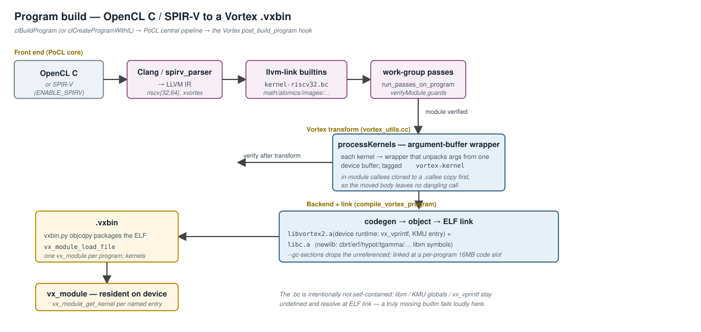
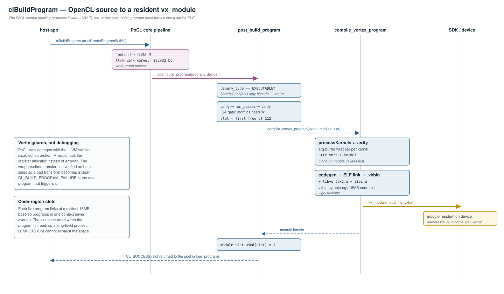
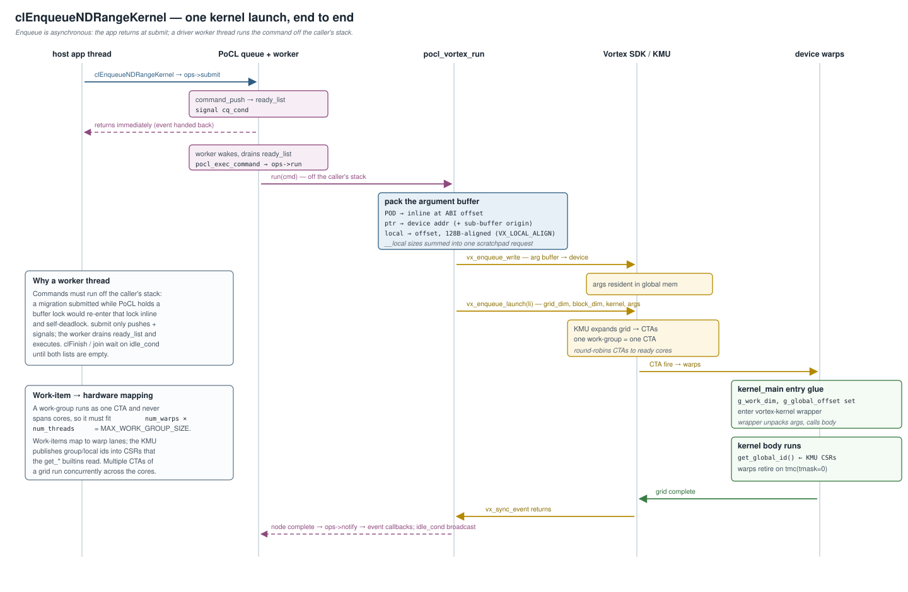
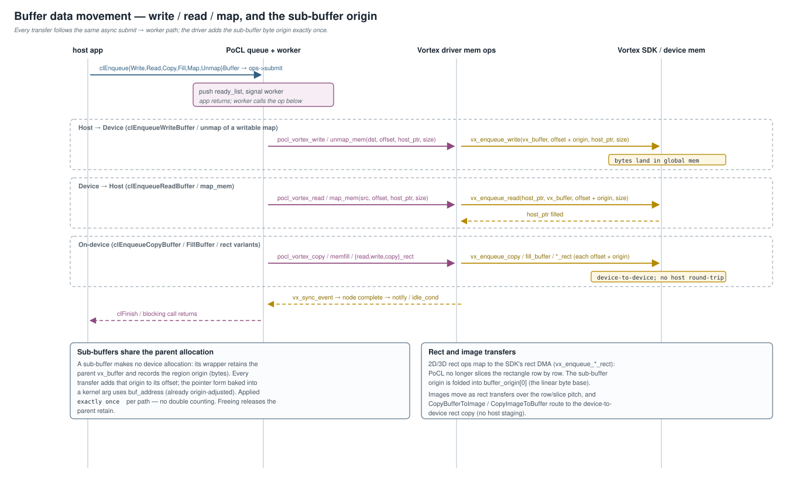

# OpenCL on Vortex

**Scope:** how an OpenCL program compiles and runs on Vortex, end to end.
The working path is **OpenCL C / SPIR-V → PoCL → Vortex**, on both 32-bit
(rv32) and 64-bit (rv64) devices, across every Vortex backend (SimX, RTL
simulation, and FPGA). This document covers the system architecture, the
JIT compile pipeline, the kernel-launch and memory execution model, the
device-side builtin library, and the capability/conformance model — with a
sequence diagram for each of the three key operations (build, launch,
data movement).

PoCL is the **single compute front end shared by three stacks**: the
native OpenCL applications here, [HIP via chipStar](hip_on_vortex_chipstar.md)
(`CHIP_BE=opencl`), and any host that speaks the OpenCL ICD. Everything
this document describes about the device driver and the JIT flow is
therefore also the substrate under the HIP path.

> **Relationship to the graphics stack.** The Vulkan/compute front end
> [vortexpipe](vortexpipe_architecture.md) does **not** go through PoCL —
> it is a Mesa/Gallium driver that emits `.vxbin` directly. PoCL is the
> *OpenCL/HIP compute* front end only. Both ultimately drive the same
> Vortex SDK (`libvortex.so`, header `vortex2.h`) and the same device
> runtime, and both target the same [kernel entry and dispatch
> ABI](kernel_entry_and_dispatch.md).

---

## 1. System architecture

An OpenCL host program links the **system ocl-icd loader** (`-lOpenCL`),
not PoCL directly. PoCL is built **ICD-only** (`ENABLE_LOADABLE_DRIVERS=OFF`):
it ships a vendor `.icd` file that points the loader at the PoCL platform,
and the Vortex device driver is **statically linked into `libpocl.so`**.
The loader dispatches every `cl*` call into PoCL; the Vortex device driver
inside PoCL is the only code that issues `vx_*` SDK calls.

Below the SDK the stack is **backend-agnostic**. `libvortex.so` is a thin
stub whose `VORTEX_DRIVER` environment variable selects the concrete
backend at load time — `libvortex-simx.so` (the C++ timing/functional
model), `-rtlsim.so` (Verilated RTL), `-xrt.so` / `-opae.so` (FPGA). The
same `libpocl.so`, the same JITed `.vxbin`, and the same device runtime
run on all of them; only `libvortex.so` and below know which device is
present. Conformance work runs on `simx`; RTL and FPGA reuse the identical
software path.

### 1.1 Ownership — in-tree vs. external

Like the HIP stack, the load-bearing software is **external** and the
Vortex repo owns only the device-side contract plus the test/CI glue.

| Component | Where |
|---|---|
| PoCL ICD, the Vortex device driver (`lib/CL/devices/vortex/`), the OpenCL-C/SPIR-V→LLVM pipeline, the kernel builtin library (`lib/kernel/vortex/`) | **External:** `vortexgpgpu/pocl` @ `vortex_3.x`, built against `$TOOLDIR/llvm-vortex`, installed to `$TOOLDIR/pocl` |
| [`tests/opencl/`](../../tests/opencl/) — 48 applications + [`common.mk`](../../tests/opencl/common.mk) | In-tree |
| [`ci/testcases/opencl.yaml`](../../ci/testcases/opencl.yaml) — the `opencl` catalog category (`pytest ci -m opencl`) | In-tree |
| [`sw/kernel/`](../../sw/kernel/) → `libvortex2.a` — the **device runtime** every kernel ELF links against (`vx_vprintf`, KMU entry/startup), and [`sw/kernel/include/`](../../sw/kernel/include/) the builtin library compiles against | In-tree |
| [`ci/toolchain_install.sh.in`](../../ci/toolchain_install.sh.in) / [`ci/toolchain_prebuilt.sh.in`](../../ci/toolchain_prebuilt.sh.in) — `pocl()` fetches / packages the prebuilt `$TOOLDIR/pocl` tarball | In-tree |

The only in-tree coupling to PoCL is [`tests/opencl/common.mk`](../../tests/opencl/common.mk),
which threads the device config into the JIT: `POCL_VORTEX_XLEN`,
`POCL_VORTEX_CFLAGS`, `POCL_VORTEX_LDFLAGS`, and `POCL_VORTEX_BINTOOL`, and
pins `OCL_ICD_VENDORS` to the Vortex `.icd` so a coexisting vendor loader
(e.g. CUDA's `libOpenCL`) is not picked up.

### 1.2 The device driver — host-side structure

The driver is `lib/CL/devices/vortex/` in the PoCL fork. Two files carry it:

- **`pocl-vortex.c`** — the `pocl_device_ops` table, device init and
  capability reporting, program build/free, kernel launch (`pocl_vortex_run`),
  buffer/sub-buffer/image memory, and the async command worker.
- **`vortex_utils.cc`** — the LLVM-level kernel transform (`processKernels`)
  and the JIT to a `.vxbin` (`compile_vortex_program`).

Each Vortex device is opened once with `vx_device_open`, and its ISA is
queried once (`VX_CAPS_ISA_FLAGS`) and **validated against what the driver
actually compiles and emits**. Every later decision — software vs.
fixed-function image sampling, whether an atomic-using program may build —
consults that captured `isa_flags` rather than assuming a unit is present.

### 1.3 The async command model

`clEnqueue*` is asynchronous. `ops->submit` only **pushes** the command
onto the device's `ready_list` (or `command_list` if it still has
unmet event dependencies) and signals a condition variable; the enqueue
call returns immediately with an event. A dedicated **worker thread**
(`pocl_vortex_driver_thread`) drains `ready_list` and runs each command via
`pocl_exec_command` **off the caller's stack**. `ops->notify` promotes a
dependent command from `command_list` to `ready_list` when its prerequisite
completes; `flush`/`join` (i.e. `clFlush`/`clFinish`) signal the worker and
wait on an idle condition until both lists drain.

The worker thread is not an optimization — it is a **correctness
requirement**. PoCL submits migration commands while holding a buffer lock;
running them inline would re-enter that lock (via
`pocl_free_event_memobjs`) and self-deadlock. Executing off the caller's
stack breaks the cycle.

---

## 2. Program build — OpenCL to `.vxbin`

A `clBuildProgram` (or `clCreateProgramWithIL` for SPIR-V) runs the PoCL
central pipeline, then the Vortex `post_build_program` hook.

1. **Front end (PoCL core).** OpenCL C → Clang → LLVM IR, or SPIR-V →
   `spirv_parser` → LLVM IR. SPIR-V is opt-in (`ENABLE_SPIRV`) and is the
   path the chipStar/HIP front end feeds in. The Vortex target is
   `riscv{32,64}` with the `+xvortex` feature (scalar SIMT, no RVV) and
   `+zicond`.
2. **Builtin link.** The module is linked (`llvm-link`) against the
   per-XLEN kernel bitcode library `kernel-riscv{32,64}.bc` (§4).
3. **Work-group passes.** PoCL's work-group transforms run.
4. **`processKernels` (Vortex, `vortex_utils.cc`).** Each kernel entry is
   rebuilt into an **argument-buffer wrapper**: a new function that unpacks
   arguments from one device buffer and calls the body. The wrapper is
   tagged with the `vortex-kernel` function attribute — the backend keys
   both the **kernel calling convention** (no callee-saved spills; the KMU
   trampoline never reads them back) and the **divergence pass's
   device-module detection** off it. A kernel that is *also* called as a
   plain function by another kernel (legal in OpenCL C) is first cloned to
   an internal `.callee` copy and the in-module call sites redirected, so
   moving the body into the wrapper does not leave a dangling call. The
   module is `verifyModule`-checked around this transform.
5. **Codegen + ELF link (`compile_vortex_program`).** The module is
   compiled to an object and linked into a device ELF with `libvortex2.a`
   (device runtime — provides `vx_vprintf`, the KMU entry) and newlib
   `libc.a` (provides the libm entry points Clang lowers to calls — `cbrt`,
   `erf`, `hypot`, `tgamma`, … — which are *not* self-contained in the
   builtin library). `--gc-sections` drops everything unreferenced. The
   image is linked at a per-program 16MB code base (see slots, below).
6. **`vxbin.py` objcopy** packages the ELF into a `.vxbin`, loaded as a
   `vx_module` (`vx_module_load_file`). Each kernel is a named entry point
   resolved lazily by `vx_module_get_kernel`.

### 2.1 Build sequence

Two invariants worth calling out from the sequence:

- **Only fully-linked executables become device ELFs.** A
  `clCreateProgramWithBinary` library or a `clCompileProgram` object is
  bitcode-only by design — its builtins are still unresolved and it is
  never launched — so `post_build_program` returns early for any
  `binary_type != CL_PROGRAM_BINARY_TYPE_EXECUTABLE`.
- **`verifyModule` is production hardening, not debug scaffolding.** PoCL
  runs codegen with the LLVM verifier disabled, so malformed IR (e.g. from
  a bad divergence-structurizer result) would fault the register allocator
  instead of erroring. Verifying around the wrapper transform turns that
  into a clean `CL_BUILD_PROGRAM_FAILURE` at the one program that triggers
  it.

### 2.2 Code-region slots

Each live program's `.vxbin` is linked at a distinct 16MB code base so
that multiple programs in one context never overlap. The driver hands out
slots from a fixed pool (`VORTEX_NUM_MODULE_SLOTS`, 112 regions between
`STARTUP_ADDR` and the reserved `0xF0000000`) and **returns a slot when its
program is freed**. A long-lived process — a full conformance run building
thousands of programs — would otherwise exhaust the code address space.

---

## 3. Kernel launch and execution

At `clEnqueueNDRangeKernel` the command is submitted and later run by the
worker thread (§1.3). `pocl_vortex_run` packs one **argument buffer** and
launches through the KMU:

- **Pointer args** are written as device addresses. For a sub-buffer the
  base is the parent's device address plus the sub-buffer origin, so the
  kernel sees a correctly-offset pointer with no separate relocation.
- **`__local` args and automatic locals** are assigned offsets into the
  device scratchpad, each aligned to `VX_LOCAL_ALIGN` (128 B — the widest
  OpenCL type, `long16`/`double16`, and also the local-memory bank stride,
  so the padding is free in bank-conflict terms). Their sizes are summed
  into a single scratchpad request passed to the launch.
- **POD args** are copied inline at their ABI offset.

The launch descriptor (`grid_dim`, `block_dim`, kernel handle, argument
buffer) goes to `vx_enqueue_launch`; when the kernel also binds a
fixed-function TEX stage, the DCR writes and the launch are folded into one
`vx_enqueue_commands` CP batch (one doorbell, retired in order). The KMU
expands the grid into CTAs and round-robins them onto ready cores.

On the device, the `kernel_main.c` entry glue publishes `g_work_dim` and
`g_global_offset` for the builtin `get_*` queries, then enters the
per-kernel wrapper, which unpacks the argument buffer and calls the body.
Work-items map onto Vortex **warps × threads**; a work-group runs as one
CTA and never spans cores, so `CL_DEVICE_MAX_WORK_GROUP_SIZE` is
`num_warps × num_threads`. `get_global_id` and friends read the KMU CSRs
the dispatcher stamped. `pocl_vortex_run` blocks on `vx_sync_event`; when
the grid retires, the worker marks the node complete, `notify` fires the
event callbacks, and any `clFinish` waiter is released.

The kernel entry, CTA expansion, and CSR-based id delivery are specified in
[Kernel Entry and Dispatch](kernel_entry_and_dispatch.md) and
[CTA Dispatch Architecture](cta_dispatch_architecture.md); this driver is
one producer of that launch ABI.

---

## 4. Memory and images

- **Buffers.** `alloc_mem_obj` wraps a `vx_buffer`. Read/write/copy/fill
  and their rect variants map to the `vx_enqueue_*` async ops; each adds
  the sub-buffer origin (a byte offset into the shared parent `vx_buffer`)
  to its offset. Blocking transfers are the same op followed by
  `vx_sync_event`.
- **Sub-buffers** allocate no device memory of their own: the wrapper
  retains the parent `vx_buffer` and records the region origin, applied
  **exactly once** per path (the pointer form baked into a kernel arg uses
  the already-origin-adjusted `buf_address`; the DMA ops add the origin to
  their offset). Freeing releases the parent retain.
- **Rect transfers** map to the SDK's rect DMA (`vx_enqueue_*_rect`) — PoCL
  no longer slices the rectangle row by row — with the sub-buffer origin
  folded into `buffer_origin[0]`.
- **Images** are served in software: `read_image`/`write_image` and the
  `get_image_*` queries are compiled into the kernel library (§4), and the
  six image transfer ops (`{read,write,copy}_image_rect`, `map`/`unmap`,
  `fill`) are wired in the ops table. Each image object carries a small
  device buffer holding its lifetime-constant `dev_image_t` descriptor,
  uploaded once at allocation, so binding an image adds no per-launch
  host↔device traffic. `CopyBufferToImage`/`CopyImageToBuffer` route to the
  device-to-device rect copy. When the device exposes a fixed-function TEX
  unit (`VX_ISA_EXT_TEX`), FF-eligible 2D reads can instead go through the
  [hardware sampler](texture_sampler_architecture.md); otherwise every
  sample is software.

---

## 5. The kernel builtin library

The device-side OpenCL C library is `lib/kernel/` in the PoCL fork,
compiled per-XLEN to `kernel-riscv{32,64}.bc` and linked into every program
(§2 step 2). Most of it is PoCL's generic, target-independent builtin set
(all of math, integer, relational, geometric, common, conversion,
async-copy, and synchronization). `lib/kernel/vortex/` carries only the
overrides Vortex genuinely needs:

| Override | Why |
|---|---|
| `read_image.cl` / `write_image.cl` | Scalar software sampling over the `dev_image_t` descriptor across every shape (1D / 1D-array / 1D-buffer / 2D / 2D-array / 3D, nearest + linear, all addressing modes) and samplerless reads. The generic PoCL versions rely on OpenCL vector arithmetic the no-vector Vortex backend (`+xvortex`) cannot select. |
| `workitems.c` | `get_global_id` etc. read the KMU CSRs, which decode only dims 0–2; the spec-mandated result for an out-of-range `dimindx` (sizes/counts → 1, ids/offsets → 0) is enforced here. |
| `atomics.c` | The 32-bit AMO builtins lower to hardware `amo*.w`. |
| `barrier.c` | Work-group barrier on the Vortex `vx_barrier`. |
| `printf.c` | Buffered printf; the host drains it (`device_side_printf = 0`). |
| `wait_group_events.cl` | A **real** work-group barrier. PoCL's generic stub is empty — sound only under the work-item-loop model where a group runs sequentially on one thread. A Vortex work-group spans independent hardware warps, so the stub would let non-copying warps race ahead of an async copy. |
| `vxlibm.c` | libm entry points Clang lowers to calls that newlib does not provide accurately enough (e.g. `nextafterf`) implemented directly via IEEE-754 integer encoding. |

The `.bc` is intentionally **not** self-contained: it leaves the C99 libm
symbols (`cbrt`, `erf`, `hypot`, `tgamma`, `remainder`, …), the KMU globals
(`g_work_dim`, `g_global_offset`), and `vx_vprintf` undefined, to be
resolved at the final kernel ELF link from newlib `libc.a` and
`libvortex2.a` respectively (§2 step 5). Any genuinely missing builtin
therefore fails **loudly at link**, in the one program that needs it,
rather than mis-executing silently.

---

## 6. Capability and conformance model

The device advertises exactly what both the hardware and the kernel library
can honor — nothing aspirational. Capability strings are built from the
device `isa_flags` at init (not from the build-time extension list, which
cannot know what the device implements) and kept for the process lifetime,
since the `cl_device_id` and its info queries outlive any single context.

| Capability | Status |
|---|---|
| Profile / version | Full-profile OpenCL 1.2. |
| `int64` | **Core** (full-profile CL 1.2); soft-lowered on rv32. Reported via `has_64bit_long` / `__opencl_c_int64`, never as the non-standard `cl_khr_int64` token (the CTS rejects unapproved `cl_khr_*` tokens). |
| Atomics | int32 base/extended, gated on the RISC-V `A` extension. A device without `A` drops every `*atomics*` extension token *and* rejects an atomic-using program at build time. |
| Images | Supported, in software (optionally FF-accelerated for 2D reads). |
| printf | Host-buffered. |
| `fp64` (`cl_khr_fp64`) | **Not advertised** — the kernel library has no double-precision builtins, so claiming it would be a promise the toolchain cannot keep. Optional in CL 1.2; the CTS `double` paths auto-skip. |
| `fp16` (`cl_khr_fp16`) | Not advertised (no half builtins). Optional; CTS `half` auto-skips. |
| `max_mem_alloc_size` | `max(global/4, 128MB)`, clamped to global — the CL 1.2 floor. Reporting the full global size is conformance-hostile because code/stack regions are reserved. |
| `max_constant_buffer_size` | 64KB (CL 1.2 floor); constants live in global memory. |

**Conformance harness.** The OpenCL-CTS runs per-category, strictly serial,
against a SimX device (a dedicated `build_ocl_cts` tree; the functional
SimX kernel with MT workers speeds architectural runs — cycles are
non-physical but bit-exact across thread counts). Fixes follow the
true-GPU rule: a missing *device* capability is added to Vortex (the
kernel library or the driver), never emulated in PoCL software. A category
is marked passing only when its full binary passes; on failure the run
stops, root-causes, and fixes.

### 6.1 Known limitations

- **3D image sampling (`read_imagef(image3d_t, …)` trilinear path).** The
  switch-heavy CFG of the software 3D sampler currently trips the Vortex
  SIMT branch-divergence structurizer, which emits `vx.split`/`vx.join`
  pairs that violate SSA dominance; with PoCL's verifier disabled this
  reaches codegen and faults. This is a **compiler** limitation, not a
  driver gap; its blast radius is 3D-image sampling only.
- **fp64 / fp16 conformance** is out of scope until double/half builtins
  exist — both are optional in CL 1.2 and correctly unadvertised.
- **Transcendental accuracy.** The libm entry points resolve from newlib;
  where a `math_brute_force` ULP bound is tighter than newlib's
  implementation, the fix is a higher-accuracy device implementation, not a
  capability change.

---

## 7. Cross-references

- [HIP on Vortex (chipStar)](hip_on_vortex_chipstar.md) — the HIP host API
  layered on this same PoCL device driver (`CHIP_BE=opencl`).
- [vortexpipe architecture](vortexpipe_architecture.md) — the Vulkan/compute
  front end that bypasses PoCL and emits `.vxbin` directly.
- [Kernel Entry and Dispatch](kernel_entry_and_dispatch.md) — the KMU launch
  and argument-buffer ABI the driver targets.
- [CTA Dispatch Architecture](cta_dispatch_architecture.md) — how a grid's
  CTAs are expanded and placed onto cores.
- [Vortex Runtime API](vortex_runtime_api.md) — the `vortex2.h` SDK surface
  (`vx_*`) the driver is written against.
- [Atomic Memory Operations](atomic_memory_operations.md) — the `A`-extension
  hardware behind the OpenCL atomic builtins.
- [Texture Sampler](texture_sampler_architecture.md) — the fixed-function
  TEX unit the image path optionally routes 2D reads through.
