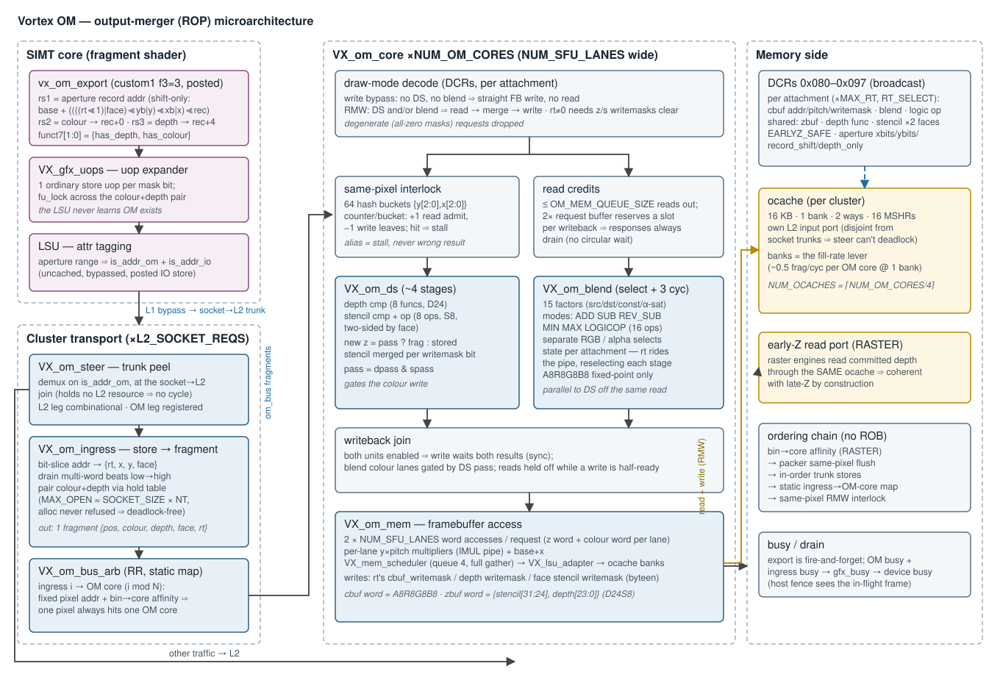
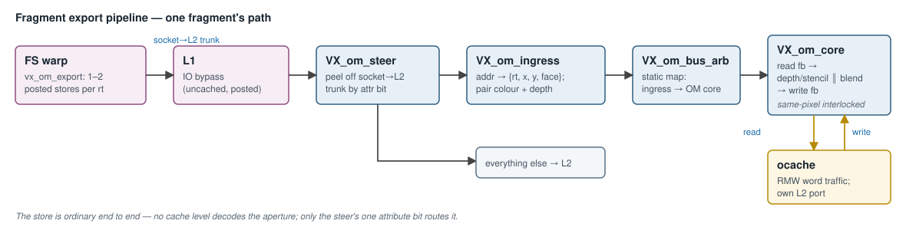
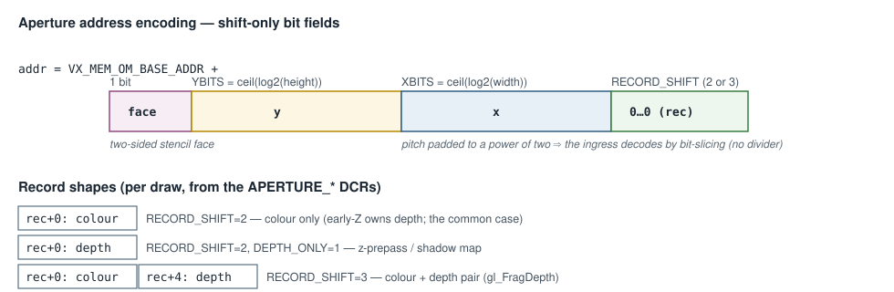

# Output Merger (OM) Microarchitecture — Design

**Scope:** the complete output-merger / ROP subsystem — the fragment-export
ISA and aperture ABI, the transport path from the shader's store to the OM
core (LSU attr tagging → trunk steer → ingress), the depth/stencil/blend
pipeline, the framebuffer memory interface through the ocache, the ordering
and deadlock arguments, and the parallelism/scaling model. Covers the RTL
([`hw/rtl/om/`](../../hw/rtl/om/)), the SIMT-side plumbing
([`VX_decode.sv`](../../hw/rtl/core/VX_decode.sv),
[`VX_gfx_uops.sv`](../../hw/rtl/core/VX_gfx_uops.sv),
[`VX_lsu_slice.sv`](../../hw/rtl/core/VX_lsu_slice.sv)), the cluster
integration ([`VX_graphics.sv`](../../hw/rtl/VX_graphics.sv)), the SimX model
([`sim/simx/om/`](../../sim/simx/om/)), and the software contract
([`sw/kernel/include/vx_graphics.h`](../../sw/kernel/include/vx_graphics.h),
[`sw/runtime/include/graphics.h`](../../sw/runtime/include/graphics.h)).

The wider graphics stack (TEX, RASTER, the interface law, early-Z
correctness) is in [`graphics_hardware_stack.md`](graphics_hardware_stack.md);
the rasterizer deep-dive is
[`rasterizer_architecture.md`](rasterizer_architecture.md).

---

## 1. Overview

The OM is a **cluster-shared fixed-function ROP**: it receives fragment
exports from the fragment shader, performs depth/stencil test-and-update and
colour blending against the framebuffer, and commits the results through a
dedicated cluster cache (the **ocache**). Its defining design decision is the
**export-as-store** model:

> The shader exports a fragment by **storing to a virtual aperture** — an
> ordinary posted memory write. There is no dedicated OM operand bus, no
> register-window staging, and no OM-specific LSU behaviour: the cluster's
> `VX_om_steer` peels the write off the socket→L2 trunk by one attribute bit,
> and `VX_om_ingress` decodes the address back into `{x, y, face}` and the
> data back into `{colour, depth}`.

The OM is **fire-and-forget** from the shader's point of view (the export
store is posted, `rd = x0`); the only completion signal is the OM's `busy`
output, which holds the device busy until every in-flight fragment has
committed.

Pipeline shape, per fragment:

---

## 2. ISA surface

### 2.1 `vx_om_export` — the fragment export

One instruction, `custom1` (0x2B) funct3=3, R4-type, `rd = x0` (posted).
Decoded in [`VX_decode.sv`](../../hw/rtl/core/VX_decode.sv) as an **LSU op**
(`EX_LSU` / `INST_LSU_SW`), never an SFU op:

| field | meaning |
|---|---|
| `rs1` | aperture record address (the shader computes it — §3.2) |
| `rs2` | colour word (A8R8G8B8) → `record + 0` |
| `rs3` | depth word (D24 in [23:0]) → `record + 4` |
| `funct7[1:0]` | `export_mask` = `{has_depth, has_colour}` |

The three record shapes, selected per draw:

- **colour only** (`01`) — the common case: early-Z owns both the depth test
  and the depth write.
- **depth only** (`10`) — z-prepass / shadow map; no colour target exists.
- **colour + depth** (`11`) — `gl_FragDepth`-class shaders.

Kernel wrappers: `vx_om_export_color/_depth/_both`
([`vx_graphics.h`](../../sw/kernel/include/vx_graphics.h)).

### 2.2 Uop expansion and the pairing lock

[`VX_gfx_uops.sv`](../../hw/rtl/core/VX_gfx_uops.sv) expands the export into
**one ordinary store uop per set `export_mask` bit**: the colour uop stores
`rs2` at `[rs1]`; the depth uop renames its source (`rs2 := rs3`) and stores
at `[rs1 + 4]`. The expander clears `export_mask` on the emitted uops, so
**the LSU never learns that OM exists** — it executes plain word stores.

A two-uop burst carries `fu_lock` on its first uop and `fu_unlock` on its
last: the scoreboard latches the LSU to the granted warp so no other warp can
interleave between the colour and depth beats. This lock is what bounds the
ingress pairing table (§4.3) to **one open record per lane** — the deadlock
argument depends on it.

### 2.3 Reserved CSRs

`VX_CSR_OM_RT_IDX` (0x7CE) and `VX_CSR_OM_SAMPLE_IDX` (0x7CF) are declared
for future MRT / MSAA support. They currently have no hardware behaviour
([`VX_om_csr.sv`](../../hw/rtl/om/VX_om_csr.sv) is an uninstantiated stub,
and the `INST_SFU_OM` / `PE_IDX_OM` SFU slot is tied off) — the OM today is
single-RT, single-sample.

---

## 3. ABI — the aperture and the framebuffer

### 3.1 The virtual aperture

A reserved address range, `VX_MEM_OM_BASE_ADDR` = `0xE0000000` up to
`VX_MEM_OM_END_ADDR` ([`VX_types.toml`](../../VX_types.toml)). It is
**virtual — nothing is stored there**; a store into it is consumed by the
steer, and a *load* from it is illegal (nothing can answer — the steer traps
it with a runtime assert).

### 3.2 Aperture address encoding — shift-only

`addr = VX_MEM_OM_BASE_ADDR + (((face << (XBITS+YBITS)) | (y << XBITS) | x) << RECORD_SHIFT)`,
with `XBITS = ⌈log2(width)⌉`, `YBITS = ⌈log2(height)⌉`, and
`RECORD_SHIFT` = 2 (one-word record) or 3 (colour+depth pair). The virtual
pitch is padded to a power of two **deliberately**: the ingress recovers
`(face, y, x)` by pure bit-slicing — a packed `y·width + x` encoding would
force a divider into the ingress. The padding wastes only virtual address
space, which is free. `face` (front/back facing, for two-sided stencil) rides
the address's top field.

The shader computes this with the `VX_OM_APERTURE_ADDR(...)` macro; the
runtime derives and programs the same three parameters via
`om_state_t::set_aperture()` ([`graphics.h`](../../sw/runtime/include/graphics.h))
and passes them to the kernel, so both sides agree by construction.

### 3.3 Framebuffer layout

Real (non-virtual) buffers, addressed by the OM core with the actual
byte pitches — the aperture's power-of-two padding does **not** apply here:

| buffer | word format | address of pixel (x, y) |
|---|---|---|
| colour (`cbuf`) | `A8R8G8B8` (`om_color_t`) | `cbuf_addr + y·cbuf_pitch + x·4` |
| depth/stencil (`zbuf`) | `{stencil[31:24], depth[23:0]}` (D24S8, single word) | `zbuf_addr + y·zbuf_pitch + x·4` |

Depth is 24-bit unsigned (`VX_OM_DEPTH_BITS`), stencil 8-bit; both live in
one word, so a depth/stencil RMW is exactly one ocache word access with
byte-enables splitting the write (`byteen[2:0]` = depth writemask,
`byteen[3]` = the face's stencil writemask).

---

## 4. Transport — from the store to the OM

### 4.1 LSU attribute tagging

[`VX_lsu_slice.sv`](../../hw/rtl/core/VX_lsu_slice.sv) range-checks every
lane address against the aperture and sets **two** attribute bits:
`is_addr_om` (the steer's select) and `is_addr_io` (alongside it). The
IO bit is not a hack — *uncached, bypassed, posted* is exactly the behaviour
an export wants, and it means **no cache level needs to know the aperture
exists**: caches carry `req_data.attr` through verbatim, so the `is_addr_om`
bit arrives at the cluster untouched.

### 4.2 `VX_om_steer` — peel at the socket→L2 join

One steer per socket→L2 trunk input (`L2_SOCKET_REQS = NUM_SOCKETS ×
L1_MEM_PORTS` of them, in [`VX_graphics.sv`](../../hw/rtl/VX_graphics.sv)).
The steer demuxes on the single `is_addr_om` bit: aperture writes go to the
OM leg (registered), everything else passes **combinationally** to L2 (the
socket already registers its outgoing bus, and a skid here would sit on the
critical L1→L2 path).

**Placement is the deadlock argument.** The join is the last point where a
request has left the socket but has not touched anything L2-owned. A full OM
ingress back-pressures the trunk input *while holding no L2 resource*; the
OM drains through the ocache, which owns its own disjoint L2 input port. The
two paths never contend, so there is no cycle.

### 4.3 `VX_om_ingress` — store → fragment

One per steer ([`VX_om_ingress.sv`](../../hw/rtl/om/VX_om_ingress.sv)).
Reconstructs `{pos_x, pos_y, colour, depth, face}` from the write:

- **Multi-word beats.** The LSU merges lanes sharing a cache line into one
  write, so a beat can carry several export words (and both words of a
  pair). The ingress drains the beat one word per cycle, low-to-high — which
  is also colour-before-depth within a pair — and releases it on the last
  word.
- **Pairing (two-word mode).** A colour word *allocates* an entry in a hold
  table; its depth word *completes* it and fires one fragment. The table is
  sized `MAX_OPEN = SOCKET_SIZE × NUM_THREADS` — one open record per lane
  that can reach this trunk — because `fu_lock` guarantees a core has at
  most one export burst in flight and per-lane program order closes each
  record before the next opens. An allocating beat can therefore **never be
  refused**, which is what makes the pairing deadlock-free (a completing
  beat can never be stuck behind one). Both invariants are runtime-asserted.
- **Output**: one fragment per request (mask one-hot on lane 0) onto the
  `VX_om_bus_if`. This is deliberately narrow: with one ocache bank the OM
  core drains ~0.5 fragments/cycle regardless of request width, so the
  fill-rate lever is `OCACHE_NUM_BANKS`, not the transport (§7).

### 4.4 `VX_om_bus_arb` — trunk → OM core

A round-robin `VX_stream_arb` from the `L2_SOCKET_REQS` ingresses onto the
`NUM_OM_CORES` OM cores. With more inputs than outputs the arb's mapping is
**static**: input `i` can only reach output `i mod NUM_OM_CORES`. Combined
with the fact that a given pixel's aperture address is fixed (→ fixed L1
port → fixed trunk → fixed ingress, per core) and that RASTER's bin→core
affinity puts a pixel on exactly one FS core, **every pixel deterministically
maps to one OM core** — same-pixel fragments can never race across OM cores.

---

## 5. The OM core pipeline

[`VX_om_core.sv`](../../hw/rtl/om/VX_om_core.sv), `NUM_LANES =
VX_CFG_NUM_SFU_LANES` wide. Per-draw DCR decode selects one of two paths:

- **Write bypass** — depth, stencil and blend all disabled, colour writes
  enabled: the fragment goes straight to a framebuffer write. No read, no
  interlock.
- **Read-modify-write** — any of depth/stencil/blend enabled: read the
  destination word(s), run DS and/or blend, write back the merged result.

### 5.1 Memory unit — `VX_om_mem`

[`VX_om_mem.sv`](../../hw/rtl/om/VX_om_mem.sv) issues `OM_MEM_REQS = 2 ×
NUM_SFU_LANES` word accesses per request — a depth/stencil word and a colour
word per lane. Per lane, two pipelined multipliers (`LATENCY_IMUL`) compute
`y × zbuf_pitch` and `y × cbuf_pitch`; shift registers carry
`base + x` alongside, and the products fold in as word offsets. A
`VX_mem_scheduler` (`CORE_QUEUE_SIZE = VX_CFG_OM_MEM_QUEUE_SIZE`,
`RSP_PARTIAL = 0` — full gather, `MEM_OUT_BUF = 3` for the SLR crossing)
funnels the 2N accesses onto the `OCACHE_NUM_REQS` ocache banks through a
`VX_lsu_adapter`. Reads use full byte-enables; writes use the DCR writemasks
(`cbuf_writemask[3:0]`, depth writemask ×3 bytes, the face's stencil
writemask on byte 3).

### 5.2 Depth/stencil unit — `VX_om_ds`

[`VX_om_ds.sv`](../../hw/rtl/om/VX_om_ds.sv), a fixed ~4-stage pipeline:

1. **Compare**: `VX_om_compare` on depth (`depth_func(ref, stored)`, 8
   functions) and stencil (`stencil_func[face]` over masked `ref`/`stored`),
   per lane. Stencil state is fully **two-sided** — func, ref, mask,
   writemask and the three ops are per-face arrays indexed by the fragment's
   `face` bit.
2. **Stencil op select**: `zpass`/`zfail`/`fail` per the two test results;
   `VX_om_stencil_op` applies one of 8 ops (KEEP…DECR_WRAP).
3. **Write value formation**: new depth = fragment depth if it passed and
   depth writes are enabled, else the stored value; new stencil bits merge
   under the face's bit-granular writemask. `pass = dpass & spass` gates the
   colour write downstream.

### 5.3 Blend unit — `VX_om_blend`

[`VX_om_blend.sv`](../../hw/rtl/om/VX_om_blend.sv): a factor-select stage
(15 blend factors incl. constant-colour from the `BLEND_CONST` DCR, and
`ALPHA_SAT`) feeding a 3-cycle datapath — `VX_om_blend_multadd`
(ADD/SUB/REV_SUB), `VX_om_blend_minmax` (MIN/MAX), and `VX_om_logic_op`
(the 16 GL logic ops) — with **separate mode/func selects for RGB and
alpha**. Modes: ADD, SUB, REV_SUB, MIN, MAX, LOGICOP
([`VX_types.toml`](../../VX_types.toml) `VX_OM_BLEND_*`). All fixed-point
8-bit-per-channel — no floating-point datapath, per the FF invariant.

### 5.4 Writeback synchronization

DS and blend run in parallel off the same read response and re-join at the
write port. When **both** are enabled, the writeback fires only when both
results are valid (`ds_blend_write_sync`) — and, critically, a *read* may not
issue while any write is half-ready, because the write-side field muxes are
driven by that pending state and a concurrent read would issue as a phantom
write. The blend-colour write lanes are additionally gated by the DS `pass`
bit, so an occluded fragment updates stencil (per the stencil ops) but never
colour. Requests whose masks all resolve to zero are dropped as degenerate.

### 5.5 The same-pixel RMW interlock

A second fragment landing on a pixel whose first RMW has not written back
would read stale data and lose the earlier fragment. The core therefore
**holds a pixel from read-admission until its write leaves**:

- Pixels hash to a 64-bucket table by position-in-8×8-tile
  (`{y[2:0], x[2:0]}`) — a counter per bucket, not an address CAM. An alias
  across tiles costs a stall, never a wrong result.
- Every admitted lane increments exactly one bucket; its writeback (with the
  admission mask, not the depth-test survivors) decrements the same one, so
  the counters stay balanced. Max count per bucket is `NUM_LANES` — only one
  request is admitted per cycle.
- An incoming RMW request that hashes onto a held bucket stalls
  (`pxh_stall`) until the bucket drains.

Combined with §4.4's deterministic pixel→OM-core map and the packer's
same-pixel flush rule upstream, this is the hardware end of the graphics
stack's blend-order chain.

### 5.6 Read-credit deadlock avoidance

Read responses must always drain: the cache can stall new requests while its
response queue is blocked, so response consumption must never depend on
request-side progress. A `VX_pending_size` credit counter caps outstanding
reads at `OM_MEM_QUEUE_SIZE`; the request buffer is sized `2×` that, so
every admitted read has a reserved slot for its writeback — the circular
wait cannot form.

---

## 6. Memory-bus interface — the ocache

The OM commits through the **ocache**, a dedicated cluster-level
`VX_cache_cluster` (16 KB, 1 bank, 2 ways, 16 MSHRs by default;
`VX_CFG_NUM_OCACHES = max(1, ⌈NUM_OM_CORES/4⌉)`), with its own L2 input
port — disjoint from the socket trunks (the steer's deadlock argument) and
from the rcache/tcache.

- OM cores occupy the first `NUM_OM_CORES` ocache input groups.
- With early-Z enabled, the **raster engines' committed-depth read port** is
  an additional ocache requester group — reading depth through the same
  cache the OM writes is what makes early-Z coherent with late-Z by
  construction (no snoop, no mirror).
- The `OCACHE_TAG` carries `UUID + queue-index + batch-select`; the
  mem-scheduler's batch-select bits let a 2N-access request drain over a
  narrower bank set.

Fill-rate arithmetic (from the ingress): with `OCACHE_NUM_BANKS = 1`, an
N-lane RMW takes ≥ 2N bank cycles, so one OM core sustains ~0.5
fragments/cycle. **`OCACHE_NUM_BANKS` is the fill-rate lever** — transport
and request width are already over-provisioned relative to it.

---

## 7. Parallelism and scaling

| axis | mechanism | invariant |
|---|---|---|
| OM cores per cluster | `VX_CFG_NUM_OM_CORES = max(1, ⌈cores/8⌉)` | static trunk→core arb map ⇒ one pixel, one OM core |
| ingresses | one per socket→L2 trunk (`NUM_SOCKETS × L1_MEM_PORTS`) | per-trunk order preserved; pairs never split (fu_lock) |
| lanes | `NUM_SFU_LANES` per om_bus request / OM pipe | one bank cycle per word access downstream |
| ocache | banks (fill rate), `NUM_OCACHES` (OM-core groups) | early-Z shares the same cache ⇒ coherence |

The end-to-end **ordering chain** for blend correctness:
RASTER bin→core affinity (one pixel → one FS core) → packer same-pixel flush
(distinct warps) → posted stores on one trunk in issue order → static
ingress→OM-core map → OM same-pixel RMW interlock. No global reorder buffer
exists anywhere; every link is a static-routing or hold-until-commit
argument.

Scaling caveats, honestly stated: the OM does not reorder across *warps* —
two same-pixel fragments exported by different warps of the same core rely
on the launch-order + interlock chain, not on an age check; and fill rate
scales with banks × OM cores, not with shader width.

---

## 8. DCR reference

[`VX_types.toml`](../../VX_types.toml) `[dcr_om]`, latched in
[`VX_om_dcr.sv`](../../hw/rtl/om/VX_om_dcr.sv). Broadcast to every OM core
(all decode identical values; the ingresses read the aperture fields from
core 0). Not reset — a draw must program what it uses.

| addr | name | semantics |
|---|---|---|
| 0x080 | `CBUF_ADDR` | colour-buffer base (64-byte-block address) |
| 0x081 | `CBUF_PITCH` | colour row pitch, bytes |
| 0x082 | `CBUF_WRITEMASK` | per-byte colour write mask (RGBA channels) |
| 0x083 | `ZBUF_ADDR` | depth/stencil base (64-byte-block address) |
| 0x084 | `ZBUF_PITCH` | depth row pitch, bytes |
| 0x085 | `DEPTH_FUNC` | 8 compare funcs; also **enables** depth (≠ ALWAYS or writemask) |
| 0x086 | `DEPTH_WRITEMASK` | 1-bit depth write enable |
| 0x087–0x08D | `STENCIL_*` | two-sided: `{back, front}` packed per register — func, zpass/zfail/fail ops, ref, mask, writemask |
| 0x08E | `BLEND_MODE` | `{a_mode, rgb_mode}` (ADD/SUB/REV_SUB/MIN/MAX/LOGICOP) |
| 0x08F | `BLEND_FUNC` | `{dst_a, src_a, dst_rgb, src_rgb}` factor selects |
| 0x090 | `BLEND_CONST` | constant blend colour |
| 0x091 | `LOGIC_OP` | 16 GL logic ops |
| 0x092 | `EARLYZ_SAFE` | per-draw gate arming RASTER early-Z (snooped by the raster DCR unit) |
| 0x093 | `APERTURE_XBITS` | `⌈log2(fb width)⌉` — aperture x field width |
| 0x094 | `APERTURE_YBITS` | `⌈log2(fb height)⌉` — aperture y field width |
| 0x095 | `APERTURE_RECORD_SHIFT` | 2 = one-word record, 3 = colour+depth pair |
| 0x096 | `APERTURE_DEPTH_ONLY` | disambiguates the two one-word modes |

The enable derivations in `VX_om_core`: depth/stencil participate when their
func/enables are non-trivial; `write_bypass` (no DS, no blend) skips the read
entirely; a colour read is issued for a DS-only draw as well, because the DS
`pass` result gates the colour write.

## 9. SimX model and performance counters

[`sim/simx/om/`](../../sim/simx/om/): `OmUnit` is the per-core ingress-side
model — it performs the aperture decode that hardware does in
`VX_om_ingress` (the `from_aperture` request flag) — and `OmCore` mirrors the
cluster ROP: the same read → DS/blend → write flow against real
`MemReq`/`MemRsp` ocache traffic, applying the shared reference primitives
(`graphics::DepthStencil`, `graphics::Blender` from
[`sw/common/`](../../sw/common/)) so SimX and RTL stay byte-exact on the
`graphics_parity` matrix.

Perf: MPM class `OM` (14) — `OM_READS` (0xB03), `OM_WRITES` (0xB04),
`OM_LAT` (0xB05), plus stall cycles: framebuffer reads/writes, accumulated
outstanding-read latency, and om_bus back-pressure per OM core.

## 10. Configuration

| knob | default | meaning |
|---|---|---|
| `VX_CFG_NUM_OM_CORES` | `max(1, ⌈cores/8⌉)` | OM cores per cluster |
| `VX_CFG_OM_MEM_QUEUE_SIZE` | 4 | mem-scheduler queue = outstanding-read credits |
| `VX_CFG_OCACHE_SIZE / NUM_BANKS / NUM_WAYS / MSHR_SIZE` | 16 KB / 1 / 2 / 16 | ocache geometry — banks are the fill-rate lever |
| `VX_CFG_NUM_OCACHES` | `max(1, ⌈NUM_OM_CORES/4⌉)` | ocache instances per cluster |
| `VX_MEM_OM_BASE_ADDR` | `0xE0000000` | aperture base (virtual; end = page-table base) |

`NUM_LANES` of the OM pipe is fixed to `VX_CFG_NUM_SFU_LANES`; the RTL is
`XLEN`-clean (`OM_ADDR_BITS` = 25/32 for 32/64-bit builds).
