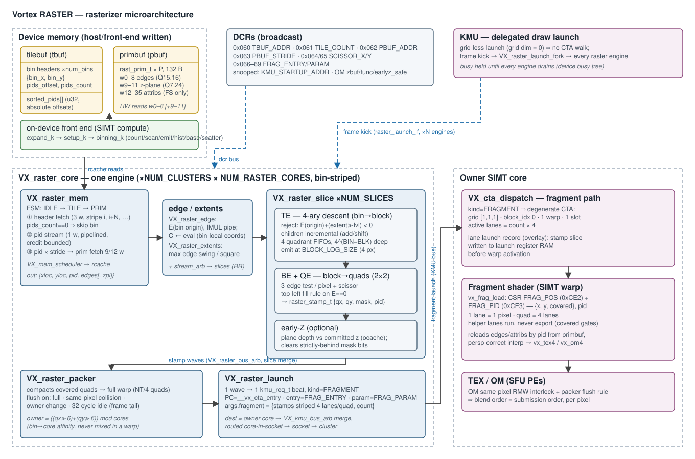
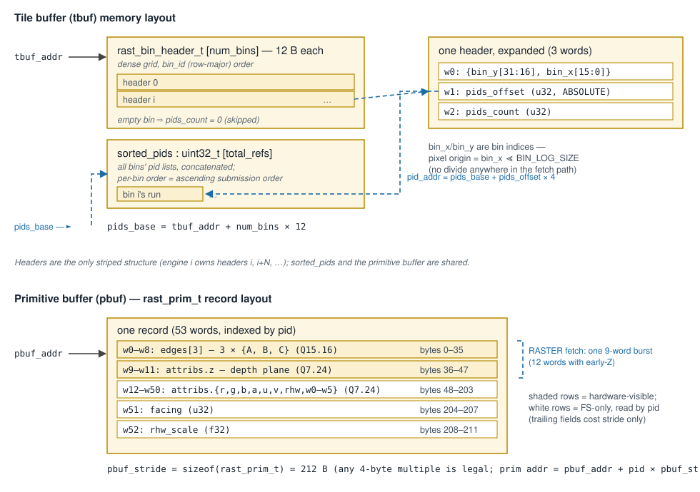

# Rasterizer (RASTER) Microarchitecture — Design

**Scope:** the complete rasterizer subsystem — the on-wire buffer ABI and its
memory layout, how the on-device front end constructs it, the DCR state, the
fetch engine, the coverage-walk pipeline, the fragment packing/launch path and
its hook into the CTA dispatcher, the shader-side fragment contract, and the
parallelism model. Covers the RTL ([`hw/rtl/raster/`](../../hw/rtl/raster/)),
the SimX model ([`sim/simx/raster/`](../../sim/simx/raster/)), and the software
producers ([`sw/gfx/gfx_frontend_k.h`](../../sw/gfx/gfx_frontend_k.h),
[`sw/runtime/common/graphics.cpp`](../../sw/runtime/common/graphics.cpp)).

The wider graphics stack — TEX, OM, the interface law, early-Z correctness, and
the software/driver side — is documented in
[`graphics_hardware_stack.md`](graphics_hardware_stack.md) and
[`graphics_software_stack.md`](graphics_software_stack.md). This document is
the rasterizer deep-dive.



---

## 1. Overview

The rasterizer is a **cluster-shared fixed-function engine** operating in a
sort-middle (binned) pipeline:

1. The **on-device front end** (SIMT compute kernels: `expand_k` → `setup_k` →
   `binning_k`) transforms the draw's vertices, performs per-triangle setup,
   and bin-sorts the visible primitives into two flat device-memory buffers:
   the **primitive buffer** and the **tile buffer**.
2. The host/CP programs the RASTER DCRs with the two buffer addresses and
   issues the draw as a **delegated draw launch** (a grid-less KMU launch).
3. Each raster engine fetches its stripe of bins, walks
   **bin → block → quad** coverage with fixed-point edge functions, optionally
   culls occluded quads against committed depth (early-Z), compacts covered
   quads into dense fragment waves, and **launches** each wave as a bare
   1-warp fragment CTA onto its owner core.
4. The fragment shader reads its pixel from the warp's launch registers
   (`FRAG_*` CSRs) and runs to completion, invoking TEX/OM as SFU ops.

There is no shader-issued raster instruction and no polling: RASTER is a pure
**push** producer.

---

## 2. On-wire ABI and memory layout

All structures are defined in
[`sw/common/vx_gfx_abi.h`](../../sw/common/vx_gfx_abi.h) (host writes,
hardware reads — the single source of truth). All words are 32-bit
little-endian.

### 2.1 Fixed-point formats

| Type | Format | Used for |
|---|---|---|
| `FloatE` (`fixed16_t`) | Q15.16 | edge-equation coefficients |
| `FloatA` (`fixed24_t`) | Q7.24 | attribute planes, incl. the depth plane |

### 2.2 Tile buffer (`tbuf`)

Two dense blocks, back to back:



`rast_bin_header_t` (3 words):

| word | field | meaning |
|---|---|---|
| 0 | `{bin_y[31:16], bin_x[15:0]}` | bin coordinates, in **bin units** (pixel origin = `bin_x << BIN_LOG_SIZE`) |
| 1 | `pids_offset` (u32) | **absolute** word index into `sorted_pids` |
| 2 | `pids_count` (u32) | primitives overlapping this bin |

Load-bearing properties:

- **Pointer-free headers.** `bin_x`/`bin_y` are pre-decoded bin indices, so
  the hardware never divides — the bin's pixel origin is one shift. The
  device front end emits a **dense grid** (`num_bins = bin_cols × bin_rows`,
  row-major `bin_id` order); a bin no primitive touches carries
  `pids_count = 0` and is skipped in one FSM step — crucially, its pid fetch
  is skipped entirely, because the DCR buffers persist across draws and a
  fetch would return a stale pid from a previous draw's pool. (The host
  oracle emits only touched bins; both are legal — `TILE_COUNT` names the
  emitted header count.)
- **Absolute pid offsets.** The pid-list base is computed once:
  `pids_base = tbuf + num_bins × 12`, and each bin's list starts at
  `pids_base + pids_offset × 4`. Headers carry no per-bin pointers, and the
  single `sorted_pids` array is shared by all striped raster instances.
- **Per-bin pid order is ascending submission order** (the binning sort is
  order-preserving), which is what makes same-pixel blend order correct with
  no hardware reorder logic (§9).

### 2.3 Primitive buffer (`pbuf`)

A flat array of `rast_prim_t` records, indexed by `pid`, with byte stride
`pbuf_stride` (= `sizeof(rast_prim_t)` = 212 B; any 4-byte-multiple stride is
legal — the hardware computes `pid × pbuf_stride`):

| words | bytes | field | format | read by |
|---|---|---|---|---|
| 0–8 | 0–35 | `edges[3]` — three `{A, B, C}` edge equations | Q15.16 | RASTER |
| 9–11 | 36–47 | `attribs.z` — screen-space depth plane `{A′, B′, C′}` | Q7.24 | RASTER (early-Z only) + FS |
| 12–50 | 48–203 | `attribs.{r,g,b,a,u,v,rhw,w0–w5}` — barycentric-delta planes | Q7.24 | FS only |
| 51 | 204–207 | `facing` — source winding | u32 | FS only |
| 52 | 208–211 | `rhw_scale` — `rhw` premultiply factor | f32 | FS only |

The depth plane sits **contiguously after the edges** so the entire
hardware-visible slice is one 9-word (12-word with early-Z) burst. Everything
after it is never touched by the rasterizer; the fragment shader reads it by
`pid`. The twelve generic varying planes (`r,g,b,a,u,v,w0–w5` — enough for
three vec4 varyings, packed in declaration order by the front end) are
perspective-premultiplied (`a·(1/w)`), with `rhw` carrying the max-normalized
`1/w` plane — see the `rast_attribs_t` comment in `vx_gfx_abi.h` for the
interpolation contract. The two trailing scalars are per-primitive facts only
the shader needs: `facing` is the source triangle's winding
(`gl_FrontFacing`), recorded before setup flips the edges to make the interior
positive; `rhw_scale` is the combined factor folded into the `rhw` plane (the
per-triangle max normalization times the power-of-2 range fold) — it cancels
in the FS's varying divide, but `gl_FragCoord.w` reads the `rhw` plane alone
and must undo it (`1/w = interp(rhw) / rhw_scale`).

An edge function is `E_k(x, y) = A_k·x + B_k·y + C_k` in Q15.16; a pixel is
inside when all three are non-negative (with the top-left tie rule of §7.4).

### 2.4 Fragment stamp

The rasterizer's output unit is the **quad stamp**
(`raster_stamp_t`, [`VX_raster_pkg.sv`](../../hw/rtl/raster/VX_raster_pkg.sv)):

| field | width | meaning |
|---|---|---|
| `pos_x`, `pos_y` | `VX_RASTER_DIM_BITS−1` each | quad position (pixel / 2) |
| `mask` | 4 | 2×2 coverage mask |
| `pid` | `VX_RASTER_PID_BITS` | primitive index |

No per-corner edge values (bcoords) are carried — the FS recomputes them from
the primitive's edges and its own pixel. The shader-visible per-lane view is
`frag_payload_t` (§11).

---

## 3. Buffer construction (binning)

### 3.1 On-device front end — the real path

[`sw/gfx/gfx_frontend_k.h`](../../sw/gfx/gfx_frontend_k.h). `setup_k` emits
the dense `rast_prim_t` array plus a per-primitive bbox array, then
`binning_k` runs an **order-preserving counting sort** in six barrier-separated
stages:

| stage | work | parallel shape |
|---|---|---|
| `BCOUNT` | per-prim count of overlapped bins from its bbox | grid-strided over prims |
| `BSCAN` | exclusive prefix-scan of the counts → per-prim key-write offsets | CTA-cooperative scan |
| `BEMIT` | expand each prim's bbox rectangle into `(bin_id << PIPE_PRIM_BITS) \| pid` keys | grid-strided over prims |
| `BHIST` | per-bin key histogram (per-thread `thist` then reduce) | bin-striped blocks |
| `BBASE` | prefix-scan of bin counts; writes every `rast_bin_header_t` (`bin_x = b % bin_cols`, `bin_y = b / bin_cols`, absolute `pids_offset`) | CTA-cooperative scan |
| `BSCATTER` | counting-sort scatter of pids into `sorted_pids`, preserving key order per bin | bin-striped blocks |

Binning is **conservative**: membership is bbox/bin overlap, so a primitive
can appear in bins it does not actually cover — the tile engine's extent test
(§7.3) culls those at one evaluation each.

### 3.2 Host reference — the oracle

`graphics::Binning()`
([`sw/runtime/common/graphics.cpp`](../../sw/runtime/common/graphics.cpp)) is
the sequential coverage oracle used by tests: same triangle-setup SSOT
(`gfx_setup::setup_triangle`), bbox → overlapped-bin loop, serialized into the
identical header-block + pid-array layout. It also enforces the **pid aliasing
guard**: a scene with more visible primitives than `VX_RASTER_PID_BITS` can
address is rejected loudly rather than aliased on device.

Both producers must bin at `VX_CFG_RASTER_BIN_LOG_SIZE` granularity — the
raster core scales `bin_x`/`bin_y` by exactly that size.

---

## 4. DCR state

Defined in [`VX_types.toml`](../../VX_types.toml), latched by
[`VX_raster_dcr.sv`](../../hw/rtl/raster/VX_raster_dcr.sv). The DCR bus is
**broadcast** to every raster engine; each engine self-selects its work stripe
by `INSTANCE_IDX` (§6.2). DCRs are not reset — a draw must program every
register it depends on; values persist across draws.

| addr | name | encoding / semantics |
|---|---|---|
| 0x060 | `RASTER_TBUF_ADDR` | tile-buffer base, as a **64-byte-block address** (byte address ≫ 6) |
| 0x061 | `RASTER_TILE_COUNT` | number of bin headers in the tile buffer (the device front end emits the dense grid, empty bins included) |
| 0x062 | `RASTER_PBUF_ADDR` | primitive-buffer base, 64-byte-block address |
| 0x063 | `RASTER_PBUF_STRIDE` | `rast_prim_t` byte stride (must be a multiple of 4) |
| 0x064 | `RASTER_SCISSOR_X` | `{xmax[31:16], xmin[15:0]}` destination window |
| 0x065 | `RASTER_SCISSOR_Y` | `{ymax[31:16], ymin[15:0]}` destination window |
| 0x066/67 | `RASTER_FRAG_ENTRY_LO/HI` | fragment-shader function address (the launch's `entry`) |
| 0x068/69 | `RASTER_FRAG_PARAM_LO/HI` | fragment-shader kernel argument pointer (the launch's `param`) |

[`VX_raster_launch`](../../hw/rtl/raster/VX_raster_launch.sv) additionally
snoops `VX_DCR_KMU_STARTUP_ADDR0/1` (the shared `__vx_cta_entry` startup PC),
so an injected fragment warp starts exactly where a KMU-launched CTA does.

With `VX_CFG_RASTER_EARLYZ_ENABLE`, [`VX_raster_dcr`](../../hw/rtl/raster/VX_raster_dcr.sv)
also snoops the **OM depth DCRs** off the same broadcast bus (no extra
routing): `OM_ZBUF_ADDR`, `OM_ZBUF_PITCH`, `OM_DEPTH_FUNC`, and
`OM_EARLYZ_SAFE` (the per-draw gate that arms early-Z).

---

## 5. Frame kick and drain

There is no raster "begin" op. A draw submits as: DCR writes, then a
**grid-less KMU launch** (any grid dimension zero). The KMU
([`VX_kmu.sv`](../../hw/rtl/VX_kmu.sv)) walks no CTAs for such a launch
and instead forwards a **frame kick** over `VX_raster_launch_if`, fanned out
to every raster engine by
[`VX_raster_launch_fork`](../../hw/rtl/raster/VX_raster_launch_fork.sv).
Command ordering guarantees the kick arrives after every DCR write of the
draw.

Inside the engine ([`VX_raster_core.sv`](../../hw/rtl/raster/VX_raster_core.sv)):

- The kick sets `armed`, pulses the fetch FSM's `start`, and raises `busy`.
- `busy` stays high until the engine is **fully drained**: fetch FSM idle,
  nothing in the edge/slice pipelines (tracked by a `VX_pending_size`
  in-flight counter), no buffered quads on the output bus, packer and launch
  builder empty, early-Z idle.
- An engine whose stripe is empty this frame (`my_tile_count == 0` — possible
  with uneven striping) drains immediately; otherwise the drain test is gated
  on the fetch unit having actually started, so `busy` cannot glitch low in
  the kick→fetch gap.
- Engine `busy` aggregates into the cluster's `gfx_busy` and the device busy
  tree, so the host's launch-drain fence observes the entire in-flight frame
  (raster → shader → OM).

Frames serialize: the host drains one frame before kicking the next.

---

## 6. The fetch engine — `VX_raster_mem`

[`VX_raster_mem.sv`](../../hw/rtl/raster/VX_raster_mem.sv) turns the two
buffers into a stream of `(xloc, yloc, pid, edges[, zplane])` records — one
per (bin, primitive) reference.

### 6.1 Fetch FSM

Three states (`IDLE`/`TILE`/`PRIM`), issuing word-granularity reads through a
`VX_mem_scheduler`; a 2-bit tag distinguishes the three fetch kinds:

- **`TILE`** — a 3-word masked request for one bin header. On response:
  latch the bin's pixel origin (`bin_x << TILE_LOGSIZE`); if
  `pids_count == 0`, advance to the next header (or idle on the last);
  otherwise compute `pids_addr` and enter `PRIM`.
- **`PID`** — stream the bin's pid list one word at a time. Pid requests are
  pipelined: the FSM does not wait for a pid's primitive data before
  requesting the next pid. A `VX_pending_size` **credit counter** caps
  in-flight pids at the output-queue depth so responses can always drain
  (memory-deadlock avoidance).
- **`PDATA`** — each returned pid enters a pipelined multiplier
  (`pid × pbuf_stride`, `LATENCY_IMUL`); the product addresses one full-mask
  9-word (12 with early-Z) request for the record's hardware-visible slice.
  The pid rides in the request tag's upper bits, so the response is
  self-identifying. Each response pushes
  `{xloc, yloc, edges[, zplane], pid}` into the output elastic buffer; when
  the bin's last response lands, the FSM returns to `TILE` (or `IDLE`).

The scheduler (`CORE_REQS` = 9/12 words, `MEM_CHANNELS = RCACHE_NUM_REQS`,
`RSP_PARTIAL = 0`) gathers each multi-word request into a single response and
feeds the **rcache** through a `VX_lsu_adapter`. Raster reads have no
instruction UUID; the tag is zero-padded to the scheduler's UUID field.

### 6.2 Instance striping

With `N = VX_CFG_NUM_CLUSTERS × VX_CFG_NUM_RASTER_CORES` engines device-wide,
engine `i` starts at header `i` and strides by `N` headers:

```
start_addr   = tbuf + i × 12
stride       = N × 12
my_bin_count = (tile_count + N − 1 − i) >> log2(N)
```

The header grid is the only striped structure — `sorted_pids` and the
primitive buffer are shared. Striping is static and deterministic, so the
SimX model reproduces the exact same bin→engine assignment.

---

## 7. The coverage pipeline

### 7.1 Edge evaluation and extents (engine front)

Before slice distribution ([`VX_raster_core.sv`](../../hw/rtl/raster/VX_raster_core.sv)):

- [`VX_raster_edge`](../../hw/rtl/raster/VX_raster_edge.sv) evaluates all
  three edge functions at the bin origin over an `LATENCY_IMUL` multiplier
  pipeline; a matching shift register carries the record alongside, and the
  evaluated values replace the `C` coefficients — downstream stages work in
  **bin-local coordinates** with add/shift only (no further multiplies).
- [`VX_raster_extents`](../../hw/rtl/raster/VX_raster_extents.sv) computes,
  combinationally per edge, the maximum positive edge-value swing across a
  bin-sized square: `extent_k = max(0, A_k)·2^TILE_LOGSIZE + max(0, B_k)·2^TILE_LOGSIZE`.
  This turns square-vs-half-plane overlap into one corner evaluation plus a
  precomputed extent.

A round-robin `VX_stream_arb` then distributes records across the
`NUM_SLICES` walker slices.

### 7.2 Slice structure

Each [`VX_raster_slice`](../../hw/rtl/raster/VX_raster_slice.sv) is
**TE → block buffer → BE(QE)**, followed by early-Z when enabled.

### 7.3 Tile engine (TE) — recursive descent

[`VX_raster_te.sv`](../../hw/rtl/raster/VX_raster_te.sv) walks a 4-ary
subdivision from bin size down to block size:

- State per square: origin, level, and the three edge values at its origin.
- **Overlap test**: `E_k(origin) + (extent_k >> level) < 0` for any edge ⇒
  the primitive misses the square ⇒ reject (this is where conservative
  bbox binning gets corrected).
- A surviving square at block size is emitted to the BE. Otherwise its four
  children are computed **incrementally** —
  `E(child) = E(parent) + i·(A ≪ s) + j·(B ≪ s)` with `s` the child log
  size — and pushed into four per-quadrant FIFOs; child 0 can bypass the
  FIFO to keep the pipe hot. A priority arbiter drains the FIFOs before new
  input is accepted, so the walk is depth-first-ish and bounded.
- FIFO capacity is `4^(TILE_LOGSIZE − BLOCK_LOGSIZE)` entries each — this
  grows fast with the bin size (the `TILE_LOGSIZE = 7`, `BLOCK_LOGSIZE = 2`
  default gives 1024-deep FIFOs), which is the area trade for coarse bins.

### 7.4 Block engine (BE) + quad evaluator (QE)

[`VX_raster_be.sv`](../../hw/rtl/raster/VX_raster_be.sv) expands each block
into its 2×2-pixel quads
(`(2^(BLOCK_LOGSIZE−1))²` per block) and drives
[`VX_raster_qe.sv`](../../hw/rtl/raster/VX_raster_qe.sv), which evaluates
each pixel of each quad against all three edges and the destination window
(scissor DCRs), producing per-quad 4-bit coverage masks.

QE applies the **Vulkan top-left fill rule**: a sample exactly on an edge
(`E == 0`) is covered only if that edge is top-left (`A > 0`, or
`A == 0 && B > 0`). The two triangles sharing an edge see opposite-sign
gradients, so a shared-edge sample is covered exactly once — no cracks, no
double cover. The classification is per-edge, once per primitive (only the
origin term varies per quad).

Covered quads are buffered (`QUAD_FIFO_DEPTH`) and emitted as **waves of
`OUTPUT_QUADS` stamps** (`OUTPUT_QUADS = VX_CFG_NUM_THREADS`), all from one
primitive and one block — so a wave is mostly sparse for small triangles.

### 7.5 Early-Z (optional)

Per slice, [`VX_raster_earlyz`](../../hw/rtl/raster/VX_raster_earlyz.sv)
evaluates each covered pixel's plane depth (bit-identical to the FS late-Z
math), reads committed depth through the coherent ocache (per-slice buses
merged onto the engine's single ocache port), and clears coverage bits that
are **strictly behind**. Pass-through when `earlyz_safe` is clear. Semantics
and the strict-behind correctness argument are in
[`graphics_hardware_stack.md` §5](graphics_hardware_stack.md).

Slice outputs merge through
[`VX_raster_bus_arb`](../../hw/rtl/raster/VX_raster_bus_arb.sv) (round-robin,
registered output) onto the engine's single stamp stream.

---

## 8. Fragment wave packing — `VX_raster_packer`

[`VX_raster_packer.sv`](../../hw/rtl/raster/VX_raster_packer.sv) compacts the
sparse per-block waves into dense fragment warps. A quad owns
`FRAG_QUAD_LANES = 4` adjacent lanes (helper lanes included — a partially
covered quad still takes all four so derivatives have neighbours), so a full
warp is `NUM_THREADS / 4` quads.

- **Scan/append**: the latched input wave is scanned one quad per cycle;
  covered quads (`mask != 0`) append to the fill buffer.
- **Flush triggers**: buffer full; **same-pixel collision** (an incoming quad
  addressing a `(pos_x, pos_y)` already buffered flushes first, so same-pixel
  fragments land in distinct, sequentially launched warps — the guarantee the
  OM's same-pixel RMW interlock builds on); **owner change** (§9); and an
  **idle timeout** (32 cycles) that flushes a partial tail at frame drain —
  the stamp stream has no end-of-frame token.
- Quads are consumed in arrival order, preserving per-bin submission order
  end to end.

---

## 9. Fragment launch and the CTA-dispatcher hook

### 9.1 Owner affinity

Every quad has a deterministic **owner core**
(`raster_owner()` in [`VX_raster_pkg.sv`](../../hw/rtl/raster/VX_raster_pkg.sv)):

```
bin_lin = (pos_x >> (BIN_LOG_SIZE−1)) + (pos_y >> (BIN_LOG_SIZE−1))   // quad coords
owner   = bin_lin % VX_CFG_NUM_CORES                                   // core within the cluster
```

Same pixel ⇒ same bin ⇒ same core, always — which is what makes same-pixel
blend order safe with in-order per-core delivery. A wave's quads all come
from one block, hence one bin, hence one owner; the packer never mixes owners
in a warp.

### 9.2 The launch message

[`VX_raster_launch.sv`](../../hw/rtl/raster/VX_raster_launch.sv) turns each
packed wave into **one `kmu_req_t` beat** on the KMU launch bus
(`KMU_KIND_FRAGMENT`), merged with the device-KMU compute stream by
[`VX_kmu_bus_arb`](../../hw/rtl/core/VX_kmu_bus_arb.sv) and routed by `dest`
(the owner core's global index; each fan-out level consumes its slice of the
index, core-in-socket first):

- Common envelope: `PC` = the snooped KMU startup PC (`__vx_cta_entry`),
  `entry` = `FRAG_ENTRY`, `param` = `FRAG_PARAM`, no LMEM.
- `args.fragment` — one variant of the tagged `kmu_args_t` **packed union**
  (the other, `args.compute`, is the full CTA grid descriptor; a fragment has
  no grid, and the envelope takes whichever variant is wider): the wave's
  stamps plus the covered-quad `count`.
  A quad's 48-bit stamp is **striped across its four lanes** (lane `l`
  carries slice `l & 3` of quad `l >> 2`'s stamp), which is what keeps the
  whole wave inside the single-beat header.

### 9.3 Consumption — `VX_cta_dispatch`

The per-core CTA dispatcher
([`VX_cta_dispatch.sv`](../../hw/rtl/core/VX_cta_dispatch.sv)) treats a
fragment launch as a degenerate CTA supplied from `kind`: grid `[1,1,1]`,
`block_idx = 0`, block size = `count × 4` active lanes, cluster size 1 — one
warp, one slot. The per-lane launch record (`cta_lane_t`) is a tagged
**overlay** sized to the wider view (either may win, so a packed union cannot
express it): a compute launch lands the expanded `{x,y,z}` thread index, a
fragment launch lands the lane's stamp slice. The record is written into the warp's launch-register RAM
before the warp is activated, so the shader's stamp is readable at its first
instruction with no memory traffic.

### 9.4 What a real GPU does

This is the mainstream shape: the rasterizer pushes pixel waves with their
payload attached; the pixel shader has `gl_FragCoord` and no `threadIdx`; the
shader never fetches its own stamp.

---

## 10. Parallelism model

Four independent axes, all order-safe by construction:

| axis | mechanism | ordering guarantee |
|---|---|---|
| raster engines (`NUM_CLUSTERS × NUM_RASTER_CORES`) | static bin striping of the header grid (§6.2) | a bin is walked by exactly one engine |
| slices per engine (`RASTER_NUM_SLICES`) | round-robin (bin, prim) distribution | per-primitive walk stays on one slice; cross-slice merge is per-wave |
| fetch pipelining | pid stream ∥ prim-data fetches, credit-bounded | responses tag-matched; output order = pid-list order |
| fragment cores | `raster_owner` bin→core map (§9.1) | a pixel only ever lands on one core, in submission order |

The end-to-end ordering chain — sorted per-bin pid lists → in-order fetch →
in-order walk → packer collision/owner flushes → dest-routed in-order launch
→ OM same-pixel interlock — is what replaces a global reorder buffer.

---

## 11. Shader-side contract

Intrinsics in
[`sw/kernel/include/vx_graphics.h`](../../sw/kernel/include/vx_graphics.h);
payload macros in [`sw/common/vx_gfx_abi.h`](../../sw/common/vx_gfx_abi.h).

- One lane = one pixel; a 2×2 quad = four adjacent lanes. Lane `l` holds
  sub-pixel `l & 3` at `(2·qx + (sub & 1), 2·qy + (sub >> 1))`.
- `vx_frag_load(p)` fills `frag_payload_t {pos, pid}` from two CSR reads:
  `VX_CSR_FRAG_POS` (0xCE2, `{covered[31], y[30:16], x[15:0]}`) and
  `VX_CSR_FRAG_PID` (0xCE3). The CSR read gathers the quad's four launch-
  register slices back into the lane's view.
- **Helper lanes**: a lane whose pixel the primitive misses still runs the
  shader (its quad neighbours need it for `vx_quad_ddx/ddy` derivatives and
  texture LOD) but must not export; `covered` — never the thread mask — gates
  the export. Wholly absent quads (beyond `count`) are thread-inactive.
- The FS recomputes per-corner edge values from the primitive's edges (loaded
  by `pid` from the primitive buffer) and its own pixel; there is no bcoord
  payload and no graphics-window op in the fragment path.

---

## 12. Configuration

[`VX_config.toml`](../../VX_config.toml) `[raster]`, instantiated in
[`VX_graphics.sv`](../../hw/rtl/VX_graphics.sv):

| knob | default | meaning |
|---|---|---|
| `VX_CFG_NUM_RASTER_CORES` | `max(1, ⌈cores/16⌉)` | raster engines per cluster |
| `VX_CFG_RASTER_NUM_SLICES` | 1 | walker slices per engine |
| `VX_CFG_RASTER_BIN_LOG_SIZE` | 7 (128 px) | bin size; **is** the engine's `TILE_LOGSIZE` (the front end bins at this granularity and the TE descends from it) |
| `VX_CFG_RASTER_BLOCK_LOG_SIZE` | 2 (4 px) | TE recursion floor / BE block size |
| `VX_CFG_RASTER_MEM_FIFO_DEPTH` | 8 | fetch output queue (also the pid credit bound) |
| `VX_CFG_RASTER_QUAD_FIFO_DEPTH` | 32 | BE covered-quad buffering |
| `VX_CFG_RASTER_MEM_QUEUE_SIZE` | 4 | mem-scheduler core queue |
| `VX_CFG_RASTER_EARLYZ_ENABLE` | false | early-Z occlusion cull |

Sizing note: the TE quadrant FIFOs scale as `4^(BIN−BLOCK)` (§7.3) — raising
`BIN_LOG_SIZE` buys fewer, larger bins (smaller tile buffer, less prim-fetch
duplication) at exponential TE buffering cost.

`OUTPUT_QUADS` is fixed to `VX_CFG_NUM_THREADS`, and raster requires
`NUM_THREADS` to be a multiple of 4 (a quad is four lanes — statically
asserted in the packer and launch builder). The launch envelope sizes itself
to the wider `kmu_args_t` variant: the compute grid descriptor dominates up
to NT = 16, and the fragment's per-thread stamp slices overtake it from
NT = 32.

## 13. SimX model and performance counters

[`sim/simx/raster/raster_core.cpp`](../../sim/simx/raster/raster_core.cpp)
mirrors the RTL 1:1 for trace-diffable parity: the same header → pid-list →
prim-record fetch phases (modeled as cache-line fetches against the rcache),
the same static bin striping, the same TE/BE walk, early-Z, packer, and
fragment-launch shape. The `graphics_parity` CI matrix holds the two in
lockstep.

Perf: MPM class `RASTER` (12) — `RASTER_READS` (0xB03), `RASTER_LAT` (0xB04),
`RASTER_ST` (0xB05): fetch requests, accumulated outstanding-read latency,
and output-stall cycles per engine.
