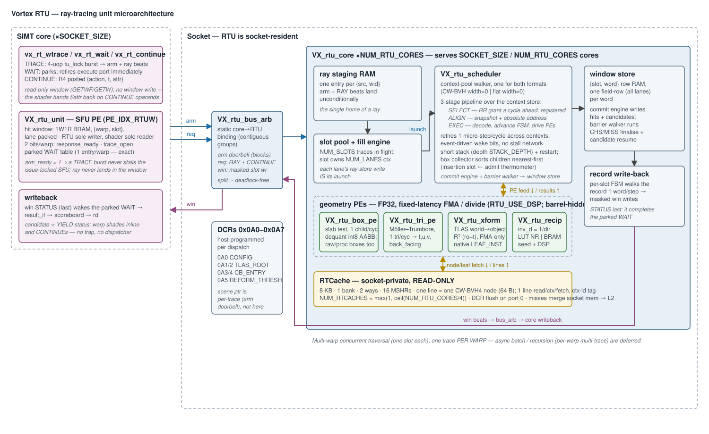
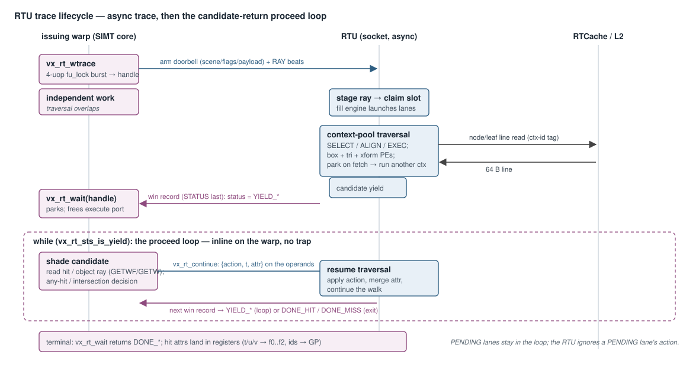

# Ray-Tracing Architecture (RTU) — Design

**Scope:** the complete Vortex hardware ray-tracing subsystem — the `vx_rt_*`
ISA surface and its SIMT-pipeline integration, the hit-window ABI, the
asynchronous BVH-traversal microarchitecture (staging → slot pool → context
scheduler → geometry PEs → record write-back), the candidate-return shader
model, the CW-BVH acceleration structure and its host builder, the RTCache
memory interface, and the parallelism/scaling model. Covers the RTL
([`hw/rtl/rtu/`](../../hw/rtl/rtu/)), the SIMT-side hookup
([`VX_sfu_unit.sv`](../../hw/rtl/core/VX_sfu_unit.sv),
[`VX_decode.sv`](../../hw/rtl/core/VX_decode.sv),
[`VX_gfx_uops.sv`](../../hw/rtl/core/VX_gfx_uops.sv)), the socket integration
([`VX_socket.sv`](../../hw/rtl/VX_socket.sv)), the SimX model
([`sim/simx/rtu/`](../../sim/simx/rtu/)), and the software contract
([`vx_raytrace.h`](../../sw/kernel/include/vx_raytrace.h),
[`sw/common/rtu_cfg.h`](../../sw/common/rtu_cfg.h),
[`sw/runtime/include/raytrace.h`](../../sw/runtime/include/raytrace.h)).

The wider graphics stack is in
[`graphics_hardware_stack.md`](graphics_hardware_stack.md); the companion FF
deep-dives are [`rasterizer_architecture.md`](rasterizer_architecture.md),
[`output_merger_architecture.md`](output_merger_architecture.md) and
[`texture_sampler_architecture.md`](texture_sampler_architecture.md). The driver
/ Vulkan ray-query path (NIR `rayQueryEXT` → RTU-op lowering, AS transcode,
residency) is in [`vortexpipe_architecture.md`](vortexpipe_architecture.md).

The RTU is a RISC-V ISA extension under `custom1` (`INST_EXT2 = 0x2B`), sharing
the opcode with the graphics FF units; it is gated by `VX_CFG_EXT_RTU_ENABLE`.



---

## 1. Overview

The RTU is an **asynchronous, SIMT-dispatched** ray-tracing accelerator. A warp
issues a trace, the RTU traverses the BVH off to the side while the warp does
independent work, and results retire through a **scoreboarded hit window**. It is
a **socket-resident** engine: each SIMT core carries a thin per-core front end
(`VX_tex`-style SFU processing element, `VX_rtu_unit`) that owns the core's hit
window; the socket hosts the shared traversal cores (`VX_rtu_core`) and a private,
read-only BVH/scene cache (**RTCache**). No traversal ever runs on the SIMT cores.

A trace is a three-phase register-to-register transaction:

1. **Trace.** `vx_rt_wtrace` streams the per-lane ray (`origin`, `dir`, `t_min`,
   `t_max`) and the warp-uniform config (scene pointer, ray flags, cull mask,
   payload pointer) into the traversal datapath, and returns an async handle.
2. **Traverse.** The socket core walks the acceleration structure on its own PEs
   — box tests, triangle tests, instance transforms, reciprocals — barrel-
   scheduling many lane-contexts through one shared front end so a context that
   parks on a memory fetch never idles the datapath.
3. **Wait / proceed.** `vx_rt_wait` blocks on the handle and reads the hit
   attributes back into registers. If traversal needs a programmable any-hit or
   intersection decision, it returns a **candidate** to the issuing warp; the
   warp shades it inline and resumes with `vx_rt_continue` — the Vulkan/DXR
   `rayQueryProceedEXT` loop, 1:1 with the hardware, **no trap and no
   dispatcher**.

The RTU consumes a **CW-BVH** (compressed-wide BVH, width 4 or 6) built host-side
and made resident. Traversal, instance transforms, and intersection all run in
FP32 on the RTU's own PEs, which reuse the ISA FPU's hardened FMA/divide cores.

---

## 2. ISA surface and SIMT integration

### 2.1 The op set

Every RTU op is `custom1` (0x2B / EXT2), decoded by funct3/funct2 in
[`VX_decode.sv`](../../hw/rtl/core/VX_decode.sv) to `EX_SFU` / `INST_SFU_RTUW`,
and mapped to one of five `RTUW_OP_*` selectors in
[`VX_rtu_pkg.sv`](../../hw/rtl/rtu/VX_rtu_pkg.sv):

| Op | Encoding (f3, f2) | Kind | Purpose |
|---|---|---|---|
| `vx_rt_wtrace` (TRACE) | 7, 0 | 4-uop burst, `fu_lock` | issue one ray; `rd` = async handle |
| `vx_rt_wait` (WAIT) | 7, 1 | parked block | block on a handle; `rd` = terminal/candidate status |
| `vx_rt_continue` / `vx_rt_cb_ret` (CB_RET) | 6, 0 | R4, posted | resume an open candidate with `{action, t, attr}` |
| `vx_rt_get_attr` … (GETW) | 6, 3 | windowed read | read `count` contiguous **integer** hit slots (ids/flags) |
| `vx_rt_get_objray` … (GETWF) | 6, 2 | windowed read | read `count` contiguous **FP** hit slots (t, barycentrics, object ray) |

The hit window is **read-only to the shader**: there is no window-write op. Every
value a shader hands back to the RTU — an intersection shader's hit distance and
`hitAttribute` — rides the *operands* of the `vx_rt_continue` that hands it back,
so a trace is self-contained. (Earlier revisions carried a `SETW` window-write and
a `GETWS` slot-indexed read; both are retired. The v1 windowed-quad `vx_tex4`-era
form and funct3=5 are also gone — funct3=5 is now TEX.)

### 2.2 The per-core SFU PE — `VX_rtu_unit`

[`VX_rtu_unit.sv`](../../hw/rtl/rtu/VX_rtu_unit.sv) occupies the `PE_IDX_RTUW`
slot of [`VX_sfu_unit`](../../hw/rtl/core/VX_sfu_unit.sv). It is deliberately
tiny — "a slot RAM, a beat streamer, and three bits per warp":

- **The hit window** is a plain 1W1R BRAM (`VX_CFG_NUM_WARPS × VX_RT_SLOT_COUNT`
  rows, lane-packed, addressed `{warp, slot}`). It holds **results only**: the
  RTU is its sole writer, the shader its sole reader, and the RTU never reads it
  back — so no arbiter, no mirror, no read port facing the RTU. The RTU traces a
  whole warp at once, so the address is a bare `{warp, slot}` with no SIMD-group
  field. A static assert requires `NUM_SFU_LANES == NUM_THREADS` for exactly this
  reason.
- **The ray never lands in the window.** A TRACE burst streams it straight to the
  traversal datapath over the socket RTU bus (§4.1): the CFG uop rings the *arm
  doorbell* with the warp-uniform half, and ORIGIN/DIR/ARM stream the per-lane
  half out of their own FP register operands as RAY beats.
- **Two status bits per warp**, both set by the RTU's write to the window's
  STATUS slot (the last write of any record): `response_ready` (a record landed —
  a blocked WAIT may complete) and `trace_open` (that record was a candidate — a
  CONTINUE may resume it).
- **The parked WAIT.** A WAIT retires from the in-order execute port *immediately*
  and parks in a per-warp table; its writeback fires when the record lands. This
  is load-bearing: a WAIT that sat at execute would head-of-line-block every other
  warp's TRACE burst — the very ops that feed the RTU its next ray — and starve
  the engine. (Measured on `rt_raycast`, the RTU sat idle-with-no-work 44% of
  cycles; idle-with-a-ray-in-hand only 117 cycles total.) One trace per warp makes
  one park entry per warp exact.

### 2.3 The TRACE burst and the issue lock

[`VX_gfx_uops.sv`](../../hw/rtl/core/VX_gfx_uops.sv) expands TRACE into exactly
four uops under `fu_lock`/`fu_unlock` — CFG (arm), ORIGIN (f0..f2), DIR (f3..f5),
ARM (f6..f7) — so two warps' rays cannot interleave on the way in. The lock is
safe because the RTU *always* accepts an arm: it stages a ray per `{src, wid}`,
and a warp holds at most one trace (decode marks TRACE/WAIT `is_wstall`, so the
warp cannot run past its own WAIT), so the staging entry is free by construction.
`arm_ready` is a hard constant 1; a TRACE burst can therefore never stall inside
the SFU while holding the issue lock. Both TRACE and WAIT release their warp
through `sched_unlock_if` — TRACE on the ARM uop's last beat, WAIT when its record
lands — never on a traversal event, so the unlock can never race the stall it
clears.

### 2.4 The candidate-return (proceed) loop

The programmable-shader path is an **inline loop on the issuing warp**, not an
async trap. `vx_rt_wait` returns a per-lane status; while it is a yield code the
warp shades the candidate and calls `vx_rt_continue`:

```c
uint32_t sts = vx_rt_wait(h, &hit);
while (vx_rt_sts_is_yield(sts)) {
    uint32_t action = /* any-hit / intersection decision from hit */;
    sts = vx_rt_continue(h, action, t, attr, &hit);   // ACCEPT / IGNORE / TERMINATE
}
```

A candidate batch covers only the lanes that actually yielded (`YIELD_ANYHIT` /
`YIELD_PROC`); every other active lane reports `PENDING` — still traversing,
nothing to shade this iteration — so it stays in the loop rather than exit on
stale data, and the RTU ignores whatever action a PENDING lane contributes. This
is what makes a partial batch (e.g. divergent-SBT reformation, which groups
candidates by shader) correct. `vx_rt_continue`'s `t`/`attr` ride the CONTINUE
operands, so the shader never writes RTU state.

> A trap-style dispatcher (`VX_RT_CALLBACK_ENTRY` + `vx_mret`) also exists in the
> ISA header for a future DXR `traceRays`+SBT pipeline with recursion; it shares
> the CB_RET encoding. The **shipping ray-query path is the inline loop above** —
> the RTL traversal core has no trap machinery.



---

## 3. The hit-window ABI

The window is a per-`(warp, lane)` file of 32-bit named slots
(`VX_RT_SLOT_COUNT = 32`, [`VX_types.toml`](../../VX_types.toml) `[rtu_slots]` is
the source of truth). The layout is **contiguity-ordered**: the RTU moves ray
state as base+count bursts, so each span's members must abut.

| slots | span | direction |
|---|---|---|
| 0..2 / 3..5 / 6 / 7 | ray `origin` / `dir` / `t_min` / `t_max` | streamed *in* at trace (not stored) |
| 8 / 9 | ray `flags` / `cull_mask` | warp-uniform, ride the arm doorbell |
| 10..16 | hit `t`, bary `u`,`v`, `primitive_id`, `instance_id`, `geometry_index`, `instance_custom` | RTU writes |
| 17..22 | object-space ray `origin`/`dir` (staged on an AHS/IS yield) | RTU writes |
| 23 / 24 / 25 | candidate `cb_type` / `sbt_idx` / `cb_handle` | RTU writes |
| 26 | **STATUS** (`VX_RT_STS_*`) | RTU writes **last** |
| 27 / 29 | payload pointer / user `hitAttribute` | RTU writes (payload at arm; attr on commit) |

**STATUS is deliberately last.** A parked WAIT completes on the address-match
write to slot 26, so every other result word must already be in the window when
it lands — moving STATUS earlier would race the warp against its own hit metadata.

Status codes ([`rtu_status`](../../VX_types.toml)): terminal `DONE_HIT`(0) /
`DONE_MISS`(1) end the lane's loop; `YIELD_ANYHIT`(2) / `YIELD_PROC`(3) /
`PENDING`(4) keep it proceeding. Ray flags mirror `SpvRayFlags*` (opaque / no-
opaque / terminate-on-first-hit / skip-closest-hit / cull-back / cull-front /
cull-opaque / cull-no-opaque / skip-triangles / skip-aabbs / enable-CHS /
enable-MISS). Callback actions: `IGNORE`(0) / `ACCEPT`(1) / `TERMINATE`(2).

`vx_rt_wait` marshals the window into `vx_hit_t` field-by-field (via a GETWF FP
read for `t`/`u`/`v` and a GETW GP read for the four ids), each chained on the
status word so the read issues only after the terminal staged the hit — the
scoreboard dependency *is* the completion fence. The `vx_hit_t` field order is
intentionally **not** the slot order, so the window is never bulk-copied; static
asserts pin both layouts.

### 3.1 Per-dispatch DCRs (0x0A0–0x0A7)

Programmed host-side by `vortex::raytrace::program()`
([`raytrace.h`](../../sw/runtime/include/raytrace.h)); the per-ray ISA carries no
texture-style state:

| addr | name | meaning |
|---|---|---|
| 0x0A0 | `RTU_CONFIG` | `scene_kind[3:0]` \| `bvh_width[7:4]` \| `cull_defaults[15:8]` |
| 0x0A1/0x0A2 | `RTU_TLAS_ROOT_LO/HI` | resident TLAS root address |
| 0x0A3/0x0A4 | `RTU_CB_ENTRY_LO/HI` | callback-dispatcher entry (trap-path builds only) |
| 0x0A5 | `RTU_REFORM_THRESH` | reformation batching threshold |
| 0x0A6 | `RTU_STATS_RESET` | perf-counter reset strobe |

The **per-trace** scene pointer rides the arm doorbell (lane-packed via an
implicit `vx_wgather`: lane1 = scene, lane2 = payload, lane3 = flags\|cull), and
the walker reads the scene *root* from the scene-buffer header, so the traversal
core does not depend on the TLAS-root DCR — those DCRs serve the runtime and the
SimX/trap-dispatcher paths.

---

## 4. Traversal microarchitecture (`VX_rtu_core` + `VX_rtu_scheduler`)

One socket `VX_rtu_core` serves `CORES_PER_RTU = SOCKET_SIZE / NUM_RTU_CORES`
cores. It is the sole writer of the hit window and owns three structures.

### 4.1 Staging — the incoming-ray home

One entry per `{src, wid}` (per warp of every core this RTU serves). An arm and
its RAY beats land **unconditionally** (the entry is free by construction), which
is what keeps `arm_ready` a constant 1. The staging RAM is the *single* home of a
ray: a traversal slot holds a **pointer** to its entry, never a copy, and a
candidate record's object-ray words are read straight back from these rows at
write-back. `{src, wid}` is the whole trace handle — a warp holds one trace, so
its entry needs no other name, and two cores' or two warps' bursts may interleave
freely on the shared bus without corrupting each other.

The socket bus ([`VX_rtu_bus_if.sv`](../../hw/rtl/rtu/VX_rtu_bus_if.sv)) has three
channels, sized so none can head-of-line-block another: **arm** (warp-uniform ray
half + identity; may block, since the RTU takes one at a time), **req** (RAY beats
and the CONTINUE — everything the RTU is *waiting for*, so it is always ready and
never stalls), and **win** (one masked slot write per beat, STATUS last). Splitting
`arm` out of `req` is what makes the whole path deadlock-free. The arbiter
([`VX_rtu_bus_arb.sv`](../../hw/rtl/rtu/VX_rtu_bus_arb.sv)) binds cores to RTUs
**statically** in contiguous groups: a dynamic binding could send a warp's TRACE
to one RTU and its later CONTINUE to another, orphaning the parked traversal.

### 4.2 The slot pool and fill engine

`RTU_NUM_SLOTS` traversals run concurrently; a slot owns `NUM_LANES` scheduler
contexts (`NUM_CTX = NUM_SLOTS × NUM_LANES`). The **fill engine** claims a free
slot for a fully-staged ray and streams the per-lane rays into the scheduler's ray
store lane by lane — *each lane's ray-store write is that lane's launch*, so early
lanes start traversing while later lanes are still streaming in. A slot is a small
descriptor (staging pointer, warp id, the warp-uniform payload, a record-walk FSM).

### 4.3 The context-pool scheduler

[`VX_rtu_scheduler.sv`](../../hw/rtl/rtu/VX_rtu_scheduler.sv) is one walker for
both scene formats — the CW-BVH walk (`RTU_BVH_WIDTH > 0`) and the flat triangle-
list walk (`WIDTH = 0`, a degenerate one-leaf scene through the same loops). Its
core idea: **per-context state is an address, not a mux.** All of it lives in a
context-indexed BRAM (the *context store*), walked by a three-stage pipeline:

- **SELECT** — a round-robin arbiter picks a ready context (one whose wake bit is
  set) and issues every context-indexed RAM read for it.
- **ALIGN** — capture the RAM outputs into the stage snapshot; precompute the
  absolute structure address.
- **EXEC** — byte-align and decode the fetched line image, advance the context
  FSM (~30 states: setup → header → node fetch → box feed/collect → stack push/pop
  → leaf triangle/instance/proc loops → done), drive the PEs and the memory port,
  and write the whole context word back.

The stages overlap across **different** contexts, so the walker retires one micro-
step per cycle. A context's wake bit is cleared at SELECT and can only be re-armed
by its own EXEC or by the one event it parked on, so a context never occupies two
stages at once and every RAM is a plain write-first BRAM with no bypass network.
Contexts talk to the shared units through **events** tagged with the context id: a
memory response, a box/tri/xform/reciprocal result, or a ray landing at launch
sets the target's wake bit (and writes any data into a context-indexed result
RAM). A structural conflict (memory port busy, full queue) simply re-arms the wake
bit and retries — there is **no stall network**.

Two work products leave the scheduler:

- **The commit engine** serializes hit commits and candidate stagings into the
  *window store* (a `{slot, word}` row RAM, one field-row across all lanes per
  word), one row per cycle.
- **The barrier walker** runs the per-slot whole-record operations one row at a
  time: *finalise* (stage CHS on hit lanes / zeroed attributes on MISS lanes when
  those shaders are enabled) and *resume* (commit accepted candidates, merge the
  returned `hitAttribute`).

Robustness details worth naming: a short-stack of depth `RTU_STACK_DEPTH` bounds
per-context node stack RAM; on overflow the walker sets an `ovf` flag and, at
pop-time, **re-descends** the subtree pruned by the tightened `best_t` (bounded by
`RTU_RESTART_CAP = 8` restarts) — a full traversal on a finite stack. A 16-entry
box collector insertion-sorts a node's child hits t-ascending so descent is
nearest-first.

### 4.4 The geometry PEs

All FP32, all fixed-latency, all reusing the ISA FPU's hardened cores so the RTU
adds no new floating-point datapath (`VX_CFG_FMA_LATENCY` / `VX_CFG_RTU_FDIV_LATENCY`
track the active backend, and the barrel scheduler hides the latency):

- **`VX_rtu_box_pe`** — pipelined ray/AABB slab test, one child box per cycle,
  emitting `{hit, t_near}`. Dequantizes the node's int8 child corners
  (`origin + q·2^exp`), does the slab test with `VX_fma_unit` + `VX_fncp_unit`,
  and subtracts the ray origin *before* multiplying by `inv_d` so axis-aligned
  rays (`inv_d = ±inf`) stay NaN-free. Also handles raw/procedural boxes.
- **`VX_rtu_tri_pe`** — pipelined Möller–Trumbore triangle test, one triangle per
  cycle, emitting `{hit, t, u, v, back_facing}`; reuses `VX_fma_unit`,
  `VX_fdiv_unit` (1/det), `VX_fncp_unit`, and `VX_rtu_fdot3`/`fcross3`.
- **`VX_rtu_xform`** — TLAS world→object transform, `obj = Rᵀ·(ro−t)` — FMA-only
  (an orthonormal TLAS rotation needs no determinant or divide), under
  `VX_CFG_RTU_TLAS_ENABLE`.
- **`VX_rtu_recip`** — F32 reciprocal for `inv_d`, either a portable LUT+Newton
  `VX_fdiv_unit` (0 DSP, default) or a BRAM-seed + DSP Newton-Raphson variant
  (`VX_CFG_RTU_RECIP_DSP_SEED`, ~9e-8 error, trades ~2K LUT onto idle BRAM/DSP).

### 4.5 The record write-back

When a slot's traversal finishes (terminal) or parks with a candidate, its
descriptor FSM walks the window store one word per step and emits a masked window
write per word: the hit/candidate spans from the window-store rows, the object-ray
and `t_max` words from the staging RAM, the flags from hot flops. STATUS goes out
last — its arrival is what completes the warp's parked WAIT and (for a candidate)
sets `trace_open`. A terminal record releases the staging entry so the warp may
arm again; a candidate keeps the slot live for the CONTINUE.

---

## 5. Memory interface — the RTCache

Per socket, a **read-only** `VX_cache_cluster` (`WRITE_ENABLE = 0`, no
writeback — the AS is immutable within a dispatch): 8 KB, 1 bank, 2 ways, 16
MSHRs by default, `VX_CFG_NUM_RTCACHES = max(1, ⌈NUM_RTU_CORES/4⌉)` instances.
The traversal core issues **one line read per context per fetch**, tagged with the
context id; a CW-BVH4 node is exactly one 64-byte cache line, so a node fetch is a
single aligned read and the outstanding count is bounded by the RTCache's own
MSHRs (`RTU_MERGE_DEPTH = 0` — this core does not merge duplicate node fetches; a
build that set it > 0 is rejected by a static assert). Nodes/leaves are packed at
arbitrary byte offsets, so a structure may straddle lines; the scheduler fetches
`RTU_NODE_LINES` lines and byte-aligns the assembled image before decode. Port 0
carries the DCR-triggered **flush** path (`VX_dcr_flush`) for AS re-uploads. Miss
traffic merges into the socket's memory arbiter alongside icache/dcache/tcache.

---

## 6. Acceleration structure — CW-BVH

A **compressed-wide BVH** of width 4 or 6, byte-layout shared host↔device
([`rtu_cfg.h`](../../sw/common/rtu_cfg.h) ↔
[`VX_rtu_pkg.sv`](../../hw/rtl/rtu/VX_rtu_pkg.sv), byte-for-byte):

- **Internal node** (CW-BVH4 = 64 B = one line; CW-BVH6 = 96 B): `kind`+child-count
  word, a common `origin[3]` (fp32) and per-axis `exp[3]` (int8) quantization
  frame, `W` child-offset words (bit 31 = leaf flag), and `W×3` int8 quantized
  child min/max corners.
- **Leaves** hold ONE triangle (16 B header + 40 B triangle record: `v0`,`v1`,`v2`,
  flags). One tri per leaf makes `gl_PrimitiveID = prim_base + index` exact under
  SAH partitioning; multi-tri leaves need a primitive-ID remap field (a documented
  format follow-up). Leaf kinds: `LEAF_TRI`, `LEAF_INST` (a TLAS instance record —
  3×4 affine + BLAS root + custom/instance id + cull mask + `VkGeometryInstanceFlagBits`),
  `LEAF_PROC` (a procedural AABB → intersection-shader yield).
- **Per-triangle flags** carry OPAQUE / PROCEDURAL bits and an SBT index; the
  walker's classifier composes them with ray flags and instance flags (force-
  opaque/no-opaque, face-cull-disable, flip-facing) to decide commit vs any-hit/
  IS yield vs cull.

**Host builder:** `vortex::raytrace::BvhBuilder` / `build_bvh_scene` /
`build_tlas_scene` ([`raytrace.h`](../../sw/runtime/include/raytrace.h)) — top-down
binned-SAH partitioning into a real internal-node tree with quantized child AABBs,
two-level TLAS→BLAS with instance transforms. Scenes are capped at
`RTU_BVH_MAX_SCENE_BYTES = 16 KB` (the per-lane pre-fetch budget). The Vulkan
driver transcodes an app `VkAccelerationStructure` to this layout
(`vp_transcode_as`) and makes it resident; today it is rebuilt per dispatch (AS
residency is a tracked gap — see §9).

---

## 7. Parallelism and scaling

| axis | mechanism | knob |
|---|---|---|
| concurrent traces | slot pool: `NUM_SLOTS` warps traversing at once | `VX_CFG_RTU_NUM_SLOTS` (= `SOCKET_SIZE / NUM_RTU_CORES`) |
| lanes per trace | context per thread of the traced warp | `NUM_CTX = NUM_SLOTS × NUM_THREADS` |
| barrel depth | contexts hide memory/PE latency in the 3-stage walker | `VX_CFG_RTU_NUM_CTX` |
| cores per RTU | static `VX_rtu_bus_arb` binding | `VX_CFG_SOCKET_SIZE / VX_CFG_NUM_RTU_CORES` |
| traversal cores | independent `VX_rtu_core` engines per socket | `VX_CFG_NUM_RTU_CORES` (= `⌈SOCKET_SIZE/4⌉`) |
| node bandwidth | RTCache banks × instances | `VX_CFG_RTCACHE_NUM_BANKS`, `NUM_RTCACHES` |
| BVH width | 4-ary vs 6-ary descent | `VX_CFG_RTU_BVH_WIDTH` |

**Structural properties.** The walker is *latency-hiding by construction*: a
context that parks on a fetch clears its wake bit and yields the pipeline to any
of the other `NUM_CTX` contexts, so memory latency never idles the datapath as
long as enough rays are resident. Every serialization point is a knob (slots,
contexts, cores, cache banks), and the ray-delivery path is deadlock-free by the
three-channel bus split rather than by any global gate. Different warps' traces
interleave freely — traversal is side-effect-free until the record write-back, and
that write is per-`{warp}` addressed, so nothing depends on cross-trace order.

The engine services **many warps concurrently** (one slot each), but a given warp
holds **one trace at a time** (staging is one entry per `{src, wid}`). Multiple
concurrent traces from a *single* warp — an async batch of traces issued before
any wait, or a nested (recursive) trace — are the deferred gap (§9): they need a
per-warp multi-trace pool and, for recursion, a per-warp context stack.

---

## 8. SimX model and performance counters

[`sim/simx/rtu/`](../../sim/simx/rtu/) mirrors the RTL shape and is the **fuller
oracle**:

- **`rtu_unit.cpp`** — the per-core PE: TRACE/WAIT window ABI, macro-op → uop
  generation, and the park/revive of a WAIT against latched terminal/candidate
  responses (same parked-WAIT semantics as the RTL).
- **`rtu_core.cpp`** — the traversal model: multi-AS / TLAS with instance
  transforms, the object-ray slots, all four candidate types (AHS / IS / CHS /
  MISS), a **ReformationEngine** that batches same-warp yields by `(warp_id,
  sbt_idx)` under a per-warp callback-in-flight gate, and real `MemReq`/`MemRsp`
  RTCache traffic for cycle parity on the `graphics_parity` matrix.
- **`rtu_walker.cpp` / `rtu_isect.cpp`** — the CW-BVH/flat walk and the ray/AABB +
  triangle math (shared FP helpers with the host reference).

SimX additionally models **multi-warp and divergent-SBT reformation** and
**per-warp multi-trace concurrency**, which the RTL core does not yet implement —
SimX remains the oracle for those. Perf: MPM class `RTU`, with per-core traversal
occupancy (busy / write / callback / fill and the two idle causes: idle-with-a-ray
vs starved) available under `DBG_RTU_OCC`.

---

## 9. Configuration

| knob | default | meaning |
|---|---|---|
| `VX_CFG_EXT_RTU_ENABLE` | false | build the RTU at all |
| `VX_CFG_NUM_RTU_CORES` | `⌈SOCKET_SIZE/4⌉` | traversal cores per socket |
| `VX_CFG_RTU_BVH_WIDTH` | 4 | 0 = flat list, 4 = CW-BVH4, 6 = CW-BVH6 |
| `VX_CFG_RTU_NUM_SLOTS` | `SOCKET_SIZE / NUM_RTU_CORES` | concurrent traces per core (derived) |
| `VX_CFG_RTU_NUM_CTX` | `NUM_SLOTS × NUM_THREADS` | traversal contexts (derived) |
| `VX_CFG_RTU_STACK_DEPTH` | 16 | short-stack depth per context |
| `VX_CFG_RTU_MERGE_DEPTH` | 0 | node-fetch MSHR merge (0 = no merge; only value implemented) |
| `VX_CFG_NUM_RTU_BLOCKS` | 2 | parallel RTCache request ports per core |
| `VX_CFG_RTU_TLAS_ENABLE` | false | instancing / TLAS descent + `VX_rtu_xform` |
| `VX_CFG_RTU_RECIP_DSP_SEED` | 0 | `inv_d` reciprocal backend (0 = LUT-NR, 1 = BRAM-seed + DSP) |
| `VX_CFG_RTU_FDIV_LATENCY` | vendor 28 / altera 15 / soft 17 | RTU divide depth (backend-keyed) |
| `VX_CFG_RTCACHE_SIZE / NUM_BANKS / NUM_WAYS / MSHR_SIZE` | 8 KB / 1 / 2 / 16 | RTCache geometry |
| `VX_CFG_NUM_RTCACHES` | `max(1, ⌈NUM_RTU_CORES/4⌉)` | RTCache instances per socket |

The RTL is XLEN-clean. A slot owning its contexts (`NUM_SLOTS` and `NUM_CTX` both
derived) is enforced by static assert — they used to be free knobs, and the
"extra idle contexts" configuration that allowed was a machine the core is not.

---

## 10. State of the implementation

Grades: ✅ done · ⚠️ partial · ❌ pending. All committed on `prism`.

| Area | State | Note |
|---|:--:|---|
| Flat + CW-BVH4/6 traversal, context pool, short stack + restart | ✅ | RTL + SimX |
| Box PE (quantized + raw/proc), triangle PE, reciprocal | ✅ | reuse ISA FMA/divide |
| TLAS + instance `VX_rtu_xform` (FMA-only) | ✅ | `VX_CFG_RTU_TLAS_ENABLE` |
| Candidate-return proceed loop (WAIT/CONTINUE), inline — no trap | ✅ | AHS / IS(proc) / CHS / MISS / SBT |
| Per-triangle AHS classifier in the CW-BVH walker | ✅ | opacity/face-cull/force-opaque, terminate-on-first-hit |
| Read-only hit window (RTU sole writer; no `SETW`; overlap with graphics removed) | ✅ | window is the RTU's alone |
| Multi-warp concurrent traversal (`NUM_SLOTS` traces) | ✅ | one trace **per warp** |
| Same-warp single-group reformation | ✅ | RTL + SimX |
| Host CW-BVH / TLAS builder | ✅ | `vortex::raytrace` |
| **Per-warp multi-trace pool** (async batch / recursion) | ❌ | staging is one entry per `{src, wid}`; recursion also needs a per-warp context stack |
| **Multi-warp / divergent-SBT reformation** | ❌ | SimX-only (models both) |
| **AS + module residency** | ❌ | BVH rebuilt per dispatch (driver) |

**Tests:** [`tests/raytracing/`](../../tests/raytracing/) — **34/34 simx,
32/34 rtlsim**; the two rtlsim-deferred (`rt_smoke_recursive`,
`rt_smoke_async_batch`) both need several traces in flight *per warp*. These are
the RTU regression gate. `rt_smoke_ahs_bvh` (a non-opaque triangle in a CW-BVH4
leaf, IGNORE → MISS) is the CW-BVH any-hit gate; `rt_raycast` and
`rt_bvh_multinode` (full framebuffer + 36-node BVH, one trace/warp) run on
rtlsim. The Vulkan ray-query tests (`tests/vulkan/rtquery*`) run the *query* on
the RTU but set `STRICT=0` because the lavapipe **AS-build** shaders fall back to
llvmpipe — a driver gap, not an RTU gap.

---

## 11. Remaining work

Full `dEQP-VK.ray_query.*` conformance (ray queries inside graphics/compute
shaders) depends on: (a) AS + module residency (stop the per-dispatch rebuild) and
plumbing the resident AS pointer into a fragment shader's arg block; and (b) fixing
the `rtquery` llvmpipe fallback so RT runs under `STRICT=1`. `dEQP-VK.ray_tracing_pipeline.*`
(traceRays + SBT, recursion) is a larger, separate track gated on the per-warp
multi-trace pool and the multi-warp / divergent-SBT reformation tails.

**Superseded / rejected directions** (recorded to avoid revival): RTU ISA v1
(funct3=5 windowed-quad, retired for the v2 window ABI); a shader-writable window
(`SETW`) and slot-indexed read (`GETWS`) — replaced by the operand-carried
CONTINUE and the read-only window; SIMT-software traversal on the cores (replaced
by the FF RTU); a dedicated per-context stack SRAM instead of the short-stack +
restart; and free-standing `NUM_SLOTS`/`NUM_CTX` knobs (now derived — a slot owns
its contexts).
