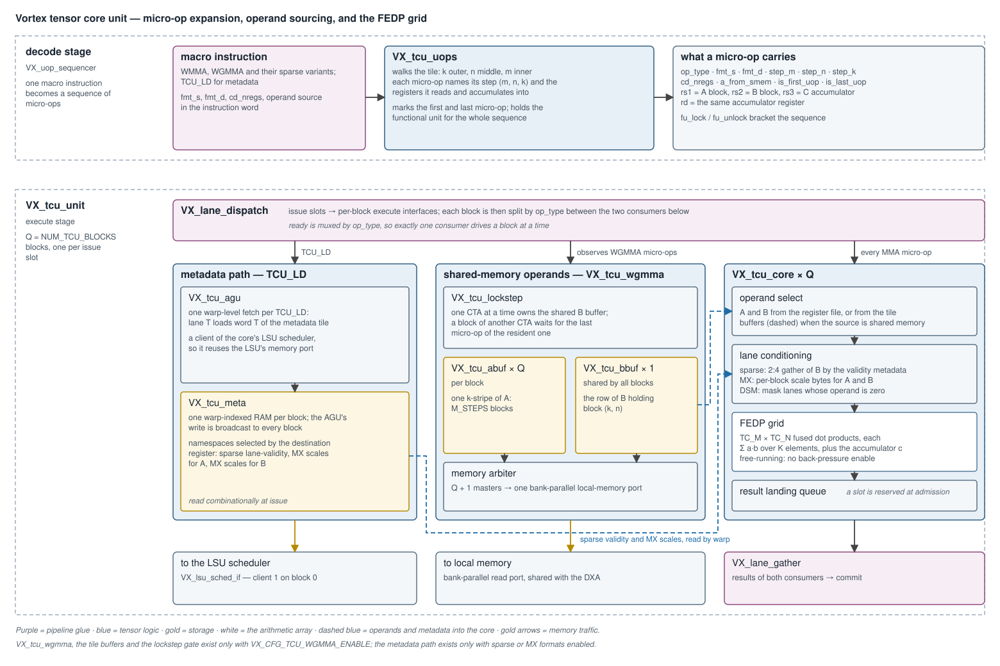
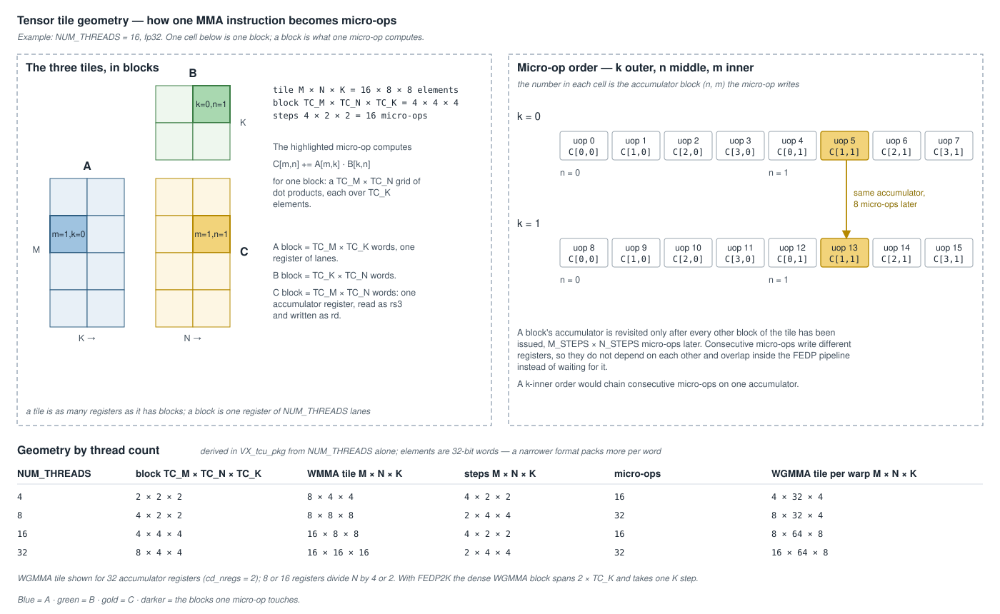
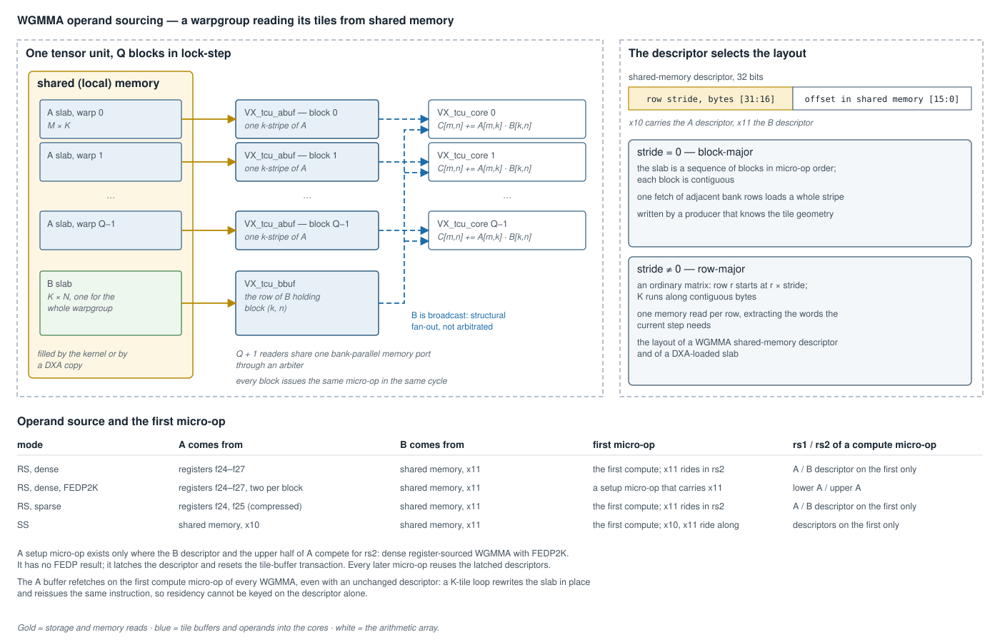

# Tensor Core Unit (TCU / WGMMA) — Design

**Scope:** the Vortex tensor core unit — the matrix-multiply-accumulate
engine behind WMMA and WGMMA (NVIDIA-style warp and warpgroup MMA), 2:4
structured sparsity, block-scaled (MX) formats, and the metadata loads that
feed them. Covers the instruction encoding, the tile geometry and micro-op
expansion, the execute-stage unit and its FEDP grid, operand sourcing from
registers and from shared memory, the metadata path, the FEDP backends, and
the SimX model. RTL: [`hw/rtl/tcu/`](../../hw/rtl/tcu/). SimX:
[`sim/simx/tcu/`](../../sim/simx/tcu/). Software:
[`sw/kernel/include/vx_tensor.h`](../../sw/kernel/include/vx_tensor.h),
[`sw/common/tensor_cfg.h`](../../sw/common/tensor_cfg.h).

The generic micro-op sequencer and the rules every accelerator extension
follows are in
[`custom_accelerator_isa_extensions.md`](custom_accelerator_isa_extensions.md).
The asynchronous copy engine that fills shared memory for a WGMMA is in
[`dxa_async_copy_multicast.md`](dxa_async_copy_multicast.md). The memory
scheduler the metadata load shares with the LSU is in
[`lsu_pipeline_design.md`](lsu_pipeline_design.md). This document is the
tensor-unit deep-dive.



---

## 1. Overview

A tensor instruction names a whole **tile** — `C += A · B` over an
`M × N × K` region — that is far larger than one register of lanes. The unit
executes it as a sequence of **micro-ops**, each computing one **block**:

1. **Decode** classifies the instruction and the micro-op sequencer expands
   it. Each micro-op carries its step `(m, n, k)` and the registers it reads.
2. The **tensor unit** in the execute stage splits each block's micro-ops
   between two consumers: metadata loads go to a warp-level address
   generator, everything else to the arithmetic core.
3. The **core** selects its operands — from the register file, or from tile
   buffers that read shared memory — conditions the lanes for sparsity and
   scaling, and runs a grid of **fused element dot products** (FEDP).
4. The result accumulates into a `C` register and commits like any other
   instruction's.

The unit is a RISC-V ISA extension (`MISA` extension bit 9), gated by
`VX_CFG_EXT_TCU_ENABLE`. WGMMA, sparsity, and each number format are
separate knobs on top of it (§10).

---

## 2. Instruction encoding

All tensor instructions are R-type on opcode `0x0B` (custom-0) with
`funct7 = 2` ([`VX_decode.sv`](../../hw/rtl/core/VX_decode.sv)). The register
**fields** are immediates, not register numbers:

| `funct3` | instruction | `rd` field | `rs1` field | `rs2` field |
|---|---|---|---|---|
| 0 | WMMA | output format `fmt_d` | input format `fmt_s` | flags |
| 1 | WGMMA | output format `fmt_d` | input format `fmt_s` | flags |
| 2 | TCU_LD | metadata slot | **register**: base address | input format `fmt_s` |

Flags of an MMA instruction:

| bit | meaning |
|---|---|
| `rs2[0]` | sparse — selects the `_SP` operation |
| `rs2[2:1]` | `cd_nregs` — accumulator registers: 0 = 8, 1 = 16, 2 = 32 |
| `rs2[3]` | `a_from_smem` — A comes from shared memory; B always does for WGMMA |

| `op_type` | value | operation |
|---|---|---|
| `INST_TCU_WMMA` | 0 | warp MMA |
| `INST_TCU_WGMMA` | 1 | warpgroup MMA |
| `INST_TCU_WMMA_SP` | 3 | sparse warp MMA |
| `INST_TCU_WGMMA_SP` | 4 | sparse warpgroup MMA |
| `INST_TCU_LD` | 5 | metadata load |

Sparsity is a distinct operation rather than a per-micro-op flag, so the
micro-op arguments do not carry a sparse bit.

### 2.1 Formats

[`VX_tcu_pkg.sv`](../../hw/rtl/tcu/VX_tcu_pkg.sv),
[`tensor_cfg.h`](../../sw/common/tensor_cfg.h). A format is a 5-bit id.

| class | formats | id |
|---|---|---|
| float | fp32, tf32, fp16, bf16, fp8 (e4m3), bf8 (e5m2) | 0–5 |
| block-scaled (MX) | mxfp8, mxbf8, mxfp4, nvfp4 | 8–11 |
| integer | i32, i8, u8, i4, u4 | 16–20 |

An MX format has bit 3 of the id set, which is how decode recognizes that
the instruction depends on scale metadata.

### 2.2 Metadata dependencies

Metadata is not an architectural register, so the scoreboard tracks it with
two extra bits:

| bit | namespace | written by | read by |
|---|---|---|---|
| `XREG_0` | sparse lane-validity | `TCU_LD` with `rd[4] = 0` | every sparse MMA |
| `XREG_1` | MX scales | `TCU_LD` with `rd[4] = 1` | every MMA with an MX input format |

A sparse MMA issued right after its `TCU_LD` stalls on the bit until the
load's writeback releases it. `TCU_LD` writes no general register.

---

## 3. Tile geometry and micro-op expansion



### 3.1 Geometry

Everything is derived in [`VX_tcu_pkg.sv`](../../hw/rtl/tcu/VX_tcu_pkg.sv)
from `NUM_THREADS`:

| quantity | derivation |
|---|---|
| block capacity | `NUM_THREADS` words — one register of lanes |
| block shape `TC_M × TC_N` | the most nearly square power-of-two split of the capacity, `M ≥ N` |
| `TC_K` | capacity ÷ `max(TC_M, TC_N)` |
| WMMA tile capacity | `NUM_THREADS × 8` — eight registers |
| tile shape `M × N × K` | the same split, applied to the tile capacity |
| steps | tile ÷ block, per axis |

A tile is as many registers as it has blocks, and a block is one register.
Geometry is counted in 32-bit words; a narrower format packs several
elements into each word, so an FEDP sees `TC_K × (32 ÷ element bits)`
inputs.

| operand | WMMA registers | WGMMA registers |
|---|---|---|
| C — accumulator | from `f0` | from `f0`, 8 / 16 / 32 of them |
| A | from `f10` | `f24`–`f27`, fixed |
| B | from `f24` or `f28` | shared memory only |

### 3.2 Order

[`VX_tcu_uops.sv`](../../hw/rtl/tcu/VX_tcu_uops.sv) emits micro-ops
**k outer, n middle, m inner**:

```
ctr = k × (N_STEPS × M_STEPS) + n × M_STEPS + m
```

Consecutive micro-ops therefore accumulate into **different** registers. A
given accumulator is revisited only `M_STEPS × N_STEPS` micro-ops later, by
which time its previous result has left the pipeline. The micro-ops of one
`k` overlap inside the FEDP pipeline instead of each waiting for the last.

A sparse instruction usually takes half the micro-ops, since 2:4 sparsity
halves the stored `K`. A symmetric block geometry (`TC_M = TC_N`, WMMA only)
keeps the count and changes the lane layout instead.

### 3.3 Register-file conflicts

Three operands per micro-op read three registers. The expander **permutes**
the A, B and C register offsets so that the three always land in different
register-file banks, which removes every read-port stall from the sequence.
The permutation is a fixed function of `(m, n, k)`; software uses the same
function to decide which register holds which block.

### 3.4 What a micro-op carries

| field | meaning |
|---|---|
| `step_m`, `step_n`, `step_k` | the block |
| `fmt_s`, `fmt_d`, `cd_nregs`, `a_from_smem` | copied from the instruction |
| `is_first_uop`, `is_last_uop` | the first and last **compute** micro-op |
| `fu_lock` / `fu_unlock` | bracket the whole sequence, setup included |

`fu_lock` holds the functional unit for the sequence so that another warp's
tensor instruction cannot interleave. The two pairs of flags differ exactly
when a sequence begins with a setup micro-op (§6.4).

---

## 4. The unit — `VX_tcu_unit`

[`VX_tcu_unit.sv`](../../hw/rtl/tcu/VX_tcu_unit.sv) holds
`Q = VX_CFG_NUM_TCU_BLOCKS` blocks, one per issue slot. After lane dispatch,
each block's execute interface is offered to two consumers and its `ready`
is muxed by `op_type`:

| consumer | takes | module |
|---|---|---|
| metadata path | `TCU_LD` | `VX_tcu_agu` |
| arithmetic | every MMA micro-op | `VX_tcu_core` |

`VX_tcu_wgmma` is a third party that only **observes** the dispatch path. It
builds the tile-buffer request from each WGMMA micro-op and returns operand
data and a ready signal, but never drives the handshake itself; the core
does.

---

## 5. The core — `VX_tcu_core`

[`VX_tcu_core.sv`](../../hw/rtl/tcu/VX_tcu_core.sv), one per block.

### 5.1 Operand select

Every difference between WMMA and WGMMA is resolved at the top of the core,
behind one set of wires. Downstream logic never tests which it is.

| operand | WMMA | WGMMA, register-sourced | WGMMA, memory-sourced |
|---|---|---|---|
| A | `rs1` | `rs1` (and `rs2` with FEDP2K) | the block's A buffer |
| B | `rs2` | the shared B buffer | the shared B buffer |
| C | `rs3` | `rs3` | `rs3` |

The B buffer's bus can be wider than a register of lanes, so the register
arm is padded to match.

### 5.2 Lane conditioning

| stage | enabled by | does |
|---|---|---|
| sparse gather — `VX_tcu_sp_mux` | `VX_CFG_TCU_SPARSE_ENABLE` | selects, per dot product, the two of every four B candidates that the validity metadata marks |
| MX scale — `VX_tcu_mx_scale` | `VX_CFG_TCU_MX_ENABLE` | addresses the scale byte of each lane's block for A and for B |
| dynamic sparsity mask — `VX_tcu_dsm` | `VX_CFG_TCU_DSM_ENABLE` | masks a lane whose A or B element is zero |

The sparse layouts of the two instruction families are **incompatible**: a
sparse WGMMA reads B from shared memory K-major, a sparse WMMA reads it from
the register file N-major, and the gather index is computed by a separate
formula for each.

### 5.3 The FEDP grid

`TC_M × TC_N` compute elements, each

```
d[i,j] = c[i,j] + Σ_k a[i,k] · b[k,j]
```

over the FEDP width — `TC_K` words, or `2 × TC_K` for a dense WGMMA with
`VX_CFG_TCU_FEDP2K`.

### 5.4 Flow control without an enable

The grid **free-runs**: it has no back-pressure enable. A clock-enable
network spanning the whole grid is what a stalled pipeline would need, and
it is the net that would set the timing.

Instead, admission reserves a slot in a **result landing queue**. A
completing result therefore always has somewhere to land, and the grid never
needs to stop.

| mechanism | role |
|---|---|
| credits | bound the results outstanding to the landing capacity — the hard overflow guarantee |
| landing queue | parks a result whose consumer is stalled; an unblocked result bypasses it with no added latency |
| header queue | carries each micro-op's header beside the grid, popped in lockstep with the result |
| admission stall | holds new micro-ops while a completed result waits, keeping the queue shallow so a chained MMA never queues behind other warps |

A fp32 result on a 64-bit build is NaN-boxed before it leaves.

---

## 6. Operands from shared memory — WGMMA



A warpgroup is `Q` warps issuing the **same micro-op in the same cycle**.
Each has its own A; all share one B. `VX_tcu_wgmma` owns everything that
exists only because WGMMA does: the tile buffers, the lockstep gate, and the
WGMMA perf counters.

### 6.1 The descriptor

| bits | field |
|---|---|
| `[15:0]` | offset of the slab in shared memory |
| `[31:16]` | row stride in bytes; **0 selects the block-major layout** |

`x10` carries the A descriptor and `x11` the B descriptor. The 16-bit offset
is why a shared memory visible to WGMMA cannot exceed 64 KB.

| layout | slab organization | fetch |
|---|---|---|
| block-major (stride 0) | blocks in micro-op order, each contiguous | adjacent bank rows, a whole stripe at once |
| row-major (stride ≠ 0) | an ordinary matrix, row `r` at `r × stride` | one read per row, extracting the words the step needs |

Row-major is the layout of a DXA-loaded slab. The buffers' output muxes are
layout-agnostic; only the fetch differs.

### 6.2 A buffer — `VX_tcu_abuf`

One per block. It holds one **k-stripe**: the `M_STEPS` A blocks of the
current `k`. Its refill key is `{descriptor, step_k}`, and it serves one A
block per micro-op, selected by `step_m`.

The buffer **refetches on the first compute micro-op of every WGMMA**, even
when the descriptor is unchanged. A K-tile loop rewrites the slab in place
and reissues the same instruction; residency keyed on the descriptor alone
would serve the previous iteration's data.

Format-aware sub-word extraction happens in the core. The buffer passes
words through.

### 6.3 B buffer — `VX_tcu_bbuf`

One for the whole unit. It holds the bank row of B that contains block
`(k, n)`, keyed on `{descriptor, bank-row index}`, and drives all `Q` cores
from the same storage — structural fan-out, not arbitration. A row often
holds several consecutive blocks, which the `TBUF_CACHE_HITS` counter
reports.

The `Q` A buffers and the B buffer are `Q + 1` readers of one
bank-parallel local-memory port, merged by an arbiter.

### 6.4 Descriptor transport and the setup micro-op

| mode | first micro-op | `rs1` of a compute micro-op | `rs2` of a compute micro-op |
|---|---|---|---|
| register A, dense | first compute, `x11` fused | A | `x11`, on the first only |
| register A, dense, FEDP2K | **setup**, carries `x11` | lower A | upper A |
| register A, sparse | first compute, `x11` fused | compressed A | `x11`, on the first only |
| memory A | first compute, `x10` and `x11` fused | `x10`, on the first only | `x11`, on the first only |

A setup micro-op exists in exactly one case:

```
needs_setup = FEDP2K ∧ register-sourced A ∧ dense
```

That is the only combination in which the B descriptor and the upper half of
A compete for the same `rs2`. The setup micro-op has no FEDP result; it
latches the descriptor and resets the tile-buffer transaction. In every
other mode the descriptors are captured when the first compute micro-op
fires, so the buffer refill starts without a capture bubble. Later
micro-ops reuse the latches.

Sparse A stays compressed to `TC_K` words even with FEDP2K, so it never
needs the upper-A operand.

### 6.5 The lockstep gate — `VX_tcu_lockstep`

The shared B buffer assumes **one CTA at a time**. A block records its CTA
when its first compute micro-op enters and releases on its last. A block
presenting a different CTA's WGMMA is deferred — `cta_conflict` — until the
resident warpgroup drains.

| situation | outcome |
|---|---|
| same CTA on several blocks | free — the production case |
| different CTA, no expansion in progress | becomes the owner |
| different CTA, expansion in progress | deferred |

The ownership persists across memory-stall gaps, so another CTA cannot enter
mid-expansion and corrupt the buffer's state. The consumer must AND
`cta_conflict` into both the buffer request and the downstream ready; a
simulation assertion catches a forgotten mask.

---

## 7. The metadata path — `TCU_LD`

### 7.1 Address generation — `VX_tcu_agu`

[`VX_tcu_agu.sv`](../../hw/rtl/tcu/VX_tcu_agu.sv) issues **one warp-wide
fetch per `TCU_LD`**: lane `T` loads word `T` of the metadata tile at the
base address in `rs1`. The kernel pre-advances the base per slot, so a
multi-slot load is several instructions.

The generator is **client 1 of the core's LSU scheduler** on block 0. It
owns no memory port; it reuses the LSU's staging, outstanding pool and cache
port. Metadata is read as a linear tile, which an interleaved per-thread
stack cannot provide, so the generator asserts that the tile does not lie
inside the stack window.

On a 64-bit build each memory word carries two 32-bit metadata words, and a
per-lane selector picks the half.

### 7.2 Storage — `VX_tcu_meta`

[`VX_tcu_meta.sv`](../../hw/rtl/tcu/VX_tcu_meta.sv) is one warp-indexed RAM
per block holding three regions, of which only the enabled ones exist:

| `rd[4]` | `rd[3:0]` | region |
|---|---|---|
| 0 | column-group index | sparse lane-validity |
| 1 | 0 | MX scales for A |
| 1 | 1 | MX scales for B |

The write is **broadcast to every block**, so a later MMA reads its metadata
whichever block the warp lands on. The read address is the micro-op's warp
id, already registered, so the RAM is read combinationally in the issue
cycle and the gather and scale logic consume it in that cycle.

The load commits with the scoreboard bit set, which releases the dependent
MMA (§2.2).

---

## 8. FEDP backends

`VX_CFG_TCU_TYPE` selects one implementation of the dot product. All compute
the same function; each asserts the configured latency against its own
stage structure.

| backend | implementation | latency |
|---|---|---|
| `TFR` — default | fixed-point reduction tree: multiply, align to the largest exponent, accumulate, normalize and round | 4; 5 on an FPGA flow, where the multiply takes two stages |
| `DPI` | C soft-float through DPI; simulation only | 4 |
| `BHF` | Berkeley HardFloat multipliers and adders | `4 + 3 × ⌈log2(2·TC_K + 1)⌉` |
| `DSP` | vendor floating-point operators, converted to fp32 first | `9 + 11 × ⌈log2(2·TC_K + 1)⌉` |
| `FPNEW` | CVFPU multipliers and adders | `14 + 7 × ⌈log2(2·TC_K)⌉` |

`TFR` is the universal default. It is the only backend that does not pay a
full floating-point rounding per tree level: it aligns every product to one
exponent and adds them as integers, rounding once. On an FPGA its
multipliers map onto DSP blocks through `VX_CFG_TCU_USE_DSP`.

---

## 9. SimX model and performance counters

[`sim/simx/tcu/`](../../sim/simx/tcu/) mirrors the RTL structure:

| RTL | SimX |
|---|---|
| `VX_tcu_uops` | `TcuUopGen` — same order, same setup predicate |
| `VX_tcu_core`, `VX_tcu_agu` | `TcuUnit` |
| `VX_tcu_tbuf`, `abuf`, `bbuf` | `TcuTbuf` — `Q` A line caches and one B, over one local-memory channel |
| `VX_tcu_lockstep` | the same per-block ownership rule |
| `VX_tcu_meta` | separate sparse and MX metadata stores |

Operand loads go through simulation channels; the tensor path never reads
memory directly.

Perf: MPM class `TCU` — `TCU_TBUF_STALLS` (0xB03, cycles a WGMMA micro-op
waited on tile-buffer data), `TCU_TBUF_CACHE_HITS` (0xB04, B rows reused),
`TCU_LMEM_READS` (0xB05).

---

## 10. Configuration

[`VX_config.toml`](../../VX_config.toml) `[tcu]`:

| knob | default | meaning |
|---|---|---|
| `VX_CFG_EXT_TCU_ENABLE` | false | the extension |
| `VX_CFG_TCU_TYPE` | `TFR` | FEDP backend |
| `VX_CFG_TCU_USE_DSP` | 1 on FPGA synthesis | multipliers on DSP blocks |
| `VX_CFG_NUM_TCU_BLOCKS` | issue width | `Q` |
| `VX_CFG_NUM_TCU_LANES` | `NUM_THREADS` | lanes per block |
| `VX_CFG_TCU_LATENCY` | from the backend | FEDP pipeline depth |
| `VX_CFG_TCU_WGMMA_ENABLE` | false | WGMMA, the tile buffers, the lockstep gate |
| `VX_CFG_TCU_FEDP2K` | false | dense WGMMA dot product of `2 × TC_K`, one K step |
| `VX_CFG_TCU_SPARSE_ENABLE` | false | 2:4 sparsity |
| `VX_CFG_TCU_DSM_ENABLE` | false | dynamic sparsity mask |
| `VX_CFG_TCU_MX_ENABLE` | false | block-scaled formats |
| `VX_CFG_TCU_{FP16,TF32,FP8,FP4,INT8,INT4,MXFP4,NVFP4}_ENABLE` | fp16 only | per-format datapaths |

The metadata path — `TCU_LD`, the address generator, the metadata RAM and
the second LSU-scheduler client — exists when either sparsity or MX is
enabled. That condition is the internal flag `TCU_META_ENABLE`, derived in
[`VX_define.vh`](../../hw/rtl/VX_define.vh).

`NUM_THREADS` must be a power of two. The application must be compiled with
the same `CONFIGS` as the driver: the tile geometry is a compile-time
constant on both sides.

---

## 11. Software surface

[`vx_tensor.h`](../../sw/kernel/include/vx_tensor.h):

| API | purpose |
|---|---|
| `wmma_context`, `wgmma_context` | compile-time tile geometry and the instruction emitters for a given pair of formats |
| `vx_make_smem_desc(ptr, leading_bytes)` | build a shared-memory descriptor; a zero stride selects block-major |
| `load_sp_metadata`, `load_mx_metadata` | emit the `TCU_LD` instructions for a fragment |
| `a_blockmajor_idx`, `b_blockmajor_idx`, `a_sp_blockmajor_idx` | where element `(r, c)` lives in a block-major slab |

[`tensor_cfg.h`](../../sw/common/tensor_cfg.h) holds the format structs and
the geometry templates shared with the simulator;
`sw/runtime/include/tensor_sp.h` and `tensor_mx.h` hold the host-side
packing helpers.

---

## 12. Verification

| category | covers |
|---|---|
| `tensor` | WMMA across thread counts, issue widths and formats |
| `tensor_wg` | WGMMA, register- and memory-sourced, with and without FEDP2K |
| `tensor_sp`, `tensor_mx`, `tensor_sp_mx` | sparsity, block-scaled formats, and both together |
| `unittest`, `hw-tcu` | the FEDP datapath per format, against a windowed reference |
| `fpga_gate`, `asic_gate`, `tensor` device | timing and area of the unit |

Test definitions are in [`ci/testcases/`](../../ci/testcases/).

---

## 13. Not implemented

- **Retiring the block-major B path.** Both layouts are implemented in the
  B buffer, which roughly doubles it. Block-major is kept as the default
  while producers move to row-major slabs.
- **Latency hiding across `k`.** There is no prefetch of the next stripe and
  no ping-pong B buffer; a `k` transition pays a refill.
- **A general metadata loader.** One fetch per instruction, single-buffered
  metadata, and the tensor unit is the only second client of the LSU
  scheduler.
- **A third descriptor layout** and bank-conflict swizzling of shared
  memory.
- **MX integer formats.** The supported MX formats use the floating-point
  conversion path.
