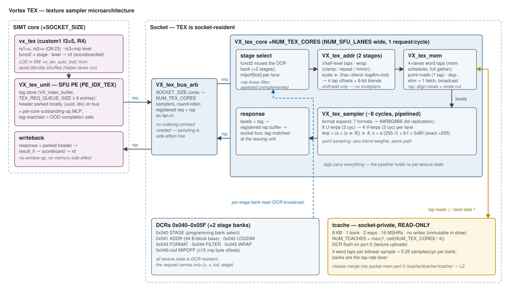
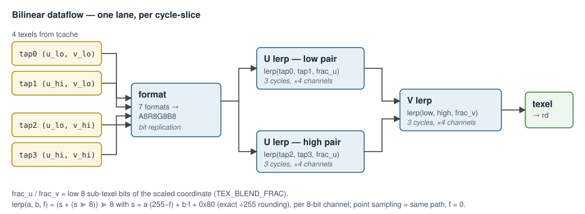

# Texture Sampler (TEX) Microarchitecture — Design

**Scope:** the complete texture-sampler subsystem — the `vx_tex` ISA surface
and its SIMT-pipeline integration, the texture memory ABI (coordinates,
formats, mip chain, DCR state), the sampler pipeline microarchitecture
(address generation → texel fetch → filtering), the tcache memory interface,
and the parallelism/scaling model. Covers the RTL
([`hw/rtl/tex/`](../../hw/rtl/tex/)), the SIMT-side hookup
([`VX_sfu_unit.sv`](../../hw/rtl/core/VX_sfu_unit.sv),
[`VX_decode.sv`](../../hw/rtl/core/VX_decode.sv)), the socket integration
([`VX_socket.sv`](../../hw/rtl/VX_socket.sv)), the SimX model
([`sim/simx/tex/`](../../sim/simx/tex/)), and the software contract
([`vx_graphics.h`](../../sw/kernel/include/vx_graphics.h),
[`sw/common/vx_tex_lod.h`](../../sw/common/vx_tex_lod.h)).

The wider graphics stack is in
[`graphics_hardware_stack.md`](graphics_hardware_stack.md); the companion
deep-dives are [`rasterizer_architecture.md`](rasterizer_architecture.md) and
[`output_merger_architecture.md`](output_merger_architecture.md).

---

## 1. Overview

TEX is a **socket-resident fixed-function sampler**: each SIMT core carries a
thin per-core front end (`VX_tex_unit`, an SFU processing element), and the
socket hosts the shared sampler back ends (`VX_tex_core`) plus a private,
read-only texture cache (**tcache**). A texture sample is a scoreboarded
register-to-register operation:

1. The shader issues `vx_tex` with `(u, v, lod)` in registers; the texel
   returns in `rd`.
2. The per-core unit tags the request and forwards it over the socket's
   texture bus; a round-robin arbiter funnels the socket's cores onto the
   sampler cores.
3. The sampler selects the stage's DCR bank, generates the 2×2 tap addresses,
   fetches texels through the tcache, expands the format, and bilinearly
   blends — all fixed-point, fully pipelined, out-of-order-completion-safe
   via tags.

Everything per-texture (base address, dimensions, format, filter, wrap, mip
offsets) is **DCR state**, programmed per draw; the only per-request operands
are the coordinates, the integer mip level, and the stage index.

---

## 2. ISA surface and SIMT integration

### 2.1 `vx_tex`

`custom1` (0x2B) funct3=5, R4-type, decoded to `EX_SFU` / `INST_SFU_TEX`
([`VX_decode.sv`](../../hw/rtl/core/VX_decode.sv)):

| field | meaning |
|---|---|
| `rs1` | `u` coordinate (Q9.23 fixed-point, normalized) |
| `rs2` | `v` coordinate |
| `rs3` | integer mip level (explicit — see §2.3) |
| `funct2` | `stage` — which of the `VX_TEX_STAGE_COUNT` (2) texture stages to sample |
| `rd` | texel, A8R8G8B8, via scoreboarded writeback |

### 2.2 The per-core SFU PE — `VX_tex_unit`

[`VX_tex_unit.sv`](../../hw/rtl/tex/VX_tex_unit.sv) occupies the
`PE_IDX_TEX` slot of [`VX_sfu_unit`](../../hw/rtl/core/VX_sfu_unit.sv)
(`NUM_LANES = VX_CFG_NUM_SFU_LANES` wide, one request per SIMD block):

- **Tag store** (`VX_index_buffer`, `VX_CFG_TEX_REQ_QUEUE_SIZE` entries):
  each issued request acquires an index and parks its writeback header (wid,
  tmask, PC, rd, …) locally; only `{uuid, index}` travels on the bus. The
  queue size is therefore the core's **texture memory-level parallelism** —
  how many `vx_tex` ops the core can have in flight — and is deliberately
  sized by latency-to-hide (`max(8, 2·NT/SFU_LANES)`), not by SIMD group
  count.
- Requests and responses pass through small registered elastic buffers (the
  socket bus is registered at both ends). Responses reassemble the
  `sfu_result_t` from the tag store and retire straight to `result_if` — the
  texel goes to `rd`; there is no window op and no memory side effect.
- Because completion is tag-matched, the unit tolerates out-of-order
  responses, and the scoreboard pipelines back-to-back `vx_tex` ops from the
  same or different warps up to the tag-store depth.

### 2.3 LOD is software, derivatives are the quad's

There is no hardware LOD calculation: the lod operand names the level. A
fragment shader derives it with
`vx_tex_auto_lod()` ([`sw/common/vx_tex_lod.h`](../../sw/common/vx_tex_lod.h)):
cross-lane `vx_quad_ddx/ddy` shuffles produce the four gradients, and
`floor(log2(max_gradient))` selects the level — bit-identical to the
host/SimX `vx_tex_quad_lod()` form by construction. This is why helper lanes
run in the fragment model: every lane of the quad must be active or the
derivative collapses.

The mip-linear filter bit changes how the lod operand reads. Without it the
operand is an integer level and one level is sampled. With it the unit samples
**both** bracketing levels in a single request — one tap set per level, so no
stage has to pair two responses — and lerps them by a weight the operand carries
in its low `VX_TEX_LOD_FRAC_BITS`. A caller that never asks for a blend
therefore never has to know about the fractional form.

The earlier `vx_tex4` windowed quad form (one thread holding a whole 2×2
quad, hardware LOD tree, four serialized samples per op) is **retired**;
`VX_tex_csr` survives only as an uninstantiated stub.

---

## 3. ABI — coordinates, formats, memory layout

### 3.1 Coordinates

32-bit two's-complement fixed-point with
`TEX_FXD_FRAC = VX_TEX_DIM_BITS + VX_TEX_SUBPIXEL_BITS = 15 + 8 = 23`
fractional bits — i.e. **Q9.23 normalized** (1.0 = `1 << 23`). The integer
bits carry wrap repetitions; the 8 sub-texel bits (`TEX_BLEND_FRAC`) become
the bilinear blend weights. Addressing modes per axis: `CLAMP`, `REPEAT`
(default), `MIRROR` and `BORDER`.

Under `BORDER` a tap whose coordinate leaves `[0, 1)` returns `TEX_BORDER`
instead of a texel. The out-of-range test costs no comparator — a coordinate is
outside exactly when anything above its fractional field is set, an integer part
or the sign bits of a negative one, so `VX_tex_wrap` OR-reduces those bits on the
coordinate it receives *before* wrapping. The address itself still clamps: the
tap is fetched and then discarded, so it only has to be one the texture owns.
`VX_tex_addr` already forms the low and high coordinate of each axis per mip
level, so the four per-tap flags fall out of those — per level too, since the
half-texel offset scales with the level and a trilinear sample can be inside the
texture at one level and outside at the next. The substitution happens in
`VX_tex_sampler` after the format decode and before the blend, because the
border colour is already in the sampler's working format while a fetched texel
is still in the texture's.

### 3.2 Texel formats

Seven fixed-function formats, expanded to A8R8G8B8 at the sampler's format
stage (low-bit replication for the narrow channels):

| format | stride | expansion |
|---|---|---|
| `A8R8G8B8` | 4 B | identity |
| `R5G6B5`, `A1R5G5B5`, `A4R4G4B4`, `A8L8` | 2 B | replicate high bits into low |
| `L8`, `A8` | 1 B | luminance/alpha splat |

### 3.3 Texture memory layout

Row-major, power-of-two dimensions (`LOGDIM` holds `log2(w)`, `log2(h)`;
`VX_TEX_DIM_BITS = 15` caps a dimension at 32K). The mip chain is a table of
byte offsets: texel address =
`(baseaddr << 6) + mipoff[lod] + (y << (log2(w) − lod) + log2stride) + (x << log2stride)`
— `baseaddr` is a 64-byte-block address, and all scaling is shifts (the
power-of-two constraint is what keeps the address path multiplier-free). Up
to `VX_TEX_LOD_MAX = 15` mip levels per stage.

### 3.4 DCR state (0x040–0x05F)

Latched in [`VX_tex_dcr.sv`](../../hw/rtl/tex/VX_tex_dcr.sv), broadcast; the
unit keeps `VX_TEX_STAGE_COUNT = 2` independent register banks
(multi-texturing):

| addr | name | semantics |
|---|---|---|
| 0x040 | `TEX_STAGE` | selects which stage bank subsequent DCR writes program |
| 0x041 | `TEX_ADDR` | texture base, 64-byte-block address |
| 0x042 | `TEX_LOGDIM` | `{log2(h)[16+], log2(w)[0+]}` |
| 0x043 | `TEX_FORMAT` | one of the 7 formats (§3.2) |
| 0x044 | `TEX_FILTER` | point / bilinear (bit 0); mip-linear above it (§2) |
| 0x045 | `TEX_WRAP` | `{v_wrap[16+], u_wrap[0+]}` |
| 0x046+lod | `TEX_MIPOFF(lod)` | byte offset of mip level *lod* from base, `lod <= VX_TEX_LOD_MAX` — the table is `VX_TEX_LOD_MAX + 1` entries and ends at 0x055, because a sampler's lod clamp is independent of the chain length and the top level is a reachable request |
| 0x056 | `TEX_BORDER` | colour a `BORDER` tap returns, ARGB8888 (§3.1) |

At request time the **instruction's** `stage` field muxes the bank
combinationally — programming-time and sample-time stage selection are
independent.

---

## 4. The sampler pipeline — `VX_tex_core`

One `VX_tex_core` instance per socket sampler
([`VX_tex_core.sv`](../../hw/rtl/tex/VX_tex_core.sv)), `NUM_SFU_LANES` wide,
every stage valid/ready-elastic and able to accept one request per cycle:

### 4.1 Stage select + setup

The request's `stage` selects the DCR bank; the per-lane mip level indexes
`mipoff[]`. A registered elastic buffer decouples the socket bus.

### 4.2 Address generation — `VX_tex_addr` (2 pipeline stages)

[`VX_tex_addr.sv`](../../hw/rtl/tex/VX_tex_addr.sv), shift/add only:

- **Stage 0**: for bilinear, offset the coordinate by ±half-texel
  (`half << miplevel >> logdim` — the half-texel in normalized space);
  apply the wrap mode per axis (`VX_tex_wrap`: clamp-saturate / mirror-XOR /
  repeat-truncate); derive the per-format `log2(stride)`
  (`VX_tex_stride`), the mip-adjusted row pitch, and the mip base
  `(baseaddr ≪ 6) + mipoff[lod]`.
- **Stage 1**: scale the wrapped coordinates to texel space
  (`coord >> (FRAC − BLEND − (logdim − lod))`), split integer/fraction —
  the low 8 fraction bits become the **blend weights** — and form the four
  tap byte-offsets `{v_lo, v_hi} × {u_lo, u_hi}` with shifts and adds.
  Point sampling emits one tap and zero blends.

### 4.3 Texel fetch — `VX_tex_mem`

[`VX_tex_mem.sv`](../../hw/rtl/tex/VX_tex_mem.sv) issues
`TEX_MEM_REQS = 4 × NUM_SFU_LANES` word reads per request through a
`VX_mem_scheduler` (`CORE_QUEUE_SIZE = VX_CFG_TEX_MEM_QUEUE_SIZE`, full
gather, registered SLR-skid output) into the tcache banks. Two demand
reducers:

- **Point-sample masking**: only tap 0 is fetched when filtering is off.
- **Duplicate elimination**: per tap, if every active lane addresses the
  same texel (common under magnification or flat-shaded UV), one lane
  fetches and the response broadcasts.

Sub-word formats are handled on the response: the word is byte-rotated by
the address alignment and truncated by the format stride, so the cache side
stays a plain 4-byte-word interface.

### 4.4 Filtering — `VX_tex_sampler`

[`VX_tex_sampler.sv`](../../hw/rtl/tex/VX_tex_sampler.sv):

1. **Format expand** (combinational + register): the four taps × lanes
   through `VX_tex_format` to A8R8G8B8.
2. **U lerps**: per lane, 8 `VX_tex_lerp` instances (4 channels × {low, high}
   texel pairs), each a 3-cycle fixed-point datapath computing
   `(s + (s >> 8)) >> 8` with `s = a·(255−f) + b·f + 0x80` — the exact
   divide-by-255 rounding, not a plain shift.
3. **V lerp**: 4 more lerps blend the two U results, another 3 cycles.

The whole sampler is ~8 cycles fixed latency, one request per cycle
throughput, per-channel 8-bit arithmetic — no floating-point anywhere (the
FF invariant). Point samples ride the same path with zero blend weights (the
lerps collapse to pass-through).

---

## 5. Memory interface — the tcache

Per socket, a **read-only** `VX_cache_cluster`
(`WRITE_ENABLE = 0`, no writeback — textures are immutable within a draw):
8 KB, 1 bank, 2 ways, 16 MSHRs by default;
`VX_CFG_NUM_TCACHES = max(1, ⌈NUM_TEX_CORES/4⌉)` instances. Port 0 carries
the DCR-triggered **flush** path (`VX_dcr_flush`) so the host can invalidate
after texture uploads. tcache miss traffic merges into the socket's memory
port 0 arbiter alongside icache/dcache/rtcache/DXA traffic — TEX has no
dedicated path to L2, which is fine because the tcache's job is precisely to
keep tap traffic on-socket.

Demand arithmetic: a bilinear sample is 4 word taps and a bank serves one
word per cycle, so one bank sustains **0.25 bilinear samples per cycle**
(independent of lane width — an N-lane request just occupies the bank for
4N cycles). Duplicate elimination and point sampling raise it; bank count
is the structural lever (same shape as the OM's ocache argument).

---

## 6. Parallelism and scaling

| axis | mechanism | knob |
|---|---|---|
| per-core MLP | tag store: outstanding `vx_tex` ops per core | `VX_CFG_TEX_REQ_QUEUE_SIZE` (≥8) |
| cores per socket | RR `VX_tex_bus_arb` fan-in (registered when fan-in ≠ 1:1) | `VX_CFG_SOCKET_SIZE` |
| sampler cores | independent `VX_tex_core` pipelines per socket | `VX_CFG_NUM_TEX_CORES` |
| lanes | `NUM_SFU_LANES`-wide datapath end to end | `VX_CFG_NUM_SFU_LANES` |
| tap bandwidth | tcache banks × instances | `VX_CFG_TCACHE_NUM_BANKS`, `NUM_TCACHES` |

Structural properties worth naming: the pipeline is **stateless per
request** (all texture state is DCR-resident, all request state rides the
tag), so sampler cores scale with zero cross-unit coupling; completion is
tag-matched end to end, so nothing anywhere depends on response order; and
requests from different cores interleave freely at the socket arb — there is
no inter-request ordering contract at all, because sampling has no side
effects. TEX is the *easiest* of the three FF units to scale for exactly
that reason: every serialization point is a knob, none is a protocol.

Texture state is **draw-global, not per-warp**: two draws with different
textures cannot overlap in the engine (DCR reprogramming is the fence),
which is the standard mobile-class FF trade.

## 7. SimX model and performance counters

[`sim/simx/tex/`](../../sim/simx/tex/): `TexUnit` mirrors the per-core PE
(operand decode, stage select, tag round-trip) and `TexCore` the socket
sampler — same address math, same dup-elimination, same lerp arithmetic
(shared fixed-point helpers with the host reference), driving real
`MemReq`/`MemRsp` tcache traffic for cycle parity on the `graphics_parity`
matrix. SimX additionally models trilinear filtering, which the RTL does not
implement — SimX remains the oracle for it.

Perf: MPM class `TEX` (13) — memory reads, accumulated outstanding-read
latency, and request stall cycles per sampler core, summed per socket.

## 8. Configuration

| knob | default | meaning |
|---|---|---|
| `VX_CFG_NUM_TEX_CORES` | `max(1, ⌈cores/8⌉)` | sampler cores per socket |
| `VX_CFG_TEX_REQ_QUEUE_SIZE` | `max(8, 2·NT/SFU_LANES)` | per-core outstanding ops (MLP) |
| `VX_CFG_TEX_MEM_QUEUE_SIZE` | = REQ_QUEUE_SIZE | sampler mem-scheduler queue |
| `VX_CFG_TCACHE_SIZE / NUM_BANKS / NUM_WAYS / MSHR_SIZE` | 8 KB / 1 / 2 / 16 | tcache geometry (banks = tap-rate lever) |
| `VX_CFG_NUM_TCACHES` | `max(1, ⌈NUM_TEX_CORES/4⌉)` | tcache instances per socket |
| `VX_TEX_STAGE_COUNT` | 2 | texture stages (DCR banks) |

The RTL is XLEN-clean (`TEX_ADDR_BITS` = 25/32 for 32/64-bit builds).
