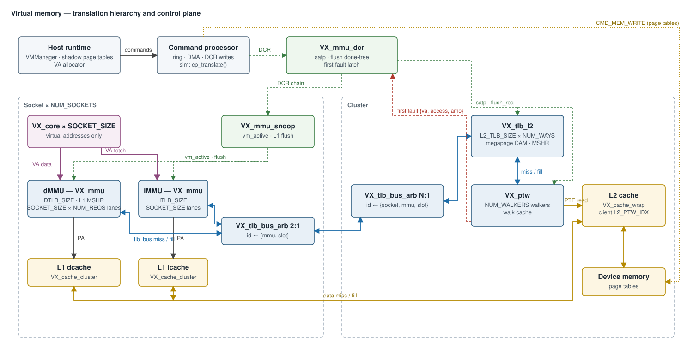
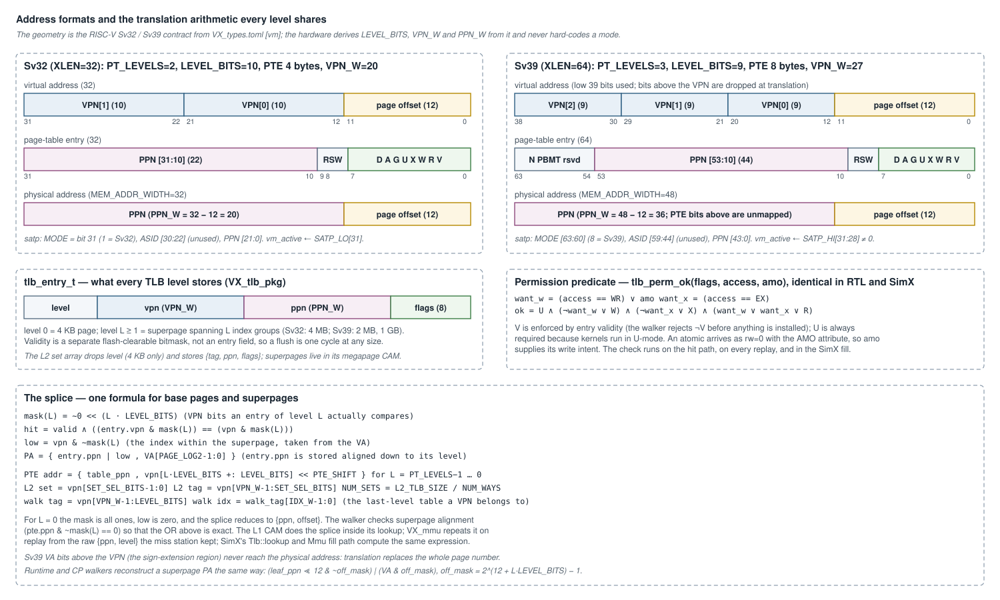
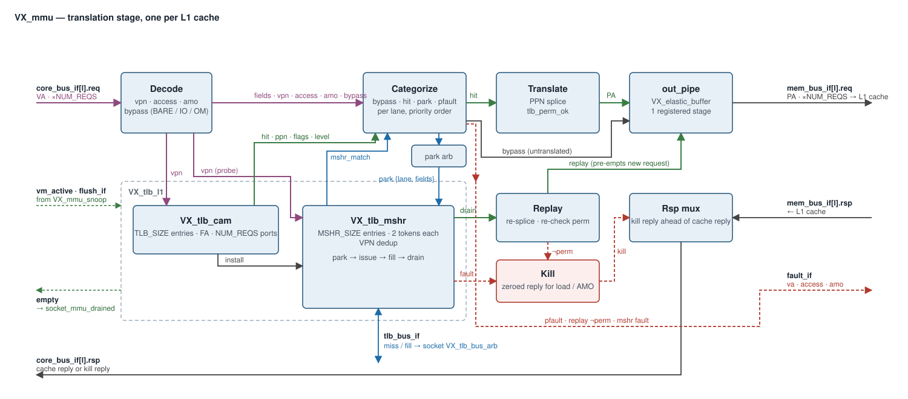
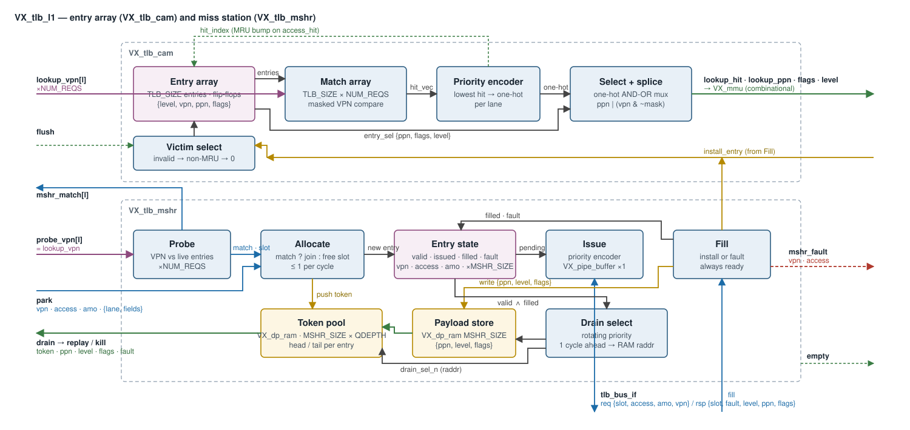
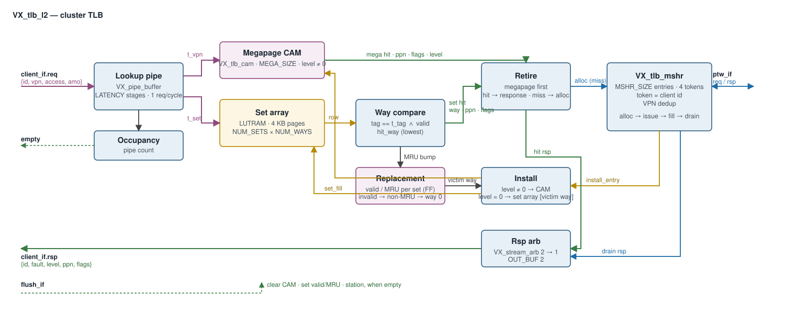
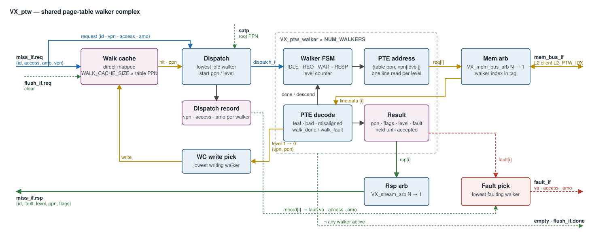
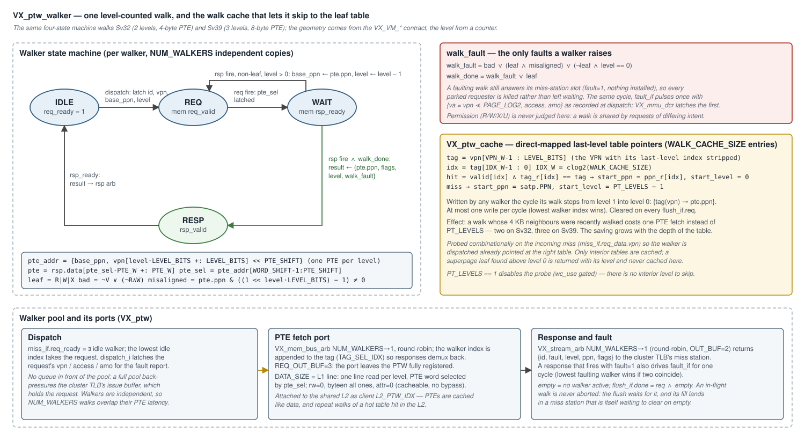
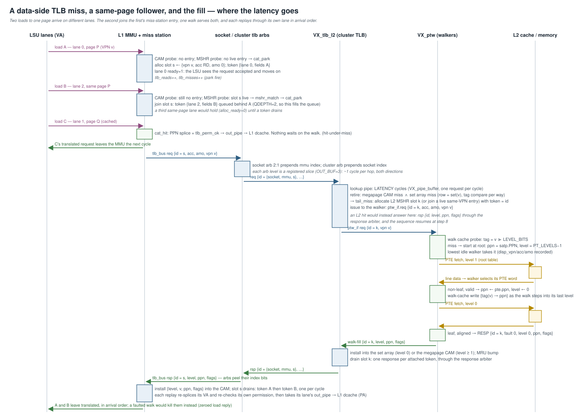
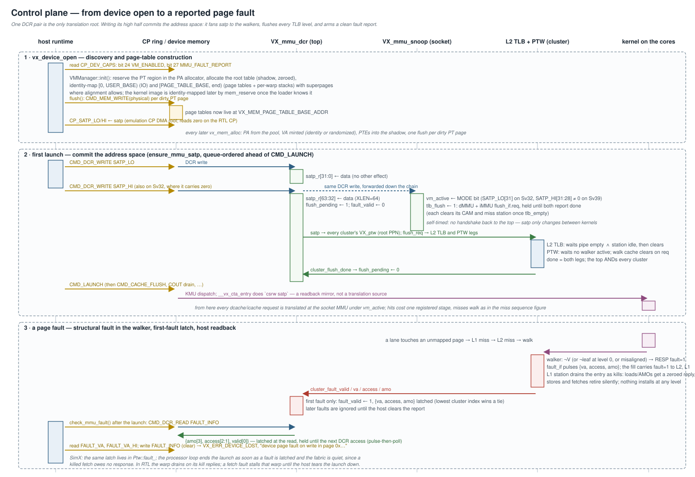

# Virtual Memory (MMU / TLB / PTW) — Design

**Scope:** the complete Vortex virtual-memory subsystem — the Sv32/Sv39
page-table contract, the socket-level L1 translation stage (`VX_mmu` over
`VX_tlb_l1`), the narrow miss/fill fabric (`VX_tlb_bus_if`,
`VX_tlb_bus_arb`), the shared cluster TLB (`VX_tlb_l2`), the multi-walker
page-table walker complex (`VX_ptw`, `VX_ptw_walker`, `VX_ptw_cache`), the
DCR control plane (`VX_mmu_dcr`, `VX_mmu_snoop`) with its flush tree and
first-fault latch, the SimX model, the host runtime's page-table manager, and
the verification surface. Covers the RTL ([`hw/rtl/vm/`](../../hw/rtl/vm/)),
the socket / cluster / top integration
([`VX_socket.sv`](../../hw/rtl/VX_socket.sv),
[`VX_cluster.sv`](../../hw/rtl/VX_cluster.sv),
[`Vortex.sv`](../../hw/rtl/Vortex.sv)), the SimX model
([`sim/simx/mem/`](../../sim/simx/mem/)), and the software contract
([`VX_types.toml`](../../VX_types.toml) `[vm]`, `[dcr_mmu]`, `[mmu_fault]`,
[`sw/common/vm_types.h`](../../sw/common/vm_types.h),
[`sw/runtime/common/vm.{cpp,h}`](../../sw/runtime/common/vm.cpp)).

The cache hierarchy the translated requests flow into is in
[`cache_subsystem.md`](cache_subsystem.md); the command processor whose DMA
engine translates on the host's behalf is in
[`command_processor.md`](command_processor.md) §8; the build-configuration
layering that splits the `VX_VM_*` contract from the `VX_CFG_*` knobs is in
[`build_configuration_system.md`](build_configuration_system.md).

VM is gated by `VX_CFG_VM_ENABLE` (default off,
[`VX_config.toml`](../../VX_config.toml) `[vm]`). Without it every module
below is absent and the core-side and cache-side buses pass straight through.



---

## 1. Overview

Vortex translates virtual addresses **at the socket, after the coalescer**,
with a two-level TLB hierarchy and a shared walker, the shape mainstream GPUs
use: small per-L1 TLBs that translate many lanes per cycle, a larger shared
TLB one level up, and a centralized page-table walker with a walk cache. The
subsystem has five load-bearing properties:

1. **Translation is a lane-parallel, hit-under-miss stage.** Every request
   lane probes the L1 CAM in the same cycle; a hit is spliced and
   permission-checked in place and leaves through a registered output stage.
   A miss parks in a VPN-dedup miss station and the lane keeps accepting
   requests. Only same-page order is guaranteed, which is exactly what the
   caches behind it need.
2. **Misses ride a narrow fabric, not the memory bus.** A TLB miss carries a
   VPN, an access kind, and an AMO bit; a fill carries `{ppn, level, flags,
   fault}`. Two orders of magnitude narrower than a `VX_mem_bus_if` lane, so
   the socket and cluster arbiter trees are cheap, and the only MMU signal that
   crosses the socket boundary is this bus.
3. **One walk per page, at every level.** The L1 miss station, the cluster
   TLB's miss station, and the walker pool each dedup on VPN. Two lanes,
   two cores, or two sockets missing on the same page share a single walk
   and every attached requester is answered by its fill.
4. **The walker is level-counted, not mode-specific.** The same
   `IDLE → REQ → WAIT → RESP` machine walks Sv32 and Sv39; the geometry
   (`LEVEL_BITS`, `PTE_SIZE`, `PT_LEVELS`) comes from the `VX_VM_*`
   contract. A direct-mapped walk cache of last-level table pointers lets a
   spatially-adjacent walk skip the interior fetches. Superpage leaves are
   returned with their level and stored as single entries.
5. **One translation root.** The page-table root is a DCR pair
   (`VX_DCR_MMU_SATP_LO/HI`) the runtime programs once before the first launch.
   The high write commits the address space: it fans `satp` to every
   walker, flushes every TLB level through a done-tree, and arms a clean
   fault report. The per-core `satp` CSR is a readback mirror only.

Faults are **reported, not trapped**. A structural fault in the walker
(invalid PTE, no leaf, misaligned superpage) kills the parked accesses so the
warp can drain, and latches `{va, access, amo}` in a first-fault register the
host reads back after the launch. Permission faults are caught against cached
translations at L1 and killed the same way.

---

## 2. The address-space contract

### 2.1 Page-table geometry

The format is the RISC-V privileged-spec Sv32 / Sv39 layout, selected by
XLEN in [`VX_types.toml`](../../VX_types.toml) `[vm]` and consumed by the
hardware, the simulators, the runtime and the kernel start-up code alike:

| constant | Sv32 (XLEN=32) | Sv39 (XLEN=64) | meaning |
|---|---|---|---|
| `VX_VM_ADDR_MODE` | `SV32` | `SV39` | satp mode written by the runtime |
| `VX_VM_PT_LEVEL` | 2 | 3 | page-table levels (`PT_LEVELS`) |
| `VX_VM_PTE_SIZE` | 4 | 8 | bytes per PTE |
| `VX_VM_PAGE_LOG2_SIZE` | 12 | 12 | 4 KB base page |
| `VX_VM_PT_SIZE` | 4 KB | 4 KB | one table = one page |
| `VX_VM_PT_SIZE_LIMIT` | 8 MB | 32 MB | page-table region at `VX_MEM_PAGE_TABLE_BASE_ADDR` |

From these [`VX_tlb_pkg.sv`](../../hw/rtl/vm/VX_tlb_pkg.sv) derives
`TLB_LEVEL_BITS = log2(PT_SIZE / PTE_SIZE)` (10 / 9),
`TLB_VPN_WIDTH = PT_LEVELS × LEVEL_BITS` (20 / 27),
`TLB_PPN_WIDTH = MEM_ADDR_WIDTH − 12` (20 / 36), and `TLB_LEVEL_WIDTH`
(the page-level index: 0 = base page, `L` = superpage spanning `L` index
groups). SimX computes `TLB_VPN_LEVEL_BITS` the same way in
[`tlb_types.h`](../../sim/simx/mem/tlb_types.h). Nothing in the RTL
hard-codes a mode; the walker is a loop over `PT_LEVELS`.



### 2.2 The translation splice

Every level stores a `tlb_entry_t = {level, vpn, ppn, flags}` and every
level translates with the same three expressions:

```
mask(L) = ~0 << (L · LEVEL_BITS)                         VPN bits an entry of level L compares
hit     = valid ∧ ((entry.vpn & mask(L)) == (vpn & mask(L)))
PA      = { entry.ppn | (vpn & ~mask(L)) , VA[11:0] }    entry.ppn stored aligned down to its level
```

For a base page `mask(0)` is all ones and the splice collapses to
`{ppn, offset}`. For a superpage the intra-page index comes from the VA and
is OR-ed into the aligned PPN; the walker checks the alignment
(`pte.ppn & ~mask(L) == 0`) so the OR is exact. The L1 CAM does the splice
inside its lookup ([`VX_tlb_cam.sv`](../../hw/rtl/vm/VX_tlb_cam.sv)), `VX_mmu`
repeats it on every replay from the raw `{ppn, level}` the miss station
kept, and SimX's `Tlb::lookup` and fill path compute the identical
expression. The runtime and the emulation CP reconstruct a superpage PA the
same way (`(leaf_ppn << 12 & ~off_mask) | (VA & off_mask)`).

### 2.3 Permissions

[`tlb_perm_ok`](../../hw/rtl/vm/VX_tlb_pkg.sv) is one function shared by the
walker and every TLB level, and mirrored verbatim in SimX:

```
want_w = (access == WR) ∨ amo
want_x = (access == EX)
ok     = U ∧ (¬want_w ∨ W) ∧ (¬want_x ∨ X) ∧ (want_w ∨ want_x ∨ R)
```

`V` is enforced by entry validity (the walker rejects `¬V` before anything is
installed). `U` is always required because kernels run in U-mode. An atomic
arrives as `rw = 0` carrying the AMO attribute, so `amo` supplies its write
intent. The check runs on the L1 hit path, on every replay, and in the SimX
fill — never in the walker, because a walk is shared by requests of differing
intent and a check there would judge them all by whichever one allocated it.
The runtime sets `V|R|X|U|A|D` on every leaf and adds `W` for
`VX_MEM_WRITE` buffers; `A`/`D` are pre-set because the device never writes
them back.

### 2.4 What is translated, and what is not

`VX_mmu` bypasses translation for a request when
`¬vm_active ∨ attr[FLUSH] ∨ attr[IO] ∨ attr[OM]`: BARE mode (satp not yet
programmed), cache-flush injections, and the IO / OM apertures, which carry
device registers or encoded coordinates rather than virtual addresses. There
is **no address-range bypass**. Instead the runtime identity-maps at open
every PA-addressed region the kernel touches — `[0, VX_MEM_USER_BASE_ADDR)`
(IO) and `[VX_MEM_PAGE_TABLE_BASE_ADDR, end)` (page tables and the per-warp
stacks), using superpages where alignment permits — and identity-maps the
kernel image once the loader knows its extents. Buffers allocated with
`VX_MEM_PHYS` come from a pinned, identity-mapped slab
(`VX_CFG_VM_PINNED_REGION_SIZE`), so a kernel can hold PA-stable pointers
while paged and identity translations contend in the same TLBs.

The graphics fixed-function masters (RASTER, TEX, OM) and the RTU issue
physical addresses and never pass through an MMU; see
[`graphics_hardware_stack.md`](graphics_hardware_stack.md).

---

## 3. The L1 stage — `VX_mmu` over `VX_tlb_l1`

### 3.1 Placement

Translation sits **at the socket, between the cores and the L1 caches**
([`VX_socket.sv`](../../hw/rtl/VX_socket.sv)). One dMMU serves
`SOCKET_SIZE × DCACHE_NUM_REQS` lanes (every core's coalesced dcache
ports) and feeds `dcache_phys_bus_if`; one iMMU serves `SOCKET_SIZE` fetch
lanes and feeds `icache_phys_bus_if`. The core emits virtual addresses only:
`VX_core` passes its dcache / icache buses straight through and takes its
`mmu_drained` status from the socket, so barrier and busy logic waits for
in-flight translations. Placing the MMU after the coalescer means it sees
coalesced requests, which are fewer than lanes, and that a socket's cores
share one set of entries.


### 3.2 The parent–storage split

[`VX_mmu.sv`](../../hw/rtl/vm/VX_mmu.sv) is *translation*: it decodes each
lane, drives the VPN probes, categorises the outcome, splices PPNs, checks
permissions, owns the output stage, the `tlb_bus` to the walker complex, and
the fault sideband. [`VX_tlb_l1.sv`](../../hw/rtl/vm/VX_tlb_l1.sv) is
*storage*: the fully-associative entry array
([`VX_tlb_cam.sv`](../../hw/rtl/vm/VX_tlb_cam.sv)) plus the non-blocking miss
station ([`VX_tlb_mshr.sv`](../../hw/rtl/vm/VX_tlb_mshr.sv)), with no address
arithmetic of its own. The split keeps "TLB = lookup" explicit and lets the
storage be reused by the cluster TLB's megapage side array.



### 3.3 The hit path

Each lane packs its request once (`req_fields = {rw, addr, data, byteen,
attr, tag}`), extracts `vpn`, `access` (`EX` on the instruction side, else
`WR`/`RD` from `rw`) and `amo`, and probes the CAM and the miss station in
parallel. The CAM compares every entry under its own superpage mask, resolves
the lowest matching index through a priority encoder, and selects the
winner's `{ppn, flags, level}` with a one-hot AND-OR mux — off the index cone
— then splices the low VPN bits into the PPN. The four lane categories are
mutually exclusive by priority:

| category | condition | what happens |
|---|---|---|
| `cat_bypass` | `valid ∧ req_bypass` | fields forwarded unchanged |
| `cat_hit` | `valid ∧ ¬bypass ∧ ¬mshr_match ∧ cam_hit ∧ perm_ok` | `PA = {ppn_spliced, addr[11:0]}` forwarded; MRU bump |
| `cat_park` | `valid ∧ ¬bypass ∧ (mshr_match ∨ ¬cam_hit)` | lowest parking lane parks; others hold and retry |
| `cat_pfault` | `valid ∧ ¬bypass ∧ ¬mshr_match ∧ cam_hit ∧ ¬perm_ok` | accepted and dropped; fault sideband pulses |

`mshr_match` outranks `cam_hit` on purpose: a request to a page whose walk is
still landing must queue behind that page's parked requests, or a same-lane
access could overtake an older one on the hit path (§3.5). Bypass and hit
requests enter a per-lane `VX_elastic_buffer` (`SIZE=2, OUT_REG=1`) that
registers the outgoing request and presents a registered `pipe_ready`
back, so the accept cone stays shallow; a replay landing on the lane takes
the slot first and the new request waits a cycle. A hit therefore costs one
registered stage.

### 3.4 The miss station



`VX_tlb_mshr` holds `MSHR_SIZE` entries (`VX_CFG_L1_TLB_MSHR_SIZE`, 4),
each with a `QDEPTH`-deep queue of opaque requester tokens (2 at L1; a token
is `{lane, req_fields}`). Its four operations:

1. **Park / allocate.** `alloc_target = match ? match_slot : free_slot`.
   The allocate path reuses the probing lane's dedup result so the wide
   compare stays off the enqueue path. `alloc_ready = ¬flush ∧ (match ?
   ¬q_full : has_free)`; at most one lane parks per cycle.
2. **Issue.** The first `valid ∧ ¬issued` entry is registered into an
   issue buffer and leaves as `tlb_bus req {id = slot, access, amo, vpn}`.
3. **Fill.** Always accepted — the issuing entry is its own landing slot.
   `¬fault`: `install_entry = {level, vpn_r[id], ppn, flags}` goes to the
   CAM, whose victim is the first invalid entry, else the first non-MRU
   entry, else slot 0 (with all MRU bits cleared). `fault`: nothing is
   installed and `fault_r[id]` is set. The fill's `{ppn, level, flags}` is
   kept per entry for the drain.
4. **Drain.** One token per cycle. The drain selection is computed one cycle
   ahead from `(valid ∧ filled) | landing fill`, rotated by a pointer that
   advances past each pop, and presented as the RAM read address — so the
   token and payload RAMs read with registered addresses and add no latency,
   and an entry fed a steady join stream cannot starve the others. An entry
   frees when its queue empties.

The associative state (`valid`, `vpn`, `issued`, `filled`, `fault`) is
flip-flops, because an all-entry parallel compare cannot come from an
addressable RAM; the wide payloads (token pool, fill result) live in
`VX_dp_ram` with registered reads. One size-independent timing contract.

### 3.5 Replay, kill, and ordering

A drained token with `¬fault` **replays**: `VX_mmu` re-splices its VA from
the kept `{ppn, level}`, re-checks `tlb_perm_ok` with the token's *own*
access and AMO intent (the walk's check covered only the request that
allocated the entry), and forwards it into its lane's output stage ahead of
new input. A token drained with `fault`, or a replay whose permission check
fails, is **killed**: the access never reaches memory, but a data-side load
or atomic still owes the pipeline a response, so `VX_mmu` injects a zeroed
response carrying the parked tag ahead of the cache reply for that lane
(`kill_needs_rsp = (EXEC_SIDE == 0) ∧ (¬rw ∨ amo)`). A plain store and every
instruction fetch retire silently — a fabricated instruction word would be
decoded as real.

Ordering follows from the structure. The stage is hit-under-miss, so only
same-page order is guaranteed: accesses to one VPN share an entry and drain in
arrival order, and the miss-station probe matches filled-but-not-yet-freed
entries so a later same-page request cannot slip past on the hit path.
`DEDUP_LIVE_EXCLUDES_FAULT = 1` at L1 stops a faulted entry attracting
joiners: the next same-VPN request re-walks rather than inheriting the kill.
Allocation is refused during a flush, because every entry clears at that
edge and an accepted request would vanish with neither replay nor kill.

### 3.6 Flush and drain

`flush_clear = flush_if.req ∧ tlb_empty`: the CAM and the miss station clear
together, only once no walk is outstanding, and `flush_if.done` reports the
same condition. `empty` — no request in the incoming or output stage and the
miss station idle — feeds `socket_mmu_drained = dmmu.empty ∧ immu.empty`,
which every core's busy logic waits on. Omitting the incoming stage would let
`empty` assert a cycle early while a request is still in flight.

### 3.7 The instruction side

The iMMU is the same module with `EXEC_SIDE = 1`: `access = EX` for every
request, one lane per core, `ITLB_SIZE` (8) entries. Fetch reaches it through
`VX_dcr_flush`, which injects the DCR-triggered cache-flush request into the
icache stream; that request carries the FLUSH attribute and bypasses
translation.

---

## 4. The miss/fill fabric

[`VX_tlb_bus_if.sv`](../../hw/rtl/vm/VX_tlb_bus_if.sv) is a valid/ready
pair in each direction:

| channel | fields |
|---|---|
| `req` | `id` (requester slot), `access` (RD/WR/EX), `amo`, `vpn` |
| `rsp` | `id`, `fault`, `level`, `ppn`, `flags` |

[`VX_tlb_bus_arb.sv`](../../hw/rtl/vm/VX_tlb_bus_arb.sv) folds `N` masters
into one: requests round-robin through a `VX_stream_arb` and the grant index
is **prepended to the id** (the id is the top field of `req_data`, so
prepending widens it); responses route back through a `VX_stream_switch`
keyed on those bits, which are peeled off. Each level is one registered
elastic slice (`OUT_BUF = 3`). The id therefore grows deterministically
([`VX_gpu_pkg.sv`](../../hw/rtl/VX_gpu_pkg.sv)):

```
L1_TLB_ID_WIDTH      = clog2(L1_TLB_MSHR_SIZE)                 the L1 miss-station slot
TLB_SOCKET_ID_WIDTH  = L1_TLB_ID_WIDTH + sel(2)                 + {dMMU, iMMU}
TLB_CLUSTER_ID_WIDTH = TLB_SOCKET_ID_WIDTH + sel(NUM_SOCKETS)   + socket
```

The socket arbiter merges the dMMU and iMMU ports onto `cluster_tlb_bus_if`,
the cluster arbiter merges every socket onto the cluster TLB's client port.
A fill routes back to exactly one L1 slot with no table lookups anywhere.

---

## 5. The cluster TLB — `VX_tlb_l2`

[`VX_tlb_l2.sv`](../../hw/rtl/vm/VX_tlb_l2.sv) is a latency-deep,
one-request-per-cycle lookup engine in front of the walker:



- **Lookup pipe.** A `VX_pipe_buffer` of depth `LATENCY`
  (`VX_CFG_L2_TLB_LATENCY`, 4) carries `{id, vpn, access, amo}`; a
  request retires from its head once its outcome is placed. An occupancy
  counter drives `empty`.
- **Main array.** `NUM_ENTRIES / NUM_WAYS` sets
  (`VX_CFG_L2_TLB_SIZE` 512, `VX_CFG_L2_TLB_NUM_WAYS` 4), one LUTRAM row per
  set holding every way's `{tag, ppn, flags}`, `set = vpn[SET_SEL_BITS-1:0]`,
  `tag = vpn[VPN_W-1:SET_SEL_BITS]`. 4 KB pages only. Victim: first invalid
  way, else first non-MRU, else way 0 with the set's MRU bits cleared.
- **Megapage side array.** A `VX_tlb_cam` of `VX_CFG_L2_TLB_MEGA_SIZE` (8)
  entries, probed in parallel with the set array, holds every fill whose
  `level ≠ 0`. One entry covers its whole superpage. The head retires
  megapage-first.
- **Miss station.** The same `VX_tlb_mshr`, `VX_CFG_L2_TLB_MSHR_SIZE` (8)
  entries × `REQR_DEPTH` (4) tokens, token = the client id. Concurrent
  misses on one VPN from any sockets share one walk (`DEDUP_LIVE_EXCLUDES_FAULT
  = 0` here: joiners share a faulted result, since each requester kills its
  own accesses). The issue side is `ptw_if.req {id = slot, access, amo, vpn}`.
- **Response arbitration.** Pipe-head hits and miss-station drains share the
  single client response port through a `VX_stream_arb` (`OUT_BUF = 2`).
- **Update order.** A fill and a same-set hit in one cycle resolve
  fill-before-hit; `set_hit_fire` bumps MRU only when the head actually
  retires.

`empty = pipe count 0 ∧ miss station idle`; `flush_clear` and `flush_if.done`
both require it, so a flush never tears down a walk in flight.

---

## 6. The walker complex — `VX_ptw`



### 6.1 Dispatch and the walk cache

[`VX_ptw.sv`](../../hw/rtl/vm/VX_ptw.sv) probes
[`VX_ptw_cache.sv`](../../hw/rtl/vm/VX_ptw_cache.sv) combinationally on the
incoming miss:

```
walk_tag = vpn[VPN_W-1 : LEVEL_BITS]      the last-level table a VPN belongs to
walk_idx = walk_tag[IDX_W-1 : 0]          IDX_W = clog2(WALK_CACHE_SIZE)
hit  →  start_ppn = ppn_r[idx],  start_level = 0
miss →  start_ppn = satp.PPN,    start_level = PT_LEVELS − 1
```

The cache is direct-mapped (`VX_CFG_PTW_WALK_CACHE_SIZE`, 16), written by any
walker the cycle its walk steps from level 1 into level 0 (`{walk_tag → pte.ppn}`,
lowest walker wins if two coincide), and cleared on `flush_if.req`. A hit
turns a `PT_LEVELS`-fetch walk into a single leaf fetch — two on Sv32, three
on Sv39 — for any page whose 4 KB neighbours were walked recently. Only
interior tables are cached; a superpage leaf found above level 0 returns with
its level and never enters the cache.

`miss_if.req_ready = ∃ idle walker`; the lowest idle index takes the request
and latches its `{vpn, access, amo}` for the fault report. There is no queue
in front of the pool: a full pool back-pressures the cluster TLB's registered
issue buffer.

### 6.2 One walk



[`VX_ptw_walker.sv`](../../hw/rtl/vm/VX_ptw_walker.sv) is a four-state
machine per walker (`VX_CFG_PTW_NUM_WALKERS`, 2):

| state | action |
|---|---|
| `IDLE` | `req_ready = 1`; on dispatch latch `{id, vpn, level, base_ppn}` |
| `REQ` | present one line read at `pte_addr = {base_ppn, vpn[level·LEVEL_BITS +: LEVEL_BITS] << PTE_SHIFT}`; latch the PTE word select |
| `WAIT` | on response: `walk_done ? → RESP : (base_ppn ← pte.ppn, level ← level − 1, → REQ)` |
| `RESP` | hold `{id, fault, level, ppn, flags}` until the response arbiter takes it |

with

```
leaf        = R ∨ W ∨ X
bad         = ¬V ∨ (¬R ∧ W)
misaligned  = pte.ppn & ((1 << level·LEVEL_BITS) − 1) ≠ 0
walk_fault  = bad ∨ (leaf ∧ misaligned) ∨ (¬leaf ∧ level == 0)
walk_done   = walk_fault ∨ leaf
```

A response with `fault = 1` still answers its miss-station slot, so every
parked requester is killed rather than stranded, and the same cycle
`fault_if` pulses once with `{va = vpn << 12, access, amo}` as recorded at
dispatch. Permissions are never judged here (§2.3). PTE fetches are ordinary
cached line reads (`rw = 0`, byte-enable all ones, `attr = 0`), `DATA_SIZE`
= the L1 line, one per level; the walker selects its PTE word from the line.

### 6.3 Ports

Every walker's memory port merges through a `VX_mem_bus_arb`
(`NUM_WALKERS → 1`, round-robin) that appends the walker index to the tag
(`TAG_SEL_IDX`) so responses demux back; `REQ_OUT_BUF = 3` leaves the port
fully registered. The merged port attaches to the shared L2 cache as client
`L2_PTW_IDX`, right after the socket and graphics ports — PTEs are cached like
data, so repeat walks of a hot table hit in the L2. Without an L2 the port
lands on the socket memory arbiter with the same tag width. Responses return
through a `VX_stream_arb` (`OUT_BUF = 2`). `empty = no walker active`;
`flush_if.done = req ∧ empty`, so an in-flight walk is never aborted.

---

## 7. A miss, end to end



1. **Lane 0 misses on page P.** CAM and miss-station probes both miss →
   `cat_park`. Slot `s` is allocated with `{vpn, access, amo}` and the token
   `{lane 0, fields}`; the LSU sees the request accepted.
2. **Lane 2 misses on P two cycles later.** The miss-station probe matches
   slot `s` → `cat_park` joins it, queuing behind lane 0's token.
3. **Lane 1 hits on page Q** in the meantime and leaves through its output
   stage: nothing waits on the walk.
4. **Issue.** `tlb_bus req {id = s, …}` climbs the socket and cluster
   arbiters, each prepending its grant index and adding a registered hop.
5. **Cluster TLB.** `LATENCY` cycles in the lookup pipe; megapage CAM and
   set array both miss → slot `k` allocated (or joined) with the widened id as
   token; `ptw_if.req {id = k, …}` issues.
6. **Walk.** Walk-cache miss → the lowest idle walker starts at the root.
   One line read per level through the L2 cache; stepping from level 1 to 0
   writes the walk cache. The leaf returns `{id = k, level, ppn, flags}`.
7. **Cluster fill.** The entry installs into the set array (level 0) or the
   megapage CAM, and slot `k` drains one response per attached token through
   the response arbiter.
8. **L1 fill.** The arbiters peel their index bits; `{id = s, …}` lands in
   the L1 miss station, installs into the CAM, and slot `s` drains token A
   then token B. Each replay re-splices its VA, re-checks its own
   permission, and takes its lane's output stage to the L1 dcache.

The latency budget follows the structure. A hit is one registered stage.
A miss that hits the cluster TLB costs the arbiter hops, `LATENCY`, and the
drain; a miss that walks adds `PT_LEVELS` (or one, on a walk-cache hit)
L2-cache round trips plus the walker's own `REQ/WAIT/RESP` cycles:

```
T_hit   ≈ 1
T_L2hit ≈ T_arb↑ + LATENCY + T_arb↓ + T_drain
T_walk  ≈ T_L2hit + Σ_levels (T_L2cache(PTE) + 3)      levels = PT_LEVELS, or 1 after a walk-cache hit
```

The SimX model charges the same shape (§9), and the `model_parity` cases in
§12 keep the two within tolerance.

---

## 8. Control plane



### 8.1 The device MMU surface — `VX_mmu_dcr`

[`VX_mmu_dcr.sv`](../../hw/rtl/vm/VX_mmu_dcr.sv) sits inline on the DCR
stream at the top of `Vortex.sv`, ahead of the cluster DCR arbiter.
The register block is `[dcr_mmu]` in [`VX_types.toml`](../../VX_types.toml):

| addr | name | access | meaning |
|---|---|---|---|
| 0x004 | `VX_DCR_MMU_SATP_LO` | write | low 32 bits of satp |
| 0x005 | `VX_DCR_MMU_SATP_HI` | write | high bits (Sv39) — **the commit**: broadcasts satp, pulses the flush, arms a clean fault |
| 0x006 | `VX_DCR_MMU_FAULT_VA` | read | first-fault virtual address, low word |
| 0x007 | `VX_DCR_MMU_FAULT_VA_HI` | read | high word (0 on XLEN=32) |
| 0x008 | `VX_DCR_MMU_FAULT_INFO` | read / write | `{amo[3], access[2:1], valid[0]}`; any write clears the report |

`satp_r` is assembled from the two halves and fanned to every cluster's
`VX_ptw` (which uses only the root PPN). The `SATP_HI` write sets
`flush_pending`, held until `AND(cluster_flush_done)`; each cluster reports
`l2_flush_if.done ∧ ptw_flush_if.done`. The first-fault latch takes
`{va, access, amo}` from the lowest-indexed cluster raising `fault_valid`,
ignores later faults until cleared, and is also cleared by the `SATP_HI`
write so a report from before the address space was valid is discarded. DCR
reads are pulse-then-poll — the host asserts the request for one cycle and
samples later — so the MMU read response is latched when the read is seen and
held until the next DCR access retires it, muxed ahead of the cluster reply.

### 8.2 The socket tap — `VX_mmu_snoop`

[`VX_mmu_snoop.sv`](../../hw/rtl/vm/VX_mmu_snoop.sv) sits inline on each
socket's DCR chain, forwarding it to the cores unchanged while snooping the
satp writes. It derives `vm_active` from the mode field
(`SATP_LO[31]` on Sv32, `SATP_HI[31:28] ≠ 0` on Sv39) and, on the `SATP_HI`
write, requests a flush of both L1 MMUs, held until both report done. The
flush is **self-timed**: satp only changes between kernels, once the TLBs are
already drained, so no completion handshake crosses the socket boundary. This
is what keeps `satp`, flush, and fault ports off the socket interface — only
the miss/fill bus crosses it.

### 8.3 The kernel's `csrw satp`

`__vx_cta_entry` in [`vx_start.S`](../../sw/kernel/src/vx_start.S) still
writes the `satp` CSR with the page-table base and mode. In RTL
`sched_csr_if.csr_satp` is a readback mirror that `VX_core` explicitly
ignores; in SimX `CsrUnit` stores it for `csrr` and drives nothing. The DCR
pair is the single source of truth on both targets, which is what makes a
launch-time root change atomic across every TLB level.

### 8.4 The host runtime

`VMManager` ([`vm.h`](../../sw/runtime/common/vm.h)) is compiled into
`libvortex.so` unconditionally and constructed only when the device reports
VM. Discovery is at `vx_device_open`: `CP_DEV_CAPS` bit 24 (`VM_ENABLED`)
enables it, bit 27 (`MMU_FAULT_REPORT`) says the device answers the fault
DCRs. Then:

- **Page tables are host-shadowed.** `read_pte` / `write_pte` hit a per-PT-page
  shadow; a mutation marks its PT page dirty, and `flush()` pushes each dirty
  page in one `CMD_MEM_WRITE(physical)` — one transfer per ~512 (Sv39) or
  ~1024 (Sv32) PTEs, the host-shadow / batched-update pattern of mainstream
  GPU drivers. `init()` reserves the PT region in the PA allocator so no later
  allocation can overlap it, allocates the root, and installs the identity
  maps of §2.4.
- **`vx_mem_alloc`** takes a PA from the global pool, mints a VA
  (identity by default; `VORTEX_RANDOMIZE_VA=1` picks a random page-aligned
  base seeded by `VORTEX_VA_SEED`, keeping multi-page buffers VA-contiguous)
  and installs one leaf PTE per page. Re-mapping a VA already covered by a
  leaf is idempotent when the translation matches (identity superpages
  installed at init are legitimately re-covered) and a conflict otherwise.
- **`ensure_mmu_satp()`** is queue-ordered ahead of the first launch that
  could translate: `CMD_DCR_WRITE SATP_LO`, then `SATP_HI` (also on Sv32,
  where it carries zero — the high write is the commit). The root cannot be
  written at open because the ring is not live yet.
- **`check_mmu_fault()`** runs after every launch (once at batch end inside
  a batch): read `FAULT_INFO`; if valid, read the VA, write `FAULT_INFO` to
  clear, print `device page fault on <read|write|fetch> [(atomic)] in page
  0x…`, and return `VX_ERR_DEVICE_LOST`.

### 8.5 The command processor

The emulation CP ([`cmd_processor.cpp`](../../sim/common/cmd_processor.cpp))
is MMU-aware: `cp_translate()` performs the same Sv32/Sv39 walk as
`VMManager::page_table_walk` against device memory for every `CMD_MEM_*` VA
operand, skipped by `F_MEM_PHYSICAL`; its root is `CP_SATP_LO/HI` (regfile
0x028/0x02C), programmed at open. The RTL CP has **no MMU**: `CP_SATP` reads
zero, `DEV_CAPS.VM_ENABLED` is 0, and the runtime never mints VAs on FPGA.
VM is therefore a simulation-only feature today
([`command_processor.md`](command_processor.md) §8, §10).

---

## 9. SimX model

[`sim/simx/mem/`](../../sim/simx/mem/) mirrors the RTL shape with three
SimObjects bound through channels:

- **`Mmu`** ([`mmu.cpp`](../../sim/simx/mem/mmu.cpp)) — the L1 stage.
  `ReqIn/ReqOut` per port, a `Tlb` CAM (`mmu_tlb.cpp`, MRU replacement,
  superpage splice), an `L1_TLB_MSHR_SIZE`-entry miss station with two parked
  requests per entry, per-port replay queues that drain ahead of new input,
  per-port kill-response queues, and the `TlbMissOut/TlbFillIn` link. Fills
  install, then re-check each parked request's own permission and either
  replay it translated or kill it. Responses pass through with no added
  latency: the stage's cost is charged on the request path.
- **`L2Tlb`** ([`tlb_l2.cpp`](../../sim/simx/mem/tlb_l2.cpp)) — one request
  per tick accepted round-robin over clients into a pipe that retires after
  `VX_CFG_L2_TLB_LATENCY` ticks; megapage `Tlb` probed first, then the
  set-associative array; an MSHR with up to four requesters per entry; fills
  fan out one response per tick.
- **`Ptw`** ([`ptw.cpp`](../../sim/simx/mem/ptw.cpp)) — `PTW_NUM_WALKERS`
  walkers with the `W_IDLE/W_REQ/W_WAIT/W_FILL` machine, the same structural
  fault rules, the same walk cache (tag = `vpn >> LEVEL_BITS`, written on the
  1 → 0 step), PTE fetches on a dedicated `MemReqOut` channel demuxed by
  walker index in the tag, and the first-fault latch.

Wiring ([`cluster.cpp`](../../sim/simx/cluster.cpp)): every core's two `Mmu`
instances are clients of the cluster `L2Tlb`; the `Ptw` shares L2-cache port 0
with socket 0 through a **priority** arbiter that favours PTE fetches — every
translated access behind a walk is blocked until it completes, and the
walkers issue far too little traffic to starve the demand stream (the reverse
order starves the walker once untranslated clients share the port).
`Cluster::running()` folds in `l2tlb_->busy() ∨ ptw_->busy()` because a
pending walk holds no channel packet.

The control plane is identical in shape: `VX_DCR_MMU_SATP_LO` stores the
half, `SATP_HI` fans the assembled value to the walker and every core's MMUs
(`set_satp` flushes a TLB only on an actual change), `FAULT_INFO` write
clears, and the fault DCRs read the first cluster holding a latched report.
The processor loop **ends the launch** as soon as a fault is latched and the
fabric is quiet, since a killed fetch owes no response.

Two deliberate divergences from the RTL, both on the SimX side of the
parity gate:

| aspect | RTL | SimX |
|---|---|---|
| L1 placement | one dMMU + one iMMU **per socket**, `SOCKET_SIZE × DCACHE_NUM_REQS` lanes | one `Mmu` pair **per core** (`DCACHE_NUM_REQS` + 1 ports) — identical at `SOCKET_SIZE = 1` |
| L1 permission faults | killed locally, **not reported** (the socket boundary carries only the translation fabric) | killed and reported through a `report_only` request the walker latches |

---

## 10. Performance counters and usage

Six VM counters live in the memory-subsystem MPM class
(`VX_DCR_MPM_CLASS_MEM = 7`, `[csr_mpm_mem]` in
[`VX_types.toml`](../../VX_types.toml)), summed over the icache and dcache
MMUs of a core:

| CSR | meaning |
|---|---|
| `VX_CSR_MPM_TLB_READS` | L1 lookups (hits + parks) |
| `VX_CSR_MPM_TLB_HITS` | L1 hits consumed |
| `VX_CSR_MPM_TLB_MISSES` | L1 parks (one per distinct outstanding VPN) |
| `VX_CSR_MPM_TLB_EVICTS` | L1 installs that displaced a valid entry |
| `VX_CSR_MPM_PTW_WALKS` | walks dispatched (SimX: cluster walker; RTL: L1 issues) |
| `VX_CSR_MPM_PTW_LATENCY` | total walk cycles (`avg = LATENCY / WALKS`) |

`--perf=7` to `blackbox.sh` prints a per-core `vm:` line:

```
PERF: vm: tlb_reads=96, hit=96%, evicts=0, ptw_walks=4, ptw_avg_lat=84.75
```

SimX also keeps cluster-level `L2Tlb::PerfStats` (reads, hits, misses,
evictions, MSHR dedups) and `Ptw::PerfStats` (walks, walk latency, walk-cache
hits). The RTL `VX_tlb_l1` computes `mmu_perf_t` at the socket, but since the
MMU moved out of the core there is no `sysmem_perf` slot to carry it, so the
in-core view reads zero on rtlsim / FPGA (§13).

Testing knobs: `VORTEX_RANDOMIZE_VA=0|1` and `VORTEX_VA_SEED=N` (§8.4);
`VX_CFG_VM_ADDR_MODE=BARE` in `CONFIGS` builds the VM hardware but runs
untranslated.

---

## 11. Configuration

| knob | default | meaning |
|---|---|---|
| `VX_CFG_VM_ENABLE` | false | build the MMU, TLB fabric, cluster TLB and walker at all |
| `VX_CFG_DTLB_SIZE` | 16 | socket dMMU CAM entries |
| `VX_CFG_ITLB_SIZE` | 8 | socket iMMU CAM entries |
| `VX_CFG_L1_TLB_MSHR_SIZE` | 4 | L1 miss-station entries (distinct outstanding VPNs); 2 tokens each |
| `VX_CFG_L2_TLB_SIZE` / `NUM_WAYS` | 512 / 4 | cluster TLB set array |
| `VX_CFG_L2_TLB_MEGA_SIZE` | 8 | cluster TLB superpage CAM |
| `VX_CFG_L2_TLB_MSHR_SIZE` | 8 | cluster miss-station entries; 4 tokens each |
| `VX_CFG_L2_TLB_LATENCY` | 4 | cluster lookup-pipe depth |
| `VX_CFG_PTW_NUM_WALKERS` | 2 | independent walkers per cluster |
| `VX_CFG_PTW_WALK_CACHE_SIZE` | 16 | direct-mapped last-level table pointers |
| `VX_CFG_VM_PINNED_REGION_SIZE` | 256 MB | identity-mapped slab behind `VX_MEM_PHYS` |
| `VX_CFG_TLB_SIZE` | 32 | **legacy** — read only by `sim/common/mem.cpp` and the `Tlb` constructor default; no RTL consumer |

The VM contract (`VX_VM_*`, `VX_MEM_PAGE_TABLE_BASE_ADDR`, `[dcr_mmu]`,
`[mmu_fault]`) lives in `VX_types.toml` and is shared with the runtime; the
knobs above are hardware-private (`VX_config.toml`). All `VX_tlb_mshr`
sizes must be powers of two ≥ 2 (static asserts).

---

## 12. Verification

**Regression** ([`ci/testcases/vm.yaml`](../../ci/testcases/vm.yaml),
`CONFIGS=-DVX_CFG_VM_ENABLE`, XLEN 32 and 64, simx and rtlsim):

| case | app / mode | exercises |
|---|---|---|
| `isa-1..5` | sgemm, diverge, dogfood, raycast, gfx_draw3d | translated ISA and graphics workloads |
| `isa-6..10` | same, `VX_CFG_VM_ADDR_MODE=BARE` | VM hardware built, translation off |
| `tlb-stress-l1/l2/walk` | `vm_test -t0 -p1/32/128` | strided pages fitting L1 / L2 / neither, randomized VA |
| `vm-fence` | `vm_test -t1` | stores + fence + peer reads across pages |
| `vm-drain` | `vm_test -t2` | trailing stores visible to the host with no fence |
| `vm-amo` | `vm_test -t3`, `EXT_A` | atomics under translation (AMO write intent) |
| `vm-superpage` | `vm_test -t4` | kernel walks its own page table through the identity superpage |
| `vm-stress` | `vm_stress` | paged and `VX_MEM_PHYS` identity translations contending |
| `tlb-concurrent`, `mc-l2-amo`, `mc-l3` | 2–4 cores, L2 / L3 | shared cluster TLB and walker across cores and cache levels |
| `vm-fault` | `vm_fault -t0` | unmapped page → device error and first-fault report |
| `parity-vm-sgemm/vecadd` | `check: model_parity` | exact instret + cycles within tolerance, simx vs rtlsim |

`vm_fault -t1` (a store to a read-only page) is not in CI: it needs the
L1 permission-fault *report*, which the RTL does not surface (§9, §13).

**Synthesis sandbox:** [`hw/unittest/vm/VX_vm_top.sv`](../../hw/unittest/vm/VX_vm_top.sv)
reproduces one cluster's translation subsystem exactly as the socket and
cluster wire it — snoop, dMMU/iMMU into real L1 caches, both arbiters, the
cluster TLB, the walker as a real L2-cache client — with the cores removed,
so every MMU/PTW timing boundary is loaded by its real neighbour. It is the
`vm` DUT in the `fpga_gate` catalog (`-DVX_CFG_EXT_A_ENABLE -DVX_CFG_VM_ENABLE`,
L2 enabled).

---

## 13. State of the implementation

Grades: ✅ done · ⚠️ partial · ❌ pending.

| area | state | note |
|---|:--:|---|
| Socket L1 translation stage, lane-parallel, hit-under-miss | ✅ | RTL + SimX |
| VPN-dedup miss stations with per-entry requester queues, ordered drain | ✅ | L1 and cluster |
| Narrow miss/fill fabric with id-prepending arbiters | ✅ | socket + cluster levels |
| Cluster TLB: pipelined set-associative array + megapage CAM | ✅ | RTL + SimX |
| Multi-walker, level-counted PTW with walk cache | ✅ | Sv32 and Sv39 from one RTL |
| Superpage fills preserved at every level | ✅ | level stored, splice on hit |
| Structural fault kill + first-fault DCR report | ✅ | walker faults only |
| Single DCR translation root, flush done-tree, socket snoop | ✅ | `csrw satp` is a mirror |
| Host-shadowed page tables, batched PT flush, randomized VA | ✅ | `VMManager` |
| Emulation CP MMU-aware DMA | ✅ | `cp_translate` |
| **L1 permission-fault report** | ⚠️ | detected and killed in RTL, not surfaced to the host; SimX reports it. `vm_fault -t1` waits on this |
| **RTL MMU perf counters** | ⚠️ | computed at the socket, not routed through `sysmem_perf`; MPM reads zero on rtlsim / FPGA |
| **SimX L1 placement** | ⚠️ | per core, vs per socket in RTL — identical only at `SOCKET_SIZE = 1` |
| **RTL CP MMU** | ❌ | RTL CP has no walker; `DEV_CAPS.VM_ENABLED = 0` on FPGA, so VM is simulation-only |
| Chip-wide L3 TLB, TLB inclusion policy, a `VX_dma` block with its own TLB | ❌ | not started |
| ASIDs, A/D write-back, PMP, Sv48/Sv57 | ❌ | deliberate: single global address space; runtime pre-sets A/D |

**Deliberate simplifications** (recorded so they are not mistaken for
bugs): there is one global address space and no ASID — `satp` is programmed
once per address space, never per dispatch, and the ASID field is ignored
everywhere; TLBs are read-only (no A/D write-back); a page fault is a
reported device error, not a resumable trap; the per-core `satp` CSR does
not drive translation.

---

## 14. Remaining work

1. **Surface L1 permission faults.** Either widen the socket boundary with a
   fault sideband or fold the report into the miss fabric (as SimX's
   `report_only` request does), so `vm_fault -t1` can run on rtlsim and the
   host distinguishes a protection violation from an unmapped page.
2. **Route the socket MMU counters** through `sysmem_perf` so the MPM `vm:`
   line is real on rtlsim and FPGA.
3. **Move the SimX L1 stage to the socket** so the timing model matches the
   RTL at `SOCKET_SIZE > 1`.
4. **RTL CP MMU.** A walker and TLB in `VX_cp_dma` honouring `F_MEM_PHYSICAL`,
   plus the `CP_SATP` registers and `DEV_CAPS.VM_ENABLED`, so VM runs on
   hardware ([`command_processor.md`](command_processor.md) §10).
5. **Retire `VX_CFG_TLB_SIZE`** once `sim/common/mem.cpp` stops reading it.
6. A chip-wide L3 TLB, inclusion-policy knobs, and a translated DMA block
   remain open design directions; none is started.

**Superseded directions** (recorded to avoid revival): a per-core MMU inside
`VX_core` (replaced by the socket-level MMU after the coalescer); a per-LSU-
slice MMU; a flat 32-entry per-cache-port TLB with an embedded single-walk
Sv32-only walker (replaced by the L1 / cluster / walker hierarchy); wiring
the orphaned `sim/common/mem.cpp` `MemoryUnit` (replaced by the dedicated
SimObjects); the per-core `csrw satp` as the translation root (replaced by
the DCR pair); and the original compile-time `VM_ENABLE` + per-transfer
host-side translation model (replaced by runtime `DEV_CAPS` discovery and an
MMU-aware CP DMA).
