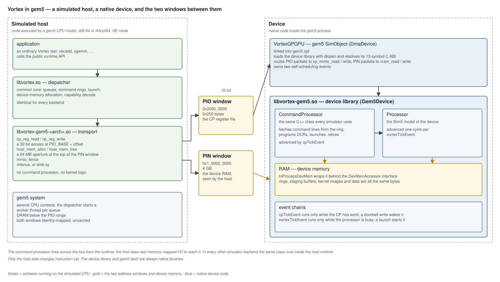
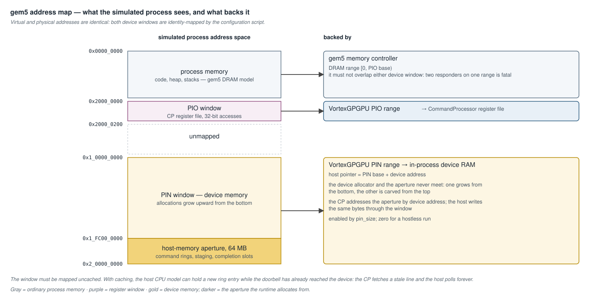
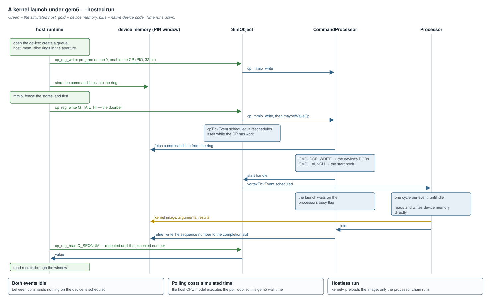

# gem5 Integration — Design

**Scope:** how Vortex runs inside the [gem5](https://www.gem5.org/) simulator
— the two-domain model, the device library and its C ABI, the gem5
SimObject and its event chains, the host runtime transport, the address map,
the kernel-launch path, and the build, install and run mechanics. Covers the
device side ([`sim/simx/gem5/`](../../sim/simx/gem5/)), the host runtime
([`sw/runtime/gem5/`](../../sw/runtime/gem5/)), and the scripts
([`ci/gem5_install.sh.in`](../../ci/gem5_install.sh.in),
[`ci/gem5_run_app.py`](../../ci/gem5_run_app.py),
[`ci/gem5_run_hostless_app.py`](../../ci/gem5_run_hostless_app.py)).

The command processor itself — its register file, command format and
engine — is in [`command_processor.md`](command_processor.md). The SimX
model of the device is in
[`simx_simulator_architecture.md`](simx_simulator_architecture.md). This
document is the gem5 deep-dive.



---

## 1. Overview

Vortex appears to gem5 as one device, `VortexGPGPU`, exposing a register
window and a memory window to a simulated host CPU.

1. The **application** runs as ordinary code on a gem5 CPU model, x86-64 or
   AArch64, in syscall-emulation mode.
2. It links the ordinary Vortex runtime. The **dispatcher** builds command
   lines and rings exactly as on every other backend; a thin **transport**
   library turns register accesses and memory allocation into real
   memory-mapped I/O.
3. The **SimObject** receives those accesses as gem5 packets and forwards
   them to a **device library** it loads at startup.
4. The device library holds the **command processor** and the **SimX
   processor model**, and the SimObject advances each on its own
   self-scheduling event.

Use it to model a host CPU and the accelerator together, with the host's
instruction set and the cost of its driver loop in the simulation, or to
exercise the command processor across a real host/device split.

| part | source | built artifact | loaded by |
|---|---|---|---|
| device library | [`vortex_gpgpu.{h,cpp}`](../../sim/simx/gem5/vortex_gpgpu.cpp), [`dev_mem.{h,cpp}`](../../sim/simx/gem5/dev_mem.cpp) | `<build>/sim/simx/libvortex-gem5.so` | the SimObject, with `dlopen` |
| SimObject | [`vortex_gpgpu_dev.{cc,hh}`](../../sim/simx/gem5/vortex_gpgpu_dev.cc), [`VortexGPGPU.py`](../../sim/simx/gem5/VortexGPGPU.py), `SConscript` | linked into `gem5.opt` | gem5 |
| host runtime | [`sw/runtime/gem5/`](../../sw/runtime/gem5/) | `<build>/sw/runtime/libvortex-gem5-<arch>.so` | the simulated process |

---

## 2. The two-domain model

| domain | runs | contains |
|---|---|---|
| simulated host | on a gem5 CPU model, in simulated time | the application, the dispatcher, the transport |
| device | natively, inside the gem5 process | the command processor, the processor model, device memory |

**The only state both domains can reach is device memory.** The command
processor addresses it directly; the host reaches it through an
identity-mapped window. Anything the two must share — the command ring, the
completion slots, staging buffers — therefore has to be allocated in device
memory.

**This is the one backend where the command processor sits across the bus
from the runtime.**

| backend | where the command processor runs | how the runtime reaches it |
|---|---|---|
| simx, rtlsim | inside the host runtime | a function call, plus a bounded tick burst |
| gem5 | inside the device library | real memory-mapped I/O |

The class is the same one
([`sim/common/cmd_processor.{h,cpp}`](../../sim/common/cmd_processor.cpp)),
and so is the command-building code in the dispatcher
([`sw/runtime/common/device.cpp`](../../sw/runtime/common/device.cpp)). Only
the side of the boundary differs.

---

## 3. The device library

Built by `make -C sim/simx USE_GEM5=1`. `Gem5Device` owns the device memory,
the processor model, a memory accessor, and an embedded command processor,
and binds the command processor's hooks — memory read and write, DCR read
and write, start, busy — to them.

### 3.1 C ABI

The SimObject resolves all thirteen symbols at construction and fails
immediately if one is missing.

| symbol | purpose |
|---|---|
| `vortex_gem5_build_info` | identifies the library |
| `vortex_gem5_create`, `_destroy` | device lifetime |
| `vortex_gem5_set_start_handler` | registers the callback a launch invokes |
| `vortex_gem5_load_kernel` | preloads an image, for a hostless run |
| `vortex_gem5_cp_mmio_read`, `_write` | a 32-bit register access |
| `vortex_gem5_cp_tick`, `_cp_has_work` | advance the command processor; is there more |
| `vortex_gem5_vortex_tick`, `_vortex_busy` | advance the processor one cycle; is it running |
| `vortex_gem5_vram_read`, `_write` | a device-memory access |

A plain C ABI keeps the device library independent of gem5's headers and
compiler flags: it is an ordinary SimX build product.

### 3.2 The memory accessor

[`dev_mem.h`](../../sim/simx/gem5/dev_mem.h) defines `DevMemAccessor`, the
seam between the device and whatever holds its memory. `InProcessDevMem`,
which wraps the SimX RAM, is the only implementation.

Despite the `DmaDevice` base class, no memory traffic goes through gem5's
DMA port: host and device both touch the in-process RAM. The base class and
the accessor interface are kept so that a port-backed implementation is a
new accessor, not a redesign (§11).

---

## 4. The SimObject

[`vortex_gpgpu_dev.cc`](../../sim/simx/gem5/vortex_gpgpu_dev.cc).

| parameter | default | meaning |
|---|---|---|
| `library` | required | absolute path of the **device** library |
| `kernel` | empty | an image to preload; selects a hostless run |
| `pio_addr`, `pio_size` | `0x20000000`, `0x200` | the register window |
| `pio_latency` | 1 ns | latency of a register access |
| `pin_addr`, `pin_size` | `0x100000000`, **0** | the memory window; a size of zero disables it |
| `max_queues` | 4 | queues the register window can address |

The register window **is** the command processor's register file: the
globals occupy `0x40` bytes and each queue a further `0x40`. There is no
second window and no base offset inside it.

### 4.1 Packet routing

| packet address | forwarded to |
|---|---|
| inside the PIO range | `cp_mmio_read` / `cp_mmio_write`, 32 bits |
| inside the PIN range | `vram_read` / `vram_write` |

### 4.2 Event chains

| event | runs while | started by |
|---|---|---|
| `cpTickEvent_` | the command processor has work | a register write that leaves it with work — in practice the doorbell |
| `vortexTickEvent_` | the processor is busy | a launch, through the start handler; or `startup()` in a hostless run |

Each event reschedules itself one clock edge later only while its condition
holds. **Between commands nothing on the device is scheduled**: idle is both
events unscheduled, not a loop polling a flag.

The two chains are deliberately separate. A single tick that advanced both
would serialize the host, the command processor and the processor, and
their concurrent progress is what the model exists to show.

---

## 5. The host runtime

[`vortex.cpp`](../../sw/runtime/gem5/vortex.cpp) implements the transport
interface the dispatcher expects and nothing else.

| callback | implementation |
|---|---|
| `dev_open`, `dev_close` | initialize and release the driver |
| `cp_reg_read`, `cp_reg_write` | a 32-bit access at `PIO_BASE_ADDR + offset` |
| `host_mem_alloc`, `host_mem_free` | allocate from the aperture; `host pointer = PIN_BASE_ADDR + device address` |
| `host_mem_pull`, `host_mem_push` | nothing to do — host and device share the bytes |

[`driver.{h,cpp}`](../../sw/runtime/gem5/driver.cpp) holds the fixed
addresses and the raw accesses. `mmio_fence()` emits the architecture's
barrier — `mfence`, or `dmb sy` — and the runtime issues it between storing
command lines through the memory window and writing the doorbell, so that
the device sees the new lines before the tail advances.

### 5.1 Instruction-set portability

The device library and gem5 are always native binaries. Only the host side
changes:

| `HOST_ARCH` | status | artifacts |
|---|---|---|
| `x86_64` | default | `<build>/sw/runtime/libvortex-gem5-x86_64.so` |
| `aarch64` | cross-compiled, opt-in in the regression flow | `<build>/sw/runtime/aarch64/…` |
| `armhf` | hostless runs only | a 32-bit process cannot reach a window above 4 GB |

Cross-architecture runs rely on two gem5 mechanisms, both set up by the
runner script: `setInterpDir`, which prefixes the dynamic linker path
embedded in the cross-compiled binary with the cross sysroot, and
`redirect_paths`, which redirects the guest's library lookups to it.

---

## 6. Address map



| range | size | backed by |
|---|---|---|
| `0x0000_0000` – `0x2000_0000` | 512 MB | the gem5 memory model — the process's own memory |
| `0x2000_0000` – `0x2000_0200` | `0x200` | the PIO window — the register file |
| `0x1_0000_0000` – `0x2_0000_0000` | 4 GB | the PIN window — device memory |
| `0x1_FC00_0000` – `0x2_0000_0000` | 64 MB | within it, the host-memory aperture |

The memory window covers the whole 32-bit device address space, so any
address the device allocator hands out is reachable, and it sits above 4 GB
so that it cannot collide with the process's own low addresses.

The aperture is carved from the **top** of the window; the device allocator
grows from the bottom. The two never meet.

**The addresses exist in two places** —
[`driver.h`](../../sw/runtime/gem5/driver.h) and the runner scripts. They
are not generated from a common source; change one and change the other.

---

## 7. A kernel launch



| step | host | device |
|---|---|---|
| open | loads the dispatcher, which loads the transport | — |
| create a queue | allocates the ring and completion slots in the aperture; programs queue 0 and enables the command processor | register writes land in the register file |
| submit | stores `CMD_DCR_WRITE` and `CMD_LAUNCH` lines into the ring; fences; writes the doorbell | the doorbell schedules `cpTickEvent_` |
| execute | — | the command processor fetches each line, programs the DCRs, and calls the start hook; the hook schedules `vortexTickEvent_` |
| run | polls the sequence-number register | the launch waits on the processor's busy flag |
| retire | sees the expected sequence number | the command processor writes it to the completion slot and the register |

Ring, staging and device memory are the same in-process bytes, so there is
a single source of truth and nothing to synchronize.

### 7.1 Hostless runs

With `kernel=` set, `startup()` preloads the image and schedules the
processor chain directly. There is no host CPU and no register traffic; the
simulation exits when the processor goes idle. It is the fastest way to run
a kernel under gem5 and the only mode a 32-bit host supports.

---

## 8. Install, build and run

### 8.1 Installing gem5

```bash
cd build/
./ci/gem5_install.sh
```

The script installs gem5's build dependencies, including the AArch64 cross
compiler; fetches gem5 at the revision pinned as `GEM5_REV` in
[`VERSION`](../../VERSION); copies the SimObject sources into the gem5
source tree; and builds `gem5.opt`.

| location | holds |
|---|---|
| `$TOOLDIR/gem5-src/` | the source and build tree |
| `$TOOLDIR/gem5/` — `GEM5_HOME` | the slim runtime install: stripped binaries and `configs/` |

```bash
GEM5_TARGETS="X86" ./ci/gem5_install.sh        # one instruction set
GEM5_TARGETS="X86 ARM" ./ci/gem5_install.sh    # both — the default
```

The script is idempotent for a given revision. Changing `GEM5_REV` requires
re-running it and confirming that both binaries still load `VortexGPGPU`.

### 8.2 Building Vortex for gem5

```bash
make -C sim/simx USE_GEM5=1                      # device library
make -C sw/runtime/stub                          # dispatcher
make -C sw/runtime/gem5                          # transport, x86-64
make -C tests/regression/vecadd                  # a test

make -C sw/runtime/stub HOST_ARCH=aarch64        # cross-compiled
make -C sw/runtime/gem5 HOST_ARCH=aarch64
make -C tests/regression/vecadd HOST_ARCH=aarch64
```

The default `make -C sim/simx` is unchanged: it has no gem5 dependency and
produces no gem5 artifact. `USE_GEM5=1` and `USE_SST=1` are mutually
exclusive — different external simulators, different link flags — and the
Makefile rejects both together. Cross-compiled outputs land in a
per-architecture subdirectory, so they coexist with the native ones.

### 8.3 Running

Through the catalog:

```bash
cd build/
./ci/regression.sh --test gem5
VORTEX_GEM5_ARM=1 ./ci/regression.sh --test gem5     # adds the AArch64 runs
```

| run | instruction set | mode |
|---|---|---|
| `hello` | x86-64, AArch64 | hostless |
| `vecadd -n16` | x86-64, AArch64 | hosted |
| `sgemm -n4` | x86-64, AArch64 | hosted |

By hand, hostless:

```bash
VORTEX_GEM5_DEV_LIB=$(pwd)/sim/simx/libvortex-gem5.so \
VORTEX_TEST_DIR=$(pwd)/tests/kernel/hello \
VORTEX_TEST_KERNEL=hello.vxbin \
    $GEM5_HOME/build/X86/gem5.opt ci/gem5_run_hostless_app.py
```

By hand, hosted:

```bash
VORTEX_GEM5_DEV_LIB=$(pwd)/sim/simx/libvortex-gem5.so \
VORTEX_GEM5_HOST_RT_DIR=$(pwd)/sw/runtime \
VORTEX_TEST_DIR=$(pwd)/tests/regression/vecadd \
VORTEX_TEST_BIN=vecadd \
VORTEX_TEST_ARGS="-n16" \
    $GEM5_HOME/build/X86/gem5.opt ci/gem5_run_app.py
```

The environment variables must precede the binary; gem5 would otherwise
read them as positional arguments.

**Sizing.** The host's poll loop executes in simulated time, so kernel
runtime translates directly into gem5 wall time. The catalog's sizes fit a
120-second budget per run.

---

## 9. Writing a configuration script

The minimal recipe for hosting Vortex in a custom gem5 system:

```python
from m5.objects import (
    AddrRange, AtomicSimpleCPU, DDR3_1600_8x8, MemCtrl, Process,
    Root, SEWorkload, SrcClockDomain, System, SystemXBar,
    VoltageDomain, VortexGPGPU,
)

# Must match sw/runtime/gem5/driver.h.
PIO_BASE, PIO_SIZE = 0x20000000, 0x0200          # register window
PIN_BASE, PIN_SIZE = 0x100000000, 0x100000000    # memory window
NUM_CPUS = 4                                     # >= 2, see 10.3

system = System()
system.clk_domain = SrcClockDomain(clock="3GHz",
                                   voltage_domain=VoltageDomain())
system.mem_mode = "atomic"
system.mem_ranges = [AddrRange("1GiB")]
system.membus = SystemXBar()
system.system_port = system.membus.cpu_side_ports

system.cpu = [AtomicSimpleCPU(cpu_id=i) for i in range(NUM_CPUS)]
system.multi_thread = True
for cpu in system.cpu:
    cpu.createInterruptController()
    cpu.icache_port = system.membus.cpu_side_ports
    cpu.dcache_port = system.membus.cpu_side_ports
    # X86 needs explicit interrupt port wiring; ARM does not.
    cpu.interrupts[0].pio           = system.membus.mem_side_ports
    cpu.interrupts[0].int_requestor = system.membus.cpu_side_ports
    cpu.interrupts[0].int_responder = system.membus.mem_side_ports

# DRAM serves the process below the register window.
system.mem_ctrl = MemCtrl()
system.mem_ctrl.dram = DDR3_1600_8x8()
system.mem_ctrl.dram.range = AddrRange(0, PIO_BASE)
system.mem_ctrl.port = system.membus.mem_side_ports

system.vortex = VortexGPGPU(
    library = "/path/to/build/sim/simx/libvortex-gem5.so",
    kernel  = "",                                # hosted: the host uploads
)
system.vortex.pio_addr = PIO_BASE
system.vortex.pio_size = PIO_SIZE
system.vortex.pin_addr = PIN_BASE
system.vortex.pin_size = PIN_SIZE
system.vortex.pio = system.membus.mem_side_ports
system.vortex.dma = system.membus.cpu_side_ports

process = Process(
    pid=100,
    cwd="/path/to/your/test",
    cmd=["/path/to/your/test/binary"],
    executable="/path/to/your/test/binary",
    env=[
        "VORTEX_DRIVER=gem5-x86_64",
        "LD_LIBRARY_PATH=/path/to/build/sw/runtime",
    ],
)

system.workload = SEWorkload.init_compatible(process.executable)
for cpu in system.cpu:
    cpu.workload = process
    cpu.createThreads()

import m5
root = Root(full_system=False, system=system)
m5.instantiate()

# After instantiate, never before (10.1).
system.cpu[0].workload[0].map(PIO_BASE, PIO_BASE, PIO_SIZE, cacheable=False)
system.cpu[0].workload[0].map(PIN_BASE, PIN_BASE, PIN_SIZE, cacheable=False)

m5.simulate()
```

The two runner scripts are the reference implementations.

---

## 10. Invariants

### 10.1 Map after instantiate

`Process.map()` is a method of the C++ process object, which exists only
after `m5.instantiate()` has built the object tree. Calling it earlier
raises `Attempt to instantiate orphan node`.

### 10.2 Identity-mapped, uncached windows

Both windows must be mapped at the addresses the runtime hard-codes, and
the memory window must be mapped `cacheable=False`. With caching, the host
CPU model can hold a new ring entry while the doorbell has already reached
the device. The command processor fetches a stale line and the host polls
forever.

### 10.3 At least two CPU contexts

The dispatcher starts a worker thread per queue. In syscall-emulation mode
`clone()` needs a free hardware context to land on and returns `EAGAIN`
without one, which surfaces as a `std::system_error` in the dispatcher.
Create several CPUs, set `multi_thread`, and assign the same process to
every one — gem5 requires the workload count to equal the thread count.

### 10.4 32-bit register accesses

The register file is 32 bits wide and gem5 delivers a packet at the width it
was issued. A 64-bit access arrives as one packet, and its upper half lands
in the next register.

### 10.5 The DRAM range excludes the windows

Two responders on one address range is fatal. The memory controller's range
must end below the register window.

---

## 11. Verification and troubleshooting

The `gem5` category in
[`ci/testcases/gem5.yaml`](../../ci/testcases/gem5.yaml) runs the flow of
§8.3 at the `nightly` tier, on a runner provisioned with the `full` profile.
The container workflow does not include gem5.

| symptom | cause | fix |
|---|---|---|
| `dlopen('libvortex-gem5.so') failed` | the SimObject cannot find the device library | give `library=` an absolute path |
| `dlsym(vortex_gem5_…) failed` | `library=` points at the host transport, not the device library | the device library has no architecture suffix |
| `Cannot open library: libvortex-gem5-x86_64.so` | the dispatcher cannot find the transport | set `LD_LIBRARY_PATH` in the process's `env` |
| `std::system_error: Resource temporarily unavailable` | no free hardware context for the worker thread | §10.3 |
| `two ports responding within range` | the DRAM range overlaps a device window; or a hostless run with a non-zero `pin_size` | §10.5; set `pin_size = 0` |
| `Tried to write unmapped address` | the runtime and the script disagree on an address, or a window was not mapped | §6, §10.1 |
| `Attempt to instantiate orphan node` | a window was mapped before `m5.instantiate()` | §10.1 |
| the host hangs polling the sequence number | the memory window is cached | §10.2 |
| `undefined reference to fmt::v8::…` | a stale object served by the compiler cache | rebuild with `CCACHE_DISABLE=1` |

---

## 12. Not implemented

- **Memory through gem5's DMA port.** The accessor interface exists; a
  port-backed implementation that carried device-memory traffic as gem5
  packets, with their timing, does not.
- **Multiple queues.** The register window addresses four; the command
  processor model has one, and the host uses queue 0.
- **Interrupt-driven completion.** The host polls the sequence-number
  register. Raising an interrupt would let the dispatcher sleep, and would
  remove the poll loop's cost from the simulation.
- **A PCI device.** The C ABI is compatible; the SimObject's base class
  would change.
- **Full-system mode.** Syscall emulation only; there is no kernel driver.
- **Several devices, or separate clocks** for the command processor and the
  processor. One device and one clock domain today.

**Known discrepancies:**

- [`gem5.yaml`](../../ci/testcases/gem5.yaml) declares both `xlen` values,
  while the memory window is sized for a 32-bit device address space.
- The header comments of [`gem5_run_app.py`](../../ci/gem5_run_app.py)
  describe an earlier transport interface (`mem_upload`, `cp_mmio_write`)
  rather than `host_mem_alloc` and `cp_reg_write`.
