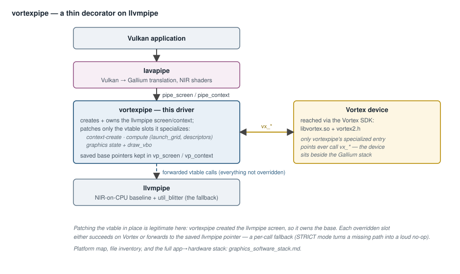
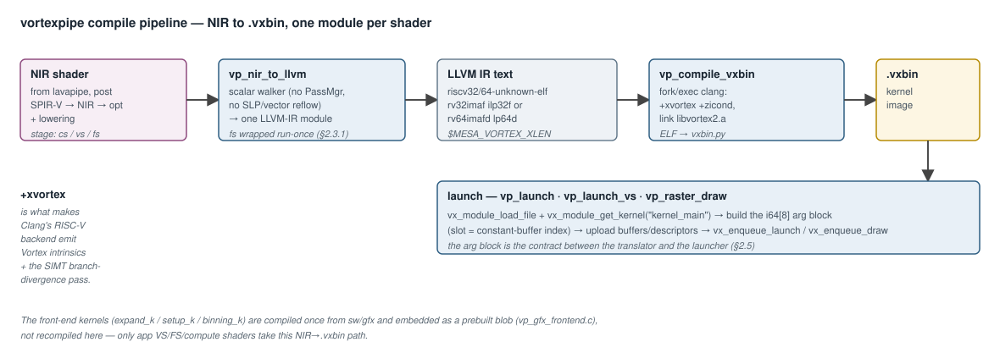
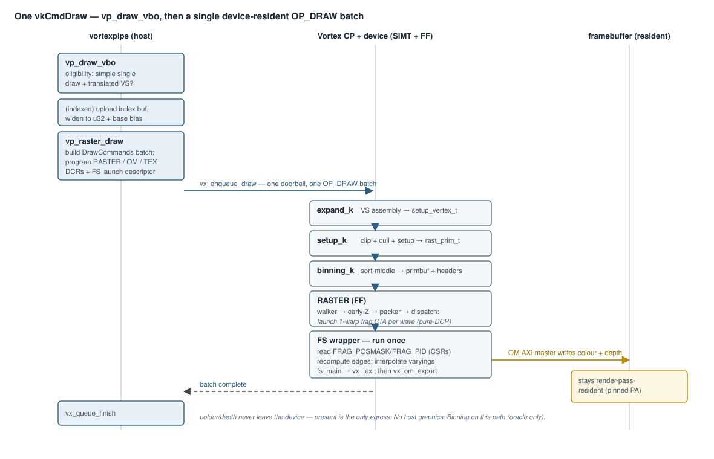

# vortexpipe — software, compiler, and rendering-pipeline architecture

This document describes the `vortexpipe` Gallium driver that lives in
[`mesa_vortex`](https://github.com/vortexgpgpu/mesa) at
`src/gallium/drivers/vortexpipe/`. It covers three things:

1. The **software architecture** — how vortexpipe plugs into Mesa /
   Gallium / lavapipe and how a draw or dispatch reaches the Vortex
   device.
2. The **compiler architecture** — how NIR shaders become Vortex
   `.vxbin` kernels, and how the translator detects and emits the
   Vortex graphics ISA.
3. The **rendering pipeline** — what happens end-to-end for one
   `vkCmdDraw` from a Vulkan app, including the VS/raster/FS/OM
   stages and the host↔device traffic between them.

This document is the **driver deep-dive** and builds on the platform map in
[`graphics_software_stack.md`](graphics_software_stack.md) — the file
inventory (both trees), the SDK boundary, and the layered stack diagram live
there and are not repeated here. Filename references use the upstream layout
in `mesa_vortex` (branch `vortex_3.x`). Vortex graphics ISA mnemonics
(`vx_tex`, `vx_om_export`, `vx_barrier`) and CSR numbers come from
`sw/kernel/include/vx_graphics.h`; the encodings quoted
below were checked against the live driver emitters in `vp_nir_to_llvm.c`.
The dispatch model is **push/launch** — RASTER launches the fragment shader
([`graphics_hardware_stack.md`](graphics_hardware_stack.md) §4; §2.3.1, §3.4
here).

---

## 1. Software architecture

### 1.1 What vortexpipe *is*

vortexpipe is not a from-scratch driver. It is a **thin decorator on
top of `llvmpipe`** that:

- Owns the llvmpipe `pipe_screen` and `pipe_context` lifecycle, so
  vortexpipe-side state can be threaded through them.
- Overrides only the entry points it specializes — context creation,
  compute hooks (`*_compute_state`, `launch_grid`, descriptor
  binding), the graphics pipeline-state + draw hooks (vertex /
  fragment / depth-stencil / blend / rasterizer / vertex-elements /
  texture-handle creation + framebuffer + `draw_vbo`), the query and
  render-condition hooks (so a device draw can stand aside while
  llvmpipe counts), and the resource write/destroy paths (so the
  screen's residency table stays honest — §1.3).
- Forwards everything it doesn't override to llvmpipe.

Each overridden entry point follows the same pattern: vortexpipe
patches the vtable slot in place, capturing the previous pointer in a
side struct (`struct vp_screen` / `struct vp_context`) that is keyed
off the llvmpipe screen / context pointer in a process-wide hash table
(`vp_reg_put` / `vp_reg_get` / `vp_reg_del` —
[`vp_context.c:59-100`](../../src/gallium/drivers/vortexpipe/vp_context.c#L59)).
This avoids the alternative of a ~140-thunk full decorator while
keeping the override surface small enough to audit at a glance.

Patching the vtable is legitimate here because vortexpipe **created**
the llvmpipe screen — it owns the base.

### 1.2 Layering



The Vortex device sits *beside* this stack, reached through the
Vortex SDK (`libvortex.so`, header `vortex2.h`). vortexpipe's
specialized entry points are the only places that ever touch
`vx_*` calls.

### 1.3 Per-screen state — `struct vp_screen`

Defined in
[`vp_private.h`](../../src/gallium/drivers/vortexpipe/vp_private.h).
Lives for the screen's lifetime. The three important groups:

- **Device handle + saved llvmpipe vtable slots.** `vx_device_open(0,
  &dev)` runs once when the screen is created
  ([`vp_screen.c`](../../src/gallium/drivers/vortexpipe/vp_screen.c)).
  The screen's `context_create`, `destroy`, `get_name`, and
  `resource_destroy` slots are replaced; the originals are saved as
  `lp_*` pointers so they can still be invoked on the forward path.
- **Device caps cached up front.** `hw_num_threads`, `hw_num_warps`,
  `hw_max_block_size`, `hw_isa_flags`, and four booleans `has_tex /
  has_raster / has_om / has_rtu` derived from `VX_ISA_EXT_*` bits.
  Caching these here lets every `launch_grid` and `draw_vbo` decide
  *fast* (no per-call `vx_device_query`) whether the workload fits
  one CTA and whether the hardware actually exposes the graphics
  fixed-function units. `has_rtu` also drives lavapipe's
  `driver_ray_queries` cap.
- **The resource-residency table.** `struct vp_resident` entries
  (`{host_base, size, buf, dev_addr, dirty}`), guarded by
  `resident_lock`. A device buffer allocated for a host resource
  outlives the dispatch that first needed it, so an unchanged vertex
  buffer is uploaded once, not per frame, and a resource's device
  address stays stable across dispatches. `vp_screen_resident_addr`
  resolves any host pointer *inside* a recorded range to its entry (+
  offset); `vp_screen_resident_dirty` marks overlapping ranges on
  every host write path (`texture_subdata`, `transfer_unmap`, buffer
  writes), and `vp_screen_resident_dirty_all` distrusts everything
  after work runs on llvmpipe (which writes host memory without
  saying which). Entries are removed in `resource_destroy` — a freed
  host allocation can be handed back at the same address, and a table
  keyed on a raw pointer without eviction would serve a stale device
  buffer for a different resource. The `dirty` flag starts true and
  is cleared only by a completed upload, so every path that has not
  been taught to invalidate errs towards re-uploading, never towards
  serving stale data.

The screen ctor also **clamps llvmpipe's advertised compute caps** to
the Vortex device's `hw_max_block_size` so well-behaved Vulkan apps
that read `maxComputeWorkGroupInvocations` pick a workgroup that fits
one CTA in the first place. Apps that ignore the cap are caught at
launch time by an explicit refusal in `vp_launch_grid` and fall back
to llvmpipe. The driver deliberately does **not** re-tile an
oversized workgroup into several smaller CTAs: NIR derives
`gl_GlobalInvocationID` as `workgroup_id * workgroup_size + local_id`
with the workgroup size **constant-folded to the shader's
compile-time value**, so a kernel launched with a smaller block keeps
multiplying by the larger one and silently addresses memory outside
its dispatch. Refusal is correct; re-tiling behind the shader's back
is not.

### 1.4 Per-context state — `struct vp_context`

Defined in
[`vp_private.h`](../../src/gallium/drivers/vortexpipe/vp_private.h).
Carries the *bound* Gallium state vortexpipe needs at launch / draw
time:

- `cur_cso`, `cur_vs`, `cur_fs` — currently bound compute / vertex /
  fragment programs, each a `struct vp_cso` that pairs the original
  llvmpipe CSO with a translated Vortex `.vxbin`, its resident device
  module (`vx_module` / `vx_kernel`), and — fragment only — the
  compiled variant set (§2.3.3).
- `cbuf[8]`, `cbuf_off[8]` — constant buffers, captured in
  `set_constant_buffer`. lavapipe binds push constants at index 0 and
  the descriptor buffer for descriptor-set N at constant-buffer index
  `N+1`, so `cbuf[1]` is the set-0 descriptor buffer the kernel will
  reach.
- `cur_dsa`, `cur_blend`, `cur_rast`, `cur_velems`, `cur_tex`,
  `cur_sampler`, `vbufs[]`, `fb_color`, `fb_depth`, `fb_width`,
  `fb_height`, `fb_samples`, `fb_color_format[]`,
  `fb_color_bgra_mask` — pre-encoded graphics state captured as the
  Vulkan-side app binds it. The captured form is the *Vortex*
  encoding (e.g. `VX_OM_DEPTH_FUNC_*` / `VX_OM_STENCIL_OP_*` packed
  words, not Gallium enums), so the draw path can write them straight
  into Vortex DCRs. The DSA capture carries the full two-sided
  stencil state; the blend capture carries per-attachment
  mode/func/write-mask (`rt_blend_*[GFX_OM_MAX_RT]`) plus the logic
  op; the sampler capture carries filters, three wrap modes, the
  packed border colour, mip enable/linear, shadow-compare state, and
  the LOD min/max/bias in fixed point.
- The render-pass-resident framebuffer (`rcb` / `rzb` / `rcb_extra[]`
  / `rcb_resolved`): the device colour + depth/stencil planes a pass
  renders into, allocated and seeded once per pass (§3.2) and reused
  across its draws.
- The texture-handle side table (`txh_*[VP_MAX_TEX_HANDLES]`) that
  maps a descriptor's `lp_jit_texture.base` back to the bound
  resource per draw (§3.6).
- The saved llvmpipe vtable slots for every entry point vortexpipe
  intercepts (`lp_create_compute_state`, `lp_bind_*_state`,
  `lp_set_constant_buffer`, `lp_draw_vbo`, `lp_set_framebuffer_state`,
  …).

### 1.5 The fallback contract

vortexpipe is a "best-effort accelerator on top of llvmpipe": every
overridden entry point either succeeds on Vortex or **forwards to the
saved llvmpipe slot**. The fallback is deliberate — it lets the
driver expose full Gallium capability (and pass lavapipe's
self-tests) even when a particular pipeline state combination isn't
covered yet.

In CI and other safety-critical contexts the silent fallback would
mask regressions, so vortexpipe has a STRICT mode gated on
`$MESA_VORTEX_STRICT`
([`vp_context.c`](../../src/gallium/drivers/vortexpipe/vp_context.c),
also in `vp_draw_vbo`). When set, a missing Vortex path becomes a
`mesa_loge` and the call becomes a no-op so the application's own
validation step catches the data not landing.

The fallback is gated **per call**, not per pipeline. Some draws can
run on Vortex while their neighbours don't — a vertex shader whose
inputs the VS translator handles will execute on the device, but if
its companion fragment shader uses something the FS translator
doesn't yet cover, the VS still runs on Vortex and the rasterization
follows on llvmpipe through a cached passthrough VS
(`vp_draw_passthrough`). A refusal can also be a *policy* rather than
a missing path: a draw or dispatch under an open occlusion /
statistics query, or under a query-based render condition, stands
aside so llvmpipe both renders and counts — the counters live
entirely in llvmpipe and a device draw would silently return zero.

#### 1.5.1 Gated fallback vs. silent collapse

Not every "unsupported" feature is a gated fallback. Two kinds of
selection coexist in the current code and only the first preserves
Vulkan conformance:

- **Gated** — code that **detects** an unsupported case and routes
  the work to llvmpipe (or fails in STRICT mode). Examples: a NIR op
  the translator has no mapping for, a line/point topology, a
  varying budget overflow, a 2x/8x multisample pass, a
  `noperspective` varying.
- **Routed** — a middle path the driver now prefers: the case *is*
  representable on the device, just not by the fixed-function unit,
  so it runs on the unit's on-device software fallback (§2.3.3)
  instead of leaving the device. A missing ISA extension, a
  non-A8R8G8B8 colour attachment, a cube/3D/shadow sampler, an MSAA
  draw — all stay device-resident.
- **Silent collapse** — code that **accepts** the call and projects
  it down to the nearest representable encoding without telling the
  caller. The remaining examples: anisotropic filtering ignored,
  mirror-clamp wraps → CLAMP, alpha test / depth-bounds test /
  alpha-to-coverage ignored, dual-source and constant-alpha blend
  factors → ONE, depth-clamp/-clip state unread.

Silent collapse is a **known conformance hole** — a Vulkan-CTS run
will produce wrong pixels (not refused draws) for those inputs. See
§3.6–§3.8 for the per-unit catalogs.

---

## 2. Compiler architecture

### 2.1 Pipeline at a glance



### 2.2 Translator stage — `vp_nir_to_llvm`

[`vp_nir_to_llvm.c`](../../src/gallium/drivers/vortexpipe/vp_nir_to_llvm.c)
(~6300 lines) walks the lavapipe-lowered NIR and emits a single
LLVM-IR module per shader. The design is intentionally **scalar
walker, not LLVM PassManager** — no SLP / vector reflowing, no NIR-to-
NIR lowering inside the translator. Three shader stages map onto two
output shapes:

| NIR stage | LLVM function shape | KMU entry |
|-----------|---------------------|-----------|
| compute   | `void kernel_main(ptr %arg)` — one thread per work-item | `kernel_main` |
| vertex    | `void kernel_main(ptr %arg)` — one thread per vertex     | `kernel_main` |
| fragment  | `void fs_main(ptr %in, ptr %out, ptr %texstate, ptr %desc, ptr %live)` wrapped by an emitted straight-line run-once `kernel_main` (`emit_fs_wrapper`, [`vp_nir_to_llvm.c`](../../src/gallium/drivers/vortexpipe/vp_nir_to_llvm.c)) — RASTER launches it (§2.3.1, §3.4) | the wrapper's `kernel_main` |

(`vxbin.py` publishes the single conventional kernel under the name
`"main"`; the C-level entry symbol stays `kernel_main`.)

Internal state (`struct vp_tr`)
carries an LLVM context, module, builder, and a per-SSA-def value
table (`val[idx][component]`) that holds each NIR component as a raw
`iN` bit pattern. Operations bit-cast to whichever interpretation
(float, int, pointer) they need. Vertex and fragment stages add
stage-specific state (`vid`, `out_base`, `attr_table`; the FS
in/out/scratch slots, the SW-routing flags, and the per-lane
discard/demote `fs_live` + `fs_sink` machinery).

Key reusable primitives:

- `emit_csr_read(t, csr, name)` — inline-asm `csrr` reading a Vortex
  CSR (CTA thread / block IDs, tmask, etc.).
- `emit_vx_barrier(t)` — `custom-0 funct3=4` with the CTA id as
  barrier id and the CTA's warp count as the count, matching
  `vx_spawn2.h::__syncthreads()`.
- `emit_vx_frag_payload(t, word)` — **CSR read**, not a window op: word 0 is
  `VX_CSR_FRAG_POS` (`x[15:0] | y[30:16] | covered[31]`), word 1 is
  `VX_CSR_FRAG_PID`. RASTER packs the stamp into the launch message and the
  core lands it in the warp's launch registers before activation, so the FS
  reads it with no window op and no memory traffic. The wrapper then
  recomputes per-corner edge values from the primitive's edge planes (the
  per-corner bcoord payload was dropped; the `VX_CSR_RASTER_BCOORD_*` CSRs
  are vestigial and unread).
- `emit_vx_quad_swap(t, value, dir)` — the quad shuffle (`custom-0
  funct3=6`), a butterfly SHFL confined to the four adjacent lanes of
  a 2x2 pixel quad. It is what derivatives (`ddx`/`ddy`) and the
  implicit texture LOD are built from; an inactive source lane
  returns the reader's own value, which is why helper lanes must run
  the shader (§3.4).
- `emit_vx_tex(t, u, v, lod)` — `custom-1 funct3=5`, **`vx_tex`** (R4-type,
  `funct2` = stage). Returns the filtered texel as a packed `A8R8G8B8` i32.
  There is no hardware-LOD form: the shader derives the mip level from its
  quad's UV derivatives (plus the sampler's bias, clamped to the sampler's
  min/max LOD) and passes it in the `lod` operand. Or a
  `gfx_tex_sample_sw` call when TEX is routed to software.
- `emit_vx_om_export(t, addr, colour, depth)` — `custom-1 funct3=3 R4-type`,
  `rd=x0` fire-and-forget, with `funct7[1:0]` = `{has_depth, has_colour}` —
  a shader may export colour only (the common case, early-Z owning the depth
  write), depth only (z-prepass), or both (`gl_FragDepth`). Emits the
  fragment as an ordinary **store into the OM aperture**; the cluster's OM
  steer peels it off the L1→L2 trunk and the OM ingress reforms it into a
  fragment (the LSU never learns OM exists). The aperture address is
  shift-only — `((rt << 1 | face) << (xbits+ybits) | y << xbits | x) <<
  record_shift`, with the geometry riding the FS arg block
  (`GFX_FS_ARG_APERTURE`) — so a multi-attachment export just changes `rt`.
  Or a `gfx_om_fragment_sw` call when OM is routed to software.
- There is **no** `emit_vx_rast`/`emit_vx_rast_begin` — RASTER has no shader
  op (§2.3.4) — and no graphics window op: the `SETW`/`GETW` graphics window
  staging is retired, and `funct3=6` on custom-1 now belongs to the RTU's
  hit-window reads (`CB_RET`/`GETWF`/`GETW`).

### 2.3 How the compiler **detects and selects** Vortex graphics ISA

There is no per-instruction "should I use TEX?" decision in the
translator — the selection happens at three earlier and clearer
points.

#### 2.3.1 Selection by shader stage

The translator routes on `nir->info.stage`: compute and vertex stages
become a plain `kernel_main(ptr %arg)`; fragment becomes
`fs_main(ptr %in, ptr %out, ptr %texstate, ptr %desc, ptr %live)`
wrapped by an emitted `kernel_main` (`emit_fs_wrapper`). Under the
**push/launch model** the wrapper is **straight-line, run-once — not a
poll loop**. The RASTER fixed-function unit *launches* the FS as a
bare 1-warp CTA per covered-quad wave and packs the per-lane stamp
into the launch message; the wrapper reads its `{pos, pid}` back as
the `FRAG_POS`/`FRAG_PID` **CSRs** (a launch-register read — no
window op, no memory traffic), recomputes the per-corner edge
(barycentric) values from the primitive's edge planes, interpolates
the varyings (dividing out the perspective-premultiplied `1/w` plane
— §3.4), runs `fs_main` once per lane, and returns. One lane is one
pixel; a lane whose pixel the primitive misses is a **helper** that
runs the shader anyway so its quad neighbours have values to shuffle
for derivatives — `covered` only gates the export. There is **no
shader-issued raster op** — the retired `vx_rast`/`vx_rast_fetch`
pull, `vx_rast_begin`, and the per-corner bcoord window payload are
gone. The `vx_tex` / `vx_om_export` ops are emitted on the FS path
because the stage is FS, not because a NIR opcode asked for them.

A fragment shader is compiled **per variant**, not once per pipeline:
the key is `{sw_tex, sw_om, sw_raster, samples, bgra_mask}`
(`struct vp_fs_variant_key`, at most `VP_MAX_FS_VARIANTS = 4` per
CSO). Each dimension changes what the wrapper *emits* — which merger
it calls, how many samples it covers, which byte each colour channel
packs into — so none of them can be a draw-time argument.

#### 2.3.2 Selection by NIR opcode

NIR opcodes map onto Vortex intrinsics through the `emit_intrinsic`
and `emit_tex` switches:

- `nir_intrinsic_barrier` with execution scope ≠ NONE →
  `emit_vx_barrier`. Pure memory barriers in this per-thread model
  are no-ops.
- `nir_intrinsic_load_workgroup_id` / `_local_invocation_id` /
  `_num_workgroups` → CSR reads of `VX_CSR_CTA_BLOCK_ID_X / +c`,
  `_THREAD_ID_X / +c`, `_GRID_DIM_X / +c`. `vkCmdDispatchBase`'s
  workgroup base rides arg slots 2/3 and is added to the CSR value.
- `nir_intrinsic_load_vertex_id{,_zero_base}` → the index-resolved
  `vid` (an indexed draw resolves `index_buf[raw_id]` in the VS
  prologue, and `firstVertex` is folded in); the VS *output* slot
  uses the sequential global id `vraw` so records are written in
  draw order for in-order triangle assembly.
  `load_instance_id` / `load_base_instance` resolve from the vertex
  arg block (verts-per-instance / base instance, slots 3/4).
- `nir_intrinsic_load_input` (VS) → `emit_vs_attr_addr` → a load from
  the per-attribute `{base, stride, divisor}` table arg slot 1 points
  at; a non-zero divisor indexes by instance/divisor (instance-rate
  attributes).
- `nir_intrinsic_load_front_face` / `load_frag_coord` → the sysval
  slots the FS wrapper fills from the primitive record (§3.4).
- `nir_tex_instr` → `emit_tex`, now a wide dispatch (§3.6): plain 2D
  `texop_tex` / `txl` / `txb` sample through the R4-type **`vx_tex`**
  (float UVs converted to S.23 fixed-point, the mip level resolved
  in-shader from quad derivatives + sampler LOD state); 3D / cube /
  cube-array / 2D-array / shadow variants, `txf` (texelFetch), `txs`
  (textureSize), and `tg4` (textureGather) go to the co-compiled SW
  sampler (`gfx_tex_*_sw` on the resident descriptor). A `txd` is
  pre-lowered to `txl`. What remains refused: 1D arrays, `tg4` on a
  cube, `txf_ms`, `nir_texop_lod`, `query_levels`.

If a NIR opcode has no mapping, the translator sets `t->ok = false`
and the whole shader fails translation (`vp_nir_to_llvm` returns
`false`), at which point the consumer call site
(`vp_create_compute_state` / `_vs_state` / `_fs_state`) keeps the
llvmpipe CSO around without a `vxbin` and the per-call fallback at
`launch_grid` / `draw_vbo` kicks in. Translation is also where the
descriptor budget is enforced: a shader touching more distinct
descriptors than the relocation can carry (`VP_MAX_DESCS = 16`), a
*compute* shader reaching a descriptor set other than set 0 (the
launch arg block has no slot for it), or a VS/FS reaching a
constant-buffer index past the 8-entry descriptor table all refuse
here rather than run half-relocated.

#### 2.3.3 Selection by device capability — per-unit HW/SW routing

The runtime decides, **per FF unit at FS-compile time**, whether each
stage runs on its hardware unit or its on-device SIMT software fallback
(`libgfx_sw`), from the device caps and the pipeline state.
`vp_fs_routing` computes `sw_tex` / `sw_om` / `sw_raster` (SW-raster
implies SW-OM — it has no FF window to merge through) from
`has_raster` / `has_om` / `has_tex` (the cached `VX_ISA_EXT_*` bits of
`VX_CAPS_ISA_FLAGS`) plus whether the draw needs a feature the FF unit
lacks. A unit that is absent or unfit routes **that unit** to software,
**not the whole draw to llvmpipe** (full residency). On top of the
caps, the variant key (§2.3.1) forces routing per draw:

- an FS using a texture op the FF sampler has no form of (shadow /
  array / cube / 3D / `tg4` / `txf`) is compiled `sw_tex`, which also
  keeps NPOT-textured draws on the device (the SW sampler addresses
  NPOT natively);
- a colour attachment the FF merger cannot encode (anything but
  `A8R8G8B8`) forces `sw_om`, as does a multi-attachment draw that
  writes depth or stencil (each export would re-run the depth/stencil
  stage, which is only self-consistent when the stage cannot change
  state between exports — the device asserts this);
- a multisample pass (`samples > 1`) forces `sw_raster` (and hence
  `sw_om`): only the software walk produces per-sample coverage.

The FS is co-compiled with `gfx_sw_abi.cpp` (divergence-bbs guard)
whenever any unit is SW; `emit_vx_tex` / the OM path / the wrapper then
emit the `gfx_*_sw` calls in place of the FF ops.

`$VORTEXPIPE_FORCE_SW=tex|om|raster|all` forces individual units to
their software path on a capable device (A/B'ing);
`$VORTEXPIPE_SW_RASTER` still forces the *llvmpipe* fallback instead.
The VS-on-Vortex → host-readback → llvmpipe-raster path
(`vp_draw_passthrough`) also remains reachable at runtime — to be
retired so llvmpipe is an offline oracle only.

#### 2.3.4 Selection by encoding constants

Vortex's graphics + RTU ISA uses the **RISC-V custom-1 opcode** (43
decimal = 0x2B). `vp_nir_to_llvm` emits the instructions through LLVM
inline asm with `.insn r 43, funct3, …` / `.insn r4 43, funct3, …`
templates. The live `funct3` map (byte-identical to the kernel SDK
`sw/kernel/include/vx_graphics.h`, and matching the emitters in
`vp_nir_to_llvm.c`):

| `funct3` | Mnemonic       | What it does                                                                              |
|----------|----------------|-------------------------------------------------------------------------------------------|
| 3        | `vx_om_export` | submit a fragment to OM as an aperture store (R4-type, `funct7[1:0]`={has_depth,has_colour}, `rd=x0`) |
| 5        | `vx_tex`       | sample TEX (R4-type; `funct2`=stage, texel in `rd`)                                        |
| 6        | RTU window     | `CB_RET`(f2=0) / `GETWF`(f2=2) / `GETW`(f2=3) — hit-window reads + callback return         |
| 7        | RTU            | `vortex_rt_wtrace`(f2=0) / `vortex_rt_wait`(f2=1)                                          |

The **fragment stamp is read as CSRs** (`FRAG_POS`/`FRAG_PID`), not a
custom-1 op. `vx_barrier` and the quad shuffle used for derivatives are on
**custom-0** (opcode 11, funct3 4 and 6), since custom-1 is reserved for
graphics + RTU. RASTER has **no shader op**: it auto-arms on its DCR config
write and launches the FS itself. The legacy forms — `vx_tex4`/`vx_om4`, the
3-operand `vx_om`, the `SETW`/`GETWS` graphics-window ops,
`vx_rast`/`vx_rast_begin` — are all **retired** across sw + simx + rtl +
mesa; `funct3=6` survives only as the RTU's hit-window family.

### 2.4 Backend stage — `vp_compile_vxbin`

[`vp_compile.c`](../../src/gallium/drivers/vortexpipe/vp_compile.c)
turns the LLVM-IR text from the translator into a `.vxbin` kernel
image by **fork/exec'ing the existing Vortex device toolchain**. The
in-process LLVM-API alternative would be cleaner but is deferred — the
shell out keeps the front-end and the device-side toolchain
decoupled.

The flags
([`vp_compile.c`](../../src/gallium/drivers/vortexpipe/vp_compile.c))
mirror the canonical Vortex kernel toolchain invocation used by
`tests/regression/common.mk` in this repo:

- `--target=riscv{32,64}-unknown-elf`, `--sysroot` + `--gcc-toolchain`
  pointing at the GNU toolchain matching the chosen XLEN.
- `-Xclang -target-feature -Xclang +xvortex` — the Vortex ISA
  extension. **This is what makes Clang's RISC-V backend emit Vortex
  intrinsics + the SIMT-aware branch-divergence pass.**
- `-Xclang -target-feature -Xclang +zicond` — conditional-zero
  instructions (Vortex uses these for divergent control flow folding).
- `-mllvm -disable-loop-idiom-all` — keep loop bodies as-is (no
  memset/memcpy idiom recognition).
- The Vortex branch-divergence pass is left at its default (enabled).
  It's the pass that lowers divergent SIMT control flow into masked
  execution; explicitly disabling it via
  `-mllvm -vortex-branch-divergence=0` would break the SIMT semantics
  the kernel relies on.

The link line pulls in `libvortex2.a` (the KMU device kernel runtime,
which provides `vx_start.S`, `vx_putchar`, `vx_spawn2.h`'s
`__syncthreads`, etc.) plus the baremetal libc / compiler-rt. The
result is an ELF; `sw/kernel/scripts/vxbin.py` packages that ELF into
a `.vxbin`. Each stage links at a **fixed, non-overlapping base
address** so the compiled modules can co-reside on the device: the
fragment shader (and compute kernels, which share its slot) at
`VP_STARTUP_FS = 0x8000_0000`, the embedded graphics front end at
`0x8020_0000`, and the vertex shader at `VP_STARTUP_VS = 0x8040_0000`
([`vp_compile.h`](../../src/gallium/drivers/vortexpipe/vp_compile.h)).

The target XLEN comes from `$MESA_VORTEX_XLEN` (default `32`; `64`
selects rv64). The env var is mesa-namespaced so it doesn't collide
with anything the linked `libvortex.so` runtime reads.

### 2.5 Launch stage — `vp_launch`, `vp_launch_vs`

[`vp_launch.c`](../../src/gallium/drivers/vortexpipe/vp_launch.c)
holds the host-side dispatch. Modules are **resident**: a compiled
`.vxbin` is loaded onto the device once with `vx_module_load_bytes +
vx_module_get_kernel("main")` and the handles cached on the CSO (the
front-end module on the draw pool), so a repeated dispatch or draw
reloads nothing — compile-once, upload-resident-once, no `/tmp`
round-trip. The fixed link bases (§2.4) mean only one image can hold
each slot: binding a different VS/FS evicts the previously resident
one, and because compute shares the FS base, an explicit ownership
token (`startup_fs_owner`) records who currently holds that address
so a draw evicts a resident compute kernel and vice versa. (The
standalone `vp_launch_vs` fallback path is the one remaining
temp-file `vx_module_load_file` user.)

**The arg block is the contract** between the translator and the
launcher. It's a fixed-size `i64[VP_ARG_SLOTS=9]` array of device
addresses passed inline to the kernel via `vx_launch_info_t.args_host`.
The vertex stage overlays its own meanings on the compute slots:

| Slot | Compute (vp_launch)                                | Vertex (vp_raster_draw / vp_launch_vs)      |
|------|----------------------------------------------------|---------------------------------------------|
| 0    | push constants                                     | output vertex-record buffer                 |
| 1    | set-0 descriptor blob                              | vertex attribute table                      |
| 2    | dispatch base `base_group_x \| base_group_y << 32` | index buffer base (0 = non-indexed)         |
| 3    | dispatch base `base_group_z`                       | verts-per-instance (0 = plain draw)         |
| 4-7  | raw shader-buffer slots (`VP_ARG_SSBO_BASE`, e.g. the RT trace-ray command buffer) | 4 = base instance, 5 = base vertex, 6 = real vertex count (`VP_ARG_VS_COUNT` — launches are warp-padded, a thread past the end has no vertex) |
| 8    | —                                                  | VS constant-buffer table (`VP_ARG_VS_DESC`, `i64[GFX_FS_DESC_SLOTS]` of per-set blob bases) |

The fragment stage has its own, wider block (built by
`vp_raster_draw`, read by the emitted wrapper): slot 0 the primitive
buffer, 1/2 the resident SW-sampler / SW-merger descriptors, 3-8 the
SW-raster tile-walk geometry, then `GFX_FS_ARG_DESC=9` (the resident
`i64[8]` constant-buffer table: push constants at 0, descriptor set N
at N+1), `GFX_FS_ARG_MRT=10` (per-attachment `gfx_sw_omcolor_t[]`),
`GFX_FS_ARG_APERTURE=11` (the packed OM aperture geometry
`{xbits, ybits, record_shift}` — render-target-sized, so it cannot be
baked at JIT time), and `GFX_FS_ARG_FLAT=12` (the per-primitive
flat-varying side array, §3.4). These live in
`sw/common/gfx_fs_desc_abi.h` — the contract is between the mesa
arg-block builder and the mesa-generated fragment kernel; nothing in
the device or SimX fixed-function path interprets the table.

For each descriptor the translator pre-scanned (`vp_scan_descriptors`
→ `cso->descs[0..num_descs)`, each entry carrying its
`{offset, cbuf_index, kind, elem_bytes, writable}`), the launcher
relocates blob by blob:

- `VP_DESC_BUFFER` (an SSBO or UBO): resolve the host range through
  the screen residency table (§1.3) — uploading only if dirty — and
  **rewrite the `lp_jit_buffer.ptr` field** in the staged copy of that
  set's descriptor blob to the device address. `load_ssbo` in the
  kernel then dereferences a device-side pointer at the descriptor
  slot. This is the bridge between the lavapipe-emitted descriptor
  format and Vortex device memory.
- `VP_DESC_IMAGE` (a storage image): same shape via `lp_jit_image` —
  base pointer rewritten, size derived from `height * row_stride`.
  Storage images are relocated for compute, fragment, *and* vertex
  stages, and are uploaded even when only written (partial stores
  must preserve untouched texels).
- `VP_DESC_AS` (an acceleration structure): `vp_as_relocate`
  transcodes the Vulkan AS to the RTU scene format (or copies the BVH
  when the device has no RTU), recursively bringing each instance's
  BLAS across and rewriting the absolute links to device addresses.

Only descriptors the shader **writes** (`writable`: `store_ssbo`, an
SSBO atomic, an image store/atomic) are read back into the host
backing after the launch — a descriptor that is only loaded still
holds the bytes it was uploaded with, and copying those back is pure
work.

For VS launches the launcher uploads the distinct vertex-buffer
resources (resident, keyed on the resource's range) plus a
`{base, stride, divisor}[VP_ATTR_TABLE_LOCS=8]` table indexed by
`driver_location`; the VS kernel's `load_input` path reads from
`table[loc].base + index * table[loc].stride`, where the index is the
vertex id or, for a non-zero divisor, `instance / divisor`
(`emit_vs_attr_addr` in the translator).

---

## 3. Rendering pipeline — what one draw call actually does

The end-to-end story for a Vulkan `vkCmdDraw` once it has been
translated to a `pipe_context::draw_vbo` call into vortexpipe
([`vp_draw_vbo`,
`vp_context.c`](../../src/gallium/drivers/vortexpipe/vp_context.c)).

### 3.1 Stage 0 — eligibility check

vortexpipe takes the Vortex device path for a **single triangle-topology
draw** with a translated VS:

```c
bool indexed    = info->index_size == 2 || info->index_size == 4;
bool tristrip   = info->mode == MESA_PRIM_TRIANGLE_STRIP ||
                  info->mode == MESA_PRIM_TRIANGLE_FAN;
bool restart_ok = !info->primitive_restart || (tristrip && indexed);
bool simple =
   !vp->render_cond_query &&
   vp->dev && vs && vs->vxbin && vs->vs_layout.stride &&
   !indirect && num_draws == 1 &&
   (info->index_size == 0 || indexed) &&
   restart_ok && info->instance_count >= 1 &&
   (info->mode == MESA_PRIM_TRIANGLES || tristrip) &&
   draws[0].count > 0;
```

Much of what this once excluded now runs on the device:

- **Indexed draws**: the index buffer is uploaded widened to u32 and
  the VS resolves `index_buf[i]` on device.
- **Strips and fans** are translated on the host into a triangle-LIST
  index array (`vp_gather_topology_u32`) and run through the
  list-native front end. **Primitive restart** is resolved in that
  same translation — the cut lands in the index list, so the device
  never sees a restart index. (A restart on a list topology has no
  strip to cut and stays with llvmpipe; so do lines and points.)
- **Instancing**: a multi-instance draw runs as one device draw over
  `instance_count × verts-per-instance` vertices; the VS resolves
  `gl_InstanceIndex`, and instance-rate attributes ride the divisor
  in the attribute table.
- **Indirect draws** are resolved on the host *before* the test — the
  parameter buffer is mapped and each record re-entered as a direct
  draw (the `!indirect` term is only reachable for
  `indirect_draw_count` / `count_from_stream_output`, which still
  fall back).
- **Multiview**: the draw is replayed once per set bit of the view
  mask, each view into its own layer (refused only combined with
  MRT).
- A **memory-predicate render condition** is re-tested on the host;
  only a *query*-based predicate refuses (llvmpipe owns the query).

Past `simple`, a few post-gates still send the draw to llvmpipe: a
sample count other than 1 or 4 (§3.4.1), an open occlusion /
statistics query (llvmpipe must count what it draws), fewer bound
attachments than the FS writes, and a pure-integer texture wider than
int8 RGBA. Everything else (multi-draw, stream-output counts, no or
untranslatable VS) takes the wholesale llvmpipe fallback — or fails
loudly in STRICT mode.

### 3.2 The device-orchestrated draw — `vp_raster_draw`

On the hardware-raster path the **whole draw is one device-resident
transaction** ([`vp_raster.cpp`](../../src/gallium/drivers/vortexpipe/vp_raster.cpp)):
the VS is *folded in* as the front end's stage 0 (no host readback of
transformed vertices), and the **on-device sort-middle front end**
produces the RASTER buffers. There is **no host `graphics::Binning`** in
the runtime path — that reference renderer is retained only as the
coverage oracle. The draw is recorded as one batch and submitted with a
single `vx_enqueue_draw` (one doorbell, one completion; see
[`command_processor.md`](command_processor.md) §8.1). The batch is the
VS launch, the front end's nine CP-sequenced stage launches
(`sw/common/gfx_frontend_abi.h`: `PIPE_STAGE_SETUP..EMIT` on
`setup_k`, `PIPE_STAGE_BCOUNT..BSCATTER` on `binning_k`) and the FF
DCR writes, drained in order by the CP's launch-barrier:

1. **VS + `expand_k`** — the translated VS writes one output record
   per vertex (resident); `expand_k`, one thread per vertex, expands
   those records into the `setup_vertex_t[]` the front end consumes,
   packing the declared varyings positionally onto the 12 scalar
   interpolation planes `[u,v,r,g,b,a,w0..w5]` (up to three vec4s).
   Indexed draws resolve the index in the VS (VS *output* slot =
   sequential `vraw` for in-order assembly).
2. **`setup_k`** (stages SETUP/SCAN/EMIT) — near-plane clip
   (Sutherland-Hodgman, ≤2 subtris, honouring the Vulkan `[0,w]`
   clip-Z convention and the app's depth range via the forwarded
   viewport transform) + app-selected front/back cull
   (`SETUP_CULL_*`, computed from the bound rasterizer state *after*
   the viewport's y-flip so the cull sign matches the app's
   framebuffer winding) + fixed-point plane-equation setup →
   `rast_prim_t` (212 B: `edges[3]`, the 14 attribute planes
   `{z,r,g,b,a,u,v,rhw,w0..w5}` carrying perspective-premultiplied
   varyings plus the normalized `1/w` plane, and the trailing
   `facing` / `rhw_scale` scalars) + the per-primitive flat-varying
   side array (the provoking vertex's words, copied verbatim — §3.4).
3. **`binning_k`** (stages BCOUNT..BSCATTER) — exact-sized parallel
   sort-middle (count→scan→emit, no overflow path) over coarse 128-px
   bins → dense primbuf + 12 B `rast_bin_header_t` per bin (32-bit
   offset/count fields) + sorted PID array. The RASTER unit then
   descends bin → block → quad.

Colour/depth/texture are **render-pass-resident (pinned-PA)** and reached
by the FF units through their DCRs. The colour and depth/stencil planes
are allocated and *seeded* once per render pass (`vp_fb_ensure`): colour
from the attachment's current contents (the pass's `loadOp=CLEAR`
already landed there), depth/stencil read back from the attachment so
the pass's clear values reach the device — or filled with the far value
when no attachment is bound. Draw-consumed resources (vertex/index
buffers, descriptors, textures) resolve through the screen residency
table (§1.3), so an unchanged buffer is uploaded once, not per draw.

### 3.3 FF configuration + RASTER launch

`vp_raster_draw` then programs the RASTER + OM + (optional) TEX DCRs and
lets the RASTER engine launch the fragment shader itself:

1. **Program RASTER DCRs**: tile/prim buffer block-addresses,
   `PBUF_STRIDE` = the whole 212-byte `rast_prim_t` record (RASTER
   itself fetches only words 0..11 — the edges and depth plane — but
   the stride must cover the trailing fields or every later
   primitive's edges alias the previous record's tail), the scissor
   rect, and the **fragment-shader launch descriptor**
   (`VX_DCR_RASTER_FRAG_ENTRY_LO/HI`, `FRAG_PARAM_LO/HI`) — so the
   raster engine self-launches the FS with no host KMU grid.
2. **Program OM DCRs**: per attachment, latched under
   `VX_DCR_OM_RT_SELECT`: colour address/pitch, write-mask, and blend
   mode/func/const (independent per-RT blend from the bound blend
   cso); then the shared state — depth buffer address/pitch,
   depth-compare + write-mask (bound DSA cso), the full two-sided
   stencil state (`STENCIL_{FUNC, ZPASS, ZFAIL, FAIL, REF, MASK,
   WRITEMASK}`, front in the low half-word, back in the high), the
   logic op, the per-draw `EARLYZ_SAFE` gate (armed only for a
   monotone depth compare with no stencil writes and no
   shader-written depth), and the aperture geometry
   (`APERTURE_{XBITS, YBITS, RECORD_SHIFT, DEPTH_ONLY}`) that must
   decode the same shift-only address the FS builds from
   `GFX_FS_ARG_APERTURE`.
3. **Program TEX DCRs** (if a sampler is bound): the resident texture's
   `VX_DCR_TEX_{ADDR, LOGDIM, FORMAT, FILTER, WRAP, BORDER,
   MIPOFF_BASE+j}` for the stage — the border colour is a DCR, so a
   `CLAMP_TO_BORDER` wrap samples on the unit, and the mip-offset
   table gives the unit the resident mip chain.
4. **RASTER runs** the fixed-function walker → early-Z → packer →
   **dispatch**, which *launches* a bare 1-warp fragment CTA per
   covered-quad wave on the core-local KMU (pure-DCR — there is **no host
   FS grid launch**; the raster engine self-kicks). Each fragment CTA runs
   the FS wrapper **once** (§3.4).

### 3.4 The fragment shader (push, run-once)

The emitted `kernel_main` wrapper (`emit_fs_wrapper`,
[`vp_nir_to_llvm.c`](../../src/gallium/drivers/vortexpipe/vp_nir_to_llvm.c))
runs once per launched wave:

```
pos = csr(FRAG_POS); pid = csr(FRAG_PID)              // launch-register reads
prim         = arg[0] + pid * 212                     // VP_RAST_PRIM_STRIDE
flat         = arg[FLAT] + pid * 12*4                 // provoking vertex's words
(X,Y,cov)    = decode(pos)                            // this lane's pixel
(f0,f1,f2)   = recompute edges  e·[X,Y,1]  from prim.edge_planes
dx = f0/(f0+f1+f2);  dy = f1/(f0+f1+f2)
rhw          = interp(prim.rhw, dx, dy)
fs_in[i]     = flat_input(i) ? flat[lane(i)]          // verbatim, no arithmetic
             : interp(prim.plane[lane(i)], dx, dy) / rhw
frag_coord   = { X+.5, Y+.5, plane_z(prim,X,Y), rhw / prim.rhw_scale }
front_facing = !prim.facing
fs_main(fs_in, fs_out, texstate, desc, &live)         // vx_tex | gfx_tex_sample_sw
rgba  = pack(fs_out)                                  // per-RT byte order (bgra_mask)
depth = fixed24(plane_z(prim, X, Y))
cov  &= live                                          // discard/demote folds in
if cov: vx_om_export(aperture(X,Y,face,rt), rgba, depth)
                                                      // vx_om_export | gfx_om_fragment_sw
```

There is **no bcoord CSR read and no `vx_rast`/`vx_om` pull** — the stamp came
in the launch registers and the edge values are recomputed from the primitive.
Varyings are interpolated affinely in Q7.24 and then divided by the
interpolated `1/w` plane to recover perspective correctness (the
per-triangle normalization `rhw_scale` cancels in that divide; only
`gl_FragCoord.w` must undo it). A **flat** varying never travels
through the interpolation planes at all — the planes are
premultiplied by `1/w` and quantised, which is defined on numbers,
and an integer varying's bit pattern is not a number — so its words
ride the side array and are read back without arithmetic; this is
also how *all integer varyings* are carried (`noperspective` is
refused). An uncovered lane still runs `fs_main` as a derivative
helper; `discard`/`demote` clear the per-lane `live` flag rather than
exiting (the lane's stores are diverted to an opaque per-thread sink
so they cannot commit, and its SSBO atomics are suppressed the same
way), and `live` folds into `cov` before the export.

`vx_om_export` stores the fragment into the OM aperture; the OM
steer/ingress turns that store back into a fragment and the OM
depth-tests / stencil-tests / blends / writes colour+depth at the
DCR-configured PAs, so the FS never sees the attachment addresses. A
multi-attachment shader exports once per render target — the `rt`
field in the aperture address selects the per-attachment state
latched under `RT_SELECT` (on the SW-OM path the wrapper instead
calls `gfx_om_fragment_mrt_sw` over the resident `gfx_sw_omcolor_t[]`).
Same-pixel ordering is correct by construction (one screen tile → one
warp). When a unit is routed to software (§2.3.3) the wrapper calls
the matching `gfx_*_sw` in place of the FF op. The colour attachment
stays device-resident; only present copies it out.

#### 3.4.1 Multisample rendering (4x MSAA)

A `samples > 1` pass renders and resolves **on the device**, on the
software raster/merge path (the variant key forces `sw_raster` +
`sw_om`):

- The resident colour and depth planes are allocated **sample-major
  within a pixel** — texel `(y*w + x)*S + k` — and seeded by
  replicating the attachment's single-sample contents across samples.
- Coverage comes from the fixed 4x rotated-grid sample table in
  `sw/common/gfx_frag_rast.h` (positions `(6,2) (14,6) (2,10) (10,14)`
  in 1/16 px). The tile walk (`gfx_rast_walk_tile_msaa_sw`) produces
  per-sample masks; the wrapper shades the pixel once and merges each
  covered sample (`gfx_om_fragment_msaa_sw` — full depth/stencil/
  blend per sample). Only 1 and 4 samples are accepted: the coverage
  mask is always a 4-sample mask against that fixed table, and a 2x
  draw would silently take samples 0 and 1 of the 4x pattern, so
  every other count goes to llvmpipe *before* a variant compiles.
- The pass-end resolve is a device kernel (`msaa_resolve_k`, embedded
  in the front-end module): a box filter that decodes, averages and
  re-encodes each pixel's samples into a dense single-sample plane —
  so R8/RG8/sRGB attachments resolve correctly — writing a separate
  destination (an in-place compaction would race its own readers).
  lavapipe's pass-end resolve blit is intercepted
  (`vp_blit_is_resident_resolve`) and served from that plane. A pass
  that ends without a resolve syncs the samples back into llvmpipe's
  own per-sample storage instead.
- MSAA composes with the rest of the surface except MRT: a
  multisample multi-attachment draw is refused at translation.

### 3.5 Fallback paths (also valid in the same code)

A unit the device lacks no longer forfeits the draw — it runs on that
unit's software fallback (§2.3.3). The remaining true fallbacks, taken
when the FS isn't translatable for the needed variant, when
`$VORTEXPIPE_SW_RASTER` is set, or when a gate in §3.1 trips:

- **VS on Vortex / raster on llvmpipe** (`vp_draw_passthrough`).
  The transformed-vertex buffer is presented to llvmpipe through a
  cached passthrough VS + matching `pipe_vertex_elements_state`, and
  llvmpipe's rasterizer takes over.
- **Everything on llvmpipe** — the original `lp_draw_vbo` is called.
  This is the path STRICT mode refuses. Either way, every resident
  range is marked dirty afterwards (§1.3): llvmpipe writes host
  allocations directly and nothing reports which ones.

### 3.6 TEX coverage (current implementation vs. the spec)

The Vortex TEX block is a fixed-function 2D sampler: per-stage
`A8R8G8B8` texels, S.23 fixed-point UV, point/bilinear taps, a
resident mip chain addressed through the `MIPOFF` DCR table (the mip
*level* is computed in-shader — there is no hardware-LOD form), four
wrap modes (CLAMP / REPEAT / MIRROR / BORDER, with the border colour
a DCR), power-of-two dimensions only. Everything Vulkan's sampling
surface needs beyond that runs on the **co-compiled SW sampler**
(`gfx_tex_*_sw` over the resident `gfx_sw_texstate_t` descriptor) —
still on the device, never a host round-trip. The per-draw texture is
selected by matching the FS's sampled-image descriptor
(`lp_jit_texture.base`) against the handle side table (§1.4), so a
shader with several bound textures samples the right one.

| Spec input                                   | Where it runs        | What the code does                                                          | Conformant?              |
|----------------------------------------------|----------------------|------------------------------------------------------------------------------|--------------------------|
| 2D `texture` / `textureLod` / bias           | FF `vx_tex`          | LOD from quad derivatives + sampler bias, clamped to min/max LOD             | **Yes**                  |
| Mipmap filter (`MIPMAP_NEAREST/LINEAR`)      | FF + in-shader LOD   | mip enable derived from `max_lod > 0.5`; trilinear when minified + linear    | **Yes**                  |
| `CLAMP_TO_BORDER`                            | FF `vx_tex`          | `VX_TEX_WRAP_BORDER` + the `VX_DCR_TEX_BORDER` colour                        | **Yes**                  |
| Mirror-clamp wraps (`MIRROR_CLAMP*`)         | —                    | `vp_vx_wrap` `default:` → CLAMP                                              | **No** — silent collapse |
| Anisotropic filtering                        | —                    | `max_anisotropy` never read; the min/mag tap is used                         | **No** — silent collapse |
| NPOT dimensions                              | SW sampler           | `GFX_SW_TEX_FILTER_NPOT` routes the sample to SW, draw stays on device       | **Yes** — routed         |
| 3D / cube / cube-array / 2D-array            | SW sampler           | `emit_tex_3d` / `_cube` / `_cube_array` / `_array`                           | **Yes** — routed         |
| Shadow (compare) samplers, incl. array/cube  | SW sampler           | `emit_tex_shadow*` with the captured compare func                            | **Yes** — routed         |
| `texelFetch` (`txf`), int and float dests    | SW sampler           | `gfx_tex_fetch_{i32,f32,array_f32}`                                          | **Yes** — routed         |
| `textureSize` (`txs`)                        | descriptor read      | `emit_tex_size` (3rd component = layers / cube count / slices)               | **Yes**                  |
| `textureGather` (`tg4`, + offset/compare)    | SW sampler           | `gfx_tex_gather*_sw`; refused on a cube sampler                              | **Yes** — routed (cube gated) |
| Integer textures (int8 RGBA)                 | SW fetch             | stored and fetched as integers, no unorm normalisation                       | **Yes**                  |
| Float formats (R16F/RG16F/RGBA16F/R32F/RG32F/RGBA32F) | SW sample   | uploaded verbatim, sampled as floats through the f32 scratch slot            | **Yes**                  |
| Depth formats (D32F/D16, packed Z24S8)       | SW sample            | depth aspect extracted/converted to f32 on upload                            | **Yes**                  |
| Other colour formats (R8, RG8, 565, 5551, …) | host decode          | decoded to `A8R8G8B8` once at upload (`util_format_read_4ub`)                | **Yes** (unorm only)     |
| View component swizzle                       | in-shader            | packed swizzle applied after the sample                                      | **Yes**                  |
| 1D arrays, `txf_ms`, `textureQueryLod`, `query_levels` | —          | `emit_tex` refuses, draw goes to llvmpipe                                    | **Yes** — gated          |
| Pure-integer formats wider than int8 RGBA    | —                    | draw-level gate → llvmpipe                                                   | **Yes** — gated          |

Freshness of the sampled texels does not rely on the resource
pointer: the allocator recycles the pointer, the storage address
*and* the dimensions, so there is no cheap "same texture?" signal.
Instead, every `create_texture_handle` capture **drops the resident
texel upload** (forcing a re-upload on next use) and **supersedes any
handle-table entry matching either the resource pointer or the mapped
base address** before recording the new view's target/layer state —
a stale entry would otherwise win the per-draw match and answer with
the wrong target or layer count.

The two remaining silent collapses — mirror-clamp wraps and
anisotropy — are sampler-state projections; closing them means either
teaching the SW sampler the wrap/filter or gating on the
`pipe_sampler_state` fields at capture time.

### 3.7 OM coverage

The Vortex OM block covers most of the Vulkan output-merger
fixed-function surface: 8 depth-compares, the full two-sided stencil
stage (compare + fail/zfail/zpass ops, reference, compare mask, write
mask), 5 blend equations (ADD / SUB / REV_SUB / MIN / MAX), 12 blend
factors, the 16 logic ops (a logic op becomes blend-mode `LOGICOP`
and supersedes blending, matching Vulkan), an RGBA write-mask, and
per-attachment state banks latched under `RT_SELECT` for
multi-attachment draws. State the FF merger cannot encode routes to
the SW merger (§2.3.3), still on-device. The encodings sit in
`vp_create_dsa_state` and `vp_create_blend_state`
([`vp_context.c`](../../src/gallium/drivers/vortexpipe/vp_context.c)).

| Spec input                                  | Where it runs        | What the code does                                                                  | Conformant?              |
|---------------------------------------------|----------------------|--------------------------------------------------------------------------------------|--------------------------|
| Device lacks `VX_ISA_EXT_OM`                | SW merger            | the FS variant is compiled `sw_om`; the draw stays on the device                     | **Yes** — routed         |
| Depth funcs (all 8)                         | FF OM                | full 1:1 mapping in `vp_vx_depth_func`; early-Z armed only when safe                 | **Yes**                  |
| Stencil test/write (two-sided)              | FF OM                | `vp_vx_stencil_op` map; front/back packed low/high; ref via `set_stencil_ref`        | **Yes**                  |
| Logic op                                    | FF OM                | `vp_vx_logic_op` full 16-op map; supersedes blending, applied per attachment         | **Yes**                  |
| MRT (`nr_cbufs > 1`, up to `GFX_OM_MAX_RT`=4) | FF OM (or SW)      | per-attachment DCR banks + one export per RT (`rt` in the aperture address); SW path uses `gfx_om_fragment_mrt_sw`. Gated: fewer bound attachments than FS outputs refuses; MRT + depth/stencil *write* forces SW-OM; MRT × multisample and MRT × multiview refuse | **Yes** — routed/gated   |
| Independent blend per RT                    | FF OM                | `rt_blend_{mode,func,colormask}[]` captured per attachment                           | **Yes**                  |
| Independent RGB/alpha blend equation        | FF OM                | `blend_mode = (alpha_func << 16) \| rgb_func`                                        | **Yes**                  |
| Blend ADD/SUB/REV_SUB/MIN/MAX, 12 factors   | FF OM                | full 1:1 mappings in `vp_vx_blend_mode` / `vp_vx_blend_factor`                       | **Yes**                  |
| Colour write-mask (RGBA bits)               | FF OM                | captured per RT, swizzled to the attachment's channel order                          | **Yes**                  |
| BGRA / non-red-first attachments            | device               | the format's `bgra` bit joins the FS variant key; the wrapper packs each colour output in that attachment's own byte order, and the blend constant / write-mask are permuted to match | **Yes**                  |
| sRGB attachments                            | SW merger            | `VX_OM_COLOR_FORMAT_SRGB8A8`; any non-`A8R8G8B8` format forces `sw_om`, which encodes it | **Yes** — routed     |
| R8 / RG8 attachments                        | SW merger            | same routing, per-format encode                                                      | **Yes** — routed         |
| Multisample (4x)                            | SW raster + merger   | §3.4.1; counts other than 1/4 refuse                                                 | **Yes** — routed/gated   |
| Depth/stencil clear values                  | device               | the pass's clear reaches the device via the depth/stencil readback seed (§3.2)       | **Yes**                  |
| Alpha test                                  | —                    | `s->alpha_enabled` silently ignored                                                  | **No** — silent collapse |
| Depth-bounds test                           | —                    | `s->depth_bounds_test` silently ignored                                              | **No** — silent collapse |
| Dual-source blend (`SRC1_*`)                | —                    | `vp_vx_blend_factor` `default:` returns `ONE`                                        | **No** — silent collapse |
| `CONSTANT_ALPHA` / `INV_CONSTANT_ALPHA`     | —                    | same `default:` → `ONE`                                                              | **No** — silent collapse |
| `alpha_to_coverage` / `alpha_to_one`        | —                    | ignored                                                                              | **No** — silent collapse |
| Depth-clamp / depth-clip-disable            | —                    | `pipe_rasterizer_state.depth_clip_*` not read                                        | **No** — silent collapse |
| Unrecognised attachment format              | llvmpipe             | `fb_color_ok = false` at bind, with a warning                                        | **Yes** — gated          |

The remaining silent collapses are all state-capture projections in
the DSA/blend encoders; each wants either an SW-merger extension
(alpha test, depth bounds, constant-alpha factors are all cheap
there) or a capture-time `unsupported` flag that joins the draw
gates.

### 3.8 Rasterizer precision & geometric limits

The on-device setup/binning front end
([`sw/common/gfx_setup.h`](../../sw/common/gfx_setup.h), consumed by
`setup_k`) and the RASTER unit both work in fixed-point:

- **Edge equations**: normalized by `1/maxVal` then stored as
  **Q15.16** (`EdgeToFixed`,
  [`gfx_setup.h`](../../sw/common/gfx_setup.h)).
  Sub-pixel resolution = 1/65536.
- **Attribute planes**: **Q7.24** barycentric deltas. Setup
  premultiplies the varying planes by the per-triangle max-normalized
  `1/w` and folds an extra power-of-2 downscale in when a
  premultiplied varying would exceed the Q7.24 range (large tiling
  UVs) — both scales cancel in the FS's `interp(a·rhw)/interp(rhw)`
  divide, so tiled UVs well beyond 1.0 stay exact.
- **Near-plane clip before binning**: `setup_k` runs the
  Sutherland–Hodgman near clip in clip space (`clip_near`, ≤2
  subtriangles), so a `w → 0` crossing becomes visible-side geometry
  instead of a sheared screen-space triangle.
- **Bin headers**: coarse 128-px bins with a 12-byte
  `rast_bin_header_t` — `bin_x`/`bin_y` `uint16_t`, but
  `pids_offset`/`pids_count` **`uint32_t`**, lifting the old 16-bit
  per-tile primitive-count and pid-offset ceilings. The composite
  bin-sort key reserves `PIPE_PRIM_BITS = 20` for the primitive id,
  bounding a draw at 2^20 post-clip primitives.
- **Scissor DCR**: `(max << 16) | min` per axis — coordinates live in
  16 bits, so the framebuffer edge stays below 65536 px.
- **Barycentrics in the FS wrapper**: recomputed in-shader as an integer MAC
  `F[axis] = ex·X + ey·Y + ez` over the primitive's Q15.16 edge planes,
  bit-identical to the raster-HW bcoord. The
  `VX_CSR_RASTER_BCOORD_*` CSRs are vestigial (defined, never read); the SW
  raster path instead reads the corner values from a resident
  `gfx_rast_quad_t`.

| Limit / input                                    | Capability              | What the code does                                                                                                  | Conformant?              |
|--------------------------------------------------|-------------------------|----------------------------------------------------------------------------------------------------------------------|--------------------------|
| Degenerate triangle (`det == 0`)                 | n/a                     | `EdgeEquation` returns false, primitive skipped                                                                      | **Yes** — gated          |
| Off-screen after viewport clamp                  | n/a                     | empty bbox → primitive skipped                                                                                       | **Yes** — gated          |
| Near-plane intersection (w → 0)                  | device clip             | `clip_near` in `setup_k` before any divide by w                                                                      | **Yes**                  |
| Vulkan y-flip viewport / depth range / clip-Z    | device setup            | the app's viewport transform, `minz/maxz`, and the `[0,w]` `halfz` convention ride `pipe_arg_t`; the face-cull sign follows the flipped winding | **Yes**  |
| Triangle strips / fans, primitive restart        | host index translation  | rebuilt as a triangle list before the draw (§3.1)                                                                    | **Yes**                  |
| Lines / points                                   | not wired               | eligibility gate → llvmpipe                                                                                          | **Yes** — gated          |
| Framebuffer width/height > 65535                 | scissor packs 16 bits   | not checked — DCR wraps silently                                                                                     | **No** — silent overflow |
| Per-draw primitives > 2^20 (post-clip)           | 20-bit sort key         | not checked — key wraps silently                                                                                     | **No** — silent overflow |
| Triangle far outside viewport (no guardband)     | n/a                     | clipped only by the screen-space bbox clamp                                                                          | **No** — silent collapse |
| Very large triangle (sub-pixel < advertised)     | Q15.16 sub-pixel        | `EdgeToFixed`'s `1/maxVal` normalization shrinks small edges; nothing rejects below `subPixelPrecisionBits`          | **No** — silent collapse |
| Attribute delta precision (Q7.24)                | fixed-point             | the range folds cover premultiplied varyings; extreme raw magnitudes still quantise                                  | **No** — silent collapse |

The remaining holes are the framebuffer/primitive-count refusal gates
(a few LOC each, no math change), the guardband, and a
sub-pixel-precision guard after `EdgeToFixed` — the last two are the
substantive precision items a fully CTS-clean rasterizer still needs.

The full draw timeline as a sequence:



---

## 4. Cross-references in this repository

- The Vortex SDK headers the translator and runtime use:
  `sw/runtime/include/vortex2.h`, `sw/runtime/include/graphics.h`,
  `sw/kernel/include/vx_graphics.h`.
- The shared on-wire graphics types (`fixed_t`, `vec2e_t`, `vec3e_t`,
  `rast_*_t`) live in `sw/common/vx_gfx_abi.h`; the front-end launch
  ABI (`pipe_arg_t`, `setup_vertex_t`, the nine `PIPE_STAGE_*`
  launches, `resolve_arg_t`) in `sw/common/gfx_frontend_abi.h`; and
  the FS descriptor-table / aperture / flat-varying arg-slot contract
  in `sw/common/gfx_fs_desc_abi.h`. How those buffers are pinned
  under VM, and the TEX/RASTER/OM hardware they feed, is documented
  in [`graphics_hardware_stack.md`](graphics_hardware_stack.md).
- Generated CSR / DCR numbers come from `VX_types.toml` →
  `sw/VX_types.h` + `hw/VX_types.vh`.
- The build artefacts the launcher consumes ship from `libvortex2.a`
  (`sw/kernel/`) and `libvortex.so` (`sw/runtime/`); see
  `Makefile.in` for the install layout (`$VORTEX_PATH/kernel/`,
  `$VORTEX_PATH/runtime/`).
- The hand-written test kernels that exercise the same TEX / RASTER /
  OM hardware mesa drives end up using: `tests/regression/gfx_tex`,
  `gfx_raster`, `gfx_om`, `gfx_draw3d`.

---

## 5. Design invariants & conformance model

These are the load-bearing policies the shipped driver embodies (the
fallback contract in §1.5 *is* the conformance model below).

### 5.1 Invariants

1. **Graphics fixed-function hardware is exactly RASTER, TEX, and OM.**
   Everything else — vertex/fragment/compute shading, binning glue, and
   (historically) ray tracing — runs on the SIMT cores. There is no
   general-purpose "graphics" co-processor beyond those three units.
   *(See the RTU reconciliation in §6.3 — this invariant has since been
   relaxed for ray tracing.)*
2. **The R/T/O datapaths are fixed-point (gfx-v1).** Floating-point work
   runs on the SIMT cores; native FP inside the fixed-function units is a
   gfx-v2 item (§6 of [`graphics_hardware_stack.md`](graphics_hardware_stack.md)).
3. **The driver targets SimX-modeled / synthesizable hardware** — there is
   no separate software-only graphics path; the fallback is llvmpipe CPU
   execution (§1.5), not a divergent Vortex path.

### 5.2 Conformance model — inherit and accelerate

vortexpipe inherits lavapipe's full Vulkan surface and **accelerates a
subset** onto Vortex, falling back to lavapipe CPU execution for anything
not yet offloaded (§1.5). lavapipe is therefore both the unimplemented-
feature fallback **and** the correctness oracle: any Vortex-accelerated
result must match what lavapipe would have produced. The practical
commitment target is Vulkan 1.3 + the ray-tracing extension family, while
the advertised surface remains lavapipe's (currently 1.4). The
silent-collapse audits in §3.6–§3.8 exist precisely to keep "accelerated"
from quietly meaning "wrong" — a gated fallback (§1.5.1) is always
preferable to a unit silently producing a non-conformant result.

---

## 6. Design history and open directions

### 6.1 Rejected compiler shapes (why Shape C)

The Shape C scalar `NIR→LLVM-IR→RISC-V` translator (§2) was chosen after
two alternatives were spiked and rejected:

- **Shape A — fork llvmpipe's SoA codegen** (~238 KB of vectorized
  codegen): rejected as too large to own and maintain.
- **Shape B — SPIR-V round-trip** (`NIR→SPIR-V→llvm-spirv→LLVM`): rejected
  because `llvm-spirv` rejects Vulkan-flavored SPIR-V.

These are recorded so the alternatives are not re-litigated.

### 6.2 HW-unit acceleration roadmap

Parts of the earlier roadmap have since landed: early-Z is armed per
draw (`EARLYZ_SAFE`), the OM carries stencil / logic ops /
per-attachment MRT banks, the TEX unit samples a resident mip chain
with a DCR border colour, and 4x MSAA renders and resolves on the
device through the SW raster path (§3.4.1). What remains
fixed-function roadmap (quad-rate TEX/OM, compressed formats,
anisotropic filtering, native-FP datapaths, bindless, deeper queues)
is tracked in the "Proposed but not yet implemented" section of
[`graphics_hardware_stack.md`](graphics_hardware_stack.md).

### 6.3 Ray tracing — the RTU path

Ray tracing runs on the **PRISM RTU** (a fixed-function hardware ray-tracing
unit), not the original SIMT-compute traversal. The driver RT path:

- **Lowering.** `vp_nir_lower_ray_tracing_to_rtu.c` lowers Vulkan `rayQueryEXT`
  (`rq_*`) opcodes to the RTU trace/wait window ops
  (`vortex_rt_wtrace` custom-1 funct3=7 f2=0, `vortex_rt_wait` f2=1, with
  `GETW` f2=3 / `CB_RET` f2=0 on funct3=6). It runs at NIR-finalize for **any** stage
  (`vp_screen.c`), so a ray query is compilable in a fragment shader as well as
  compute — though the fragment "fusion" case is not yet proven (below).
- **Acceleration structure.** `vp_transcode_as` transcodes the Vulkan AS to the
  RTU's **CW-BVH4** layout (the host builder is the SDK `vortex::raytrace` lib),
  and the `VP_DESC_AS` relocation copies it resident. The RTU consumes that byte
  format directly.
- **Dispatch.** RT rides the compute path (`vp_launch_grid` → `vp_launch`), not
  the CP `OP_DRAW` batch — there is no `OP_TRACE`/`OP_DISPATCH` yet.

Current gaps: the acceleration structure is **relocated every
dispatch** (`vp_as_begin`/`vp_as_relocate` run per launch — no AS
residency, though compute modules themselves now stay resident in the
shared FS load slot, §2.5); **ray-query-in-fragment-shader fusion**
is compilable (the lowering runs for any stage) but not yet proven on
device; and `rtquery` still **silently falls back to llvmpipe** for
the AS-build shaders (STRICT=0). Native `tests/raytracing/rt_smoke_*`
validate the RTU directly on-device.

The RTU hardware/ISA/ABI microarchitecture is documented in
[`ray_tracing_architecture.md`](ray_tracing_architecture.md). Invariant 5.1.1
("no RT hardware unit") is relaxed for ray tracing.
