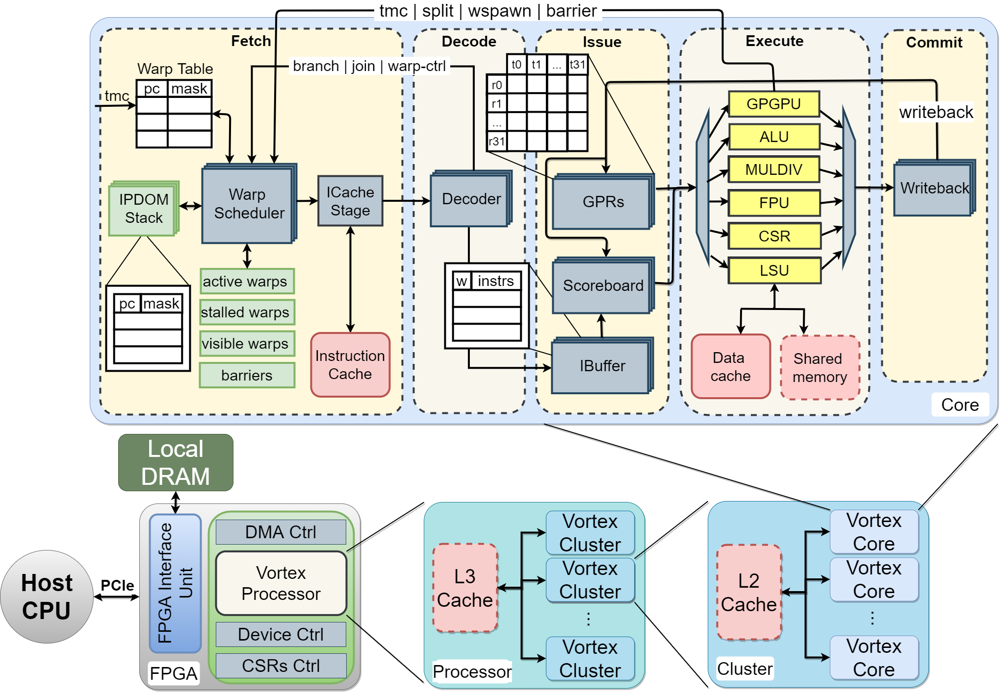

# Vortex Microarchitecture

### Vortex GPGPU Execution Model

Vortex uses the SIMT (Single Instruction, Multiple Threads) execution model with a single warp issued per cycle.

- **Threads**
  - Smallest unit of computation
  - Each thread has its own register file (32 int + 32 fp registers)
  - Threads execute in parallel
- **Warps**
  - A logical clster of threads
  - Each thread in a warp execute the same instruction
    - The PC is shared; maintain thread mask for Writeback
  - Warp's execution is time-multiplexed at log steps
    - Ex. warp 0 executes at cycle 0, warp 1 executes at cycle 1

### Vortex RISC-V ISA Extension

- **Thread Mask Control**
  - Control the number of warps to activate during execution
  - `TMC` *count*: activate count threads
- **Warp Scheduling**
  - Control the number of warps to activate during execution
  - `WSPAWN` *count, addr*: activate count warps and jump to addr location
- **Control-Flow Divergence**
  - Control threads to activate when a branch diverges
    - `SPLIT` *predicate*: apply 'taken' predicate thread mask adn save 'not-taken' into IPDOM stack
    - `JOIN`: restore 'not-taken' thread mask
- **Warp Synchronization**
  - `BAR` *id, count*: stall warps entering barrier *id* until count is reached

### Vortex Pipeline/Datapath

Vortex has a 5-stage pipeline: FI | ID | Issue | EX | WB.

- **Fetch**
  - Warp Scheduler
    - Track stalled & active warps, resolve branches and barriers, maintain split/join IPDOM stack
  - Instruction Cache
    - Retrieve instruction from cache, issue I-cache requests/responses
- **Decode**
  - Decode fetched instructions, notify warp scheduler when the following instructions are decoded:
    - Branch, tmc, split/join, wspawn
  - Precompute used_regs mask (needed for Issue stage)
- **Issue**
  - Scheduling
    - In-order issue (operands/execute unit ready), out-of-order commit
  - IBuffer
    - Store fetched instructions, separate queues per-warp, selects next warp through round-robin scheduling
  - Scoreboard
    - Track in-use registers
  - GPRs (General-Purpose Registers) stage
    - Fetch issued instruction operands and send operands to execute unit
- **Execute**
  - ALU Unit
    - Single-cycle operations (+,-,>>,<<,&,|,^), Branch instructions (Share ALU resources)
  - MULDIV Unit
    - Multiplier - done in 2 cycles
    - Divider - division and remainder, done in 32 cycles
      - Implements serial alogrithm (Stalls the pipeline)
  - FPU Unit
    - Multi-cycle operations, uses `FPnew` Library on ASIC, uses hard DSPs on FPGA
  - CSR Unit
    - Store constant status registers - device caps, FPU status flags, performance counters
    - Handle external CSR requests (requests from host CPU)
  - LSU Unit
    - Handle load/store operations, issue D-cache requests, handle D-cache responses
    - Commit load responses - saves storage, Scoreboard tracks completion
  - GPGPU Unit
    - Handle GPGPU instructions
      - TMC, WSPAWN, SPLIT, BAR
    - JOIN is handled by Warp Scheduler (upon SPLIT response)
- **Commit**
  - Commit
    - Update CSR flags, update performance counters
  - Writeback
    - Write result back to GPRs, notify Scoreboard (release in-use register), select candidate instruction (ALU unit has highest priority)
- **Clustering**
  - Group mulitple cores into clusters (optionally share L2 cache)
  - Group multiple clusters (optionally share L3 cache)
  - Configurable at build time
  - Default configuration:
    - #Clusters = 1
    - #Cores = 4
    - #Warps = 4
    - #Threads = 4
- **FPGA AFU Interface**
  - Manage CPU-GPU comunication
    - Query devices caps, load kernel instructions and resource buffers, start kernel execution, read destination buffers
  - Local Memory - GPU access to local DRAM
  - Reserved I/O addresses - redirect to host CPU, console output