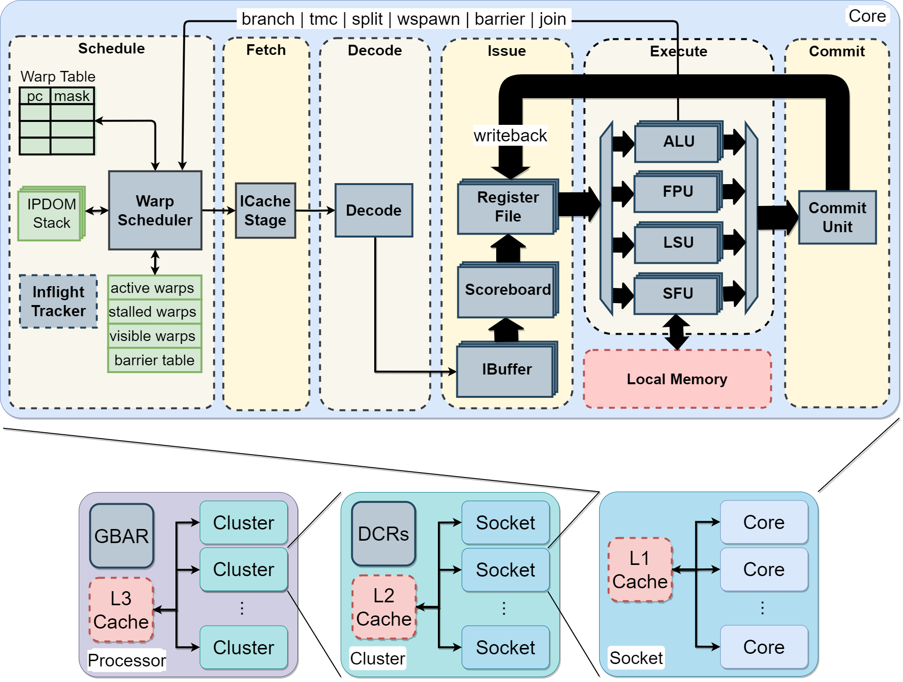

# Vortex Microarchitecture

### Vortex GPGPU Execution Model

Vortex uses the SIMT (Single Instruction, Multiple Threads) execution model with a single warp issued per cycle.

- **Threads**
  - Smallest unit of computation
  - Each thread has its own register file (32 int + 32 fp registers)
  - Threads execute in parallel
- **Warps**
  - A logical clster of threads
  - Each thread in a warp execute the same instruction
    - The PC is shared; maintain thread mask for Writeback
  - Warp's execution is time-multiplexed at log steps
    - Ex. warp 0 executes at cycle 0, warp 1 executes at cycle 1

### Vortex RISC-V ISA Extension

- **Thread Mask Control**
  - Control the number of warps to activate during execution
  - `TMC` *count*: activate count threads
- **Warp Scheduling**
  - Control the number of warps to activate during execution
  - `WSPAWN` *count, addr*: activate count warps and jump to addr location
- **Control-Flow Divergence**
  - Control threads activation when a branch diverges
    - `SPLIT` *taken, predicate*: apply predicate thread mask and save current state into IPDOM stack
    - `JOIN`: pop IPDOM stack to restore thread mask
    - `PRED` *predicate, restore_mask*: thread predicate instruction
- **Warp Synchronization**
  - `BAR` *id, count*: stall warps entering barrier *id* until count is reached

### Vortex Pipeline/Datapath

Vortex has a 6-stage pipeline:

- **Schedule**
  - Warp Scheduler
    - Schedule the next PC into the pipeline
    - Track stalled, active warps
  - IPDOM Stack
    - Save split/join states for divergent threads
  - Inflight Tracker
    - Track in-flight instructions

- **Fetch**
  - Retrieve instructions from memory
  - Handle I-cache requests/responses
- **Decode**
  - Decode fetched instructions
  - Notify warp scheduler on control instructions
- **Issue**
  - IBuffer
    - Store decoded instructions in separate per-warp queues
  - Scoreboard
    - Track in-use registers
    - Check register use for decoded instructions
  - Operands Collector
    - Fetch the operands for issued instructions from the register file
- **Execute**
  - ALU Unit
    - Handle arithmetic and branch operations
  - FPU Unit
    - Handle floating-point operations
  - LSU Unit
    - Handle load/store operations
  - SFU Unit
    - Handle warp control operations
    - Handle Control Status Registers (CSRs) operations
- **Commit**
  - Write result back to the register file and update the Scoreboard.

### Vortex clustering architecture
- Sockets
  - Grouping multiple cores sharing L1 cache
- Clusters
  - Grouping of sockets sharing L2 cache

### Vortex Cache Subsystem
More details about the cache subsystem are provided [here](./cache_subsystem.md).