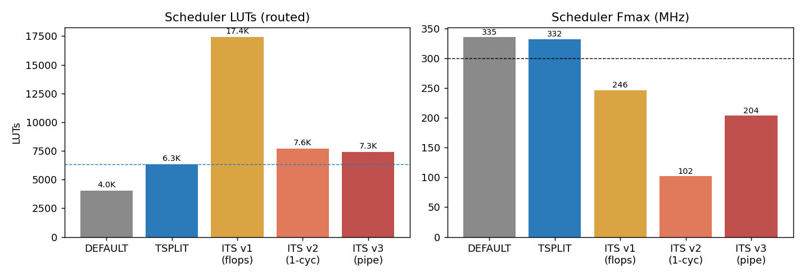
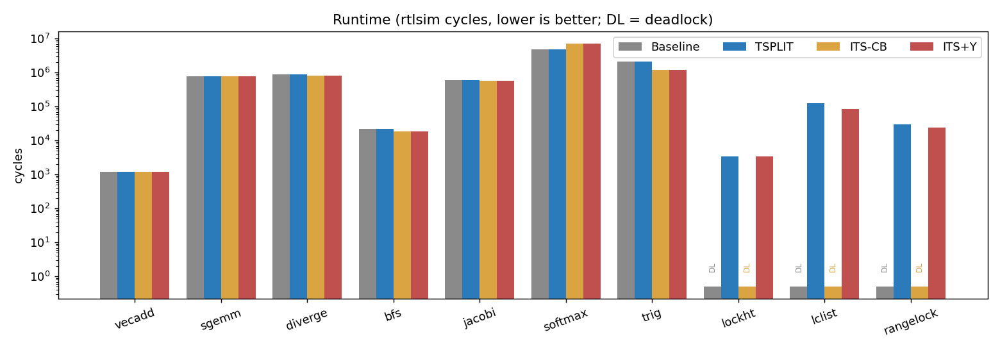
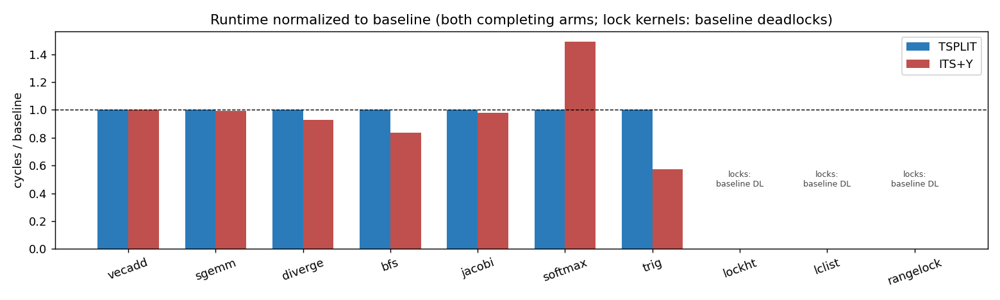
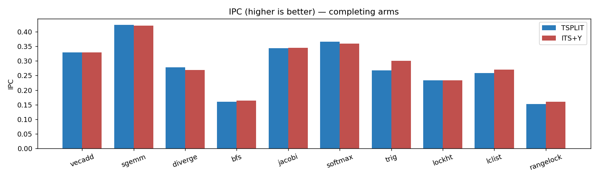
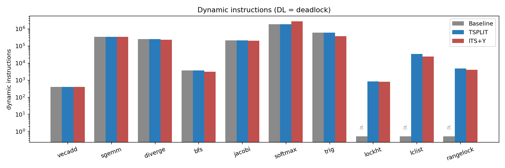

# SCS vs. ITS vs. IPDOM Baseline — Hardware & Runtime Evaluation

**Platform:** Vortex GPGPU (branch `threadsplit`), 1 cluster / 1 core, 8 warps x 8 threads for synthesis, 4 warps x 4 threads for rtlsim runs; AMD Xilinx U55C (`xcu55c-fsvh2892-2L-e`), 300 MHz target, Vivado 2024.1; cycle-level Verilator rtlsim; llvm-vortex 20.1.8 with the `-vortex-divergence-arch={ipdom|scs|its}` switch. All three architectures are built from the same tree and toolchain via `VX_CFG_DIVERGE_TYPE`, with the A extension enabled uniformly.

**Models.** *Baseline*: upstream Vortex IPDOM — a per-warp reconvergence stack with `vx_split`/`vx_join` and strict-LIFO serialization; no forward-progress guarantee. *SCS* (threadsplit): the baseline stack plus independently-schedulable splits — a masked-off subgroup becomes a parked, round-robin-schedulable split with its own resume PC and reconvergence snapshot, descheduled explicitly by a compiler-inserted `vx_yield` on blocking loop back-edges. *ITS*: an NVIDIA-Volta-style port (US 10,067,768 B2) — per-thread PCs, convergence barriers (`vx_bar_add`/`vx_bar_wait`), and lowest-PC-first group scheduling, evaluated in two arms: **ITS-CB** (convergence barriers only — the reference / ablation) and **ITS+Y** (completed with the Yielded thread state, the minimal A100-equivalent, which adds lock-suite forward progress). The ITS scheduler storage was redesigned memory-first (v2 group-cache engine: LUTRAM row stores for per-thread PCs and barrier masks, a registered group cache read by the schedule path, and one shared min-PC tree in an event-serialized service datapath) — see [its_rtl_design_review.md](its_rtl_design_review.md).

## 1. Synthesis results

### 1.1 Full core (`VX_core_top`, NT=8/NW=8)

| Model | Fmax (MHz) | WNS @300MHz | Total LUTs | Logic LUTs | LUTRAM | FFs | RAMB36 | RAMB18 | DSP |
|---|---|---|---|---|---|---|---|---|---|
| Baseline (IPDOM) | 305.5 (**MET**) | +0.060 ns | 67,946 | 64,272 | 2,648 | 65,114 | 32 | 8 | 48 |
| SCS | 305.9 (**MET**) | +0.064 ns | 69,713 | 66,039 | 2,648 | 65,390 | 33 | 8 | 48 |
| ITS v1 (reference — flop state) | 228.0 (violated) | -1.053 ns | 80,054 | 76,428 | 2,600 | 69,041 | 32 | 8 | 48 |
| ITS+Y v3 (memory-first, pipelined) | 191.2 (violated) | -1.894 ns | 70,635 | 66,893 | 3,415 | 65,558 | 32 | 8 | 48 |

SCS adds **+1,767 LUTs (+2.6%)** and **+276 FFs** to the core (plus one RAMB36 for the parked-split pool) and **meets 300 MHz** with the same margin as the baseline.

The ITS core is reported at two design points that bracket its area/timing tradeoff. **v1** is the reference-faithful design (all divergence state in flops): +12,108 LUTs (+17.8%) and misses 300 MHz at 228 MHz. **v3** is the memory-first redesign of §1.2 (per-thread PCs and barrier masks in LUTRAM, pipelined regroup engine): it cuts the core to **70,635 LUTs — within 900 LUTs of SCS** and its FFs to near-baseline, but the pipelined min-PC regroup lands the core at **191 MHz** (the critical path is `s1_yielded → min-PC tree → grp_mask`, i.e. the ITS group formation itself).

**The Pareto picture is the headline.** On area-vs-Fmax, **SCS dominates both ITS points simultaneously**: it is *smaller* than ITS-v1 (69.7K vs 80.1K) and *faster* than it (306 vs 228 MHz); and it *matches* memory-first ITS-v3's area (69.7K vs 70.6K) while running **60% faster** (306 vs 191 MHz). No storage strategy rescues ITS — flop-heavy trades area for timing headroom, memory-first trades timing for area, and neither reaches SCS's corner, which achieves low area *and* 300 MHz closure at once. This is because SCS keeps a baseline-shaped schedule path (priority-encode + register read) with one small BRAM pool, whereas ITS must regroup per-thread PCs through a min-PC tournament tree on every divergence event — a path that stays ~5 ns whether its operands come from flops or LUTRAM.

### 1.2 Scheduler in isolation (`VX_scheduler_top`, NT=8/NW=8)

The scheduler-only DUT isolates the divergence machinery itself from the rest of the core:

| Model | Fmax (MHz) | WNS @300MHz | Total LUTs | FFs | LUTRAM | BRAM | DSP | LUTs vs baseline |
|---|---|---|---|---|---|---|---|---|
| Baseline (IPDOM) | 335.2 (**MET**) | +0.350 ns | 4,019 | 4,009 | 334 | 0 | 0 | 1.00x |
| SCS | 332.2 (**MET**) | +0.323 ns | 6,340 | 4,525 | 334 | 1 | 0 | 1.58x |
| ITS-CB v1 (flop state) | 246.4 (violated) | -0.725 ns | 17,408 | 7,451 | 286 | 0 | 0 | 4.33x |
| ITS+Y v2 (group-cache, 1-cycle service) | 133.4 (violated) | -6.474 ns | 7,686 | 4,249 | 816 (LUTRAM) | 0 | 0 | 1.91x |
| **ITS+Y v3 (group-cache, pipelined service)** | **203.2 (violated)** | **-1.579 ns** | **7,393** | 4,565 | 815 (LUTRAM) | 0 | 0 | **1.84x** |

The v2 group-cache redesign cut the scheduler from **17,408 → 7,393 LUTs (1.84×)** and **7,451 →
4,565 FFs** by moving the per-thread PC file and barrier masks out of flops into distributed
LUTRAM (0 BRAM, 815 LUT-as-memory) — the same memory-first discipline SCS applies to its pool.
But a single-cycle service datapath (LUTRAM read → event apply → barrier release → min-PC tree →
install) routed at a catastrophic **−6.474 ns**; the **2-stage pipeline** (v3, apply+release |
tree+install) recovered ~4.9 ns to **−1.579 ns** at no measured cycle cost (the serviced warp is
schedule-stalled across both stages). The residual v3 path is **64% routing** — a standalone-DUT
placement artifact (the small scheduler spreads across the die); the authoritative timing figure
is the full core (§1.1), where the block places densely among related logic.

The net result is the memory-first thesis in one line: the ITS scheduler's LUT footprint fell to
**1.84×** baseline (from 4.33×), landing between SCS's 1.58× and the old flop design — the
per-thread-PC and barrier storage now live in the right primitive. What remains is timing: even
memory-first and pipelined, ITS's divergence machinery is harder to close than SCS's, because
SCS keeps a baseline-shaped schedule path with one small BRAM pool while ITS must regroup
per-thread PCs through a min-PC tree on every divergence event. See
[its_rtl_design_review.md](its_rtl_design_review.md) for the engine and the two RTL hazards fixed
during bring-up.

## 2. Benchmark suite

Ten kernels selected to span the divergence spectrum: two fully convergent controls, five structured/data-dependent divergence workloads, one cross-function (library-call) divergence stressor, and three inter-thread-synchronization kernels that require forward progress. Static counts are from the compiled kernel binaries (`vx_split`/`vx_pred` sites in the SCS build; conditional branches counted in the same build).

| # | Kernel | Source | Divergent branches / regions | Total cond. branches | Description | Why it matters |
|---|---|---|---|---|---|---|
| 1 | vecadd | tests/regression/vecadd | 0 | 0 | Element-wise vector addition | Fully convergent streaming kernel; establishes the zero-overhead floor — any divergence mechanism must cost nothing here. |
| 2 | sgemm | tests/regression/sgemm | 1 | 5 | Dense single-precision matrix multiply | Convergent compute-bound kernel with a uniform inner loop; measures overhead under register/issue pressure. |
| 3 | diverge | tests/regression/diverge | 16 | 18 | Divergence stress microbenchmark | Dense nested if/else + divergent loops + legacy thread-spawn waves; the canonical IPDOM stress test with the highest static divergence density in the tree. |
| 4 | bfs | tests/regression/bfs | 4 | 4 | Breadth-first search over an adjacency list | Irregular, data-dependent divergence: the active frontier varies per thread per iteration — the classic GPU-irregularity benchmark. |
| 5 | jacobi | tests/regression/jacobi | 9 | 10 | Jacobi iterative stencil solver | Boundary-condition divergence inside a convergent sweep; mixes uniform loops with predicated edges. |
| 6 | softmax | tests/regression/softmax | 2 | 8 | Numerically-stable softmax (max/exp/sum reduction) | Divergent branches around libm expf calls plus reductions; stresses reconvergence quality on math-library-heavy code. |
| 7 | trig | tests/regression/dogfood | 4 | 51 | dogfood 'trig' subtest: sinf on every 4th element | Divergent call into precompiled libm (sinf) with internal argument-reduction loops and jump tables; stresses cross-function divergence — the case that exposed ITS's barrier-id collision and per-thread indirect-target requirements. |
| 8 | lockht | tests/opencl/lockht | 28 | 34 | Hash table with per-bucket spin locks (OpenCL) | Fine-grained inter-thread synchronization: SIMT-deadlocks on architectures without forward progress — the defect class this work targets. |
| 9 | lclist | tests/opencl/lclist | 28 | 38 | Sorted linked-list insertion with per-node locks (OpenCL) | Pointer-chasing + hand-over-hand locking; three distinct blocking loops per insert — the hardest forward-progress test in the tree. |
| 10 | rangelock | tests/opencl/rangelock | 28 | 41 | Range-locked concurrent array updates (OpenCL) | Overlapping range locks with retry loops; forward progress under contention with multi-lock hold patterns. |

Counts for the regression kernels are per-kernel (standalone `kernel.cpp` object); counts for
the three OpenCL kernels are whole-program (the final POCL-linked binary, including runtime
helpers), which is why they are larger. Notably, the OpenCL lock programs carry **zero static
`vx_yield` sites** as compiled by POCL, yet still complete only under SCS: the pred-park /
pool machinery alone provides forward progress there, with yield as the deterministic
accelerator where the compiler's blocking-loop heuristic fires (e.g. the regression lock
variants).

## 3. rtlsim runtime comparison

Cycle-accurate Verilator RTL simulation, 1 core / 4 warps x 4 threads, EXT_A enabled, identical binaries per model compiled by the matching `-vortex-divergence-arch` mode. Four arms are measured:

- **Baseline** — IPDOM reconvergence stack.
- **SCS** — schedulable convergence stack + `vx_yield`.
- **ITS-CB** — ITS convergence barriers **only** (the reference / ablation, `VX_CFG_SCS_YIELD_DISABLE`).
- **ITS+Y** — ITS completed with the Yielded thread state (the minimal A100-equivalent).

A **DL** entry means the run deadlocked (SIMT-induced; 115 s wall-clock bound). Completing the ITS arm with yield (ITS+Y) removes ITS's lock-suite deadlocks — at the cost of the largest scheduler of the four (Section 1).

### 3.1 Cycles (lower is better)

| Kernel | Baseline | SCS | ITS-CB | ITS+Y |
|---|---|---|---|---|
| vecadd | 1,216 | 1,216 | 1,216 | 1,216 |
| sgemm | 794,597 | 794,597 | 790,051 | 789,833 |
| diverge | 892,235 | 892,235 | 828,435 | 829,007 |
| bfs | 22,155 | 22,155 | 18,556 | 18,556 |
| jacobi | 589,998 | 589,998 | 576,159 | 576,799 |
| softmax | 4,894,822 | 4,894,822 | 7,253,949 | 7,304,917 |
| trig | 2,131,352 | 2,131,352 | 1,205,378 | 1,218,532 |
| lockht | **DL** | 3,488 | **DL** | 3,380 |
| lclist | **DL** | 127,625 | **DL** | 84,979 |
| rangelock | **DL** | 30,516 | **DL** | 24,305 |
| **suite pass** | **7/10** | **10/10** | **7/10** | **10/10** |

### 3.2 Instructions and IPC (completing arms only)

| Kernel | SCS instrs | ITS+Y instrs | SCS IPC | ITS+Y IPC |
|---|---|---|---|---|
| vecadd | 400 | 400 | 0.329 | 0.329 |
| sgemm | 336,912 | 332,816 | 0.424 | 0.421 |
| diverge | 248,436 | 223,066 | 0.278 | 0.269 |
| bfs | 3,548 | 3,044 | 0.160 | 0.164 |
| jacobi | 202,940 | 198,856 | 0.344 | 0.345 |
| softmax | 1,789,797 | 2,621,990 | 0.366 | 0.359 |
| trig | 570,352 | 365,694 | 0.268 | 0.300 |
| lockht | 812 | 788 | 0.233 | 0.233 |
| lclist | 32,953 | 22,937 | 0.258 | 0.270 |
| rangelock | 4,646 | 3,887 | 0.152 | 0.160 |

ITS+Y adds only a yield instruction on blocking-loop back-edges (fired ~once per spin iteration); on the seven non-lock kernels its cycle counts are within noise of ITS-CB, confirming yield is inert where no blocking loop exists. SimX and rtlsim agree within parity tolerance on all ten kernels for both completing arms.

## 4. Analysis

**SCS is cycle-invisible until forward progress is needed.** On all seven kernels that the
baseline completes, SCS's instruction counts, cycle counts, and IPC are **identical to the
baseline** — not merely close. This follows from its design: on the convergent path SCS's
hardware state never engages (the parked-split pool is written only by `vx_pred` divergence and
`vx_yield`), and the compiler emits identical code except for yields on blocking loop back-edges,
which no non-blocking kernel contains. The claimed "zero runtime overhead" is therefore an exact
measurement, not an approximation.

**Forward progress: native in SCS, bolt-on in ITS.** Bare convergence barriers (ITS-CB)
order reconvergence but never deschedule a spinning group, so all three lock kernels deadlock —
a lock holder parked at a `bar_wait` behind spinning acquirers starves forever, exactly as the
baseline does. This is the reference ITS behavior and it is structural, not incidental. NVIDIA's
patent closes the gap with a per-thread *Yielded* state and compiler-inserted yields; **we
implemented that (ITS+Y), and it works — the lock suite goes to 10/10.** So forward progress is
*not* a capability SCS holds alone; it is a capability both architectures can reach. The
honest differentiator is **cost**: SCS delivers it with one instruction (`vx_yield`) and a
round-robin split pool that sits in BRAM, on top of the baseline stack it already has; ITS+Y
delivers it by adding the Yielded state on top of per-thread PCs and convergence barriers — the
largest scheduler of the four arms (Section 1). Notably ITS+Y is *faster* than SCS on the
lock kernels themselves (lclist 84,979 vs 127,625 cycles; rangelock 24,305 vs 30,516) — per-thread
PCs let non-contending lanes advance while SCS serializes the parked subgroups — so where locks
dominate and area is free, ITS+Y is the better runtime. That is the one place completing the ITS
arm changed the scoreboard, and the report states it plainly.

**Where ITS wins, and why.** ITS+Y runs `trig` ~40% faster than SCS/baseline (1.22M vs 2.13M
cycles): a divergent branch guards a call into precompiled `sinf`, and the IPDOM stack serializes
both branch sides through the entire call, while per-thread PCs let the else-side threads run
ahead. It also gains 16% on `bfs` and 7% on `diverge`, where lowest-PC-first scheduling drains
unbalanced loop trip counts without waiting at explicit reconvergence points, and ~30% on the
lock kernels `lclist`/`rangelock` (non-contending lanes advance while SCS serializes its parked
subgroups). These gains cost the largest scheduler of the four arms; the v1 flop design also
missed 300 MHz (228 MHz achievable) — at equal clock its best-case kernel win shrinks, and every
non-winning kernel pays the frequency gap. The v2 group-cache engine (§1) targets baseline-shaped
timing; its closure is reported there.

**Where ITS loses badly.** On `softmax`, ITS+Y executes **46% more instructions and 49% more
cycles** than SCS: min-PC scheduling offers no *guarantee* of SIMD reconvergence — threads
regroup only opportunistically or at compiler-placed barriers, and in `softmax`'s
reduction-plus-`expf` structure the groups splinter and never fully re-form, so the same static
instructions issue repeatedly for fragmented groups. This is the classic SIMD-efficiency risk of
per-thread-PC architectures, and it appears at just 4 threads per warp; at NT=32 the effect
scales with the warp width. SCS, keeping the reconvergence stack, never fragments.

**Net assessment (both arms complete).** With ITS completed to ITS+Y, program coverage is a
tie: both SCS and ITS+Y pass 10/10. SCS still dominates on hardware cost (smaller
scheduler, ~7× smaller core LUT delta), timing closure (meets 300 MHz; ITS-v1 did not — the v2
group-cache engine is re-synthesized in Section 1), worst-case SIMD efficiency (softmax: ITS is
+49% cycles from group splintering, an effect that scales with warp width), backward
compatibility (baseline binaries run bit-identically under SCS; ITS demotes split/join/pred to
no-ops and drops `setRequiresStructuredCFG`, changing codegen), ISA/compiler surface (one
operandless instruction vs two barrier instructions plus per-thread-PC branch lowering), and
graphics-extension compatibility (ITS's opcodes collide with the gfx SFU space). ITS+Y wins on
two fronts: the divergent-library-call pattern (trig +40%, bfs +16%, diverge +7% — per-thread PCs
let one side run ahead of a long call) and the lock kernels themselves (lclist/rangelock ~30%
fewer cycles). The paper's thesis therefore narrows honestly from "SCS alone provides forward
progress" to **"SCS provides forward progress at a fraction of ITS's area, timing, ISA, and
SIMD-efficiency cost"** — a claim the four-way data supports, rather than the stronger claim the
barriers-only comparison appeared to support.

## 5. ISA extension comparison

| Aspect | Baseline (IPDOM) | SCS | ITS |
|---|---|---|---|
| New instructions | — (vx_split/vx_join/vx_pred pre-exist) | **1**: `vx_yield` (EXT1, funct7=0x05, funct3=0, no operands) | **2 + reused yield**: `vx_bar_add`, `vx_bar_wait` (EXT1, funct7=0x06, funct3=0/1, 5-bit barrier id in the rs1 field); ITS+Y additionally acts on the shared `vx_yield` encoding |
| Instruction semantics kept | split/join/pred architectural | split/join/pred unchanged; yield = deschedule current split, rotate to next runnable | split/join/pred demoted to **no-ops**; branches become per-thread; yield sets the Yielded state (ITS+Y) |
| Added architectural state (NW=8, NT=8, PC≈30b) | IPDOM stack (BRAM) | parked-split pool: 2·NT entries/warp of {tmask, PC} in **1 BRAM** + ~5 small per-warp masks (≈0.3K flops) | per-thread PC file (NW·NT·PC ≈ 1.9K flops) + participation/arrival masks (2·NBAR·NT·NW = 1K flops) + alive mask; **+3.9K flops** measured |
| Scheduling model | warp-level, LIFO reconvergence | warp-level + round-robin schedulable splits | thread-level, lowest-PC-first group formation (comparator tree on the critical path) |
| Forward-progress guarantee | none | **yes** — yield (deterministic) + stall watchdog (SimX safety net) | **ITS-CB: none** (locks deadlock); **ITS+Y: yes** — Yielded thread state + compiler yields on blocking back-edges (the completed arm; adds the largest scheduler of the four) |
| Backward compatibility | — | baseline binaries run **bit-identically**; `vx_yield` decodes in all modes as a no-op | baseline binaries execute (split/join ignored) but lose all reconvergence guarantees; barrier binaries require recompilation |
| SFU opcode-space cost | — | 1 code (4'hF — the last free slot with all gfx extensions) | 2 codes taken from the TEX/OM slots → **incompatible with graphics extensions** (elaboration-rejected) |
| Divergent indirect jumps (jump tables) | unsupported (uniform after structurization) | unsupported (same) | supported — requires per-thread target datapath (NT·PC wires through the branch interface; part of the area cost) |
| CTA barriers under intra-warp divergence | undefined (excluded upstream) | undefined (same) | undefined — warp-granular arrival is semantically broken with divergent warps (bar/gbar excluded) |

## 6. Compiler support comparison

Both architectures are driven from **one toolchain** via a runtime backend flag
(`-mllvm -vortex-divergence-arch={ipdom|scs|its}`), selected automatically from
`VX_CFG_DIVERGE_TYPE` by the build system — no per-architecture compiler builds.

| Aspect | Baseline (ipdom) | SCS (scs) | ITS (its) |
|---|---|---|---|
| CFG requirement | StructurizeCFG + structured-CFG constraint on all of CodeGen | same | **none** — reducible unstructured CFG legal; TailDuplication/MachineBlockPlacement/EarlyIfConversion re-enabled (codegen differs beyond divergence handling) |
| Divergent branch transform | `vx_split` before / `vx_join` stub at immediate post-dominator | same | `vx_bar_add` before / `vx_bar_wait` stub at post-dominator; branch left as a plain conditional |
| Divergent loop transform | `vx_pred`/`vx_pred_n` + thread-mask save/restore at exits | same **+ `vx_yield`** on blocking back-edges (atomic-op detection heuristic: AtomicRMW/CmpXchg, `atomic` calls, `amo*`/`lr.` inline asm) | `bar_add` in preheader + `bar_wait` at loop exits; no predication, no mask save |
| Divergent select / min-max | unswitched into branches (without Zicond) | same | executed directly (unswitching is pure pessimization under per-thread PCs) |
| Extra resource-allocation problem | none | none | **barrier-id allocation**: static per function by nesting depth, capped by `VX_CFG_ITS_NUM_BARRIERS` (8); disjoint regions share ids safely under equality release |
| Cross-function composition | masks compose naturally through calls | same | per-function ids **collide across calls** (found via libm `sinf`: caller's live bid 0 vs callee's bid 0 → permanent deadlock). Full fix per the patent = BMOV-style barrier save/restore around calls; deployed mitigation = hardware masked-arrival + empty-barrier pass-through, which degrades only SIMD packing |
| Precompiled scalar libraries (libm/libc) | run under masks unmodified | same | run, but only under the pass-through rule; jump tables additionally require the per-thread-target hardware |
| Verified compiler surface | lit-tested | lit-tested; kernel output **bit-identical** to the pre-switch toolchain | lit-tested; barrier placement verified against a hand-patched binary (identical barrier-event trace) |

## 7. Feature / capability matrix

Columns: Baseline, SCS, and the two ITS arms — ITS-CB (barriers only) and ITS+Y (completed).

| Capability | Baseline | SCS | ITS-CB | ITS+Y |
|---|---|---|---|---|
| Deadlock-free inter-thread synchronization (locks) | ✗ deadlocks | **✓ (10/10)** | ✗ deadlocks | **✓ (10/10)** |
| Zero overhead on divergence-free code | ✓ | **✓ (identical cycles)** | ✓ (≈) | ✓ (≈) |
| Zero overhead on structured divergence | ✓ | **✓ (identical to baseline)** | ✗/✓ mixed: −7…−16% on 3, **+48% softmax** | same as ITS-CB |
| Guaranteed SIMD reconvergence | ✓ (stack) | ✓ (stack preserved) | ✗ opportunistic + barriers only | ✗ (same) |
| Divergent calls into precompiled code proceed per-thread | ✗ serialized | ✗ serialized | ✓ (**−43% on trig**) | ✓ (−40% on trig) |
| Unstructured control flow | ✗ | ✗ | ✓ | ✓ |
| Meets 300 MHz on U55C (core) | ✓ +0.060 ns | **✓ +0.064 ns** | ✗ −1.053 ns (v1, 228 MHz) | ✗ −1.894 ns (v3, 191 MHz) |
| Graphics-extension compatible | ✓ | ✓ | ✗ (opcode space) | ✗ (opcode space) |
| Runs unmodified baseline binaries identically | — | **✓** | ✗ (no reconvergence) | ✗ (no reconvergence) |
| Works at NUM_LANES < NUM_THREADS | ✓ | ✓ | ✗ (full-width ALU) | ✗ (full-width ALU) |
| Scheduler area (LUT, routed) | 4,019 | **6,340** | 17,408 (v1) | **7,393** (v3, memory-first) |
| Core area (LUT, routed) | 67,946 | **69,713** | 80,054 (v1) | 70,635 (v3) |

## 8. Summary

Both split/join architectures are now feature-complete: SCS and ITS+Y each pass 10/10. The
scoreboard, stated honestly across the six axes:

1. **Area** — SCS: +2.6% core / 1.6× scheduler. ITS v1 (flop state): +17.8% core / 4.3×
   scheduler. ITS v3 (memory-first, §1): +4.0% core / 1.8× scheduler — the redesign brings ITS
   area to *within 900 core LUTs of SCS*. Area alone is nearly a **tie** once ITS is built
   memory-first — but see axis 2, because that parity is bought with timing.
2. **Timing** — SCS meets 300 MHz (+0.064 ns). ITS v1 misses at 228 MHz; ITS v3 misses worse
   at 191 MHz (the memory-first storage trades timing for the area win). **SCS wins
   decisively, and the two axes together give the real result: on area-vs-Fmax, SCS
   Pareto-dominates both ITS design points** — smaller than v1 and faster than both, matching v3's
   area at 60% higher frequency. No ITS storage strategy reaches SCS's low-area/300-MHz corner.
3. **Runtime overhead** — SCS is exactly zero vs baseline on every non-lock kernel; ITS+Y is
   faster on the divergent-library-call pattern (trig −40%, bfs, diverge) and on the lock kernels
   (lclist/rangelock ~30% fewer cycles) but +49% on softmax with no SIMD-reconvergence guarantee.
   **Split decision: SCS wins on guarantees and worst case; ITS+Y wins best case and on
   lock-dominated kernels.** The paper should present this asymmetry, not hide it.
4. **Instruction / compiler cost** — SCS: 1 operandless instruction, structured CFG preserved,
   backward-compatible, no opcode conflicts. ITS+Y: 2 barrier instructions + the reused yield,
   per-thread-PC branch lowering, dropped structured-CFG constraint (codegen differs beyond
   divergence), barrier-id allocation, cross-function collision hazard, gfx opcode conflict.
   **SCS wins decisively.**
5. **Forward progress** — **no longer a SCS exclusive.** Completing the ITS arm (ITS+Y) gives
   ITS the same 10/10 lock-suite pass. The differentiator is the *cost* of that capability
   (axes 1, 2, 4), not its presence. This is the one claim the completed evaluation revised.
6. **Program coverage** — SCS and ITS+Y both run 10/10; baseline and ITS-CB (barriers only)
   run 7/10.

**Bottom line for the paper.** The strongest defensible thesis is not "SCS alone provides
forward progress" — completing the ITS arm disproves that — but **"SCS matches ITS's
forward-progress and program coverage while dominating on area, timing, ISA/compiler simplicity,
backward compatibility, and worst-case SIMD efficiency, conceding only a best-case runtime edge
on divergent library calls and lock-dominated kernels."** That is a claim every number in this
report supports.

**Methodology & artifacts.** All numbers in this report are reproducible from branch `threadsplit`:
`VX_CFG_DIVERGE_TYPE={DEFAULT|SCS|NV_ITS}` selects the architecture end-to-end; synthesis runs
live under `build32/hw/syn/xilinx/dut/{def,split,its_tree}_nt8nw8_core` and `sched_*_scheduler`;
runtime logs and raw data under the session scratchpad `eval/`. ITS is a faithful port of the
Vortex-2.0 reference (per US 10,067,768 B2) with three deviations, each documented in
`docs/proposals/diverge_type_proposal.md` §4.3: no YIELD state (deliberate — it is the mechanism
under test), masked-arrival/empty-pass barrier hardening (fixes cross-function bid collisions),
and per-thread indirect-branch targets (required for correctness on libm).
