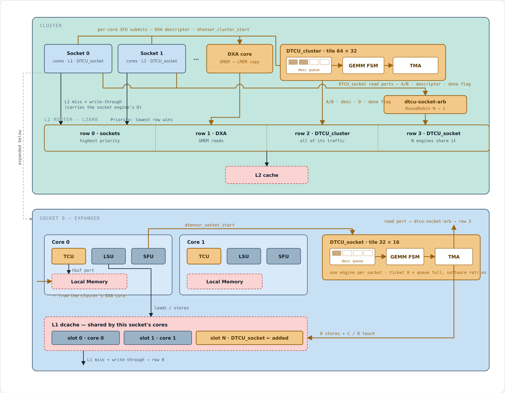
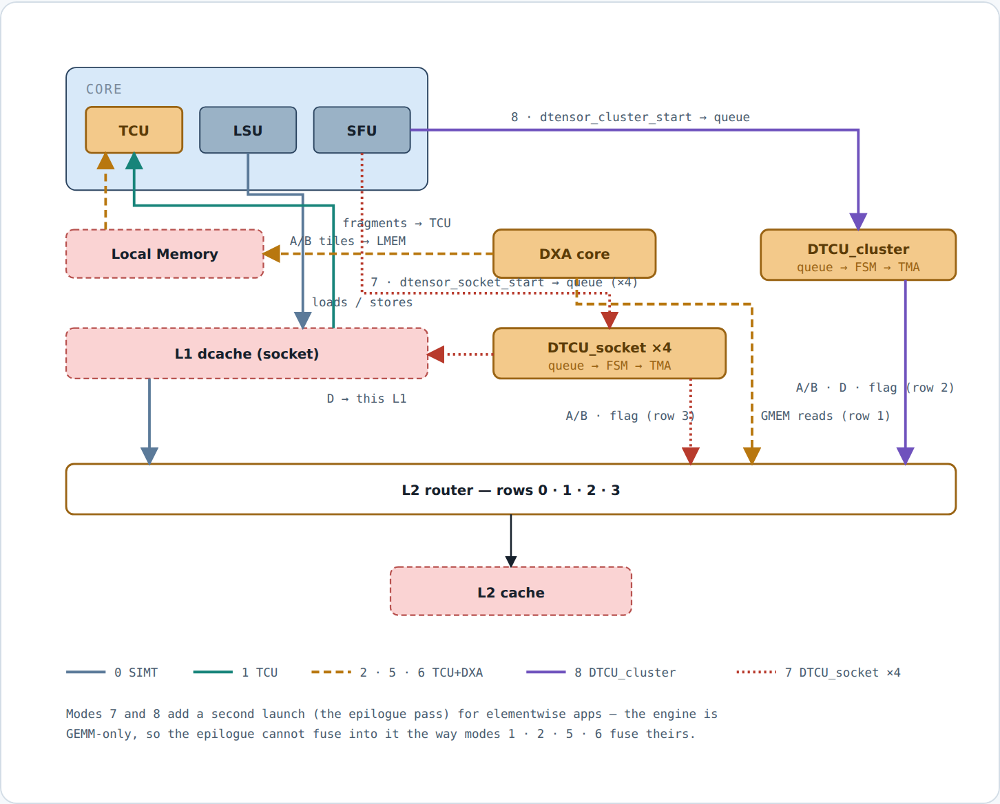

# DTCU figures — 2026-08-28 export

Figure-only export of [`260807_dtcu_figures.html`](260807_dtcu_figures.html) (the source of the
published artifact). Diagrams and measured tables only — the commentary, the audit trail and the
withdrawn claims live in the HTML, which remains the document of record. Every number below is
labelled with the regime it belongs to; do not quote one without it.

## FIG 1 · Module placement, submit path, and wiring

Amber marks what this work adds. Both DTCU variants read operands from L2; they differ only in
where D lands — the cluster engine writes it to L2, the socket engine into its own socket's L1
through an added requester slot.

## FIG 2 · How each cgo27_motivation mode flows

Modes 7 and 8 add a second launch (the epilogue pass) for elementwise apps — the engine is
GEMM-only, so the epilogue cannot fuse into it the way modes 1 · 2 · 5 · 6 fuse theirs.

## Machine — one cluster

| symbol | meaning | value |
|---|---|--:|
| #cluster | clusters in the processor | 1 |
| NC | cores per cluster | 4 |
| NS | sockets per cluster (SOCKET_SIZE 1) | 4 |
| NW | warps per core | 16 |
| NT | threads per warp | 32 |
| NR | architectural regs per thread | 32 |
| issue | issue width per core | 4 |
| LMEM | Local Memory, per core | 64 KB |
| L1 | dcache, per socket | 32 KB |
| L2 | per cluster, 1 bank | 1 MB |
| line | L1 / L2 / DRAM block | 64 B |

## Modes and where D lands

| mode | name | what it does | D lands |
|--:|---|---|---|
| 0 | SIMT | scalar MAC, software fp16→fp32 | dcache |
| 1 | TCU | in-core WMMA, fragments by LSU load | dcache |
| 2 | TCU + DXA | DXA stages A/B into LMEM — 1 buffer | dcache |
| 3 | TCU workgroup + DXA | multi-warp CTA shares one staged tile; warp 0 is the producer; wgmma reads smem | dcache |
| 4 | TCU workgroup, SW copy | same geometry, the CTA copies its own tiles — the DXA control for 3 | dcache |
| 5 | TCU workgroup + DXA, A resident | CTA sweeps 4 column tiles against A staged once for the whole K — N-axis reuse | dcache |
| 6 | TCU workgroup + DXA, A resident, single B buffer | same A reuse and CTA geometry as 5; synchronous issue/wait/consume/wait schedule isolates buffering | dcache |
| 7 | DTCU_socket | 4 engines, tile 32×16, one descriptor per socket | socket L1 |
| 8 | DTCU_cluster | 1 engine, tile 64×32, one descriptor per core | L2 |
| 9 · 10 · 11 | hetero | cores + engine(s) on one GEMM — numbered, not built | — |
| 14 | DTCU_socket pipeline | one producer warp and N consumer warps per core | socket L1 |
| 15 | DTCU_cluster pipeline | core 0 warp 0 is the sole producer; N consumer warps on every core | L2 |

Modes 2 and 4 are controls, 3 is 5 without A-residency — arguments, not candidates, so they stay
out of the headline table below.

## Measured, app 1 — three GEMM shapes on the same machine (MAC = M · N · K)

| mode | units | 128×64×32 cycles | MAC/cyc | /unit | 256×128×64 cycles | MAC/cyc | /unit | 512×256×128 cycles | MAC/cyc | /unit |
|---|---|--:|--:|--:|--:|--:|--:|--:|--:|--:|
| 0 SIMT | 4 cores | 142,952 | 1.83 | 0.46 | *skipped* | | | *skipped* | | |
| 1 TCU | 4 cores | 23,513 | 11.15 | 2.79 | 96,244 | 21.79 | 5.45 | 386,994 | 43.35 | 10.84 |
| 5 TCU wg + DXA, A resident | 4 cores | 22,820 | 11.49 | 2.87 | 66,521 | 31.53 | 7.88 | 305,878 | 54.85 | 13.71 |
| **7 DTCU_socket** | 4 engines | **11,728** | **22.35** | **5.59** | **49,152** | **42.66** | 10.67 | **303,303** | **55.31** | 13.83 |
| 8 DTCU_cluster | 1 engine | 49,472 | 5.30 | 5.30 | 160,420 | 13.07 | **13.07** | 1,111,970 | 15.09 | **15.09** |

Mode 0 is skipped above the smallest shape by policy (no engine, no staging, no knob); its
recorded values are 1,145,460 and 9,581,708.

## Regime 1 — attention-shaped: K = head_dim = 64 fixed, M = N = seqlen swept. Memory-bound at every size

| mode | units | M=N=128 | 256 | 512 | 1024 |
|---|---|--:|--:|--:|--:|
| 0 SIMT | 4 cores | 560,994 | *skipped* | *skipped* | *skipped* |
| 1 TCU | 4 cores | 50,875 | 187,473 | 762,659 | — |
| 5 TCU wg + DXA, A resident | 4 cores | 41,666 | 123,228 | — | — |
| **7 DTCU_socket** | 4 engines | **25,826** | **87,782** | **344,451** | **1,523,464** |
| 8 DTCU_cluster | 1 engine | 148,094 | 300,810 | 1,194,150 | 4,863,334 |
| 7 vs 1 | *lead grows* | 1.97× | 2.14× | **2.21×** | — |

— is a run that did not complete, not a skip. Every number shown verified `PASSED`, errors = 0.

## Regime 2 — scale all three dimensions. Where the engine stops winning

| shape | 1 TCU | 5 A-resident | 7 DTCU_socket | 7 vs 1 | 1 MAC/cyc | 7 MAC/cyc |
|---|--:|--:|--:|--:|--:|--:|
| 128 × 64 × 32 | 23,513 | 22,820 | **11,728** | **2.00×** | 11.2 | 22.4 |
| 256 × 128 × 64 | 96,244 | 66,521 | **49,152** | **1.96×** | 21.8 | 42.7 |
| 512 × 256 × 128 | 386,994 | 305,878 | **303,303** | 1.28× | 43.4 | 55.3 |
| 768 × 384 × 192 | **918,488** | — | 1,002,507 | 0.92× | 61.7 | 56.5 |
| 1024 × 512 × 256 | **1,739,671** | 2,287,740 | 2,286,325 | 0.76× | **77.2** | 58.7 |

The crossover sits between 512×256×128 and 768×384×192: the core keeps climbing (latency hidden
by parallelism) while the engine flattens against its 64 MAC/cyc ceiling at 92 % of modelled peak.

## What operand staging needs before a copy engine pays — modes 3 / 4, fused epilogue

| measurement | 3 DXA @128×64×32 | 4 SW | 3 DXA @256×128×64 | 4 SW | 3 DXA @512×256×128 | 4 SW |
|---|--:|--:|--:|--:|--:|--:|
| measured — whole kernel, D = epi(C + A·B) | 25,386 | 32,583 | 103,400 § | 152,677 | 454,165 | ‡ |
| measured — C read compiled out (`-DMOTI_WG_NO_C`, wrong on purpose) | 22,979 | 25,795 | 98,637 | 104,133 | 423,127 | 497,215 |
| derived — reading C alone | 2,407 | 6,788 | 4,763 | 48,544 | 31,038 | — |
| what DXA is worth (4 ÷ 3, full kernel) | **1.28×** | | **1.48×** | | — | |

§ measured at `-a 6` (the identity, byte-identical to `-a 1`); the `-a 1` non-termination is
unexplained and lives below the kernel. ‡ mode 4 at the largest shape finishes at no app tested.

## Engine width sweep at 512 × 256 × 128 — ⚠ SUPERSEDED, measured on the combined binary

| MACS / ACC_BANKS / SMEM_BANKS | 7 cycles | 7 MAC/cyc | 7 vs 1× | 8 cycles | 8 MAC/cyc | 8 vs 1× |
|---|--:|--:|--:|--:|--:|--:|
| 1× (16 / 2 / 2, default) | 324,469 | 51.71 | — | 1,140,573 | 14.71 | — |
| 2× (32 / 4 / 4) | 243,869 | 68.80 | 1.33× | 663,865 | 25.27 | 1.72× |
| 4× (64 / 8 / 8) | 223,977 | **74.91** | 1.45× | 411,997 | 40.72 | **2.77×** |

⚠ Absolute cycles predate the per-mode device programs and do not survive; the ratios (between
builds differing only in engine width) do. Re-run on the isolated programs before quoting.

## Mode 3 / mode 5 cycles after the 2026-08-27 rollover repair (selected controls)

| shape | baseline | GELU | softmax | column mean |
|---|--:|--:|--:|--:|
| r8 | 1,271,236 / 771,276 | 1,206,215 / 934,264 | 3,380,091 / 2,894,187 | 1,411,349 / 911,445 |
| r16 | 4,922,450 / 3,167,132 | 4,553,521 / 3,901,604 | 13,152,718 / 11,389,887 | 5,320,533 / 3,565,268 |
| s256 | 669,466 / 422,363 | 627,081 / 528,061 | 1,943,037 / 1,674,336 | 739,935 / 492,876 |
| s1024 | 9,845,019 / 6,116,052 | 8,814,271 / 7,202,122 | 27,077,567 / 23,321,603 | 10,615,767 / 6,883,131 |

Cells are mode 3 / mode 5. Full data: `result/260827_data/exp1_m3_m5_final_20260827.csv`.
Mode 3 is the no-A-residency control for candidate mode 5; this table does not redefine the
placement winner set.
